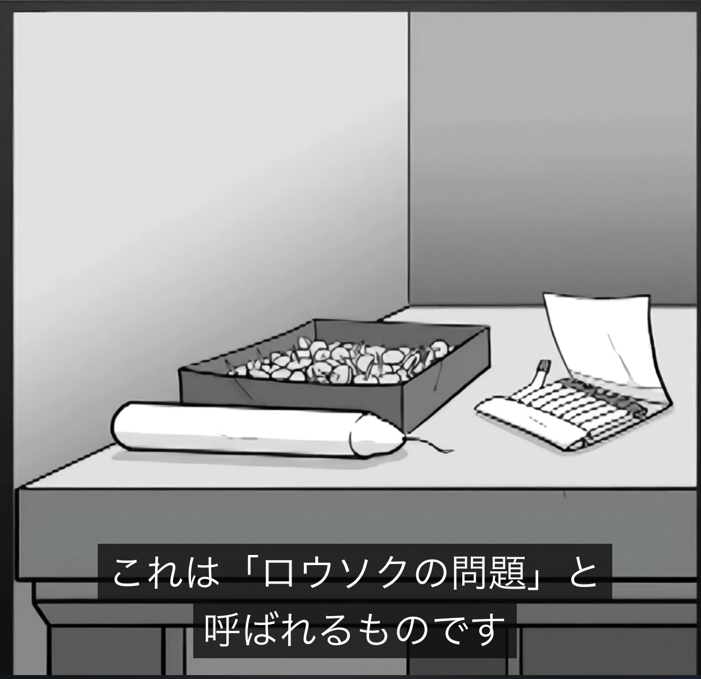

[2024年を振り返る](https://blog.sa2taka.com/post/2024-look-back/)から一年経ちました。今年は公私ともに大きな変化があった年だなと感じます。1年、ちょっとだけ長かったよ。

2025年は名前ばかりではありますがチームリーダーとなり、自分以外のスキルアップなどに脳のリソースが割かれた年でした。他者のために、自分の基準を上げる。正直、自分に甘く他者にゲロ甘い私としては難しいミッションではありますが、日々是努力。

# TypeScript

本年も変わらず仕事では99.99%利用していました。

TypeScript 7.0楽しみですねー。最近はOxlintなどがtsgoを組み込んで型に関するlintのルールなども提供しています。ただ、うまくTypeScript ESLintがTypeScript 7.0を組み込んで高速化されれば、ESLintがまた復権しそうだよなぁとも思っています。個人的にはまだLintはESLint使っていますが、Oxlintとかを始めとした後発のlinterに移るかどうか迷いますね。

# 良かった本

とある理由で今年は去年よりは本を読んでないです。ただ、ようやくKindleを買ってベッドの横でうず高く積まれている本の成長スピードに不安になることもなくなり、Kindleのおかげでサクッと本を読めるようになったので、そこまで変わらないかもしれないです。

今年読んだ本で良かったものを溶解します。今年発売というワケではないのであしからず。また、順番も特に意味はありません。緩やかに読んだ順、という感じです。

## Tidy First?

[Tidy First?](https://www.oreilly.co.jp//books/9784814400911/index.html)はXPなどで有名なKent Beck氏の著書です。

本著ではTidy（整頓された）という言葉を利用していますが、すなわちコードを綺麗にする、ということに関することが記載された本です。「First?」と疑問形になっていることからも分かる通り、整頓することを最初にするべきかどうか、という観点で書かれた本です。

最初にHow Toで整頓術が書かれていて、後半になるほどその整頓を「いつやるのか」「やる・やらないのメリットなどの理論」など抽象的な話が広がっていきます。

Refactoringという言葉が広まった現代において、本来のRefactoringという言葉のニュアンスが徐々に変化していったことにより、更に小さな概念としてTidyというワードを利用しているのが特徴的。つまりは、かなり小さな整頓術について色々書かれているが、その実態は振る舞いを変えないRefactoringについてかかれた本ではあります。

この本を変えば、日々プログラムを書いているITエンジニアにとって「このコードは整頓するべきかどうか」「整頓するならどのような方法があるか」などをより一歩具体的な言葉で説明できるようになるかなと思うし、更には設計段階でも使える本かなと思いました。

Twitterでめちゃめちゃ話題になっていましたが、それほどMust Buyというとは感じませんでした。ただ2, 3年目のプログラマーなら読んで損はない本かなと思います。

## モチベーション3.0

[モチベーション3.0](https://www.amazon.co.jp/dp/4062144492)は、もはや古の名著ですね。

[ダニエル・ピンク氏のTEDの講演](https://www.ted.com/talks/dan_pink_the_puzzle_of_motivation)は非常な有名な講演ですね。下記のろうそくの画像を見れば見たことあると感じる方も多いと思います。

イメージとしてはろうそくの問題が非常に先行しますが、この講演の本質としては報酬などを与える外発的動機付けではかえって生産性が下がり、	内発的動機づけが重要である、というのが高圧力でまとめた講演の内容です。

正直言うと上記の講演を見れば良いのが結論なのですが、古本屋でそこそこ安い値段で売ってるので見かけたら買うのもいいでしょう。

世界的名著でもあるのでもはや説明不要かもしれませんが、改めて現代で働く、とくに「他者のレベル上げる」という観点にたつと非常に重要な示唆を与えてくれると感じたので、記載しました。
先述の通りチームリーダーになり、ただこの本を読んだのは2月とかでまだリーダーになる前でもあり、今の私とこの本を読んだときの私とでは少し視点が違います。モチベーション3.0で重要な「課題解決のために必要な行動を自身で主体的に決定し取り組めること（AUTONOMY）」「成長の環境があること（MASTERY）」「社会やチームへの貢献、組織の成長など利他的なもののことがあること（PURPOSE）」という3つの要素が重要であるというのがこの本の重要なエッセンスです。他者が快適にスキルアップできるような環境を作るためにはどうするか、というのをこの本から学べるかなと思いました。

## Effective SQL/達人に学ぶSQL徹底指南書/達人に学ぶDB設計徹底指南書

[Effective SQL](https://www.amazon.co.jp/dp/4798153990)はその名の通り、SQLに関する本です。

Effectiveは大抵の場合中級者向けの本ではあり、この本もSQL初心者というよりも中級者以上の人向けの本ではあります。

かなり数多くの観点で、書かれていて飽きない本。最初はデータモデリングからインデックスの貼り方など、一定知っている話から始まって、ただSQLの規格に沿った話をしてくれているので、包括的な知識が身につく。
私としては例えばGroupByのRollup Cube Grouping Set、8章の直積の部分、9章のタリーテーブルは初めて学んだ概念でした。細かいレベルでも再発見があって面白い本なのでSQLを書いて仕事している方は読んでみると面白いと思います。

[達人に学ぶSQL徹底指南書](https://www.amazon.co.jp/dp/4798157821)および[達人に学ぶDB設計徹底指南書](https://www.amazon.co.jp//dp/4798186627)もその名の通りSQLについての本です。今の会社に入ってから4年間ぐらいNoSQL書いてたので、RDBMSなシステムを作るときに改めて学び直そうとSQLの本をそこそこ仕入れました。

ミックさんというTwitterでもよく見かける方が書かれた本です。前者はEffective SQLのようなSQLの本、後者はRDBMSの設計についての本です。

前者は2018年の本で、ちょうどNoSQLが流行りきって下火になりかけていたあたりの時代の本です。近現代的な部分もありますが、最近のSQLの進化（例えばJSONあたり？）とかは少し薄かったりしますが、それでも非常に良い本でした。これもまた中級者向きっていう感じの本でしたが、私としては集合演算とかHAVINGと私自身はあまり使わない奴の強力さが知れて良かったです。
MySQLでウィンドウ関数が実装されたのが2017というのも驚き。最近じゃん。

後者は設計の本で、コレはどちらかと言うと初心者向け。正規化の基礎部分から始まって、設計とパフォーマンスなどの話も交えながら、論理設計について様々な事が書いてある本。物理設計は流石にプロジェクトとかクラウドとかそういったものが関係するからかそこまで書いてないです。
上2つほど新たな知識がある、というわけでもないですが、久々にRDBMS触れる人や新卒などの方は読むと良いんじゃないかなと思いました。

## スイッチ!

[スイッチ！](https://www.amazon.co.jp/dp/4152091509)はチップ・ハース氏・ダン・ハース氏によって書かれた本です。この二人、以前紹介した[アイデアのちから](https://blog.sa2taka.com/post/2023-look-back/#%E3%82%A2%E3%82%A4%E3%83%87%E3%82%A2%E3%81%AE%E3%81%A1%E3%81%8B%E3%82%89)の著者であります。古本屋で適当に見てたら二人の名前があったので購入したところ、こっちもこっちでめっちゃ良い本でした。

今回は「アイデアのちから」とパッと見は関係ない、「変化」についての話でした。私はCOBOLを作ったことでも有名なグレースホッパーさんの「人間は変化に対してアレルギーがある」って言葉が好きです。この本はそのアレルギーの具体性から話は始まる感じ。「変化できないのは人の問題ではなく環境の問題かもしれない」「我慢できないのではなく我慢するための体力が残ってないのかも知れない」「変わろうとしないのではなく、戸惑ってるだけなのかもしれない」。

人間の感情を象、理性を象使いと捉えてその先はそれぞれをどう変化のために活用していくかが書いてあります。個人的には6章がとても良かったです。言ってしまえば「変化を細かく」そして「小さな成功体験を積むこと」が良い、みたいなありふれた話だが、それについて不可思議な例とともに話が進んで、とてもおもしろい。

ところどころ「アイデアのちから」からも話が出てたり（サウスウエスト航空とかね）それを読んでるとさらに面白いかもしれないので、両方とも買って読みましょう。

## カンバン仕事術

ITエンジニアやっていると、[カンバン仕事術](https://www.amazon.co.jp/dp/487311764X)の本は聞いたことあるかもしれません。

チーム編成が変わり、スピードがガクッと落ちた時期におすすめされた本です。

カンバンというのはもはやアジャイル・スクラム開発でも導入されている技法だと思いますがその技法についてのバイブル的な部分はあると思います。

ただ、私のチームは設計からQAまでを同じ人がこなすので、100%とり入れられるものではないです。

一方で、個人的にこの本で一番良かったのは「始めるのを終わらせて、終わらせることを始めよう」という言葉。特にAIによってレビューなどが溜まりがちな最近。自分の新たな仕事を始める前に、自分が残しているタスクを全部終わらせるということを意識する用になりました。とにかく自分の中の小さなタスクをすぐに終わらせればチームのためにもなりますし、[スイッチ！](#スイッチ!)にもある「変化を細かく」していくことにもつながります。

## ソフトウェア設計の結合バランス

今年の最も良かった本は[ソフトウェア設計の結合バランス](https://www.amazon.co.jp/dp/4295022969)です。

正直言うと[原著](https://www.amazon.com/dp/0137353480)の方を買って読んではいたのですが、日本語版が爆速で出版されたので日本語版の紹介です。

ソフトウェアにおける重要な用語として「結合度」「凝集度」がありますが、その結合度についての本。一方で今までの常識をぎゅぎゅっと高速道路としてまとめた本であり、一方で新常識的な本です。

「モジュール化はいい」「結合してない方がいい」と持て囃されてるような気がするが、個人的には疎結合が必ずしもいいとは思ってないなぁという肌感覚がある中で、この本も似た感じの話をしていいます。要はバランスであると。
システムは「目的」「コンポーネント」「相互作用」の3つの核があり、それぞれが依存しあっている。ソフトウェアにおいてはコンポーネントは疎結合と言いつつ、実際はコンポーネント間では結ばれている。結合がないなんてことはないわけです。どのように相互依存していくか、つまりコンポーネント間での知識の共有とは何か、さらには「コンポーネント外に出てはいけない知識とは何か」を規定することが、いわゆる設計の仕事の中核となります。

原文の段階でTwitterで非常に話題になっていましたが、システム開発を生業にするなら絶対に読むべき本と、と言いたいほどに個人的にはいい本だったと思います。結合に関する理想的な話ではなく、現実的で具体的な話、そして最後にはHow To的に結合度をベースとした設計ツールの話があります（ここだけ私あんまりちゃんと読んでないけど）。

## その他

今年読んだ本は、結構良かったのが多かったので、それ以外にもざざっとまとめます。

- [仮説行動](https://www.amazon.co.jp/dp/4862763375)：起業・新規事業に関する話が中心ではありつつも仮説という「思考」から「行動」へと移すための本、という点で良かった
- [世界3万人のハイパフォーマー分析でわかった 成功し続ける人の６つの習慣](https://www.amazon.co.jp/dp/4799330462)：内容は一言では表しづらいですが、習慣や行動を少し変えるだけで存在感が増してきます。まとめ記事なども多いので、そこから読むのも良いかも
- [哲学史入門](https://www.amazon.co.jp/dp/4140887184)：名前の通り哲学史に付いてだが、著名な教授とのインタビュー形式である点が特徴。教科書的に書かれている本とセットで読むと、理解が結構進む
- [システム設計の面接試験](https://www.amazon.co.jp/dp/4802614063)：名前の通り面接試験でシステム設計について回答するための教科書的な本。とは言えど、実際に動くシステムを前提としているため生きた知識が多く、面接試験関係なく非常に面白い（私自身転職する気無いし）

# 第四境界

私が今年本を読まなかった理由、正直人生における公私の「私」の方の最大の変革と言ってもいいのが、第四境界への出会いです。

[第四境界](https://www.daiyonkyokai.net/)はARG、現実代替ゲームで有名なProject Coldを前身に持つクリエイター集団です。[人の財布](https://shop.daiyonkyokai.net/products/hitonosaifu)を始めとした「人の」シリーズ、[かがみの特殊少年更生施設](https://www.daiyonkyokai.net/case-mark/003/)など、日本におけるARGの先駆者的存在です。

私自身も謎解きがめちゃめちゃ好きなので、去年「人の財布」「人の給与明細」「人の交換日記」（交換日記は今年ですが）という作品群を購入していました。ただ、今年の4月にあった「[東京侵食2025](https://event.daiyonkyokai.net/tokyoshinshoku2025/)」がターニングポイントでした。たまたまTwitterで見かけて、どうやら金澤かなという漫画のキャラクターが、現実、しかも1時間ほどで行ける「ららぽーと豊洲」にいるらしいぞ。ということを知って、金曜日の業後急いで向かいました。
眼の前には大量の人の群れと、真っ赤なパーカーを来た金澤かなちゃん。次の日にはららぽーと立飛、最後には東京タワーと金澤かなちゃんが移動していき、それを日々追いかけてました。
そして、金澤かなの救出のための謎解きがあったのですが、これを何百人の人間とスプシ上で意見を交換して謎を解くようなフェーズがありました。これが尋常じゃなく楽しくて、第四境界という存在にすっかり心を魅入られてしまいました。

このあたりは[クロスアーカイブ](https://www.daiyonkyokai.net/crossarchive/)に残っています。

そこからDiscordチャンネルでともに謎を解いた諸先輩方との交流を楽しみ、毎月のように新作が現れる第四境界のハイペースクリエイトっぷりに財布を空っぽにし。ゲームの性質上謎解き好きが集まっているので、7年ぶりにリアル脱出ゲームにいってからは毎月ハイペースに脱出ゲームしていたりと、プライベートでこんなに人と話す機会が増えるとは思わなかったです。オフ会も5,6年ぶりですわ。

ちなみにオススメは[残置物](https://shop.daiyonkyokai.net/products/zanchibutsu)と、残置物がSilent Hill Fとコラボした[残置物f](https://shop.daiyonkyokai.net/products/shfz)です。

# ゲーム

とは言えど、普通のゲームもちょこちょこ遊んでいます。第四境界は含まず。

- [MASH VP](https://store.steampowered.com/app/2928330/MASH_VP_ReVISION/?l=japanese)
    - ジャンルは音ゲー
    - Sixstar Gate Startrailよりは遊んでない気もするけど、それ除けば今年一番遊んだ音ゲーだと思う
    - 確か今ランク80位ぐらい
- [文字遊戯](https://store.steampowered.com/app/2343610/_/?l=japanese)
    - ジャンルは...パズルアクション?
    - プレイ動画を見るべし
    - 元々中国語のゲームなんですよ。翻訳って、もはや別ゲーやん
    - 今年の個人的GOTY
- [日本事故物件監視協会](https://jp-stigmatized-property.com/)
    - ジャンルはホラーサイゼリア（私が命名）
    - ちなみに第四境界に事故物件鑑定士試験というのがある。無関係
    - 監視カメラに移る異常を見つけるゲームで、八番出口ライクといえば八番出口ライク
    - 1はわかるかいっていう小さな異変を探しつつ、時折流れる環境音や幽霊に驚きがあったが、2はわかりやすい異変とジャンプスケアしか無いのでおすすめしない
- [都市伝説解体センター](https://umdc.shueisha-games.com/)
    - ジャンルはジャスミン可愛がりゲーム
    - 言わずもがな今年を象徴するゲームの1つ
    - 同じところが作っている前作のゲームが好きで買ったんだが、こんなに盛り上がるとは思わなかった
- [ファミレスを享受せよ](https://store.steampowered.com/app/2336980/_/?l=japanese)
    - ジャンルはパスワード総当りゲーム
    - 熱く盛り上がっていたのがトシカイなら、静かに盛り上がっていたのがこのゲーム
    - こういう雰囲気のゲームがたまらんのですね
- [未解決事件は終わらせないといけないから](https://store.steampowered.com/app/2676840/_/?l=japanese)
    - ジャンルは時系列入れ替えパズル
    - 前作のLegal Dungeonも面白かったが、こちらも面白い
    - これもファミレスを享受せよと同様に、静かに盛り上がっていましたよね
- [深夜1時の交換手](https://store.steampowered.com/app/3416230/1/?l=japanese)
    - ジャンルはノベルアドベンチャー
    - この中では群を抜いてマイナーだと思うが、個人的にはストーリーもゲーム性も良かった
    - 良質なインディーノベルアドベンチャーが800円未満であるので、800円という価格設定はもしかしたらプレイ時間の割には高いのかもしれないが、それを含めてもおすすめ
- [ソフィアは嘘と引き換えに](https://sofia.mutan.co.jp/)
    - ジャンルは声優の声の使い分けに驚くゲーム
    - 第四境界の運営母体1つである株式会社StorynoteとMUTANが共同で開発した作品
    - 5つの人格を持つソフィアと取り調べをしていく中で、どの人格が殺人を犯したのかを推理していくゲーム
    - 東京ゲームショウでは声優さんとリアルタイムで取り調べができて、すごかったです

# 最後に

日本シリーズ次こそは。
