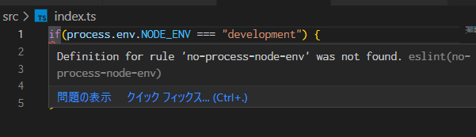
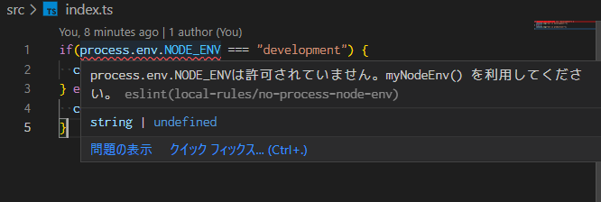
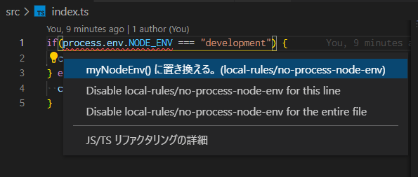
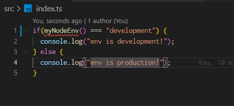

**2024-04-25 追記**: [Flat Configに関する記事](https://blog.sa2taka.com/post/custom-eslint-rule-with-flat-config)を記載したのでリンクを貼りました。ルールの作成自体は本記事は現在も参考になるはずです。

カスタムESLintルールを作ったことありますか？

ESLintは、JavaScriptやTypeScript、特にReactやVue、Angularなどモダンな環境で書いた事がある人はほとんどの人が使っているLinterです。LintはもともとC言語用の静的解析ツールですが、現在では文法チェックやよくある間違い、バグになりそうな部分の指摘などをしてくれるツール全般を指します。JavaScript用のものが、ESLintです。

そんなESLintは、自分のルールを作成できます。ここではカスタムESLintルールと呼びます。

本記事ではTypeScriptでそんなオレオレルールを作っていきましょう。

# 今回作るルール

話は変わって私事ですが、Node.jsのプログラムを作成しているときに環境によって動作を変更したい場面がありました。
テストならテスト用のDBを、開発なら開発用のデータを、本番なら本番のデータを、触る・入れるみたいな場面ですね。よくある。

こういった場合、Node.jsの環境であれば基本的にはこう書かれるでしょう。

```typescript
if(process.env.NODE_ENV = 'development') { 
  // 開発用の処理
}
```

ただ、作成している環境では、別途`myNodeEnv()`みたいな関数がありました。
この関数は`NODE_ENV`環境変数が空だった場合、`development`を、それ以外の場合は`NODE_ENV`の値を返すというメソッドで、基本的に開発時に`NODE_ENV`を設定しないので、こういった用途には`process.env.NODE_ENV`じゃなくて`myNodeEnv()`を使うべきでした。

なので、今回は`process.env.NODE_ENV`が使われたら`myNodeEnv()`を使ってね、と教えてくれるルールを作っていきましょう。

# デモ環境作成

まず、適当に環境を作っていきましょう。

```bash
$ mkdir custom-eslint-demo
$ cd custom-eslint-demo
$ yarn init
$ yarn add -D eslint typescript @types/node @typescript-eslint/eslint-plugin @typescript-eslint/parser
$ yarn tsc --init
$ yarn eslint --init
```

`tsconfig.json`と`.eslintrc.js`（設定によって`.eslintrc`とか別名です）が出来上がると思います。

:::
ちなみに、本記事の内容では何でもいいですが、後にちょっとだけ記載する別の方法を利用したい場合は`.eslintrc.js`じゃないと出来ないので、そちらがオススメです。
:::

```json:tsconfig.json
{
  "compilerOptions": {
    "target": "es5",
    "module": "esnext",
    "moduleResolution": "node",
    "esModuleInterop": true,
    "forceConsistentCasingInFileNames": true,
    "strict": true,
    "skipLibCheck": true,
    "outDir": "./lib"
  },
}
```

```js:.eslintrc.js
module.exports = {
    "env": {
        "browser": true,
        "es2021": true
    },
    "parser": "@typescript-eslint/parser",
    "parserOptions": {
        "ecmaVersion": 13,
        "sourceType": "module"
    },
    "plugins": [
        "@typescript-eslint"
    ],
    "rules": {
    }
};
```

# ルール作成

ではまずルールを破る実装を作ってみましょう。

```typescript:src/index.ts
if(process.env.NODE_ENV === "development") {
  console.log("env is development!");
} else {
  console.log("env is production!");
}
```

当然ながら、現状これでlintエラーは存在しません。

```bash
$ yarn eslint --ext .ts  src/
Done in 0.53s.
```

では、上記ファイルでlintエラーが発生するようにエラーを作成していきましょう。

## 実装の準備

TypeScriptで実装する場合は、別途eslintの型定義を必要としますので追加しましょう。

```bash
$ yarn add -D @types/eslint
```

続いて、カスタムルール置き場の適当なフォルダを作成していきましょう。`eslint`フォルダを今回は作成します。

`eslint`フォルダは下記のような構造にしようと思います。

```
eslint
├── __tests__ # テストケース置き場
├── rules # *.jsの置き場（基本触らない）
└── src # *.tsの置き場
```

:::warning
`eslint`フォルダを作成していますが、この状態だとVSCodeで読み込まれないです。
方法はいくつかありますが、この記事のやり方だとフォルダ名が変わりますので注意。

具体的には[VSCodeでも読み込めるように](#VSCodeでも読み込めるように)に記載しています。
:::

## ルールの作り方の概要

カスタムESLintルールは特定の構造を持ったオブジェクトを`module.exports`（いわゆるCommonJS）形式でエクスポートしてあげるとルールとして実行してくれます。

詳細は[ESLintルールの定義方法](https://eslint.org/docs/developer-guide/working-with-rules)に詳しいです（あくまでこれは公式ライブラリにルールを追加する時の話ですが）。

エクスポートするものは、下記のように`meta`と`create`という2つを作っていきます。`meta`はルールの説明役で、`create`はルールの実装です。

```typescript:eslint/src/no-process-node-env.ts
import { Rule } from "eslint";

const rule = {
  meta : {
    ...
  }, 
  create(context: Rule.RuleContext) {
    ...
  },
} as Rule.RuleModule

module.exports = rule;
```

:::
なんで

```typescript
const rule: Rule.RuleModule = {
...
}
```

と、しないのかというと。

何故か`@types/eslint`の`Rule.RuleModule`の`meta`の型である`RuleMetaData`に`hasSuggestions`という値がないからです。今回はこの`hasSuggestions`という値を利用するので、`as Rule.RuleModule`で最低限、型が効くようにしています。

[PR作ったので](https://github.com/DefinitelyTyped/DefinitelyTyped/pull/57531)、しばらくしたら治るかも？

と、作ったのもつかの間、記事書いている間に超速で取り込まれたので今は普通に上の書き方でできます。もしかして、カスタムESLintルールをTypeScriptで書いてる人間ってそんないないんですかね...。確かにパーサーによってASTが変わったり、論理的に型は自明だけどTypeScriptに判断できないみたいな場面があるので、TypeScriptの利便性よりノイズが多くなってしまう可能性はありそうですが。
:::

## ファイル名

ファイル名から拡張子を取ったものがそのままルールになります。

最終的にはそうじゃなくなるので、最悪適当なファイル名でいいですが、ルール名から乖離している必要はまったくないので、基本的にはファイル名がそのままルール名という状態が望ましいでしょう。

今回の場合は`no-process-node-env`というルール名にしてみましょう。

なので

```
eslint
├── __tests__
├── rules
└── src
    └── no-process-node-env.ts

```
こんな感じ。

### metaの中身

metaはルールの説明を記載できます。公式の[Rule Basics](https://eslint.org/docs/developer-guide/working-with-rules#rule-basics)にも記載がありますが、ここでも軽く触れていきます。

ちなみに全てoptionalです。なので指定しなくても問題ありません。

```typescript
meta: {
  type: "problem" | "suggestion" | "layout", // 。問題のあるコードか、よりよりコードを提案できるか、空白やセミコロンなどに関するルールのどれですか、というのを選択する感じですね。
  docs: {
    description: string, // ルールの説明
    category: string, // [rules index](https://eslint.org/docs/rules/)のどれかを指定します
    recommended: boolean, // .eslintrcとかに "extends": "eslint:recommended" みたいに記載された場合に有効になるかどうか
    url: string, // 完全なドキュメントのURL
  },
  fixable: "code" | "whitespace", // eslint --fixを使うときに指定するものです。本記事では使いませんし、違いがまだわかりません。
  hasSuggestions: boolean, // 変更の提案がある場合 true にします。じゃないとエラーになります
  schema: any[], // eslintで指定できるオプション。今回は使わない。正確ではanyではなくて JSONSchema4 というオブジェクト（の配列）。
  deprecated: boolean, // 非推奨かどうか
  replacedBy: any[], // 非推奨の場合の置き換えられたルール。調べてないのでなんの配列かはわからないです。
  messages: Record<String, String>, // 公式ページには記載がないです。ルールでエラーメッセージを吐くときに直接メッセージを指定するかわりに、messageIdというのを指定できます。その時、messagesのkeyをIDとして、対応するメッセージを吐いてくれます。
}
```

今回は、こんな感じにしました。

```typescript:eslint/src/no-process-node-env.ts
import { Rule } from "eslint";

const rule = {
  meta: {
    type: "problem",
    hasSuggestions: true,
    docs: {
      description: "許可のされていないprocess.env.NODE_ENV",
      suggestion: true,
    },
    messages: {
      unexpectedProcessEnvNodeEnv: "process.env.NODE_ENVは許可されていません。myNodeEnv() を利用してください。",
      replaceToNodeEnv: "myNodeEnv() に置き換える。",
    },
  },
} as Rule.RuleModule;
```

descriptionとかは既存の実装を参考に直訳した感じですね。ちなみに`suggestion: true`というのが`docs`の中にありますが、ESLint7以前では`hasSuggestions`じゃなくてこっちが使われているので、紹介までに記載してます。

## ルールの実装

ルールの実装は`create`関数で行います。

create関数はとあるオブジェクトを返す必要があります。
そのオブジェクトは **このASTのNodeが来たらこういう処理をします（結果としてエラーとなるコードだったらエラーをレポートします）** という感じのオブジェクトです。あくまで日本語にするなら。

### AST

ASTとはAbstract Syntax Tree、抽象構文木と呼ばれています。

JavaScript以外の文脈でもASTというのは用いられています。例えばRubyやPythonなどのインタプリタ言語はコードをASTに変換してからコードを実行するという用な感じですね。

ASTはソースコードをツリー表現したものです。treeって書いてありますもんね。百聞不如一見と言いますので、実際に見てもらったほうが理解は早いでしょう。

[AST Explorer](https://astexplorer.net/)は簡単にASTを見られるのでオススメです[^parser]。

[^parser]: より正確に確認したいなら、上の（おそらく）デフォルトの`acron`となっているパーサーの部分を適当なパーサーに置き換えたほうがいいでしょう。`@typescript-eslint/parser`が順当でしょう。

例えば今回ターゲットとする

```typescript:src/index.ts
if(process.env.NODE_ENV === "development") {
  console.log("env is development!");
} else {
  console.log("env is production!");
}
```

これをASTにかけた結果、If文の部分を抜き出したものが下記となります。ただし、あまりにも縦長になるので必要なものに絞っています。完全版は上記のサイトで簡単に見られるのでご確認ください。

```json
"type": "IfStatement",
  "test": {
    "type": "BinaryExpression",
    "left": {
      "type": "MemberExpression",
      "object": {
        "type": "MemberExpression",
        "object": {
          "type": "Identifier",
          "name": "process"
        },
        "property": {
          "type": "Identifier",
          "name": "env"
        },
        "computed": false,
        "optional": false
      },
      "property": {
        "type": "Identifier",
        "name": "NODE_ENV"
      },
      "computed": false,
      "optional": false
    },
    "operator": "===",
    "right": {
      "type": "Literal",
      "value": "development",
      "raw": "\"development\""
    }
  },
  "consequent": {
    ...// console.log("env is development!"); の部分
  },
  "alternate": {
    ...// console.log("env is production!"); の部分
  }
}
```

最初はなんとなく目を背けたくなるような感じですが、よく見るとそんなに難しいものではないですよね。

まず`IFStatement`はif文でしょう。if文は`test`と`consequent`と`alternate`を持っています。`test`の結果がtruelyだった場合`consequent`が、falsyだった場合は`alternate`が実行されるのでしょう。

次に`BinaryExpression`は二項演算子[^operator]ですね。`1 - 1`とか、`"hoge" + "fuga"`とかです。でleftが`MemberExpression`でrightが`Literal`、そんで二項演算子の演算子は`===`となっている、というのはわかります。つまり`MemberExpression` `===` `Literal` という感じですね。

[^operator]: ちなみに単項演算子（unary operetor）と多項演算子があります。前者はマイナスを表す`-1`とか、1を足す`1++`とかも該当するのでしょう。プログラミングで多項演算子としてもっぱら使われるのは三項演算子とか条件演算子とか呼ばれる`cond ? cons : alt`の形式のやつですね。

右項の`Literal`はそのままリテラルで、今回は文字列リテラルですね。

今回特に重要なのは左項の`MemberExpression`です。この`MemberExpression`は`node.env.NODE_ENV`のASTです。つまり、今回はこの形式のASTが現れたらエラーをレポートするようにしたいのです。

`MemberExpression`は（おそらく）その名の通り、オブジェクトのMemberであることを表します。例えば`process.env`や`console.log`がそうですね。今回は関係ないのあまり調べてないですが、`get computed () => { ... }`という感じでgetter形式で書かれる場合`computed: true`となるんだと思います。

`MemberExpression`はプロパティを持つの`object`とアクセスプロパティを表す`property`の2つを持ちます。

例えば、`a.b.c`という場合、どういうASTになるのでしょうか。下記のようになります（不要なものを省いてます）。

```json
{
  "type": "MemberExpression",
  "object": {
    "type": "MemberExpression",
    "object": {
      "type": "Identifier",
      "name": "a",
    },
    "property": {
      "type": "Identifier",
      "name": "b",
    },
  },
  "property": {
    "type": "Identifier",
    "name": "c",
  },
},
```

トップレベルのプロパティを見てみましょう。`c`ですね。このプロパティは`a.b`が持っています。なので`object`は`a.b`が表すものになるはずです。`a.b`も`MemberExpression`なので、`object`は`MemberExpression`です。でアクセスするプロパティは`b`です。`b`を持つ`object`は`a`なので、上記のASTも`a`となっていますね。

これを`process.env.NODE_ENV`に置き換えると、

- `MemberExpression`
- `property`が`NODE_ENV`、
- `object`が`MemberExpression`
- `object`の`property`が`env`
- `object`の`object`が`process`

というASTになることがわかりました。

### create関数

ASTの説明だけでお腹いっぱいですが、本来の目的はカスタムESLintルールを作るところです。

create関数はこのASTのNodeが来たらこういう処理をします（結果としてエラーとなるコードだったらエラーをレポートします）というオブジェクトを返すと言いました。これをコードで書くとこうなります。

```typescript
const rule = {
  meta: {
    ...
  },
  create(context: Rule.RuleContext) {
    return {
      MemberExpression(node: MemberExpression & Rule.NodeParentExtension) { }
      // または
      MemberExpression: (node: MemberExpression & Rule.NodeParentExtension) => { }
    }
  }
}
```

この例の場合は`MemberExpression`が来たら指定した関数を実行する、ということです。これはASTすべて（とESLint独自のやつ）指定することが出来ます。引数の`node`は、先程のJSONが入っています。

あとは

- `MemberExpression`
- `property`が`NODE_ENV`、
- `object`が`MemberExpression`
- `object`の`property`が`env`
- `object`の`object`が`process`

を満たす場合にエラーをレポートするような実装にすればいいのですね。早速実装していきましょう。

```typescript
// 型のimport
import { Rule } from "eslint";
import { MemberExpression, Expression, Super, Identifier, PrivateIdentifier } from "estree";

// 今回用いるtype guard達
const isMemberExpression = (
  object: Expression | Super
): object is MemberExpression & {
  parent: Rule.Node;
} => {
  return object.type === "MemberExpression";
};

const isIdentifier = (expression: Expression | Super | PrivateIdentifier): expression is Identifier => {
  return expression.type === "Identifier";
};

const rule = {
  meta: {
    ...
  },
  create(context: Rule.RuleContext) {
    return {
      MemberExpression(node: MemberExpression & Rule.NodeParentExtension) {
        // typeチェックを行います。typeといってもASTのtypeです。
        const sourceNode = node.object;

        // propetyにアクセスする親がMemberExpressionでなければ今回確認するやつではないですね。
        if (!isMemberExpression(sourceNode)) {
          return;
        }

        const sourceObject = sourceNode.object;
        const sourceProperty = sourceNode.property;
        const targetProperty = node.property;

        // TypeScriptじゃなければ、せいぜい確認するのはsourceObjectだけですが
        // すべてIdentifier型ではないので、TypeGuardも兼ねてすべてIdentifierであることを確認します。
        if (!isIdentifier(sourceObject)) {
          return;
        }
        if (!isIdentifier(sourceProperty)) {
          return;
        }
        if (!isIdentifier(targetProperty)) {
          return;
        }

        // 続いて値を確認していきます。
        // node.computedを確認しているのは、本家の`no-process-env`でやっていたからですが、正直不要だと思います。
        if (
          !node.computed &&
          sourceObject.name === "process" &&
          sourceProperty.name === "env" &&
          targetProperty.name === "NODE_ENV"
        ) {
          // 無事process.env.NODE_ENVのASTが現れたことを確認したらレポートします。
          context.report({
            node,
            // messageIdはmeta.messagesに指定した値を利用します。
            messageId: "unexpectedProcessEnvNodeEnv",
            // 提案する場合はこれを指定します。VSCodeで変換できるようになりますね。
            // またmeta.hasSuggestionsがtrueにする必要があります。
            suggest: [
              {
                // messageIdはmeta.messagesに指定した値を利用します。
                messageId: "replaceToNodeEnv",
                // 変換する動作です。今回は単純に`process.env.NODE_ENV`を`myNodeEnv()`に置き換えるだけに留まっています。
                fix(fixer) {
                  return fixer.replaceText(node, "myNodeEnv()");
                },
              },
            ],
          });
        }
      },
    };
  },
} as Rule.RuleModule;

module.exports = rule;
```

説明は上記コードのコメントを参照していただければ、ある程度理解できるコードかと思います。

ただ、TypeScriptの都合で、型関連のコードが増えています。
[本家のno-process-envの実装](https://github.com/eslint/eslint/blob/main/lib/rules/no-process-env.js)と比較すると（こちらのほうが確認するものが1つ増えているとはいえ）圧倒的に違いますね。

## 完成品

というわけで全部コミコミで実装したものがこれです。

```typescript:eslint/src/no-process-node-env.ts
import { Rule } from "eslint";
import { MemberExpression, Expression, Super, Identifier, PrivateIdentifier } from "estree";

const isMemberExpression = (
  object: Expression | Super
): object is MemberExpression & {
  parent: Rule.Node;
} => {
  return object.type === "MemberExpression";
};

const isIdentifier = (expression: Expression | Super | PrivateIdentifier): expression is Identifier => {
  return expression.type === "Identifier";
};

const rule = {
  meta: {
    type: "problem",
    hasSuggestions: true,
    docs: {
      description: "許可のされていないprocess.env.NODE_ENV",
    },
    messages: {
      unexpectedProcessEnvNodeEnv: "process.env.NODE_ENVは許可されていません。myNodeEnv() を利用してください。",
      replaceToNodeEnv: "myNodeEnv() に置き換える。",
    },
  },
  create(context: Rule.RuleContext) {
    return {
      MemberExpression(node: MemberExpression & Rule.NodeParentExtension) {
        const sourceNode = node.object;

        if (!isMemberExpression(sourceNode)) {
          return;
        }

        const sourceObject = sourceNode.object;
        const sourceProperty = sourceNode.property;
        const targetProperty = node.property;

        if (!isIdentifier(sourceObject)) {
          return;
        }
        if (!isIdentifier(sourceProperty)) {
          return;
        }
        if (!isIdentifier(targetProperty)) {
          return;
        }

        if (
          !node.computed &&
          sourceObject.name === "process" &&
          sourceProperty.name === "env" &&
          targetProperty.name === "NODE_ENV"
        ) {
          context.report({
            node,
            messageId: "unexpectedProcessEnvNodeEnv",
            suggest: [
              {
                messageId: "replaceToNodeEnv",
                fix(fixer) {
                  return fixer.replaceText(node, "myNodeEnv()");
                },
              },
            ],
          });
        }
      },
    };
  },
} as Rule.RuleModule;

module.exports = rule;
```

## テスト

ESLintのカスタムルールですが、簡単にテストができるので、追加していきましょう。

今回は`jest`を利用していますが、eslintは`mocha`を利用していますので、既存のプロジェクトが`mocha`だって人でも問題ないでしょう。

```bash
$ yarn add -D jest @types/jest ts-jest ts-node
$ yarn jest --init
```

どうせならテストもTypeScriptにしたいので、`jest.config.js`にその設定を入れます。

```javascript:jest.config.js
export default {
  preset: "ts-jest",
  testEnvironment: "node",
};
```

続いて、テストを記載していきます。`eslint/__tests__/no-process-node-env.test.ts`にでも記載しましょう。

```typescript:eslint/__tests__/no-process-node-env.test.ts
import { RuleTester } from "eslint";

const rule = require("../src/no-process-node-env");

const ruleTester = new RuleTester();
// rule名, ルールの実装(先程実装したやつ), 成功ケースと失敗ケース
ruleTester.run("no-process-node-env", rule, {
  // 成功ケース
  valid: ["process.env.hoge", "process.env"],
  // 失敗ケース
  invalid: [
    {
      code: "process.env.NODE_ENV",
      errors: [
        {
          // 失敗したときの詳細。ID指定じゃない場合はメッセージを直に書くのが正解かも。
          messageId: "unexpectedProcessEnvNodeEnv",
          type: "MemberExpression",
        },
      ],
    },
  ],
});
```

第三引数に成功ケースとして`valid`を、失敗ケースとして`invalid`を入れるだけです。`code`はそのままコードを書いてください。ちなみにこのとき`code`に`if(process.env.NODE_ENV)`と書いても、実際はエラーになりますがテストは失敗します。エラーになる最小の記載をしてください、ってことですかね。

テストはこれで記載完了です。ラクチン！。
動かしてみましょう。

```bash
$ yarn jest 
PASS  eslint-local-rules/__tests__/no-process-node-env.test.ts
  no-process-node-env
    valid
      ✓ process.env.hoge (27 ms)
      ✓ process.env (2 ms)
    invalid
      ✓ process.env.NODE_ENV (5 ms)

Test Suites: 1 passed, 1 total
Tests:       3 passed, 3 total
Snapshots:   0 total
Time:        1.915 s, estimated 2 s
Ran all test suites.
Done in 4.09s.
```

良さそうですね。
※ 多分ですが、実装の前にやったほうがいいです。TDD。

## ビルド

ただ、eslintはルールとして`ts`を読み込んでくれないので`js`に変換する必要があります。今回は`tsc`を利用しましょう。

スクリプトにビルド用コマンドを書きましょう。おそらく設定が異なるはずなので、今回は`./eslint/tsconfig.json`を作成しました。

```json:package.json
  "scripts": {
    "build:eslint": "yarn tsc -p ./eslint/tsconfig.json"
  }
```

tsconfigでは`outDir`を`rules`にするのが目的です。それ以外にもいくつか手は入れていますが、ここは環境次第です。

```json:tsconfig.json
{
  "extends": "../tsconfig.json",
  "compilerOptions": {
    "outDir": "./rules",
    "rootDir": "src"
  },
  "exclude": [
    "__tests__"
  ]
}
```

あとはビルドをしてあげましょう。

```bash
$ yarn build:eslint
```

こうすると、フォルダ構造はこんな感じになります。

```
eslint
├── __tests__
│   └── no-process-node-env.test.ts
├── rules
│   └── no-process-node-env.js
└── src
    └── no-process-node.env.ts
```

## ルールの適用

こうすればルールの適用自体は簡単です。`.eslintrc`とかにルールを追記してあげましょう。この際ルール名は、先程`rules`の直下に作ったjsのファイル名と同じにします。今回は`no-process-node-env`ですね。

```js:.eslintrc.js
module.exports = {
    "env": {
        "browser": true,
        "es2021": true
    },
    "parser": "@typescript-eslint/parser",
    "parserOptions": {
        "ecmaVersion": 13,
        "sourceType": "module"
    },
    "plugins": [
        "@typescript-eslint"
    ],
    "rules": {
+       "no-process-node-env": "error"
    }
};
```

カスタムESLintルールを適用するときは`--rulesdir`オプションを付けてあげます。これはルールの実装が置かれているディレクトリをしていするもので、今回は`eslint/rules`です。

```bash
$ yarn eslint --ext .ts --rulesdir=eslint/rules src/
... 
custom-eslint-demo/src/index.ts
  1:4  error  process.env.NODE_ENVは許可されていません。myNodeEnv() を利用してください。  no-process-node-env

✖ 1 problem (1 error, 0 warnings)
```

ちゃんとエラーが出てますね！！！　やったね。

## 完璧...? 

**・・・おや！？ VSCodeのようすが・・・!**



VSCodeはカスタムESLintがいい感じに使えません。ESLintのExtensionですね、正確には。いい感じに設定できるようになればいいんですけど。

# VSCodeでも読み込めるように

**移行の記載は、ESLint v9以降で推奨されているFlat Configにて解消されます。詳しくは[ Flat Config時代の自作ESLint#旧方法からの移行](https://blog.sa2taka.com/post/custom-eslint-rule-with-flat-config/#%E6%97%A7%E6%96%B9%E6%B3%95%E3%81%8B%E3%82%89%E3%81%AE%E7%A7%BB%E8%A1%8C) を確認してください。

色々試行錯誤してみましたが、多分VSCodeの設定では無理。じゃあどうするの。

パッと調べると[eslint-plugin-rulesdir](https://www.npmjs.com/package/eslint-plugin-rulesdir)というライブラリを使用する方法が出てきました。[書いて覚える ESLint ルールの作り方：キマリは通さない - Qiita](https://qiita.com/kik4/items/ef30d5e0e24dabb81463#%E3%83%AB%E3%83%BC%E3%83%AB%E3%82%92%E5%8B%95%E3%81%8B%E3%81%99)こちらの記事などが参考になります。

ですが、私のプロジェクト`.eslintrc.js`じゃないのよ。...あとルール名が`rulesdir/rule`になるのは直感的じゃない。

ので、本記事では違う方法を利用します。具体的には[eslint-plugin-local-rules](https://www.npmjs.com/package/eslint-plugin-local-rules)を使う方法です。

## 設定作業

まずはインストール。

```bash
$ yarn add -D eslint-plugin-local-rules
```

続いて`./eslint`を`./eslint-local-rules`にリネームします。というのも、`eslint-plugin-local-rules`は`eslint-local-rules.js`または`eslint-local-rules/index.js`を読みに行くという動きになるので。フォルダ名は全然わかりやすいので、個人的に抵抗はありませんが、抵抗がある場合は上記に示した`eslint-plugin-rulesdir`を利用しましょう。

続いて、`eslint-local-rules/index.js`を作成します。ここはルールを列挙するだけの場所なので、複雑なことは行いませんね。

```javascript:eslint-local-rules/index.js
"use strict";

module.exports = {
  "no-process-node-env": require("./rules/no-process-node-env.js"),
};
```

最後に`.eslintrc`を変更します。pluginとして`local-rules`を追加します。ローカルに定義していますが`local-rules`というプラグインが追加したものとESLint君が判断するので`rules`の中の追加したルールも変更します。

```.eslintrc.js
module.exports = {
    "env": {
        "browser": true,
        "es2021": true
    },
    "parser": "@typescript-eslint/parser",
    "parserOptions": {
        "ecmaVersion": 13,
        "sourceType": "module"
    },
    "plugins": [
        "@typescript-eslint",
+       "local-rules"
    ],
    "rules": {
-       "no-process-node-env": "error"
+       "local-rules/no-process-node-env": "error"
    }
};
```

## 動作確認

動作を見てみましょう。

```bash
$ custom-eslint-demo/node_modules/.bin/eslint --ext .ts src/
custom-eslint-demo/src/index.ts
  1:4  error  process.env.NODE_ENVは許可されていません。myNodeEnv() を利用してください。  local-rules/no-process-node-env
```

コマンドは良さそう。


VSCodeでもエラー表示されましたね！

更に今回はsuggestionを設定しています。
Ctrl + .とかで表示してみると。



提案が表示されますね。クリックしてみましょう。



置き換えられました。すごいぞ！

# まとめ

TypeScriptでESLint書きたい人って、多分少数派なんだと思う。
