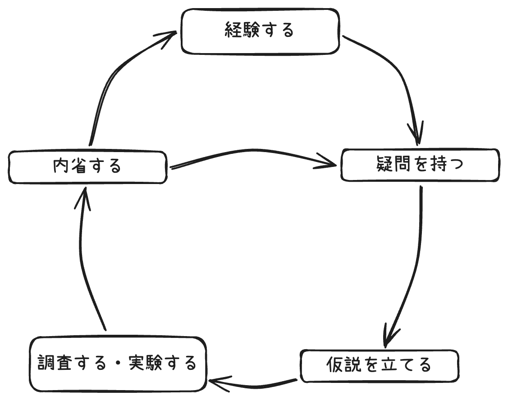

社会人になって7年と半年が経ち、ITエンジニアリング関連を中心に経験の量も人並みには増えてきました。私は高専から社会人になったこと、周りが大学院卒の方も多い関係で、近い年齢で社会人歴に差がある状況も多いです。地頭の良さとかはそういった方々と比べると平々凡々もいいところです。一方で過去実質3社に対して新卒として入社しており[^3-times-new=graduate]、全てにおいて高速なキャッチアップのスキルといたる話の場でも（多少場を荒らしながら）過去に一瞬見聞きした情報を活用して適切な回答を出すスキルを駆使して活躍できているという自覚はあります。

[^3-times-new=graduate]: 1回目は通常の新卒。2回目は2年目のときに出向研修という形でとある企業で1年間新卒研修からの経験を、3回目は今の会社に転職したときで新卒と同じグレードで所属したという内訳です。

これらのスキルは大なり小なり人間の根本に備わっていると考えていました。しかし最近、これらのスキルが必ずしも一般的ではないことに気づきました。そこで、以下の2点について深く考察するに至りました：

- **高速に知の拡大のサイクルを回すスキル**
- **過去に見聞きした情報を活用するための技術**

これらは共通の**知の拡大のサイクル**というものに深く紐づいているのでは、と考えました。本記事では、この**知の拡大のサイクル**とそれを支える**2つのスキル**について詳しく探求していきます。


# 暗黙知

知識というと[SECIモデル](https://ja.wikipedia.org/wiki/SECI%E3%83%A2%E3%83%87%E3%83%AB)を代表するような人の暗黙知をグループの形式知とする（SECIモデルでは更にそれを暗黙知として知識の発展をサイクルさせている）、いわゆる**ナレッジマネジメント**・**知識の体系化**という観点が多いです。

一方、本記事で焦点を当てるのは、体系化されない個人の**暗黙知を拡大するためのサイクル**です。マイケル・ポランニーの「**暗黙知の次元**」によれば、「我々は語れる以上のことを知ることができる」とされています。つまり、形式化できる知識以上のことを私たちは知ることができるのです。

特にクリエイティブな分野では、形式知だけでは解決できない課題に直面することが多く、暗黙知から生まれる直感が重要な役割を果たします。より高度なクリエイティブな仕事に取り組むためには、形式化できない知識を吸収し、自身の暗黙知を拡大することが不可欠です。

暗黙知（tacit knowledge）に関しては先程も記載したマイケル・ポランニーのいう本を紹介します。
ポランニーによれば暗黙知は特定の知覚できる**包括的存在**（**遠位項**）の構成要素（**近位項**）を**統合する過程**といいます。「人の顔の認知」という包括的存在には数多くの構成要素があります。例えば「鼻が高くて」「唇は薄くて」「ヒゲは生えてて」……。「我々は語れる以上のことを知ることができる」がここに繋がります。人の顔を知覚する（顔を見て誰かを当てる）のはとても簡単ですが、その中には数多くの言葉にできない知覚・感覚があります。これを包括的存在に統合する過程こそが暗黙知の正体であると。

# 知の拡大のサイクル

今回私が提示するサイクルは **「経験する」→「疑問を持つ」→「仮説を立てる」→「調査する・実験する」→「内省する」->「疑問を持つ」または「新たな経験で活用し経験する」** というフローです。



こちらのフローの意図としては、自らが意識して知識を拡大するためのサイクルを回すことで、暗黙知から更に形式知または暗黙知を拡大できるものであるということです。つまり通常の学習フロー以上に知識の拡大するための添加物として考えています。

:::info
**コルブの経験学習サイクル**というものがあります。こちらは、「具体的な経験をする」→「経験の観察と内省をする」→「内省から抽象概念を獲得する」→「別の機会で抽象概念をテストする」、4つのステップを繰り返すことで学習は進まるというものです。学習における基本であり本質的なステップだと思います。

今回私が提示したものも本質的には同じですし、なんなら内容も似ています。経験学習サイクルは経験から知識を獲得する本質的なサイクルであり、私の提示したサイクルは意識することで知の拡大を助けるもの、といった違いがあるものと思っています。
:::

## 経験する

基本的にはどのような知識獲得もここからスタートすると思います。

経験と記載していますが、こちらは「**学習**」でも問題ないと思います。特に全く未経験の業界へ進むときは本やブログなどを漁ることもあるでしょう。また、経験というのも「**自発的に経験したもの**」だけではなく「**偶発的に経験したもの**」も含みます。例えば、バグを見つけた・エラーレポートが上がってきた・質問されたなどはITエンジニアでは一般的だと思いますが、これらもこのサイクルの**スタートライン**です。

:::info
ドラッガーは[断絶の時代](https://drucker.diamond.co.jp/works/detail/22.html)にて知識労働に関する記述をしています。その中で

> 重要な科目ほど経験を積んだ後のほうが学びやすい。しかも、それらの科目の多くは、まさに経験を積んだ者が必要とする知識でもある

と述べています。最初教科書で学んでも分からなかったが、経験してから改めて体系的な知識を学びだすと理解が早まった、という経験は多くの人にあるでしょう。このサイクルとは強く関係ないですが、経験が知識獲得において重要であることは間違いないと思います。
:::

私が最近学習した話の具体例を挙げてみます。Next.jsというよりかはReactに近い話ですが、Next.jsのApp RouterではServer Actionという機能を使えるようになり、少し前にこちらを利用することとなりました。
Server Actionはクライアントから関数呼び出しのようにサーバーサイドの関数を呼び出します。
どう見てもただの関数呼び出しですが、実際にサーバーサイドで関数を呼び出せます。こういった経験をしてみました。

```typescript
export const BookmarkButton = ({user, article}) => {
  const bookmark = async (userId, articleId) => {
    "use server";

    sql`INSERT INTO bookmarks (user_id, article_id) VALUES (${userId}, ${articleId})`;
  };

  return <button onClick={() => bookmark(user.id, article.id)}>ブックマーク</button>;
}
```

## 疑問を持つ

経験や学習するとき、もしくは何か問題が出ている場合、特に新しいことであれば、そこには自分の知らない知識が隠れています。表面上をなぞるだけでなんとなく理解したという気分になることもありますが。しかし大抵の場合はそこの裏には本質的で抽象的でそして大抵は将来的に使える知識が埋まっています。

具体例として先程のServer Actionについての続きです。経験した次のステップとして、どうやってサーバーサイドの関数を呼び出しているのかという疑問が基本的には湧くでしょう。
ただし、この**疑問の源泉は過去の経験から来ています**。`use server`をするとサーバー側で実行できるんだなと表面的な理解をするだけの場合もあります。「クライアントからサーバーサイドの処理を呼び出すにはAPIを実装してHTTP通信するなどの必要がある」という過去の経験があるからこその疑問を持つことができるわけです。人生で初めて見たコードがこのServer Actionであれば、サーバーとクライアントという概念を知らなければ、そんな疑問は出ないでしょう。**疑問を持つこともスキルです**。

```typescript
export const BookmarkButton = ({user, article}) => {
  // 疑問
  // bookmarkはコンポーネントの中の関数だ。つまりクライアントの処理だ。
  // なのに何故サーバーサイド側で処理されるんだろう？
  const bookmark = async (userId, articleId) => {
    "use server";

    sql`INSERT INTO bookmarks (user_id, article_id) VALUES (${userId}, ${articleId})`;
  };

  return <button onClick={() => bookmark(user.id, article.id)}>ブックマーク</button>;
}
```

## 仮説を立てる

疑問が出たら当然解決する必要があります。疑問は検索すれば解決できる場合も多いです。一方で調査をしないと解決できないケースもあります。調査のためには仮説を立てることが不可欠です。どうしてもプログラムで仮説というと「推測するな、計測せよ」という言葉がありますが、そちらは[ミスリードである](https://aki33524.hatenablog.com/entry/2023/08/25/231051)という話もあります。（推論しなきゃ計測箇所もわからないんだから自明だろと思いつつ、）適切な推測 = 仮定を立てることは重要です。

仮説の立て方の1つとして、**アブダクション**があります。

アブダクション（リトロダクション）はチャールズ・サンダース・パースによって形式化された論理的推論の新たな手法です。論理的推論には帰納法と演繹法がありますが、アブダクションはこれらとは異なる第三の推論法となっています。詳細は[新装版 アブダクション: 仮説と発見の論理](https://amzn.asia/d/2tYpfUe)という本が詳しいです。

アブダクションでは「驚くべき事実Cが観察される。しかしもしHが真実ならばCは当然のことだろう、ゆえにHが真実であると考えるべき理由がある」という形式化がされています。例えば「陸地で魚の化石が発見される。しかしもしその陸地が昔海であれば、魚の化石があるのは当然だろう。ゆえにその陸地は昔海だった」というような推論です[^gyakuten]。
特に私はITエンジニアということもあり、こちらの定式化はプログラムのバグなどを探すときに非常に役立つ考え方ですし、様々な考え方に通じる非常に重要な考え方だと思っています。

[^gyakuten]: 個人的にはこの考え方が逆転裁判の「発想を逆転する」っぽいなという印象があります。

Server Actionの具体例の続きです。正直言うとServer Actionに関してはこのまま調査をすばすぐに答えがでるものです。その場合でも上記に記載したように知の拡大のサイクルにはこの仮定は重要だと考えています。「クライアントからサーバーを呼び出すには必ず何らかの通信が必要となる。おそらく現実的にHTTP通信、特にPOST処理を送っているのではないか」という仮説を建ててみます。この仮説を立てるというのは非常に難しく、疑問を持つ以上に**過去の経験が重要です**。上記の仮定を立てるためには、クライアントからサーバーに通信が必要であること、例えばgRPCはブラウザ通信では不向きなことなど同時多発的に現れる仮説の種を適切に取捨選択する必要があるからです。

```typescript
export const BookmarkButton = ({user, article}) => {
  // 疑問
  // bookmarkはコンポーネントの中の関数だ。つまりクライアントの処理だ。
  // なのに何故サーバーサイド側で処理されるんだろう？
  // 
  // 仮説
  // 通信を行わなければ絶対に実現不可能である。
  // ブラウザから通信されるため現実的にはHTTP通信を行っており、
  // 性質上おそらくPOSTリクエストを送っているのではないか
  const bookmark = async (userId, articleId) => {
    "use server";

    sql`INSERT INTO bookmarks (user_id, article_id) VALUES (${userId}, ${articleId})`;
  };

  return <button onClick={() => bookmark(user.id, article.id)}>ブックマーク</button>;
}
```

## 調査する・実験する

疑問と仮説がでたら、それを元に調査をします。こちらもアブダクションの力を借りることが出来ます。仮説から検証可能な予測を演繹的に導き出します。先程の例では「この陸地は昔海であった」という仮説を真とすると、演繹的に「土地を掘ることで海だった特有の地層が現れるだろう」（地層については詳しくsないですが）という予測が立てられます。この予測を検証するために、実際に土地を掘って地層を調査し、様々な場所で海である地層が現れると帰納的に先程の仮説が真といえます。

Server Actionの例であれば簡単です。調べてみると（公式ページにはあんまり書いてないですが）どのように実現しているかの検証をまとめてくれている方がいるからです。
一方で答えのない調査だったり、社内独自のドメイン的な知識だったりする場合はその限りではありません。そういった場合は仮説を元に調査を開始するため、仮説の精度が重要になるということですね。

ちなみにServer Actionでは実際にPOST通信を送っています。

```typescript
export const BookmarkButton = ({user, article}) => {
  // 疑問
  // bookmarkはコンポーネントの中の関数だ。つまりクライアントの処理だ。
  // なのに何故サーバーサイド側で処理されるんだろう？
  // 
  // 仮説
  // 通信を行わなければ絶対に実現不可能である。
  // ブラウザから通信されるため現実的にはHTTP通信を行っており、
  // 性質上おそらくPOSTリクエストを送っているのではないか
  //
  // 調査結果
  // 実際にPOST通信を送っており、bookmark関数全体がサーバーサイド側の処理となっている。
  const bookmark = async (userId, articleId) => {
    "use server";

    sql`INSERT INTO bookmarks (user_id, article_id) VALUES (${userId}, ${articleId})`;
  };

  return <button onClick={() => bookmark(user.id, article.id)}>ブックマーク</button>;
}
```

## 内省する

ここで重要なのが、その得られた知見を一時的なものにしないことです。「わかったから解消しよう」と短絡的に動くと将来的にコレを活用できません。ここで得られた知見を次のサイクルに活かすためには、**内省**が必要です。「自分の仮説と結論は合っていたか」「間違っている場合は何故間違っていたのか」「この結論を発展させたらどうなるか」などを考えることが重要です。

Server Actionの例であれば、調査結果としてHTTP通信がされている事がわかりました。こちらでも**過去の経験**を活かします。これでは、HTTP通信の受け口ということは一般的にController層と呼ばれる部分の性質を保つ必要があるという、という内省結果を得たとします。この内省結果は次のサイクルに活かされます。

```typescript
export const BookmarkButton = ({user, article}) => {
  // 疑問
  // bookmarkはコンポーネントの中の関数だ。つまりクライアントの処理だ。
  // なのに何故サーバーサイド側で処理されるんだろう？
  // 
  // 仮説
  // 通信を行わなければ絶対に実現不可能である。
  // ブラウザから通信されるため現実的にはHTTP通信を行っており、
  // 性質上おそらくPOSTリクエストを送っているのではないか
  //
  // 調査結果
  // 実際にPOST通信を送っており、bookmark関数全体がサーバーサイド側の処理となっている。
  //
  // 内省
  // HTTP通信ということは、この関数は実は一般的なcontroller層の役割を持っている。
  // つまりcontroller層での対応、または境界値防御が必要な処理ということである。
  const bookmark = async (userId, articleId) => {
    "use server";

    sql`INSERT INTO bookmarks (user_id, article_id) VALUES (${userId}, ${articleId})`;
  };

  return <button onClick={() => bookmark(user.id, article.id)}>ブックマーク</button>;
}
```

## 新たなサイクルへ

ここまでが一連の1サイクルとなります。ここから更にサイクルが始まる可能性がありますしここで一旦休憩ということもあると思っています。たとえここで一旦休憩したところで、また別のタイミングで新たな知の拡大のサイクルが始まります。新しいサイクルでも別のサイクルでもここで得られた暗黙知を活用できることが重要です。

Server Actionの例では、内省結果としてController層の役割を持っているということがわかりました。この結果を元に、新たなサイクルを回すことができます。例えば、Controller層の役割を持つ関数であるため境界値防御が必要だが認証がされていないことに疑問を持ちました。そうすると渡すuserIdを任意のものにすれば別人のブックマークができるのではないかなと仮説を立て、実験をしてみます（する必要もないぐらい自明なんですが）。やってみると実際に別人のブックマークができてしまいました。内省としてはserver actionでは認証が必要なんだなということがわかります。
更に新たなサイクルとして、今度は別のServer Actionを実装するときにこの内省を活かして認証を確実に行うことができます。そこから**サイクルが回らない可能性はあります**が、この知識が**今度は別のサイクルの「疑問を持つ」「仮説を立てる」「内省する」のステップに活かすことができます**。

ちなみにこのへんは[Server Action - Security](https://nextjs.org/docs/app/building-your-application/data-fetching/server-actions-and-mutations#security)に記載されています。Next.js採用前にちゃんと読みましょう。

```typescript
export const BookmarkButton = ({user, article}) => {
  // 内省
  // HTTP通信ということは、この関数は実は一般的なcontroller層の役割を持っている。
  // つまりcontroller層での対応、または境界値防御が必要な処理ということである。
  // 
  // 疑問
  // 一般的なcontroller層ということは、認証などをが必要ではないか?
  //
  // 仮説
  // userIdを外部から渡しているため、これだとセキュリティ的に問題がある（なりすましができる）状態ではないか?
  // 
  // 実験結果 
  // なりすましができるということは、userIdを改ざんすれば別人のブックマークを作成できそうだ。
  // 実際にリクエストを送る際にuserIdを別のものにしたら別人のブックマークができてしまった。
  //
  // 内省
  // サーバーアクションでは認証が必要だ。
  const bookmark = async (userId, articleId) => {
    "use server";

    sql`INSERT INTO bookmarks (user_id, article_id) VALUES (${userId}, ${articleId})`;
  };

  return <button onClick={() => bookmark(user.id, article.id)}>ブックマーク</button>;
}
```

## 知の拡大のサイクルのまとめ

これまでの過程は「暗黙知を拡大するためのサイクル」といいました。暗黙知は包括的存在を統合する過程ですね。

- 経験は暗黙知を獲得する第一歩です。包括的存在の第一歩は知覚できる存在です。構成要素の統合する過程を得るため、ここから疑問を持ち、仮説を立て、調査し、内省していきます
- 疑問を持つことは包括的存在の構成要素があることに気づくことです。疑問を持たなければここでサイクルは止まってしまいます
  - Server Actionであればどうやって動作しているかという観点でした
  - バグ調査であればそのバグが何故おきているかを考えることです
- 仮説を立てることは要素を洗い出すことです
  - Server ActionであればHTTP通信が必要であることを仮定しました
  - バグ調査であればそのバグが発生する場所や条件を考えます
- 調査・実験は要素を統合することです
  - Server Actionは検索してみるとHTTP通信をしていることがわかり、そこから包括的存在と要素の関係がわかりました
  - バグ調査の実験ではそのバグが発生する条件を再現しその条件を変えてみることで、何がその包括的存在の要素であるかを取捨選択し関係性がわかります
- 内省することで統合の過程を知り、内在化します ≒ 知見を得ます
  - Server ActionではHTTP通信を用いていることからController層に似たものであることがわかった結果、通常のControllerの構造と同じであることがわかり、Controller層に必要な前提条件をServer Actionでも適用できそうなことがわかりました
  - バグ調査ではその結果から類似のバグなどがわかり（例えばインデックス境界値の問題など）今後のバグ対策に活かすことができたり、その類似のバグのグループに対して対策することで、包括的存在のバグを防ぐことができるかもしれません

改めて記載しますが、ポランニーが「暗黙知の次元」にて、暗黙知において必要な2つの条項、諸要素からなる近位項と包括的存在からなる遠位項を統合する過程が暗黙知であると述べています。この遠位項と近位項には2つのレベルの意義や精神を持ちます。それらは階層構造を持ち、そして更に多層的な「知の宇宙」に取り込まれることでさらなる階層構造になるということです。この知のサイクルはこの小さな階層構造を高速に作成していくものだと思っています。

# 知の拡大のサイクルを支える2つのスキル

最初に「高速なキャッチアップスキル」と「一瞬見聞きした情報を活用し適切な回答を出すスキル」という話をしました。こちらは私の自覚しているスキルであり、この知の拡大のサイクルに役立っているものだと考えています。

言い換えると「**高速に知の拡大のサイクルを回す**」ことで「高速なキャッチアップ」を実現し、「**知識を思い出す**」ことが「一瞬見聞きした情報を活用し適切な回答を出す」ことに重要な要素となっています。

## 高速に知の拡大のサイクルを回すスキル

「高速に知識のサイクルを回す」とは、シンプルに上記のサイクルを高速に回すことです。

サイクルではしばしば**過去の経験**という言葉があります。しかし、特にキャッチアップの場を想定すると、大抵の場合は過去の経験はなく、あるのは目の前にある大量の疑問だけです。しかもそれは表面的な疑問であり、深堀りをすると更に多くに疑問が出ます。**過去の経験がない場合はその経験を作る**のが重要です。

**最初の一歩目のやり方は人それぞれあると思っています**。全く取っ掛かりがない場合もあり得るでしょうが、今回は例えば所属して1日目に小さな開発タスクを振られたとしましょう。
私であれば背景をSlackなりを検索して得られる情報を調べます。大量のフローデータから自分なりの結論を得ることが得意ですので、そちらを使って仮説を立てます。そしてそれをメンターの方などに伝えて自分の結論が正しいかを確認しています。大抵の場合最初に振られるタスクは難しくもないしメンターがちゃんと解説してくれるとは思います。それでもメンターにとって当然の暗黙知の説明が省かれることもあるわけで、こちらは頻度高く実施することとなります。こちらのやり方は将来的には少量のフローデータから仮説を立てる力が付きますが、一方で少量のフローデータで仮説を立てられる自信もついてしまい最終的にとんでもない誤解をすることもあります。
逆に「とにかくやってみる」というのもありでしょう。実際にやってみればすぐに質の高いフィードバックを得られます。他にはペアプロ・ペア作業などで他人の知見を取得したり、自分で改めて要件定義したり詳細設計をちゃんと書いてレビューしてもらうなど、とにかく経験を積むことが重要だと考えています。

高速に知の拡大のサイクルを回すためには、その起爆剤となる最初の一歩のやり方を見つけ、**まずは高速に経験する**ことが重要です。そこからは後は疑問というエンジンがかかれば自然とサイクルが回り出します。

## 知識を思い出すスキル

「疑問を持つ」「仮説を立てる」「内省する」というのは**過去の経験を活かす**ことが前提となっています。そのため、過去の経験を活用するためのスキルが必要です。知識の活用というとナレッジマネジメントのように感じますが、**知識の体系化**だけではない**過去の経験を思い出すスキル**です。

簡単に言えば「適切なときに類似の過去の経験やその内省結果を取得できる」スキルです。あくまで主観的ですが、私自身はこのスキルがかなり高いと自負していて、3か月前や半年前におきた似た出来事をなんとなく思い出し、その情報を元にSlackなどを検索して探し出すということが今まで数多くありました。

基本的には内省した、または何度も繰り返し経験した（[SECIモデル](https://ja.wikipedia.org/wiki/SECI%E3%83%A2%E3%83%87%E3%83%AB)における内面化まで持っていった状態）であれば数年前の経験でも思い出すことができると思います。私でしたらWindowsバッチの書き方とか、初期状態のWindowsではPowerShellのスクリプトは動かないとか、そういった数10回とやってきたものは思い出せます。

一方で1回だけ行った経験、一瞬だけ見た情報などは当然すぐには思い出せません。しかし、これらの一見忘れてしまったように見える経験や情報も、実は脳の中に保存されていることがあります。[リファクタリング・ウェットウェア](https://www.oreilly.co.jp/books/9784873114033/)では、脳をLモード（論理的・意識的処理）とRモード（直感的・無意識的処理）の2つの処理モードを持つシステムとして捉えています。一度だけの経験や一瞬見た情報は、主にRモードで処理され、無意識の領域に保存されることがあります。これらの情報は、直接的に思い出すことは難しいかもしれませんが、**適切な刺激や状況下で突然思い出されたり、問題解決の際に直感的なひらめきとして現れたりすることがあります**。具体例としては散歩しているときとかシャワーしているときとかです。

私もさきほどスキルが高いと自負しましたが、別に記憶力は全く持って良い方ではありません（飲み物を取りに行こうと椅子から立ち上がっただけでなんで立ち上がったか忘れる程に）。
おそらく**問題に対して深く洞察・内省をおこなう**ことでRモードが検索を始め、ふとした瞬間に類似した記憶が現れるのだと思います。
実際、ある問題が発生したとき、その問題が実は2年前に1回だけおきた問題と同じだった事がありました。2年前に起きたことを思い出したのは、その問題について深く考え、一度その問題から離れて6時間後に休憩していたときでした。つまり**発生した問題、未知（と思われる）経験に対してちゃんと考えることが重要である**と捉えています。そしてその方法が**知の拡大のサイクルです**。その問題や経験に対して疑問を持ち・仮定を立て・調査し・内省することで、脳のRモードがその問題に対してフル稼働してくれ、ちょっと長いけどそう長くもない時間の後に検索結果を返してくれます。

# まとめ

知の拡大のサイクルとして下記の5つを1つのサイクルとして行うことで暗黙知を貯め・拡大できると考えました。

1. 経験する：新しい技術や課題に直面する
2. 疑問を持つ：経験から生じる疑問を認識する
3. 仮説を立てる：疑問に対する可能な説明を考える
4. 調査する・実験する：仮説を検証するために情報を集め、実験する
5. 内省する：得られた結果を深く考察し、理解を深める

知の拡大のサイクルをより効果的に回すためには、以下の2つのスキルがあるとよいとも考えています。

1. 高速に知の拡大のサイクルを回すスキル
   • 新しい環境や技術に対して、迅速に経験を積み持つ能力
   • 過去の経験がない場合はまずは積極的に経験を作り出す姿勢が重要で、自分にあった方法を見つける
2. 知識を思い出すスキル
   • 過去の経験や一度見聞きした情報を適切なタイミングで思い出し、活用する能力
   • 直接的な記憶だけでなく、無意識的に保存された情報についてフォーカス
   • 問題に対して深く洞察・内省することで、関連する過去の経験を思い出しやすくなる

最終的にAIに書かせた深そうで浅い文章になってしまいました。
