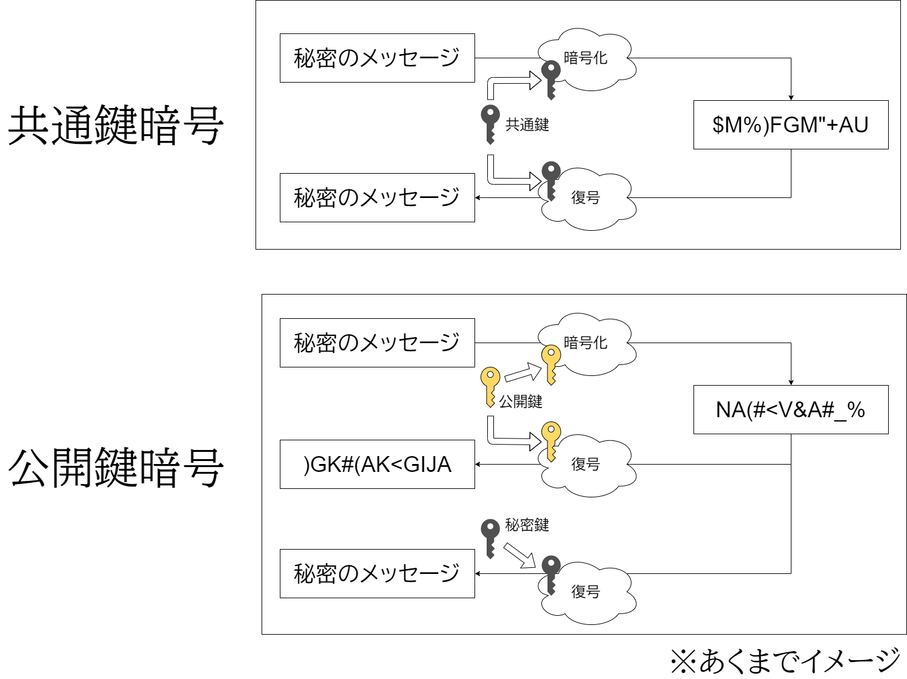
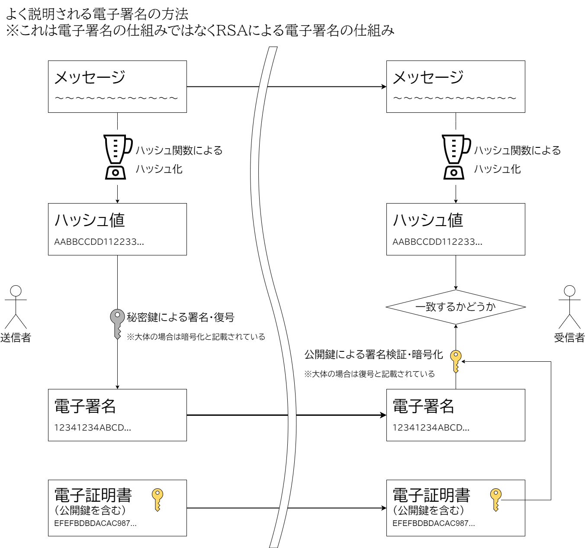
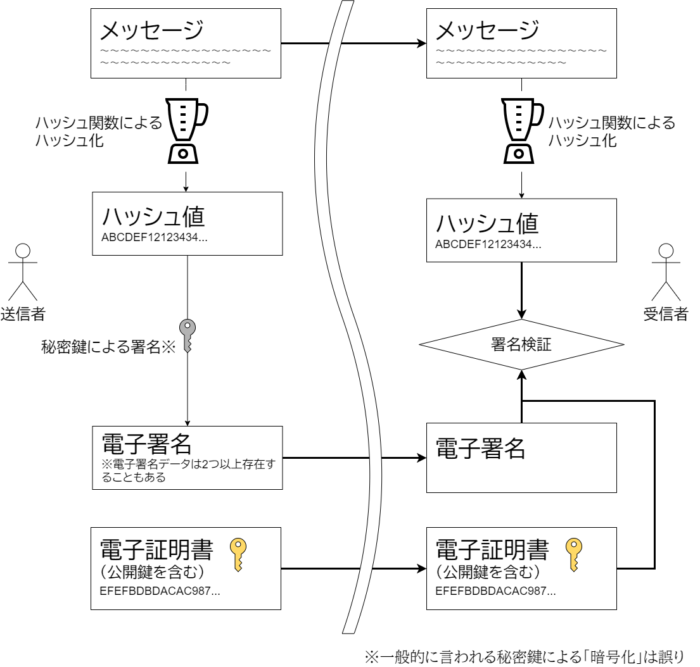
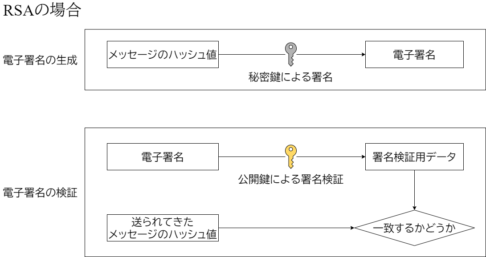
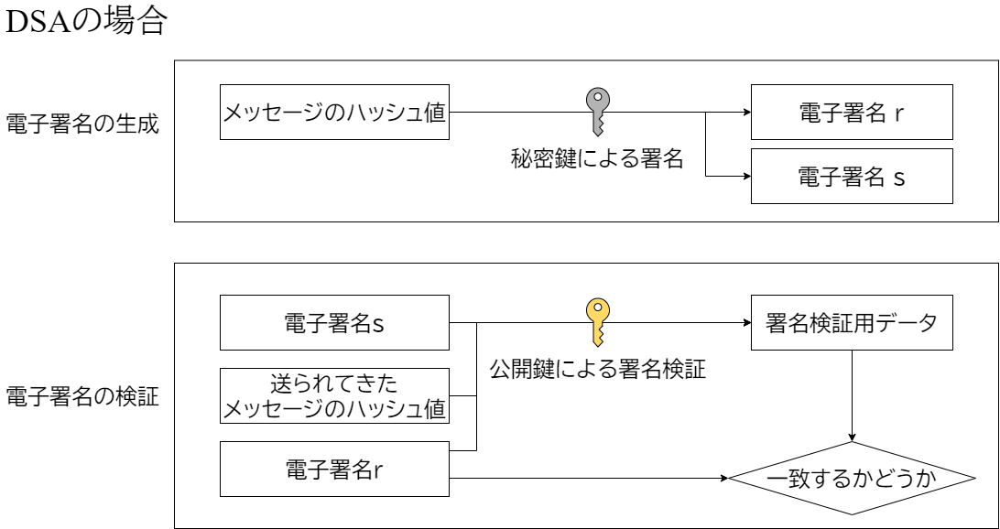
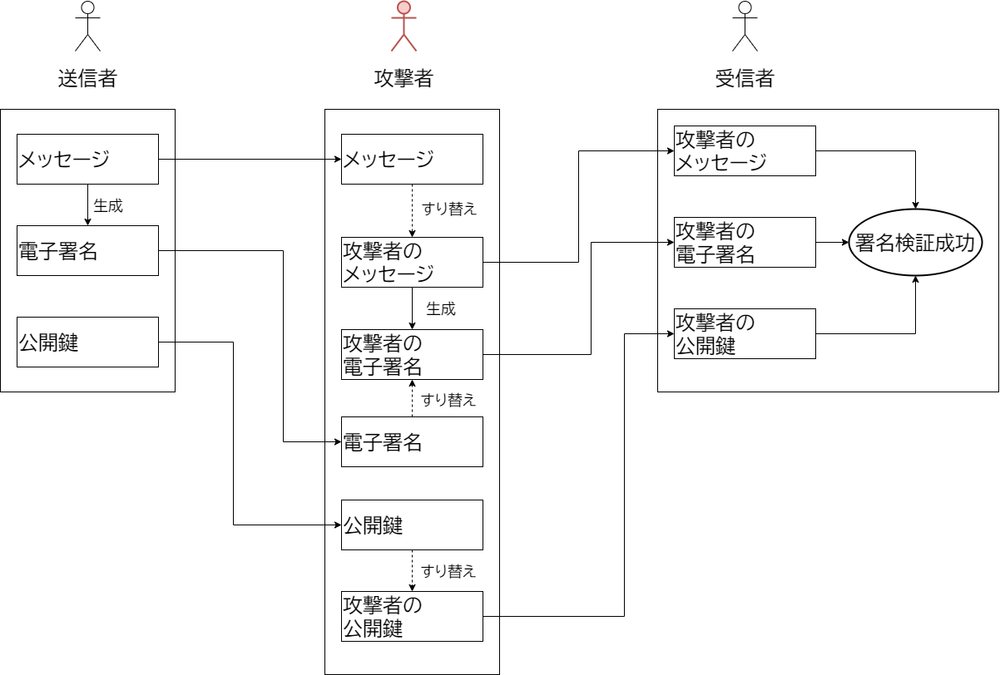
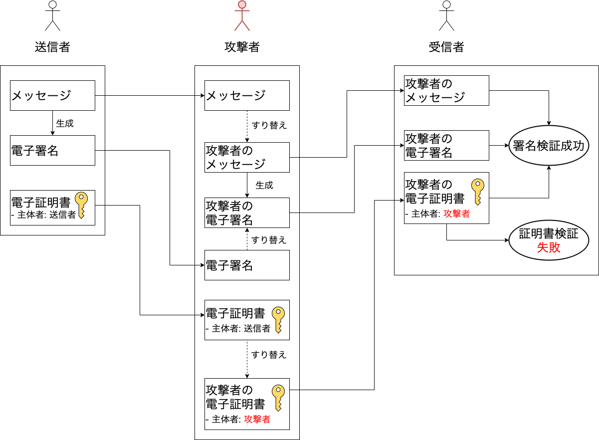
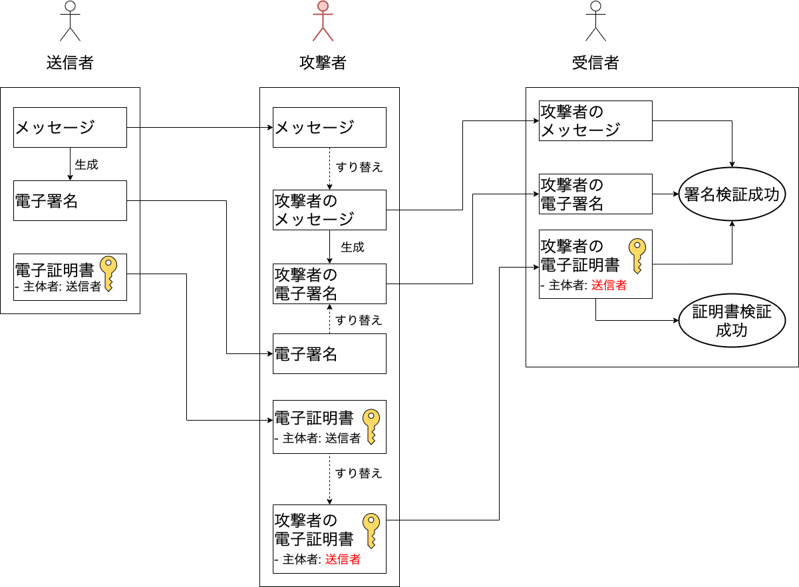
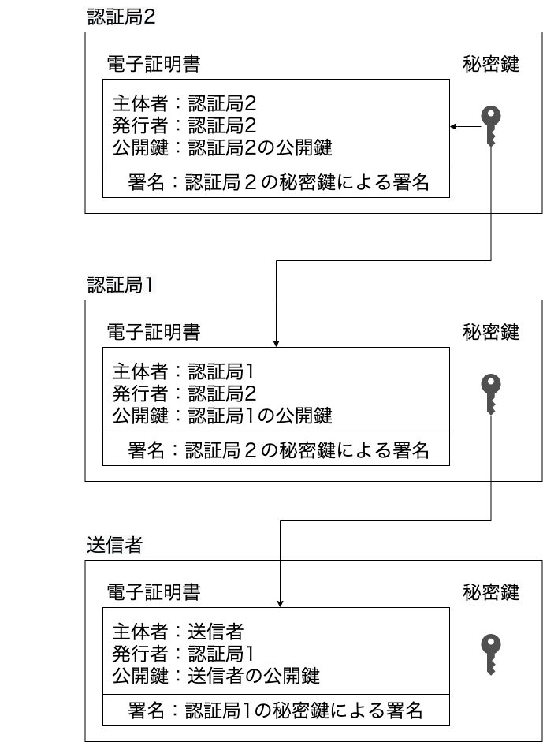

ハローワールド。

電子署名、ってなんだろうと思って調べると「電子署名は電子文章版の署名や押印です」などのような説明が多いですよね。

その説明は間違ってはいませんし、通常はそれぐらいの理解で問題はありません。しかし、額面通り受け取ってしまうと、電子文章（PDFとか）にサインをするの？などと思ってしまったり、もしくはもっと詳しく知りたい場合、それ以上踏み込んだ説明がなかなかありません。

本記事はそこに一歩だけ踏み込んで、初学者向けに電子署名を説明していきます。

- 電子署名って言葉を知らない
- 電子署名はなんとなくわかるけど、具体的にはよくわからない
- 電子署名について調べて、更に詳しいことが知りたい
- 電子署名に調査するよう言われたが、何から手を付ければいいかわからない

そのような人たちにおすすめです。

# 署名とは

電子署名の前に、署名の話です。電子署名は電子上で行う署名のことなので、署名とは何かを知るのも大事でしょう。

goo辞書[^goo-dict]において[署名](https://dictionary.goo.ne.jp/word/%E7%BD%B2%E5%90%8D/)はこんな意味となっています。

[^goo-dict]: https://dictionary.goo.ne.jp/

> ［名］(スル)本人が自分の名を書類などに書くこと。また、その書かれたもの。「契約書に署名する」

なるほど、署名とは名前を書類に書くことなんですね……というのは違います。これは「やっている行為」の説明であり、「行為の理由」の記載がありませんね。
コトバンク[^kotobank]の日本大百科全書（ニッポニカ）の[署名](https://kotobank.jp/word/%E7%BD%B2%E5%90%8D-4626)には、それに加えとても大事な記載があります。

[^kotobank]: https://kotobank.jp/

> **行為者の同一性を示し、行為者の責任を明らかにするため**に行為者が自己の氏名を手書き（自署）すること。（強調は筆者）

署名とは**行為者の同一性を示し、行為者の責任を明らかにする**ものなのですね。行為者の同一性を示す、というのは即ち**その人が行ったことを示す**ことですね。例えばクレジットカードで支払うときにサインするのは、クレジットカードで払うという行為は自分のものですよ・自分は別の人がなりすましていませんよ、などを示すためです。また、同一性を示せれば何でもいいのです。日本では署名より押印の方がずっと多いと思いますが、押印も目的は同じです。

そんなの誰でもわかるよ、というお話でしょうか。では、行為者の同一性を示すのは何が嬉しいのでしょうか。

署名を利用する主な理由は下記の2つでしょう。

- 真正性
- 否認防止

この2つの言葉は、情報セキュリティの分野で出てくる言葉です。[JIS Q 27000シリーズ(JIS Q 27000:2019)](https://kikakurui.com/q/Q27000-2019-01.html)[^jisq27000:2019]では次のような説明がなされています。

[^jisq27000:2019]: https://kikakurui.com/q/Q27000-2019-01.html

> 真正性（authenticity） エンティティ（筆者注: 行為者）は，それが主張するとおりのものであるという特性。

> 否認防止（non-repudiation） 主張された事象又は処置の発生，及びそれらを引き起こしたエンティティを証明する能力。 

ちょっと何行っているかわからない、という感じですが、簡単に言えばこんな感じです。

- 真正性：メッセージ・文章・行為などが、その人によって送信した・作られた・行われたことを証明できること。例えば、とっぷらがとっぷら本人のクレジットカードを利用したことを証明できること。ここにはとっぷら自身が本人であることと、クレジットカードが本物であること、どちらも真正性の対象となる。
- 否認防止：「第三者が」行った人物を証明できること。例えば、とっぷらがクレジットカードを利用した、というのを第三者（例えば裁判官など）が証明できること。これは、逆に俺はやっていない、と否認が出来ないことも意味する。

なんか言われてしまえばあたり前のことかもしれません。

本章で言いたいのは**電子署名における署名の意味**は、名前を書くことではなく**行為者の同一性を示すこと**です。より単純化するなら、真正性と否認防止を保持することです。

# 電子署名とは

電子署名、という言葉を聞くと、デジタル上で名前を書くこと、と思ってしまいますよね。そして現実では、例えばタブレット端末とデジタルペンシルなどを用いて署名を求められる事がありますよね。ご経験のある方も多いと思います。あれは電子署名なのですか？という話ですが、残念ながら違います。アレはただの署名です。

電子署名は、電子上で行う署名ですが、その正体は一体何でしょうか？探っていきましょう。

## 定義

まず、電子署名の定義ってなんでしょうか？定義自体は色々ありますが、今回はアメリカの政府で使われているものを見てみましょう。

アメリカには連邦情報処理標準、通称FIPSと呼ばれるものがあります。これは米国連邦情報技術局（NIST）によって発行される標準や指針、即ちガイドラインで、少なくとも政府機関などではこのFIPSに従います。ただ、FIPSは業界標準などにも用いられるほど強い影響力を持つものです。

FIPSには電子署名について記載したものがあり、[FIPS186-4](https://www.nist.gov/publications/digital-signature-standard-dss-2)[^FIPS186-4]に纏められています。

[^FIPS186-4]: https://www.nist.gov/publications/digital-signature-standard-dss-2

このFIPS186-4における電子署名の定義を見てみましょう。

> Digital signatures are used to detect unauthorized modifications to data and to authenticate the identity of the signatory. In addition, the recipient of signed data can use a digital signature as evidence in demonstrating to a third party that the signature was, in fact, generated by the claimed signatory. This is known as non-repudiation, since the signatory cannot easily repudiate the signature at a later time
> > 電子署名は、データへの不正な変更を検出し、署名者の身元を認証するために使用される。さらに、署名されたデータの受信者は、署名が実際に主張された署名者によって生成されたものであることを第三者に証明するための証拠とし電子署名を使用することができる。これは、署名者が後で簡単に署名を否認することができないため、否認防止として知られている。

この文章はほとんど先程の「行為者の同一性を示す」の具体的な説明と言えますが、一点だけ異なる場所があります。それが`データへの不正な変更を検出し`の部分です。通常の署名と電子署名とで大きく異なる部分がここです。これは情報セキュリティでは**完全性**と呼ばれるものです。完全性は。[JIS Q 27000シリーズ(JIS Q 27000:2019)](https://kikakurui.com/q/Q27000-2019-01.html)[^jisq27000:2019]では次のような説明がなされています

> 完全性（integrity） 正確さ及び完全さの特性。

簡単に言えば下記のようになります。

- 完全性：データが壊れたり、他人によって改ざんされていないこと。例えば、クレジットカードの支払額があとになって減らせたり出来ないこと。

ただの署名では完全性の保持は難しいです。**通常の署名は文章が改ざんされていないことは証明できません**ので、あとから「1万円」の文字を「3万円」に書き直すことが出来てしまいます[^ichi-man]。書いたときに紙をコピーしたりカーボンコピーするなどして写しを取ることで、改ざん防止は可能ですが、署名単体にその効果はありません。

[^ichi-man]: 「一」や「二」などの漢字は改ざんされやすいため、「壱」や「弐」などの漢字を金額で用いる様になったのですね。

しかし、電子署名では「文章が改ざんされていない」ことを証明できるのです。改ざんされていない、というのは少なくとも**電子署名したタイミングから文章の変更が無い**、という意味です。

:::info
日本にも電子署名に関する法律である[電子署名及び認証業務に関する法律](https://elaws.e-gov.go.jp/document?lawid=412AC0000000102)[^digital-sign-law]、通称電子署名法があります。法律なので、具体的な手段などについての記載はないですが、ざっくり上記の定義は記載されています。大半は認定制度について書かれているので、紹介までに留めておきます。
:::

[^digital-sign-law]: https://elaws.e-gov.go.jp/document?lawid=412AC0000000102

## 正体

上記では定義を見ましたが、定義だけを見たらあんまりよくわからないですね。なので、ここでは電子署名の正体を見ていきましょう。引き続き[FIPS186-4](https://www.nist.gov/publications/digital-signature-standard-dss-2)[^FIPS186-4]からの引用です。

> This Standard defines methods for digital signature generation that can be used for the protection of binary data (commonly called a message), and for the verification and validation of those digital signatures. Three techniques are approved. 
> (1) The Digital Signature Algorithm (DSA) [...].
> (2) The RSA [...].
> (3) The Elliptic Curve Digital Signature Algorithm (ECDSA) [...].
> > 本規格は、バイナリデータ（一般にメッセージと呼ばれる）の保護、およびそれらの電子署名の検証と妥当性確認に使用できる電子署名生成の方法を定義する。3つの技術が承認されている。
> > (1) 電子署名アルゴリズム (DSA) (中略)
> > (2) RSA (中略)
> > (3) 楕円曲線電子署名アルゴリズム (ECDSA) (以下略)

この**DSA**, **RSA**, **ECDSA**というのが電子署名の正体です（あくまでFIPS 186-4の中での話です）。これらは一体何でしょうか。

これらは**公開鍵暗号**と呼ばれるものです。もし電子署名と調べたなら、この公開鍵暗号という言葉はすでに知っているかもしれません。

# 公開鍵暗号

暗号、というと、伝えたいメッセージをパスワードによって一見意味のわからない文字列へ変換すること（= 暗号化）を一番最初に思い浮かべます。その一見意味のわからない文字列は暗号化したときに利用したパスワードを使って変換すること（= 復号）することで伝えたいメッセージが復元されて読める用になる、というものですね。

この方式は**共通鍵暗号**や対称鍵暗号などと呼ばれています。これは暗号化と復号に用いる鍵、即ちパスワードが同じという意味です。共通鍵暗号の問題点は、自分と通信相手だけが知っているパスワードを作り出さないといけない点です。

公開鍵暗号は共通鍵暗号の反対です。公開鍵と呼ばれる鍵でメッセージを暗号化し、秘密鍵と呼ばれる鍵でメッセージを復号できます。イメージとしては下図のとおりです。**あくまでイメージです**。この公開鍵暗号の利点は、公開鍵を公開しても、秘密鍵さえ秘密にしておけば、誰も暗号化したメッセージを解読できない点です。なので公開鍵を街の掲示板に張り出しても、暗号化はみんなできますが、理論上は誰も解読できないのです。

なぜイメージであることを強調したのかというと、**上図の方式の公開鍵暗号というのは公開鍵暗号のメジャーな使い方ではありません**。暗号という名前がついている以上、上記の方式が一般的な使われ方と思ってしまいますが、実は違います。というのも、**上図の公開鍵暗号ができるのは**、先程出てきたDSA, RSA, ECDSAのうちでは**RSAのみ**です。

あくまで公開鍵暗号は**公開鍵と秘密鍵がある**んだな、という点と、**公開鍵は公開して良くて秘密鍵は公開してはだめ**であることが重要です（名前のとおりです）。

:::info
一般的に暗号というのは、情報セキュリティで言う機密性を保持する、と思われがちです。機密性は許可されていない人に対して情報がバレないことです。暗号の場合はパスワードを知らない（=許可がない）と情報が取得できない、ということですね。
しかしながら、暗号は機密性以外をカバーすることもあります。例えばMAC(Message Authentication Code)は共通鍵版の電子署名のようなものです。

1. メッセージと共通鍵を使い何らかの形でMACを生成し、メッセージとMACを送信する。このMACはメッセージごとに理論上異なる値。例えば、メッセージを後術のハッシュ関数で変換し、変換後のデータを共通鍵で暗号化するといった方法でMACを生成する。
2. メッセージを受け取った人は1。と同じ方法でMACを生成する。生成したMACと受け取ったMACが同じかどうかを検証する。同じである場合は改ざんがなく、違う場合は改ざんがあると言うことがわかる。

メッセージ自体は暗号化されていない場合は、機密性は保持されていません。ですが、MACによって改ざんの検知を行い完全性を保持します。また対称鍵が相手と自分しか知らないという前提において、相手しか知り得ないはずの対称鍵によって同じMACが生成出来た場合は真正性（相手が想定している人であること）を保持できます。電子署名と違って、第三者に証明できないため否認防止は保持できません。

このように**暗号は機密性の保持以外でも使われる**、という点が重要となります。
:::

## 公開鍵暗号と電子署名

では、公開鍵暗号による電子署名って一体何を行うのでしょうか？

「電子署名」と検索して、一般的に説明される仕組みは下記のようなものでしょう。これは**電子署名全体の仕組みではなく、RSAによる電子署名の仕組み**です。**DSA、またはECDSAでは下記のとおりではありません**。

電子署名全体の仕組みではない、ということですが、これも立派な電子署名なので細かく見ていきましょう。RSAがなにか、などはまた後ほど記載します。

### ハッシュ関数

送信者はまず、メッセージをハッシュ関数によってハッシュ化します。ハッシュ化、ハッシュ関数とは何でしょうか。

ハッシュ関数は任意のデータから別のデータを作る関数のことで、一般的には固定長のデータを生成します。では固定長のデータを生成できれば何でもいいのかというとそうでもありません。ハッシュ関数、とくに電子署名などで使われる**暗号学的ハッシュ関数**には下記が存在します。

- ハッシュ値から、そのハッシュ値となるデータを取得が不可能であること
- 同じハッシュ値となる、異なる2つのデータのペアを求めることが不可能であること
- 似たようなデータとそれらのハッシュ値の間に相関がないこと

簡単に言えば、同じデータからは同じハッシュ値が・そして違うデータからは全く違うハッシュ値が生成され、ハッシュ値から元のデータを推測できないという特徴です。また、固定長のデータを生成しますので、メッセージがどれだけ長くてもハッシュ化することで大幅にデータの容量が削減されます。SHA256と呼ばれるハッシュ関数は256bitとなります。

### 電子証明書

電子証明書、というものが登場していますが、これは公開鍵を含むデータです。後ほど電子証明書の必要性を記載しますが、公開鍵以外にも電子署名の署名検証に必要なデータが存在します。

### 電子署名

これはメッセージ（のハッシュ）と秘密鍵により生成できるものです。RSAではハッシュを秘密鍵で**復号**することで生成できます。逆に、その電子署名を公開鍵で**暗号化**することで、元のハッシュが取得できます。

:::warning
[RSAを発表した論文](https://people.csail.mit.edu/rivest/Rsapaper.pdf)では秘密鍵は「secret deciphering key」すなわち秘密「復号」鍵、公開鍵は「public enciphering key」つまり公開「暗号化」鍵という名称になっています。実はRSAでは暗号化も復号も殆ど同じなので、メッセージを復号することにも意味があります（そしてそれが秘密鍵で暗号化するというのにも繋がります）。その意図を汲み取って記載すると、メッセージを復号し、復号したものを暗号化する、という少し不思議な記載となります。
:::

あくまでこの方式は**RSAと呼ばれる方式でのみ使われる**ものです。

# 電子署名のやり方

上記で示したのはRSAでの電子署名です。その他の方法ではどうするのでしょうか？

RSA以外の方式（DSA, ECDSA）でも、大まかな部分は変わりません。下図はRSA以外も含めた電子署名方全体の大雑把なやり方ですが、RSAとは大きく違いませんね。

- メッセージをハッシュ化する
- メッセージ・電子署名・電子証明書（公開鍵）を送る
- 電子署名は秘密鍵で生成し。署名検証はメッセージ、電子署名、電子証明書（公開鍵）を用いる

という点は変わりません。

電子署名のそれぞれの仕組みの大きな違いは、**電子署名の生成方法**と、**電子署名の検証方法**にあります。

## RSAの場合

RSAの特徴は、暗号化関数$E(M)$と復号関数$D(M)$について（$M$はメッセージなどの入力値）

$$
D(E(M)) = M \\
E(D(M)) = M
$$

ということです。公開鍵暗号と呼ばれるものは、上記の特徴を持つという勘違いがありますが、DSAでは上記の特徴がありません。ちなみに暗号化関数$E(M)$では公開鍵を、復号関数$D(M)$では秘密鍵を用います。

上に示した方法と同じですが、改めて見てみます。

ここで言う「署名」とは、復号関数$D(M)$のことです。Mはメッセージのハッシュ値ですね。そして、署名検証というのが、暗号化関数$E(M)$です。すなわち

$$
\begin{aligned}
\text{電子署名} & = D(\text{ハッシュ値}) \\
\text{署名用検証データ} & = E(\text{送信された電子署名}) \\
&=E(D(\text{ハッシュ値})) \\ \\
D(E(M)) &= M \text{という性質により} \\ \\
\text{署名用検証データ} & = E(\text{送信された電子署名}) \\
&=E(D(\text{ハッシュ値})) \\
&= \text{ハッシュ値} 
\end{aligned}
$$

となります。このとき、送信された電子署名が異なる場合は、証明書検証用データと電子署名が異なるため、検証失敗となります。

RSAの具体的なやり方は、[別記事](https://blog.sa2taka.com/post/rsa-public-key-cryptosystem/#RSA%E5%85%AC%E9%96%8B%E9%8D%B5%E6%9A%97%E5%8F%B7%E6%96%B9%E5%BC%8F%E3%81%AE%E5%85%B7%E4%BD%93%E7%9A%84%E3%81%AA%E6%96%B9%E6%B3%95)にてまとめていますので、気になった方は別途ご覧ください。

## DSAの場合

DSAはRSAと異なり、メッセージを秘密鍵で復号し、公開鍵で暗号化することで元のメッセージを手に入れることはできません。

DSAでの電子署名と署名検証は下図のようになります。

DSAはハッシュ値から秘密鍵により2つの電子署名データを作成し、ハッシュ値・電子署名データの2つ・公開鍵により署名検証用データを作成し、2つある署名データのうちの1つと比較する。大雑把に言えばこんなアルゴリズムです。
RSAとの大きな違いは、電子署名が2つ現れるところと署名検証の方法です。RSAでは、$D(E(M)) = M$の仕組みによりハッシュ値を秘密鍵で署名しその署名データを公開鍵で戻してあげれば良かったですが、DSAはそういった性質はありません。

DSAの署名生成方法や検証方法などは[別記事](https://blog.sa2taka.com/post/digital-signature-alrgorithm/)にまとまっています。

# 公開鍵と証明書

これにて電子署名の具体的なやり方もわかりました。メッセージ（のハッシュ）に対して、秘密鍵で署名を作って、メッセージとともに署名と公開鍵を送信。その後公開鍵と署名とメッセージ（のハッシュ）を使って検証する。検証が成功したら、メッセージは改ざんされておらず（完全性の保持）、相手は間違いなく想定通りの相手の人である（真正性および否認防止）ことがわかります。

……本当にそうでしょうか。

**ここまではあくまで純粋な電子署名の世界の話です**。**ここからは現実世界における電子署名の話です**。

メッセージが改ざんされる、というのは送信経路の中で悪意のある人がメッセージを書き換えてしまう、ということです（送信後の話は一旦おいておきます）。改ざんされたことを検知できるように電子署名が存在します。
つまりメッセージと電子署名は1:1で結びつきます。メッセージが一文字変われば（理論的には）電子署名も変わり、同じ秘密鍵と別のメッセージから同じ電子署名が生成されることもないのです。だから、改ざん検知ができるのですね。

そういえば、送信経路の中でもう1つ流れるものがあります。**公開鍵は改ざんされたらどうなるのでしょうか**。
すなわち、下図のような状態に陥ったらどうなるんでしょうか。

送信者と受信者の間に攻撃者が居ます。その攻撃者は送られてくるメッセージを改ざんします。メッセージだけを改ざんしたら署名検証で改ざんされたことがバレてしまうため、攻撃者の秘密鍵を用いて電子署名を生成し、秘密鍵に対応する攻撃者の公開鍵を送信します。そうすると、受信者は攻撃者のメッセージ・電子署名・公開鍵を受け取ります。当然その組み合わせは正しいものなので検証は成功してしまいます。

これは**第三者攻撃**、またはMan In The MiddleでMITMと呼ばれます。
第三者攻撃はネットワークの二者間の通信の間に攻撃者が割り込み、ネットワーク内の通信の傍受や改ざんのことを指しますので、このケース以外でも第三者攻撃と呼ばれるものがあります。

## 電子証明書

何がいけなかったかというと、受信者は**公開鍵が誰のものかわからない**ことです。
公開鍵自体は、実態はただのランダムなデータ（とは限らないのですが、少なくとも人間の目には意味のないデータ）です。そこに持ち主の名前を書くことができればいいんじゃないでしょうか。

[^sign]: ここの名前を書くという行為は意味的には署名ですが、電子署名の署名ではありませんね。

そこで登場するのが電子証明書です。ちょっと上の方でも出てきましたね。

一般的にこういう場面で証明書というと、X.509証明書と呼ばれる規格のことを指します。本記事でもこちらを元に解説していきます[^x509-rfc]。

[^x509-rfc]: X.509について記載されている[RFC5280](https://datatracker.ietf.org/doc/html/rfc5280)を参考にしています。

電子証明書は
- 公開鍵
- 公開鍵の持ち主（主体者）
- バージョン

などが含まれています。他にも重要なデータがあるのですが、後ほど説明します。

なので、下図のように、主体者（=公開鍵の持ち主）の名前が書いてあるので、主体者が想定しているかどうかを検証すれば問題解決ですね！ 

……本当でしょうか。

ここまで読まれた方なら「**じゃあ攻撃者が電子証明書の主体者を『送信者』として送ったらどうするの?**」と思われる方もいるかもしれません。つまり下図のような場合どうするの？という話です。

そう、証明書検証が成功しますね。

:::warning
電子署名が用いられている例の1つとしてhttpsがあります。httpsではサーバーが想定通りのものかどうか、及び通信内容が改ざんされていないことを確認するために電子署名を用います。

サーバーが想定通りのものかを確認するために、電子証明書の中にURLが仕組まれています。上記ではSubjectを比較するとなっていますが、ブラウザではSubject（主体者）ではなくCommon NameというデータにURLが入っています。ブラウザはURLとそのCommon Nameを比較します。現在のChromeではCommon Nameの比較はされずsubjectAlternativeName、通称SANと呼ばれるデータとを比較します（おそらくその他にも色々確認していると思われます）。

ちなみに、Google ChromeやFirefoxなど、URL欄の左側に鍵マークがついています。これはhttpsで通信していますよ、というマークですが、クリックすると「証明書」という欄があります。それはまさしく電子証明書であり、詳しく証明書を見ると、Common NameやsubjectAlternativeNameや、その他のデータが確認できます。
:::

## 証明書チェーン

電子署名頼みの綱である、公開鍵・電子証明書。電子証明書が改ざんされたらすべての努力が水の泡です。**電子証明書の改ざんは検出できないでしょうか?**。

できるんです。**証明書チェーン**と呼ばれる方法で、電子証明書の検証が行えます。

電子署名は任意のメッセージに署名をつけることで改ざんを防ぐことができます。つまり、**電子証明書に署名をくっつければ、改ざんを防ぐことができるのではないでしょうか**? 下図みたいな感じ。

電子証明書を署名してくれる機関のことを**認証局**または**CA**と呼びます。認証局もまた秘密鍵及び電子証明書を持っています。

まずは最下段の送信者を見てみましょう。この電子証明書の署名をくっつけるのが目的です。
そのため、認証局1にお願いをして、電子証明書に署名するようお願いします[^certificate-request]。
電子署名は平文・公開鍵・署名があれば検証可能です。そのうち平文と署名は電子証明書の中に入っています[^x509-signature]。あとは認証局1の電子証明書を貰えば検証可能ということです。そのため、電子証明書の中には誰が発行したか = **発行者の情報が載っており**、電子証明書の中には発行者の電子証明書のURLなんかも載ってることもあります。

[^certificate-request]: 正確に言えばCSR(Certificate Signing Request)、証明書署名要求ファイルと呼ばれるものを認証局に送ることで、署名のくっついた電子証明書をもらうことができます。

[^x509-signature]: X.509に定義されている電子証明書は、電子証明書の中に署名がくっついています。そのため、画像では署名が一緒になっているように表現されています。

では、認証局1の電子証明書はどうなのでしょうか？当然認証局1の電子証明書も署名がくっついています。それは誰の秘密鍵によって署名したのかというと、また別の認証局2が現れます。同じように認証局1の電子証明書の署名を認証局2が行ってくれます。

このように電子証明書を認証局が署名し、その認証局の電子証明書をまた別に認証局が署名を行い...ということを行うことで電子証明書がチェーンのように繋がっていきます。これが**証明書チェーン**です。

## ルート証明書

でも認証局が署名し、別の認証局が署名し……とやったら無限に続かないか？と思いますが、この証明書チェーンの最後に**自己署名証明書**と呼ばれるものが現れます（必ずしも自己署名証明書が最後にあるとは限りません）。
その名の通り、自分で署名した証明書という意味です。画像では最上部の認証局2の電子証明書がその自己署名証明書です。
つまり、自分の秘密鍵で署名したものです。なので、主体者と発行者が同じです。

お気づきの方はいるかも知れません、自分の秘密鍵で署名するのは意味あるのか？と。実は、通常は意味ありません。自分自身を自分の秘密鍵で署名するということは、平文・秘密鍵・署名がすべて自分自身のものなので、その電子証明書で署名したすべてのものを自分自身で用意できます。そのため、例えばhttps通信ではブラウザはこのような証明書を不正な証明書としてエラーを出します。

ですが、各OS、またはFirefoxでは自前で**ルート証明書**と呼ばれるものを用意しています。これは**証明書チェーンの素 = ルートとなる証明書**となり、簡単に言えば証明書チェーンに現れたら**その証明書チェーンは正しい**と言える、特別な電子証明書です。すべてが自己署名証明書とは限りませんが、大体の場合は自己署名証明書です。

このルート証明書は各OSやFirefox（Mozzila）等が独自に精査を行ない、日々更新（追加および削除）されるもの、という意味では特別な証明書です。ですが、証明書としては他で利用されているものとなにも変わりません。私もルート証明書と同じような証明書は作れます。ですので、あくまで**ルート証明書は信頼された認証局が発行した普通の証明書**です。

これが意味することは、ルート証明書の持ち主が悪さをすれば、例えば「僕はgoogle[.]comですよ」と言い張れる証明書が作成可能です。そんな悪さをしないかどうかを各OSやMozzilaなどが精査をしている、ということですね。ここまでデジタルな世界が続いているのですが、最終的には**信頼の上にこのシステムは成り立っているのですね**。この全体的なシステムのことを**PKI**（Public Key Infrastructure）、**公開鍵暗号基盤**などと呼びます。

# まとめ

ここまで、電子署名と、電子署名を支える電子証明書・公開鍵暗号基盤を見てきました。

- 電子署名は公開鍵暗号によるもの
- 平文・電子署名・電子証明書の3つにより平文の完全性・メッセージ送信者の真正性・否認防止を保持できる
- 電子証明書は、更に公開鍵基盤によって完全性・真正性・否認防止を保持できる

というのがざっくりしたまとめですね。電子署名の生成方法・検証方法や、電子証明書の生成方法・検証方法などは気をつけないと、そこを攻撃されるようなこともあります。しかしながら、あくまでその巨人達の肩の上に乗るだけならば、この記事に記載されいているような基礎知識をしっかりと把握できれば大丈夫でしょう。
