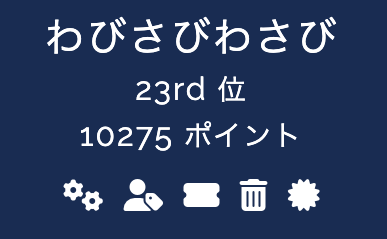

2026/07/25 - 07/26に開催された[DIVER OSINT CTF 2026](https://diverctf.org/)に参加しました。

今年の1月に開催された[SWIMMER OSINT CTF](/post/swimmer-osint-ctf-2026-writeup)は、このDIVERの制作陣による初心者向けCTFでした。今回はその本家です。

チームで参加しましたが、この記事は私（とっぷら）が解いた問題だけのWriteupです。

# DIVER OSINT CTFについて

2026/07/25（土）12:10（JST）から翌26日（日）12:10（JST）までの24時間で開催されました。

OSINT（Open Source Intelligence）に特化したCTFなので、通常のCTFにあるWebやPwnといったカテゴリはありません[^crypto]。

[^crypto]: cryptoというカテゴリは存在しますが、通常のCTFのcryptoとは異なりました。

また本CTFはAIの利用に関しては基本自由（自動提出等が禁止されているなどの細かいルールがある程度）となっています。


## 成績

- チーム名：わびさびわさび
- 点数：10,275 pts
- 最終成績：23位 / 867チーム中



私個人が解いたのは、welcomeカテゴリの7問を除いて21問です。合計6,004点でチームの稼ぎ頭として活動していますが、高級AIを使っていたぐらいしか差はないです。

# 準備

前述のとおりAIの利用が許可されているので、前日にAIのスキルを作成していました。ただ、やったこととしては、Diverの利用規約を読み込ませそれのルールを作成し、その後OSINT、特に一般的なOSINTとOSINT CTFという観点でも違いがあると思ったので、過去のOSINT CTFの問題も含めてOSINTに関するスキルを調査・作成をさせただけです。

```text:指示文1
<ルールを貼り付け>

上記は今回参加するDiver OSINT CTFというOSINT CTFです。
まずは上記のルールを読みAIのあなたに適切なCLAUDE.mdを作成してください。
```

```text:指示文2
1. OSINTに関するツールや解法、特にOSINT CTFを中心に調査を行ってください
2. その後それらを中心に適切にCTFの問題を解放するためのスキルを作成してください。その際、人間がやるべき点は人間がやるように適切に依頼を人間に行うようにしてください
3. さらに詰まった場合には別の手段を考えるような方法を考えるスキルも作成してください。
```

これだけです。

ちなみに基本的にはClaude Code × Fable 5。問題の難易度や調査具合によってEffortを変えたり、モデルを安価なものにしました。また、後半からはCursor × GPT 5.6 Solも掛け合わせて使っていました。

# Writeup

カテゴリごとに並べます。

## introduction

### container (100pt)

#### 問題文

```
この黄色いコンテナを最近まで運んでいた船のIMO番号を答えよ。
```

コンテナの写真が添付されており、そこに`MSMU 145796 9`という識別番号が写っています。

#### 回答

OSINT CTFではちょこちょこ出てくる航空・電車・航海のうちの航海の話。こういったものは明らかにAIが得意なんで、色々聞いてみました。

まず、こういったコンテナの番号はISO 6346という規格で管理されています。ISO 6346の構造を分解してくれました。`MSMU`はオーナーコード（BICコード）とカテゴリ識別子`U`（貨物コンテナ）の組み合わせで、MSC系のコードのはず。`145796`がシリアル番号で、`9`がチェックディジット。そして代替経路として、船社の追跡ページにコンテナ番号を入れれば積載船名が分かります。
IMO番号は船舶の固有識別番号で、船名とIMO番号の対応は複数の船舶データベースで確認できます。船名からVesselFinderというサイトなどでIMOに辿れるらしいです。

この助言に従って調査をして、2026年4月3日に大阪でEmpty to Shipper、6月22日にLondon GatewayでEmpty received at CY。間に4隻の船名が並んでいます。

| 区間 | 船名 | IMO |
|---|---|---|
| 大阪 → 釜山 | JULIE | 9225770 |
| 釜山 → 寧波 | MSC RAYA | 9930052 |
| 寧波 → ル・アーブル | MSC ROME | 9964211 |
| ル・アーブル → ロンドン | MSC BENIN | 9974565 |

コンテナ1個が2か月半かけて4隻を乗り継いでいます。「最近まで運んでいた船」なので最終区間のMSC BENIN。IMOは複数の船舶データベースで一致することを確認しました。

フラグ： `Diver26{9974565}`

### momo (100pt)

#### 問題文

```
2026年4月に航空機の写真を撮影していたが、機体記号を写し忘れてしまった。
写真が示す航空機の機体記号を調べて答えよ。
```

飛行機の画像が添付されいました。

#### 回答

これはAIなしで解いた問題です。

飛行機は問題名通り、peach aviationのものであり、また飛行機向かって右側に「大平電業」に記載があります。「peach 大平電業」と調べると一番上に `JA828P` の機体番号がある機体が出てきます...がこれは誤りです。
右側に記載されているのは「大平電業」のほか「豊かな社会とこれからも」と記載されています。が `JA828P` は「インフラ支え75年」となっています。

そのため「豊かな社会とこれからも」が記載されている画像を色々探して、最終的に`JA823P`の機体番号の機体が該当のペイントをしていることがわかりました。

フラグ： `Diver26{JA823P}`

### read_qr (100pt)

#### 問題文

```
このQRコードには何というURLが記録されているのだろうか。
```

「Welcome to DIVER OSINT CTF 2026」と印刷された紙とQRコードが写っています。

#### 回答

QRをシンプルに読み込ませると、`https://qr.intro26.workers.dev/q/y0u_r34d_7h3_qr_wi7h0u7_4cc3ss`を返しました。leetを戻すと「you read the qr without access」です。

ところがこのURLをブラウザで開くと、こう表示されます。

```
Welcome!
Unfortunately, "https://qr.intro26.workers.dev/" is a wrong answer.
```

誤ったURLを開いたように見えます。QRは例えば隠しデータを入れられたり何かいろんな仕組みがあることは知っていたので誤っているのかなと思いました。
が、これ普通にQRをスマホで開いたときのURLとは違うというだけで、普通にリダイレクト前のURLをいけば良さそうだよな（だってleetがそうなんだもん）となりました。この間、10分。

フラグ： `Diver26{https://qr.intro26.workers.dev/q/y0u_r34d_7h3_qr_wi7h0u7_4cc3ss}`

## recon

### shopping1 (100pt)

#### 問題文

```
ある EC サイトを利用したユーザーから、「このサイトで登録したクレジットカードの情報が漏洩しているようだ」という通報が複数件届いた。
調査したところ、このサイトのページの一部が改竄されているようだ。
配信元として悪用されているライブラリのソースコードを公開している GitHub アカウント名を特定せよ。
例えば、アカウント名がexampleであった場合、Flagは Diver26{example} となる。

対象サイト: https://shop.attic-findings.com/
```

#### 回答

AIが得意そうっすよね。まぁただ僕も得意です。
シンプルにブラウザで開いて、だいたい改ざんされる原因はCDNの読み込みなのでscriptタグを調べてみます。すると下記のようなものが出てきます。

```html
<script src="https://cdn.jsdelivr.net/npm/imask@7.6.1/dist/imask.min.js"></script>
...
<script src="https://js-deliver.com/v2/polyfill.min.js"></script>
```

本物のjsDelivr（`cdn.jsdelivr.net`）と、タイポスクワットの`js-deliver.com`が同じページに並んでいます。最近polyfill.io使ったページでBASIC認証が開くようになったやつとか、なんか色々思い出しますね。

`polyfill.min.js`（24KB）を取得すると難読化されたコードです。まぁAIにとっては知っちゃことないので解析させると文字列を抽出すると可読なURLが1本だけ出てきます。`https://js-deliver.com/upload`。情報の送信先です。

そして`js-deliver.com`のトップページを見ると、「js-deliver — Ship less. Support more.」という、それらしいOSS風のランディングページが作り込まれていました。MITライセンス、「© 2026 js-deliver contributors」。そのフッターに、GitHubリポジトリへのリンクが置いてあります。

フラグ： `Diver26{smpri194-beep}`

### shopping2 (275pt)

#### 問題文

```
shopping1 で特定した攻撃者は別のキャンペーンも並行運用しているらしい。
並行キャンペーンサイトのFQDNを特定せよ。
例えば、FQDNがcampaign.example.comの場合、Flagは Diver26{campaign.example.com} となる。
```

#### 回答

まずGitHub側を洗いましたが、すぐに枯れます。リポジトリは`js-deliver`の1つだけ。まぁこれはAIが得意だろうと思って完全に任せてみました。

色々やってたようですが、なんかあまりうまく動いていなかったようです。
そんなタイミングで、「3. さらに詰まった場合には別の手段を考えるような方法を考えるスキルも作成してください」という指示で作成したピボット用のスキルが発動して、GitHubのgistを洗い出しました。するとgistが1つだけありました。

`email_spoofing.md`、「How to Prevent Email Spoofing on a Cloudflare Domain」。攻撃者がフィッシングインフラの運用ノウハウ、つまり自分のドメインのSPF/DKIM/DMARC設定手順を公開している、という設定です。
そのStep 1に、Cloudflareダッシュボードのスクリーンショットが1枚貼られていました。Claudeは即座に「攻撃者本人のDNSレコードが写り込んでいる可能性」と判断してダウンロードし、画像として読みます。

メールアドレスと保有している`.org`ドメイン名は白塗りされていました。ですがWorkersのプロジェクト名`plain-cherry-ca06`が塗り残されていました。

あとはこれをurlscan.ioで引くのですが、ここでもうひと手間あります。素の`plain-cherry-ca06`で検索すると0件。`page.url:plain-cherry-ca06`とフィールド指定に変えると1件ヒットしました。ちゃんとpivotすることが重要だったようですね。

フラグ： `Diver26{plain-cherry-ca06.smpri194.workers.dev}`

## hardware

### yonezu1 (100pt)

#### 問題文

```
音楽家の米津玄師は、サメを模した乗り物を用いたパフォーマンスを行った。
公開情報から判断できる限りで、この乗り物の駆動プラットフォームはどの企業の製品を利用していると考えられるか。英語表記 で答えよ。
例えばボーイング社が答えの場合、flag は Diver26{Boeing} となる。
```

#### 回答

こういったものは公開されているニュースとかで記載されているだろうなと思い、AIに任せてやってみました。Claudeは開始1分後に正解を検索していましたが、捨てています。まぁ、ただ色々あって20分ぐらいかけて正解にたどり着いていました。
Twitterなんかを検索するとすぐに出てきたっぽいですね。本CTF全体を通してですが、AIがSNSの検索に弱く、またSNSに情報が非常に多くあることを痛感しました。

フラグ： `Diver26{WHILL}`

### yonezu2 (100pt)

#### 問題文

```
米津玄師が搭乗していたサメ形の乗り物を動作させている製品の制御仕様は公開されていると考えられる。
この製品を回転させる際に使用されるコマンドとそのIDを確認してほしい。
例えば、 IrisOut という コマンド が 0xE2 という コマンド ID で定義されている場合、Flagは Diver26{IrisOut_0xE2} となる。
コマンド名およびIDは仕様書に書かれている通りに解答せよ。
```

#### 回答

前に続く問題です。Claudeが1つ前の紆余曲折でプラットフォームの内容を完全に特定していたので、あとはそれを調査するだけでした。GitHub上に上がっています：https://github.com/WHILL/whill_control_system_protocol_specification.git。

コマンドとしては下記のとおりです。

| Command | ID |
|---|---|
| StartSendingData | 0x00 |
| StopSendingData | 0x01 |
| SetPower | 0x02 |
| SetJoystick | 0x03 |
| SetSpeedProfile | 0x04 |
| SetBatterySaving | 0x06 |
| SetVelocity | 0x08 |

回転っぽいコマンドはないですが、8択です。説明読むとたぶんSetVelocityがそうかなぁと思ったので、それを提出しました。

フラグ： `Diver26{SetVelocity_0x08}`

## misc

### nui (100pt)

#### 問題文

```
写真のぬいぐるみは、いつ、どのような機材で撮影されたものか答えよ。
2020年11月23日にCanon PowerShot SX70 HSで撮影されたものであれば、
FlagはDiver26{20201123_Canon PowerShot SX70 HS}となる。
```

#### 回答

`exiftool`にかけるとEXIFが完全に除去されています。GPSも撮影日時も機種もありません。

被写体は月のぬいぐるみに地球の帽子。この辺で検索してみると即ヒットしました。Artemis IIの無重力インジケータ「Rise」（Lucas Yeによるデザイン）です。
どうやら、NASAにこの画像の原本があるらしく、調べるとNASAブログの「[Artemis II Crew Arrives at Launch Site, Shares Moon Mascot](https://www.nasa.gov/blogs/missions/2026/03/27/artemis-ii-crew-arrives-at-launch-site-shares-moon-mascot/)」（2026年3月27日）に辿り着きます。記事の画像の元データを見てみるとEXIFが残っているようです。

```
Make                : samsung
Camera Model Name   : Galaxy S23 Ultra
Date/Time Original  : 2026:01:28 14:48:28
```

フラグ： `Diver26{20260128_Galaxy S23 Ultra}`

### sunny_saturday (436pt)

#### 問題文

```
この映像はある晴れた土曜日に撮影された。
撮影した日時として考えられるものをYYYY-MM-DD_HH:mm形式で解答せよ。
```

そしてYouTubeの動画リンクが貼られていました。YouTubeの動画は数寄屋橋前を撮影したものです。

#### 回答

個人的にお気に入りの問題の1つです。

この問題は4つの方向から解くことができます。

まず1つ目は問題に記載されている、土曜日であること。2つ目は[動画に記載されている広告](https://www.ginzasonypark.com/activity/022/)の開催日から4/25〜5/31（もしくはその直前）であること。3つ目は動画に映り込んでいる時計から16:15であること。

問題には「晴れている」という情報がありますが、4/25〜5/31の間に晴れている土曜日は4/25, 5/2, 5/9, 5/16の4日あります。まぁ回答は5回OKっぽかったので全部試せばいいんですが、それではちょっとつまらん。

ということで4つ目のキーを探すことにしました。太陽の角度とかかなぁ、でもさすがに無理だろうなぁ（まぁやった人いるっぽいですが）とか考えてました。奥のユンケルの広告とかPRADAとかめっちゃ調べました。
他の問題を経由して改めて、数寄屋橋周辺のイベントを調査したところ[かつての高速道路を歩き“未来の歩行者空間”を体感するイベント Roof Park Fes & Walk 2026](https://www.metro.tokyo.lg.jp/information/press/2026/03/2026031914)というイベントを見つけました。これは古い高速道路を歩けるイベントで、動画内をよく見てみると、上のほうに高速道路っぽいところから写真を撮っている人が見えます。エウレカ！このイベントの開催日は4/25, 4/26ですので、4/25の16:15が正解です。


フラグ： `Diver26{2026-04-25_16:15}`

## geo

### F3 (100pt)

#### 問題文

```
この解説パネルが展示されている建物を地図で示せ。
```

F3という文字と、災害の被害の状況が書かれたものです。

#### 回答

こちらもAIを一切使わずに解いた問題です。

F3および被害の文章から、おそらく台風などだと想定して、「F3 指標 台風」などと調べると「藤田スケール」というものがわかります。竜巻に関する指標らしいですね。

おそらく竜巻に関する資料館・博物館だろうと思い、また文字がかなり綺麗なので最近できたものなのかなと思いました。

台風・博物館で調べると、名古屋とか千葉博物館が出てきますが、[読売新聞の記事で藤田さんの地元に博物館ができる](https://www.yomiuri.co.jp/science/20220220-OYT1T50191/2/)ということがわかりました。画像を見てみると、白いですが、似ている。
調べてみると、文言こそ違いますが https://www.tanseisha.co.jp/works/detail/kitakyushu-city-science-museum にアメリカの竜巻の被害の解説パネルが展示されており、書き方がかなり似ています。そのためここであるとわかりました。

フラグ： 北九州市科学館スペースLABOの座標を選択。

### stargazing (417pt)

#### 問題文

```
星街すいせいの楽曲「星をみる少女」のミュージック・ビデオでは、彼女が星空が見える場所へ旅する様子が描かれている。
このミュージック・ビデオで、道路上の歩道橋が映っているシーンがある。この歩道橋の至近に、近年、カフェがオープンしている。その店名をラテン文字表記で答えよ。
例えば、カフェの店名が Davis Street Espresso であった場合、Flagは Diver26{Davis Street Espresso} となる。
もし複数のカフェがある場合、歩道橋に最も近いものが答えとなる。
```

#### 回答

チームメンバーどの辺のシーンか、国のあたりはつけていたので調べてみました。一応国は[JTBのプレスリリース](https://www.jtbcorp.jp/jp/newsroom/2026/06/30_jtb_projectstargazer.html)が出てきて、JTBがロケーション協力をしていること、本人コメントに「カザフスタンの荒野に立つ日が来るなんて想像もしていませんでした」とあることが確認できます。

6車線で中央分離のない幹線道路、緑のトラス歩道橋で両端にアーチ屋根付きの階段塔、進行方向左に村と並木、ぐらいしか分からないです。

Overpass APIというOpenStreetMapのAPIで歩道橋を全列挙できるらしいです。はえー。

```
[out:json][timeout:60];
(way["bridge"="yes"]["highway"~"footway|pedestrian|path|steps"](43.2,76.95,43.55,77.9););
out center tags;
```

数十件の候補が返ってきます。AIはどうやらArcGISのWorld Imageryを使って目視確認しているようです。怖いっすね。

43.3510, 77.0634の橋を同じ方法で見ると、村が北西側、バザールの列が南東側という配置が映像と一致したらしいです。Nominatimというシステムで逆ジオコーディングすると、Кульджинский тракт（クルジャ街道）、Талгарский район、村はГульдала（Guldala）です。

中央アジアではGoogle MapとかOSMの限界があり、2GISという中央アジアあたりに強いマップサイトを利用することで解決しています。近隣の「Береке」というカフェのページを開いたところ、その「近隣のカフェ」欄に`Qara Qazan`が載っており、歩道橋側のカフェがそこだったということで提出。

フラグ： `Diver26{Qara Qazan}`

### elevation (481pt)

#### 問題文

```
Aidu風力発電所の建設が長年差し止められた原因の一つであった軍事レーダーのレドームについて、公的情報から入手可能な絶対標高（m）の最高値を示せ。
データから得られた値を小数第二位まで回答すること。
例えば、東京タワーについて入手できたデータが351mだった場合、Flagは Diver26{351.00} である。
```

#### 回答

Aidu風力発電はエストニア、エストニアといえばデジタル国家。そう、AIの出番ですね。

エストニアのAidu風力発電所は、Sõnajalg兄弟の風車が防空監視レーダーを妨害するとして国防省と長く係争していました。ERRの記事と国防省の声明から、該当するレーダーが**Kellavereレーダー基地**（Lääne-Viru県、Lockheed Martin TPS-77、レドーム付き）だと分かります。

また、さすがデジタル国家と追うことで、エストニア土地局Maa-ametが公開LiDAR点群を持っています。座標さえわかれば標高もいけそうですね。

座標に関しては、https://wikimapia.org/12938156/et/Kellavere-radar にあります。ユーザー投稿なんでめちゃめちゃ信憑性があるわけではないですが、AIがいい感じにレドームっぽそうな（周りから浮いていそうな）座標を空気を読んで取得しました。

公式のデータは2009年からありますが、**2018年以降のデータではレドームが除去されています。** 2009年、2012年、2013年のデータにだけレドームが写っていて、最高値は2013年の178.02mでした。

一度178.02で提出してダメでしたが、改めて運営の方の精査により正解になりました。

フラグ： `Diver26{178.02}`

## transportation

### dx (162pt)

#### 問題文

```
2026年2～3月、グリッド 31FEV の中に存在する陸地でイベントが実施されたようだ。
このイベントに関して利用された船舶が、最後に停泊していた港を地図で示せ。
もし、いま現在も船舶がどこかの港に停泊していることが確認できる場合、その港を示せ。
```

#### 回答

グリッドというのはMGRS（Military Grid Reference System）で、地球をUTM座標系に基づいて分割したものです。

が、Claudeの1回目の検索クエリが`3Y0K Bouvet Island DXpedition 2026 February ship vessel`でした。検索する前に、知識だけでグリッドから島とイベントを当てています。怖すぎる。

MGRSの`31FEV`は、`31`がUTMゾーン31（経度0度から6度E）、`F`が緯度バンドF（南緯56度から48度）、`EV`がその中の100km四方の識別子です。この海域は南大西洋の真ん中で、**陸地はブーベ島ただ一つ**しかありません。下2桁の`EV`を照合するまでもなく候補が一意に決まります。

2026年2月から3月にブーベ島で行われたイベントは、アマチュア無線のDXペディション3Y0Kです。ちなみに3Y0Kってのはブーベ島のコールサインです。DXpeditionは、アマチュア無線家が珍しい場所に行って無線交信するイベントです。

現地レポートによれば、チームはケープタウンからデンマーク船籍の**Argus**（Icetugs社）で出航し、ヘリコプターを搭載して2月28日に上陸しています。ブーベ島は接岸できないのでヘリで降りるわけです。

ここからが船の特定です。「Argus」という名前の船は世界に複数あります。運航会社Icetugs ApSのものはIMO 7104752、MMSI 219226000、コールサインOVZW2に一意化しました。MagicPortの寄港履歴にケープタウンがあることも整合します。ちなみにIcetugs社のArgusは氷砕船です。

結果、Argusは係留中で、現在地はレイキャヴィーク。最後の寄港地はハフナルフィヨルズル（6月26日13:27 UTC出港）でした。


ブーベ島まで行った船が今はアイスランドにいるという、船ってすごいなぁと。

フラグ：レイキャヴィーク港の座標を選択。

### air2air2 (445pt)

#### 問題文

```
この動画は現地時間の2026年1月9日に撮影された。
この動画に映っている航空機の機体記号（登録番号）と、コールサインは何か。アンダースコア (_) で繋いで解答せよ。
たとえば、機体記号が F-WWJJ で、コールサインが AIB789 のとき、Flagは Diver26{F-WWJJ_AIB789} となる。
注意:撮影者が搭乗している機体ではない。また、コールサインはICAOコードを使用すること。
```

#### 回答

動画には冒頭に機内（座席ポケットの安全のしおりに赤の上に紺の尾翼イラスト）、中盤に常緑樹の森と紅白の鉄塔と送電線、後半にエアカナダの飛行機で並走している、という内容でした。ちなみに僕は最初の座席ポケットの安全のしおりであるという判別すらできませんでした。
雰囲気が日本っぽいのと日本の人が出しているメタ的な発想、さらにAir Canadaが並走するぐらいなので成田空港かねぇというぐらいの予想はしました。また、飛行機は777-300ERということもAIが判別してくれました。一目みるだけで判別できる人もいるわけで、すごいです。

1月9日に日本へ降りたエアカナダの777-300ERは3機でした。

- ACA1 = C-FIUR：15:55:30 JSTに羽田34Rへ接地
- ACA9 = C-FIVW：15:52 JSTに成田進入開始
- ACA3 = C-FIVR：16:21 JSTに成田進入

んで、AIが色々調べて、ACA3が34L（西側）、ACA9が34R（東側）から侵入していることを突き止めました。ここに映像側の制約を重ねます。動画では「AIR CANADA」の文字が正順に読めます。つまり見えているのは左側面で、機首は左を向いていて、カメラは機体の西側にあります。成田で西側から並行進入機を撮れるのは34Lに進入している機体なので、被写体は東側の34R、すなわちACA9です。

ちなみに自分が乗っている飛行機がAir Japanであると特定できたらしいですね。私のAIはそれなしでいけたっぽいです。

名探偵張りの推理力を見せてくれたAIです。

フラグ： `Diver26{C-FIVW_ACA9}`

### 250 (461pt)

#### 問題文

```
SNS投稿 / Social Media Post: https://www.facebook.com/reel/1181612624131449

2026年7月4日18:00（現地時間）ごろ、このバスはどこにいたか。地図上で示せ。
```

#### 回答

アメリカ建国250周年の記念ラッピングバスが、7月4日18時にどこを走っていたかを地図で答える問題です。

まず動画から車両番号を取ります。車体前面左上に**車両番号20094**が読めました。結構でっかく書いてあるし、車両番号さえわかりゃそういうツールも出てくるだろうと思って楽だと思っていました。が、点数を見るとわかるとおり、難問でしたね。

BCTの公式ニュースリリースに、この記念バスが通常の固定路線で乗客を運ぶと明記されていました。

> The commemorative bus will serve passengers across BCT's standard fixed routes throughout Broward County.

イベント展示ではなく、当日のAVLデータで一点に定まるということです。

ここでTransSeeというサイトがBCTに対応していることが分かりました。車両20094の現存も確認できます。ところが車両の走行履歴はPremium限定（1週2カナダドル）。ルール的には無料でいけるはずだと、ということでClaudeに追加調査。

下記はAIくんがまとめた当日の動き。

- TransSeeの`routeveh`は無料で開くが、表示されるのは予定位置のみで実車番が出ない。44路線を1本ずつ照会して20094を探すも全滅
- Wayback CDXにはtranssee.caのBCT系スナップショットが2026年6月までしかない
- GTFS-Realtimeの実フィードURLをtransit.land経由で特定（`https://bctmyride-buspas.com:8080/GTFS/VehiclePositions`）したが、Waybackにアーカイブなし
- Pantographはフロリダ非対応、Bus Observatoryも対象外、Broward GeoHubにAVL履歴なし

突破口になったのが**gtfsrt.io**という無料のGTFS-Realtimeアーカイブでした。BCTのVehiclePositionsが2026年1月27日から保存されています。

Parquetファイルを提供しているっぽいので、`vehicle_id = '20094'`を抽出すると、路線はBCT36、trip IDは`26MAY_36-01_8_s`。18:00 EDT（22:00 UTC）を挟む測位点は2つだけでした。

| 現地時刻 | 緯度 | 経度 |
|---|---|---|
| 17:59:53 EDT | 26.145458 | -80.211624 |
| 18:00:11 EDT | 26.145428 | -80.210120 |

「18:00ごろ」なので時刻差11秒の実測点を採用して提出しました。**不正解です。**
どうやら運営は「18時頃」というものを18時に最も近い即位点である17:59:53の方を採用していたようです。が、しばらくして18:00:11の方も正解にしてくれました。

フラグ： 地図上でNorthwest 16th Street沿い（26.1455, -80.2100付近）を選択。

## history

### accident (398pt)

#### 問題文

```
1955年、アメリカの軍人であるMiguel A. Pedrazaは運転中の事故によって死去した。
このとき彼が乗っていた車のナンバーを教えよ（ハイフン・スペースなし）。
たとえば、ナンバーがABC-123である場合、flagは Diver26{ABC123}となる。
```

#### 回答

AIが色々検索しましたが、結構つまづいていました。最初の突破口が**NARA（アメリカ国立公文書館）のカタログ全文検索**でした。まずなんでここを検索しようと思ったんだよという話ではある。「軍人と言えば軍の一次情報です」だそうだ。

ヒットは2件、どちらも陸軍のGeneral Ordersのマイクロフィッシュ（写真フィルム）でした。写真でしかないので検索はできない。

- https://catalog.archives.gov/id/417208158
- https://catalog.archives.gov/id/467311236

どのページか分からないなら全部読む、ということで、**398枚のページ画像を並列ダウンロード（941MB）してtesseractで全ページOCR**しました。← これAIが言ってるんだ。正気かよ。たまたまtesseractのOCRがローカルにあったのでそれを使っていたようです。

色々調査したところ、下記のOCR結果が出てきました。

```
_ MASTER SERGEANT MIGUEL 4. PEOR/ZA, R410403440, rnfantry, Gompany *BMy,
65th Infantry, 3d'Infantry Division, united States Army. on UD 4peil 1951,
rear Yonggareilyon, Korea, ... Sergeant PEDRJZ/'S patrol was subjected to
heavy mortar fire. ... Entered the military service from Puerto Rico.
```

ちなみに `MIGUEL A. PEDRAZA`が`MIGUEL 4. PEOR/ZA`です。OCRあるあるのAと4の誤認識ですね。

内容は1951年7月26日付の第3歩兵師団のGeneral Orders No. 313、Bronze Star Medal（V章付き）の表彰文です。1951年4月に韓国のYonggak付近で迫撃砲を受け、負傷兵2名を1人ずつ約100ヤード担いで搬送した功績。所属はプエルトリコ人部隊「Borinqueneers」として知られる第65歩兵連隊のB中隊。

どうやら米本土からプエルトリコに丸ごと移るようです。そうなるとプエルトリコ側の情報を検索する必要がありそうです。

プエルトリコの新聞アーカイブを探して辿り着いたのがEast View Global Press Archive（Veridian）でした。

`"Miguel A. Pedraza"`で引くと

| 日付 | スニペット |
|---|---|
| 1943.08.30 | el sargento Miguel A. Pedraza, **de Cayey** |
| 1951.09.03 | sargento mayor Miguel A. Pedraza |
| 1951.09.15 | El segundo teniente Miguel A. Pedraza |
| 1955.05.06 | **Capitán** Miguel A. Pedraza |
| 1955.05.07 | CAPITAN Miguel A. PEDRAZA, Ha ido a morar con el（死亡広告） |

軍曹から曹長、少尉、そして大尉へ。20年分の昇進履歴が新聞の索引に並んでいて、1955年5月に死亡広告が出ています。同一人物であることの確認と、事故の日付の特定が同時にできました。

AIは本文が読めなかったようですが、検索が上手いこと使えるようなので、あの手この手でAIが頑張っていました。最終的にブランド名検索をしていて、「Chrysler（クライスラー）」の車で引っかかり、その周辺にナンバープレートも記載がありました。

```
[Chrysler] mndo19550506-01.1.1 :: ... Décimo Distrito Na¡val localizó el cadáver
  dentro del j automóvil Chrysler **39-735**, i dido entre agua y looo, El vehuo ...
```

ref: https://gpa.eastview.com/crl/elmundo/?a=d&d=mndo19550506-01.1.1

ほぼAIが冒険してはいるのですが、アメリカからプエルトリコへの大冒険でした。

フラグ： `Diver26{39735}`

### tuition (483pt)

#### 問題文

```
添付画像で示されているロボットは、ある現代芸術家の作品である。この芸術家が、1961年2月20日に教育機関へ支払った金銭はいくらか。
通貨コード（ ISO 4217コード ）と共に答えよ。 たとえば、123.40米ドルの場合、Flagは Diver26{123.40USD} となる。通貨コードと数値の間にスペースは不要である。
```

#### 回答

この問題でClaudeが最後まで当てられなかったのが、**画像に写っているロボットが何か**でした。

廃材のフレーム、拡声器のスピーカー、発泡スチロール。第一仮説はナムジュン・パイクの《Robot K-456》(1964)でしたが違います。
ナムジュンパイクっぽさはあったので、私のほうでナムジュンパイクの作品群を探していたらビンゴなK-567というロボットが見つかりました。

作者が決まってからも空振りが続きます。

- Smithsonianのパイク・アーカイブ：ファインディングエイドを取ると財務記録は「Series 3. Financial and Legal Records, **1965**-2002」。1961年をカバーしていない
- ダルムシュタット国際音楽研究所（IMD）のアーカイブ：パイクは1958年にここでジョン・ケージに出会っているので最有力視したが、`q=Paik`の**全83件を走査しても1961年2月20日付がない**

最終的にドイツ語での検索で当たったのは**Monoskop**でした。アヴァンギャルド芸術の私文書スキャンを集めた個人wikiです。

https://monoskop.org/Nam_June_Paik

Ephemera に "Studienbuch ausgestellt von der Universität Köln" というファイルが置かれています。ケルン大学の学籍簿らしいですね。

11ページ目にDeutsche Bankケルン支店の振込伝票（Durchschrift für den Auftraggeber、振込人控え）が、学籍簿にそのまま綴じ込まれていたのです。

- Überweisen Sie **DM 97.50** / wörtlich: siebenundneunzig 50/100
- 宛先：**Universitätskasse und Quästur, Köln**（ケルン大学出納局）
- 振込人：Herrn Nam June Paik、Ausländer-DM-Konto（外国人用DM口座）経由
- 日付スタンプ：**20. Feb. 1961**

ISO 4217でドイツマルクは`DEM`です。

フラグ： `Diver26{97.50DEM}`

## military

### diode (460pt)

#### 問題文

```
Geran-4のフライトコントロールユニットに搭載されている、ショットキーバリアダイオードを製造したと思われる企業は何か。
所在国・地域における法人番号（またはそれに相当する番号、最新のもの）を各国・地域の政府機関により公開されている情報から解答せよ。
たとえば、法人番号が 123456789ABC であった場合、Flagは Diver26{123456789ABC} となる。
```

#### 回答

ウクライナ国防省情報総局（GUR）の「War & Sanctions」ポータルに、Geran-4の分解データ（2026年5月25日公開、54部品）が載っています。こういう情報が公式で公開されているのはすごいですね。

| 部品 | 所属 | メーカー |
|---|---|---|
| 7175 `A34` | Tracker Borscht V3 | ON Semiconductor |
| 7174 `YG` | Tracker Borscht V3 | Littelfuse |
| **7142 `640M SS54`** | **Flight Controller Unit** | **Not identified** |

FCUに載っているのは1件だけで、しかもメーカーが「Not identified」。政府のデータベースに載っていないものを調べるのか...。

AIが詰まっていたので、別の方向性で考えてみてと言ったら、ロゴからメーカーを特定する方向に進めました。結論として直接的にはいきませんでしたが、中国系企業を調査している過程で、中国の部品通販のサイトLCSCに行ったようです。
LCSCで、品番`SS54`で検索して出てきた`C123946`がShandong Jingdao Microelectronics（山东晶导微电子）製で、公式サイトのロゴを取得したら刻印と完全に一致しました。

法人番号は中国の統一社会信用代码です。[IPO目論見書](https://pdf.dfcfw.com/pdf/H2_AN202012211442500686_1.pdf)などに記載があったようです。まぁ、何か、AI、自分で計算してたけど。どうやって？「[GB 32100-2015 アルゴリズム](https://zh.wikisource.org/zh-hant/GB_32100-2015_%E6%B3%95%E4%BA%BA%E5%92%8C%E5%85%B6%E4%BB%96%E7%BB%84%E7%BB%87%E7%BB%9F%E4%B8%80%E7%A4%BE%E4%BC%9A%E4%BF%A1%E7%94%A8%E4%BB%A3%E7%A0%81%E7%BC%96%E7%A0%81%E8%A7%84%E5%88%99)を計算しました」。

フラグ： `Diver26{91370881074437184X}`

## crypto

### stable (339pt)

#### 問題文

```
0x5Ec2bb2D56FC8CC4d05110211EcaBDC8fAe3B128

お店の名前を現地語で答えよ。
たとえば、店名が現地語で향택 부산전포점のとき、Flagは Diver26{향택 부산전포점} となる。
```

#### 回答

カテゴリは`crypto`ですが暗号ではありません。

まぁおそらく仮想通貨のウォレットでしょう。JPYCも話題だし。こういうのもAIが得意そうなので任せてみました。まぁ結論からいうと店は当てられませんでした（候補にはあったけどね）。

調べてみると、受け取っているのはJPYCだけで、2026年3月26日から7月24日にかけて約30件、1,000円から42,300円。**1,550円が何度も繰り返し**現れ、そこに42,300円や38,650円といった大口が混ざります。

ここまでで「Polygon上でJPYC決済を受けている飲食店」と断定できます。1,550円が単品の価格で、数万円は複数人の会計だろう、という読みです。

Claudeが最後に見つけた手がかりが、開通日の指紋です。2026年3月26日に10 JPYCを受け取って直後に10 JPYC送り返している。決済の開通テストです。本番の客の決済が始まるのは4月6日から8日でした。その近辺でJPYCを始めた店を探せば良いわけです。

......が、今回当てたのは「1,550円という数値」。下記のサムネイルが画像検索に出てきました。うわ、1,550円だ！

https://www.youtube.com/watch?v=Tt3eBTA7tiE

お好み焼きの千房が、HashPortと組んでJPYC決済の実証実験を2店舗で始めており、開始日が4月7日。開通日もその辺。行っているのは有楽町ビッグカメラ支店と千日前店。まぁたぶん東京の店舗な気はしますが、逆張りで大阪を調べてみます。すると、https://x.com/hiyo2025/status/2041349700419461395 の投稿が見つかり、送信先のウォレットが異なるため千日前店ではないようです。

あとは上記の動画のQRのマスクが甘いので、AIに読ませてみたら、「たぶんそうじゃね」的なことを言ってくれたので送信。

フラグ： `Diver26{千房 有楽町ビックカメラ支店}`

## company

### arctic (277pt)

#### 問題文

```
2025年、インドにて「Westarctica」の大使を名乗り、詐欺を働いていた人物が逮捕された。
以下のニュースに添付されている同国の偽造外交官ナンバープレートは、彼が経営に携わる特定の法人名義で登録されていた。
この法人の21桁からなる企業識別番号（CIN）を答えよ。
https://www.abc.net.au/news/2025-07-25/man-arrested-for-running-fake-embassy-in-india/105571606
```

#### 回答

-- ここから Claude の最終的にゴールにたどり着かなかったセッションログ --

ここで**プレートが2枚ある**ことに気付きます。

- **DL4CR8559**：青いプレート単独のクローズアップ写真。「HONORARY CONSUL / BARON WESTARCTICA」
- **DL1CR6887**：リード写真の黒いAudiに装着。「HONORARY CONSULATE… PROVINCE OF WESTARCTICA」

決め手のひとつが画像の`alt`属性でした。単独写真のほうに`"fake blue diplomatic car number plate"`と書かれています。記事HTMLの中に埋まっていたメタデータです。

DL4CR8559をRC照会すると、実在の登録が出てきました。Hyundai Sonata Gold、RTOはJanakpuri（デリー）、登録日は2004年12月30日、Owner SerialはFirst Owner。保険は2013年に、PUCは2024年に失効しています。21年落ちで無保険の車に「BARON WESTARCTICA」の偽外交プレートを付けていたわけです。

そして所有者名がこうなっていました。

```
Owner Name: *****A *******S ******* ***.
```

伏字については、見方を変えると情報が残っています。「消えた」のではなく「文字数と末尾の1文字が残っている」のです。おそらく下記のような感じ。

```
??????A  ???????S  PRIVATE  LTD.
 (6字)    (8字)     (7字)   (3字)
末尾A     末尾S
```

社名の実体は「6文字で末尾がA」と「8文字で末尾がS」の2語です。

法人の絞り込みでは、逮捕された人物の関係会社を洗いました。**data.gov.inで公開されているMCA公式のデリー全社CSV（55MB）**を丸ごと落としてローカルで照合しました。

これで一族の登記拠点が見えます。11/2A, PUSA ROAD, NEW DELHI 110005に、13社が集中していました。HARSH系が6社、MAHAK系が2社、そしてCLASSIC OVERSEAS（1987年）、VARDHMAN OVERSEAS（1993年）など。

またFirst Ownerという一語も効きます。2004年の新車の最初の所有者ということは、名義は2004年時点で存在した会社です。判明した会社の設立年を並べると2002年（西ベンガル）、2007年、2010年、2013年、2016年で、2004年時点のデリー会社がありません。現役の役員リストに出てこない古い会社だ、という仮説に至りました。

ここで完璧すぎる偽陽性を引きます。全デリー会社をマスクで機械照合したところ、`SONATA FASHIONS PRIVATE LIMITED`（2004年設立）が`SONATA`（6字、末尾A）と`FASHIONS`（8字、末尾S）に完全一致しました。しかも車がHyundai Sonata Goldです。ただし住所が一族のクラスタ外で、末尾が`LIMITED`（7字）でマスクの3字と合いません。一致しすぎて怪しい、という感覚が正しく働きました。

-- ここからCursor × GPT 5.6 Solのセッションログ --

Claudeが暗礁に乗り上げてたので、ここいらでCursor使ってみるかと思ってやったら、一瞬で下記の記事が出てきました。会社名がめっちゃ書いてある。

https://timesofindia.indiatimes.com/articleshow/122866564.cms?utm_source=contentofinterest&utm_medium=text&utm_campaign=cppst

> Indra Business Private Limited

あとは検索することで企業識別番号がわかります。

フラグ： `Diver26{U51909DL2002PTC114202}`

## disinfo

### rch (500pt)

#### 問題文

```
OSINTリサーチャーであるあなた宛に、メッセージが送られてきたようだ。

これは米軍機が北朝鮮か中国に荷物を運んでいる秘密のフライトの証拠だ！彼らは対立しているかのように見せかけ、実際には裏で繋がっているんだ！

この主張は正しくない。実際には何のために何を運んでいると推定されるか。

採点基準:

「何のため」（目的）および「何を運んでいるか」（貨物）を 1文で簡潔に 明記せよ。貨物の名称は原則として正式名称を用いること。
もっとも主要な貨物を答えよ。例えば、貨物の輸送に際して、書類が同時に運ばれているとしても、「紙」「書類」などと答えたものは得点にならない。
解答は英語または日本語で行うこと
```

#### 回答

一応私が回答こそしていますが、ほとんどがチームメンバーが調査していました。ほとんどがこの投稿でわかります：https://x.com/AIYeyENGDdJkjTr/status/2050479663638823144


答えは、2026年5月のトランプ大統領の訪中にあたって、大統領専用車を北京へ空輸したものである、という趣旨の1文です。

# 感想

[前回のSWIMMER](/posts/swimmer-osint-ctf-2026-writeup.md)では「今回で言う`research_2025`のようなthe OSINT CTF問題を自力で回答していきたい」と書いていました。今回はまさにそういう問題ばかりで、しかも24時間、かなりの数を解けたので、そこは満足しています。

AIの強さという観点も非常に面白かったです。普段はコードを書く・調査させる程度ですが、自律的に解を追いかけ、様々な手段をAIなりに駆使する力を見せつけられ、改めて時代の変調を感じます。

一方で、今回私が回答はしなかったものの `houses` の問題はAIは全く持って検討がついていなかった（一応関西電力っぽい電柱であることは当てていた）です。私自身は手前のマンホールの写真から奈良県田原本町を当てて、最終的に場所は別のチームメンバーが先に当てれらてしまいましたが、人間の残された可能性を感じました。いや、そんなでもないか。

最後に。

主催のみなさま、ありがとうございました。次こそはarcadeみたいな100点問題を24時間かけずに解きたいです。という冗談は置いておいて、rchのように、偽情報を大袈裟に流布するような人に対する防衛術といった観点は普段の我々の生活にも重要だと思いました。SWIMMERの時もそうでしたが、世界はこんなにも違うメガネで見ることができるんだという新たな発見もありました。sunny_saturdayやhousesといったAIには難しく、人間のひらめきなどを活かせる問題も数多く、作問力の高さを感じました。改めて感謝です。次があるならまた参加します。

わびさびわさびの皆様、また集まっていただきありがとうございました。こういった本格的なCTFで23thというのは初心者集団にしてはあまりにも高い順位だと思います。AI×私では見つけられなかったラストピースを探してくれた問題もあり、調査力という観点ではトップクラスに高いと思い心強かったです。
