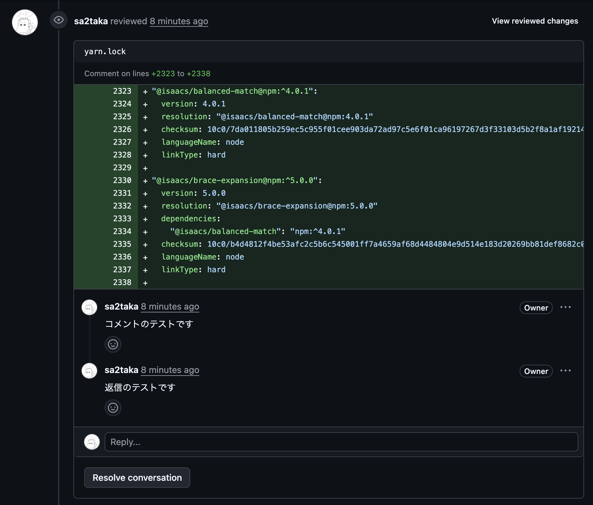

最近実行しているコマンドランキング、2位がclaude、1位がccusageになって参りました。

開発時にGitHubにレビューコメントをもらい、それを対応するというのはエンジニアにとって朝飯前であり夕食後ではあります。今までは私がどれを対応するか選択してClaudeに投げていましたが、簡単な修正を3,4個ぐらいもらったときはClaudにまとめて対応してもらったほうが当然楽だなと思いました。なので、PRのレビューコメントを確認し、なんらかのCoding Agentにわかりやすい形で投げたいなと思いました。

GitHubには[CLI](https://docs.github.com/ja/github-cli/github-cli/about-github-cli)があり、様々な情報が取得できます。
`gh pr view`というコマンドがあり、[Reference](https://cli.github.com/manual/gh_pr_view)を確認すると `comments` というオプションがあるのでそれで良さそうじゃん。……とはいきません。

# gh pr viewコマンドの問題

手元にいい感じのPRがなかったので、RenovateのPRにこんな感じでレビューコメントを投げてみました。



https://github.com/sa2taka/next-blog/pull/1153#pullrequestreview-3014989872

ここで `gh pr view --comments` コマンドを実行するとこうなります。

```sh
$  gh pr view --comments 1153
Update dependency glob to v11.0.3 sa2taka/next-blog#1153
Open • renovate wants to merge 1 commit into main from renovate/glob-11.x-lockfile • about 1 month ago
+52 -35 • ✓ Checks passing
Reviewers: sa2taka (Commented)
Labels: dependencies, patch, renovate


  This PR contains the following updates:                                                                             
  ...PRのdescriptionが記載される

View this pull request on GitHub: https://github.com/sa2taka/next-blog/pull/1153
```

先程のコメントが登場しません。

jsonで取得する機能もあるのでそちらを利用してみましょう。

```sh
$ gh pr view --json comments 1153
{
  "comments": []
}
```

**そう、`gh pr view`コマンドでは、コードに記載したコメントは取得できません。**

# 解決策

GitHub CLIには最強のサブコマンド[api](https://cli.github.com/manual/gh_api)が存在します。名前の通りGitHubのAPIを叩いてくれます。これを利用しましょう。

レビューコメントは [/repos/{owner}/{repo}/pulls/{pull_number}/comments](https://docs.github.com/ja/rest/pulls/comments?apiVersion=2022-11-28#list-review-comments-in-a-repository) にて取得可能です。

```sh
$ gh api "repos/:owner/:repo/pulls/1153/comments" | jq '.[].body'
"コメントのテストです"
"返信のテストです"
```

どのような応答があるは[リファレンス](https://docs.github.com/ja/rest/pulls/comments?apiVersion=2022-11-28#list-review-comments-in-a-repository)に記載されています。

# 現在のPRのコメントをいい感じに取得するスクリプト

Claudeに投げるには流石にJSONだと無駄情報がありすぎるので、いい感じのスクリプトを作ってもらいました。

```bash
#!/bin/bash

# PRコメントをスレッドごとにまとめて表示するツール

set -euo pipefail

# jqクエリ: スレッドごとにコメントをグループ化し、ファイルと行数を提示
JQ_QUERY='
# まずコメントをスレッドIDでグループ化（in_reply_to_idがnullのものは自分のIDをキーにする）
def thread_id: if .in_reply_to_id then .in_reply_to_id else .id end;

# スレッドごとにグループ化
group_by(thread_id) |
map({
  thread_id: .[0] | thread_id,
  file: .[0].path,
  line: .[0].line,
  position: .[0].position,
  comments: map({
    id: .id,
    user: .user.login,
    body: .body,
    created_at: .created_at,
    is_reply: (.in_reply_to_id != null)
  }) | sort_by(.created_at)
}) |
sort_by(.file, .line)
'

# PRコメントを取得してjqで整形
gh api "repos/:owner/:repo/pulls/$(gh pr view --json number -q .number)/comments" | jq -r "$JQ_QUERY" | jq -r '
.[] | 
"📁 \(.file):\(.line) (position: \(.position))",
"🧵 スレッドID: \(.thread_id)",
(.comments[] | 
  if .is_reply then
    "  └─ 💬 \(.user): \(.body)"
  else
    "  🟢 \(.user): \(.body)"
  end
),
""
'
```

実行結果が下記です。

```sh
$ pr-comments
📁 yarn.lock:2338 (position: 19)
🧵 スレッドID: 2203992995
  🟢 sa2taka: コメントのテストです
  └─ 💬 sa2taka: 返信のテストです
```  

jqとawkは、結局細かい記法を理解しないままAIに書かせるツールになりそうですね。
