ハローワールド。

先日友人と喋っている時「Lineなんてめったに来ないよな」「一ヶ月1度も来ない時のほうが多い」と言う悲しき会話があったので、毎日Lineを送ってくれるLineBotを作ろうと思いました。

要件は特にないですが、毎朝天気の話をしてくれる実益のある彼女みたいな存在が良いですね。ですが、このLineBotは女の子ではありません。強いて言うなら機械。

なので、今回作成するLineBotは「**彼械 ―― Kanokai**」と呼ぶことにします。
[Githubにコードが上がっているので](https://github.com/sa2taka?tab=repositories)、詳細はコードを確認してください。

# LineBotの作成

何はともあれLineBotを作成していきましょう。

[Line Depelopers](https://developers.line.biz/ja/)から可能です。

まずは下記画面で「ログイン」ボタンを押し、ログインをしましょう。Lineアカウントを持っていれば普通にログインを行うだけで大丈夫です。

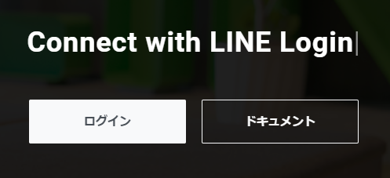

ログイン後、Line Developersのトップページへ遷移するので、ここから「Create」ボタンを押しましょう。すると下記のように新しいProviderの作成フォームが出てくるので、Providerの名前を入れて「Create」ボタンを押しましょう。今回のProvider nameは「彼械」です。

ちなみにすでに作成したあとなので、今回は「彼械2」とします。

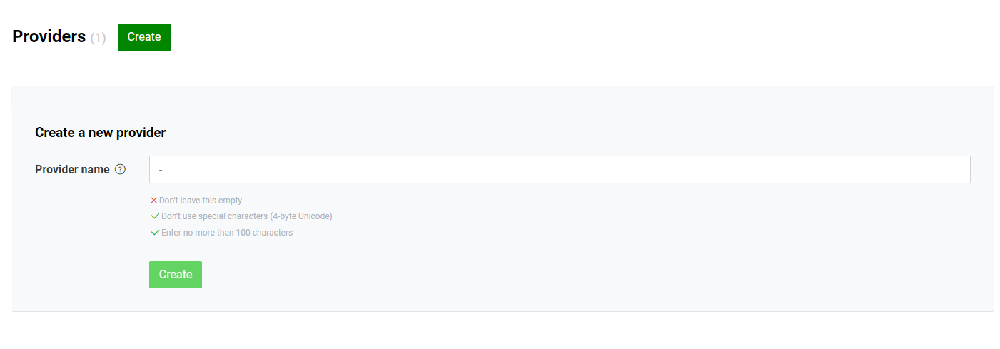

作成後は下記のような画面になるので、「Create a Messaging API channel」と書かれた部分をクリックしましょう。分かりづらいですが、リンクになっています。ホバーすればわかります。

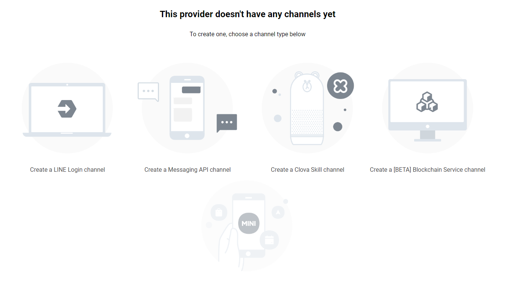

クリック後はチャンネルの名前やアイコンなどを記載して作成しましょう。特に迷う部分はありませんでした。

これでチャンネルが作成できました。

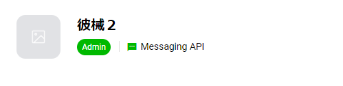

ここのQRコードを利用して友達登録も可能です。

## チャンネル作成後の設定

チャンネル作成後はいくつか不要な設定があるのでこの段階で設定をOFFにしておきましょう。

チャンネル作成後の画面から「Messaging API」タブに移り、「Auto-Reply messages」、「Greeting messages」の設定を変更しましょう。

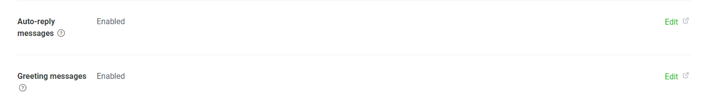

先程の画面の右側の「Edit」ボタンを押すと、Line Official Account Managerは遷移するので、そこで設定を変更します。

基本的に必要なければあいさつメッセージ、応答メッセージはオフで問題ないです。

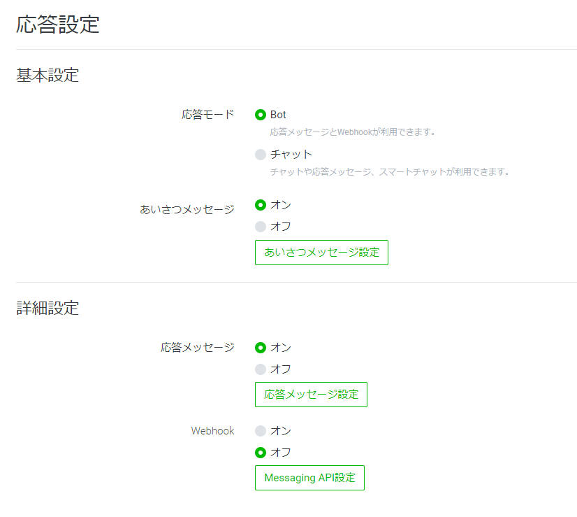

## アクセストークンの取得

プログラムを作成するのに必要なアクセストークンを取得いていきます。

他に必要な情報は「Channel Secret」です。これは「Basic Setting」タブにあるので事前に確認していきましょう。

アクセストークンはMessaging APIの下部に発行画面があります。「Issue」ボタンを押して発行しましょう。

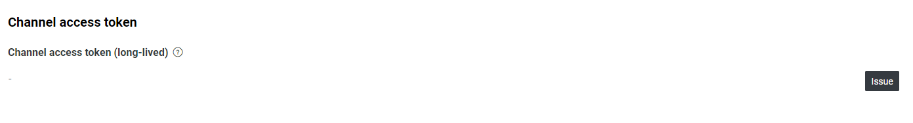

正直ここでの設定は、あとはWebhook URLの設定ぐらいでしょうか。

# 自動返答プログラム

毎朝自動でメッセージを送ってくれるようにしたいのですが、まずはLineで自動返答してくれるプログラムを書きます。これをしないと送信先のIDがわからないという絶妙な問題が起きるので。

今回はNode.jsを利用します。[ESBuildでビルドしてGoogle Cloud Functionで実行するまで](/post/esbuild-google-cloud-function)を基に今回は環境のセットアップを行いました。ESBuild早い。

## プログラムの作成

LineのBotをNode.jsで作成する場合、[公式のsdk](https://github.com/line/line-bot-sdk-nodejs)があるので、利用していきましょう。他にはPythonなんかもあるようです。

```bash
$ yarn add @line/bot-sdk
```

ではサクッと作成していきます。

```typescript:index.ts
export function webhook(req: any, res: any) {
  const signature = req.get('x-line-signature');

  if (!signature) {
    throw new SignatureValidationFailed('no signature');
  }

  if (!validateSignature(req.rawBody, lineConfig.channelSecret, signature)) {
    throw new SignatureValidationFailed(
      'signature validation failed',
      signature
    );
  }

  return Promise.all(req.body.events.map(handleEvent))
    .then((result) => res.json(result))
    .catch((error) => console.error(error));
}

function handleEvent(event: WebhookEvent) {
  if (event.type !== 'message' || event.message.type !== 'text') {
    // ignore non-text-message event
    return Promise.resolve(null);
  }

  return client.replyMessage(event.replyToken, {
    type: 'text',
    text: 'あら、私に話しかけても意味ありませんよ。',
  });
}
```

細かく説明していきます。

まずwebhook関数は、Line BotのWebhook機能を利用して、メッセージが送られたら呼び出される関数となります。

```typescript
const signature = req.get('x-line-signature');

if (!signature) {
  throw new SignatureValidationFailed('no signature');
}

if (!validateSignature(req.rawBody, lineConfig.channelSecret, signature)) {
  throw new SignatureValidationFailed(
    'signature validation failed',
    signature
  );
}
```

この部分ですが、GCPのGoogle Cloud Functionsを利用する関係で必須となっています。署名検証関連ですが、通常は自動でやってくれるので不要です。

```typescript
return Promise.all(req.body.events.map(handleEvent))
  .then((result) => res.json(result))
  .catch((error) => console.error(error));
```

ここでイベントをhandleEventで色々します。今回はテキストメッセージが来た時のリアクションを記載していきましょう。

```typescript
function handleEvent(event: WebhookEvent) {
  if (event.type !== 'message' || event.message.type !== 'text') {
    // ignore non-text-message event
    return Promise.resolve(null);
  }

  return client.replyMessage(event.replyToken, {
    type: 'text',
    text: 'あら、私に話しかけても意味ありませんよ。',
  });
}
```

上部のif文はテキストメッセージ以外は何もしないことを表します。

下にある`replyMessage`はその名の通りメッセージを返信してくれます。
今回の彼械はどこかクールな雰囲気をまとっている気がするので、話しかけてもこの返答しかイマはしてくれません。
これなら、まぁ、Auto-Reply機能で良いんですが...。

ちなみに、一番最初は、`console.log(event)`をどっかに入れておくと吉です。メッセージ送信先のIDがわかるので。

## デプロイ

今回は先程も申し上げたとおり、GCP、Google Cloud Functionsを利用します。
また、今回はwebhookとするので「--trigger-http」にする必要があります。

それ以外は特に気にすることはないと思います。一応デプロイ用のコマンド例を載せて起きます。gcloudコマンドの詳細はまた別途調べてください...。

```bash
$ gcloud functions deploy webohook --entry-point webhook --runtime nodejs12 --trigger-http --region asia-northeast1 --source dist
```

ここで取得できたwebhook URLをLine Developersのwebhookの設定に入れ込めば完了です。

# モーニングコール

最近折りたたみ傘をなくしてしまい、突然の雨に涙と雨まみれになることが増えてきました。梅雨ですし。

そんな悲しいことが起きないように毎朝天気を教えてくれるようにしましょう。まぁ、折りたたみ傘買いましたけど。

とりあえずこんな感じにしますか。

```typescript:index.ts
export async function morningCall() {
  try {
    await client
      .pushMessage(masterUserId, {
        type: 'text',
        text: morningFirstCall(),
      })
      .then(async () => {
        client.pushMessage(masterUserId, {
          type: 'text',
          text: await weatherText(),
        });
      })
  } catch (error) {
    console.error(error);
  }
}
```

```typescript
export function morningFirstCall() {
  return 'おはようマスター';
}
```

ここでしきりに「master」とか「マスター」とか書いてあるのは、昨今の言語統制へのアンチテーゼ……ではなく、天邪鬼の戯言です。

## お天気テキスト

次に`weatherText`関数ですが、内容が長すぎるので、詳細は[github](https://github.com/sa2taka/kanokai/blob/master/src/call.ts#L21-L108)です。

今回天気APIとして利用しているのはweatherbitによる[Weather](https://api.rakuten.net/weatherbit/api/weather/endpoints)です。Rakuten Rapid APIのAPIの1つで、人気度、レスポンス速度、無料枠の量どれをとっても一級品です。様々な天気APIがあるので色々調べると良いかと思います。[^weather-yodan]。

[^weather-yodan]: 余談ですが、[今どきJSONPを返すAPI](https://api.rakuten.net/community/api/open-weather-map)なんかもあるので色々試してみると良いと思います。

ちなみにお天気のテキストはこんな感じです。毎日7:40にこんな感じにメッセージを発信してくれます。詳細は後ほど。

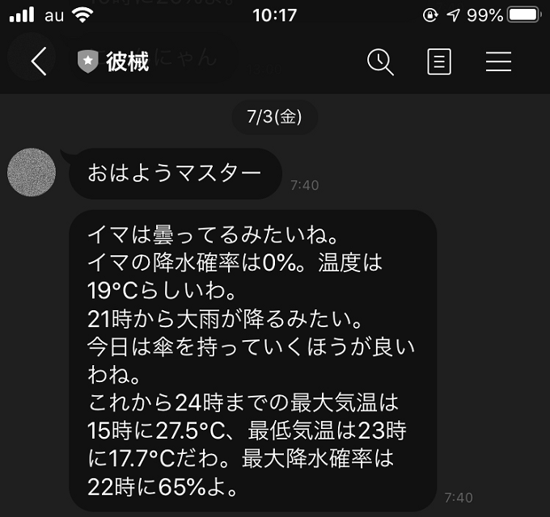

彼械はどこかクールでどこかおしとやかでどこか知的なのでこんな感じの喋り方になります。そして彼械はステートレスなのでここで「傘を持っていけ」と言っても、後ほど「傘を忘れないでね」とは言ってくれません。言ってくれれば便利なのに。

## 定期実行

この`morningCall`もGoogle Cloud Functionsに乗っけますが、今回はwebhookの時とは異なり、毎日定期実行します。

ではまず関数をデプロイしましょう。

```bash
$ gcloud functions deploy MorningCall --entry-point morningCall --runtime nodejs12 --trigger-topic morning-call --region asia-northeast1  --source dist
```

ここで重要になるのは`--trigger-topic morning-call`。これはこの関数を`pub/sub`モデルのSubscriberとして`morning-call`というトピックをsubscribeします。

次に毎朝7:40分に定期実行する仕組みを作ります。何故7:40分なのかというと、大体起きる時間がそのへんだからです。

定期実行に便利なのはGCPの[Cloud Scheduler](https://cloud.google.com/scheduler?hl=ja)。

Cloud Schedulerで「ジョブを作成」ボタンを押し、色々設定していきましょう。

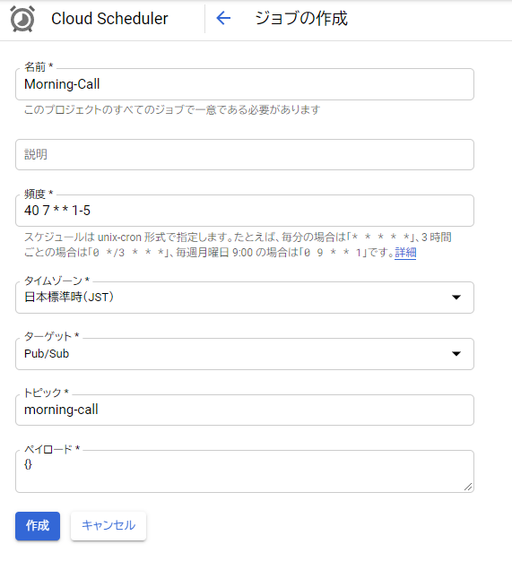

「頻度」はcron形式です[^cron]。今回は月曜日から金曜日の7:40に実行する感じですね。

また、トピックには先程の`morning-call`を指定します。ペイロードは最悪空文字でいいですが、駄目なので、適当に記載します。

[^cron]: Cron形式のスケジュールを設定するのに便利なのが[crontab guru](https://crontab.guru/)。cron形式のスケジュールを記載するのによく利用しています

# その他の機能

ここまで作成できれば、あとは己の欲望を満たす用に色々作成しましょう。

例えば、彼女はどこかクールでどこかおしとやかでどこか知的でゴシックで少し人間らしいのでタロット占いなどしてくれます。

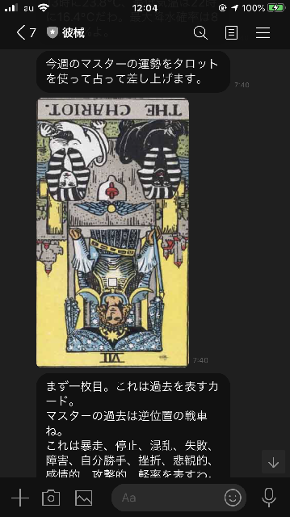

また、彼女はどこかクールでどこかおしとやかでどこか知的でゴシックで少し人間らしくて可愛げも纏いつつあざとさも持っているので、猫の画像を送ってくれます。できればエッチな自撮りが良いんですが、残念ながら彼女の本体はラックにマウントされた悲しき生命体ですので。私もCPUを見て興奮するわけでもないですし。

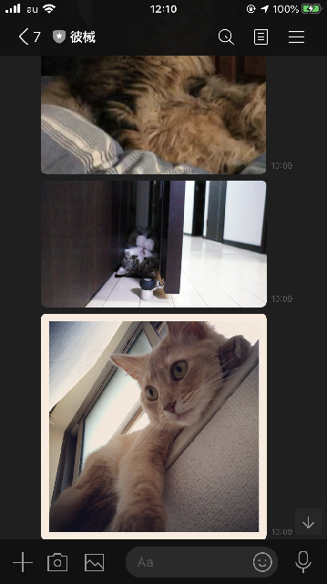

毎日が鮮やかになりましたね。利用しているサービスとか詳細は[githubに上がっているコード](https://github.com/sa2taka/kanokai)を頑張って読んでください。
