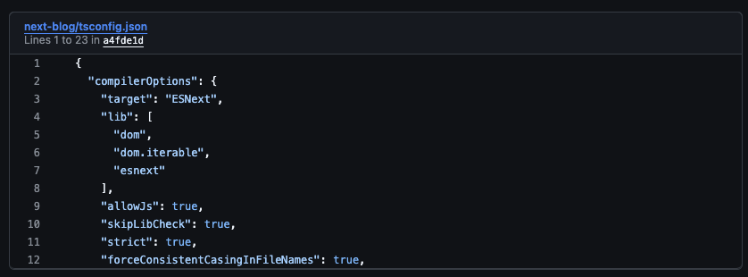

GitHubではコメントにpermalinkを貼り付けることで、[該当のコードを埋め込めます](https://docs.github.com/ja/get-started/writing-on-github/working-with-advanced-formatting/creating-a-permanent-link-to-a-code-snippet)。これを私のブログで再現してぇなと思いました。



こんな感じです。

https://github.com/sa2taka/next-blog/blob/a81fdd89dc479edc2d24bbb10e9de8d3175bdf88/packages/blog/tsconfig.json

# permalinkから情報取得

既に同様の思いを持った方がおりました。[GitHubのPermalinkから埋め込みを作る](https://yu7400ki.me/blog/github-embed)にて解説されています。

重要なのは、Permalinkからデータを取得する処理です。実はGitHubのpermalinkは`Accept`ヘッダーに`application/json`を設定するとちゃんとJSON形式で情報を返してくれます。一部抜粋ですが、こんな感じでいろんな情報を取得できます。

```bash
$ curl -H "Accept: application/json" https://github.com/sa2taka/next-blog/blob/a81fdd89dc479edc2d24bbb10e9de8d3175bdf88/packages/blog/tsconfig.json
{
  "payload": {
    "allShortcutsEnabled": false,
    "fileTree": { ... },
    "repo": {
      "id": 504221802,
      "defaultBranch": "main",
      "name": "next-blog",
      "ownerLogin": "sa2taka",
       ...
    },
    "refInfo": {
      "name": "a81fdd89dc479edc2d24bbb10e9de8d3175bdf88",
      ...
    },
    "path": "packages/blog/tsconfig.json",
    "currentUser": null,
    "blob": {
      "rawLines": [
        "{",
        "  \"extends\": \"../../tsconfig.json\",",
        "  \"compilerOptions\": {",
        ...
      ],
      ...
    },
    ...
  },
  "title": "next-blog/packages/blog/tsconfig.json at a81fdd89dc479edc2d24bbb10e9de8d3175bdf88 · sa2taka/next-blog"
}⏎  
```

特に`payload.blob.rawLines`が実データとなります。この辺の情報を取得すればいい感じに表示できます。

# Markdown Itのプラグイン化

今回MarkdownItのプラグイン化したのが下記です。が、かなり私のブログに特化している上に読みづらいし変なことやっているのであまり参考にしない方が良いです。雰囲気はつかめると思います。

https://github.com/sa2taka/next-blog/blob/68875816ab595b38df0b7e9dcba3e53b99f8738e/packages/blog/src/libs/markdown/plugins/github-emabed.ts

データ取得部分はこんな感じです。markdownItでは多分非同期処理は使えないんで、`fetch`が使えないので、`sync-fetch`という同期的にfetchするライブラリを活用しています。

https://github.com/sa2taka/next-blog/blob/68875816ab595b38df0b7e9dcba3e53b99f8738e/packages/blog/src/libs/markdown/plugins/github-emabed.ts

MarkdownItでは `linkfy` という仕組みによりただのURLもリンクに変換します。ただpermalinkもリンクになってしまうので、`linkfy`で付与されたリンクを削除しています。

https://github.com/sa2taka/next-blog/blob/68875816ab595b38df0b7e9dcba3e53b99f8738e/packages/blog/src/libs/markdown/plugins/github-emabed.ts#L142-L180

そして無理やりhtmlにしています。GitHubっぽく行数を表示したかったのですが、prismの[Line Numbers](https://prismjs.com/plugins/line-numbers/)プラグインはどうやらクライアント側で処理をしないといけないようで、SSGによる静的生成にこだわっているこのアプリでは対応できませんでした。

天邪鬼なのでできないと思ったらやれるようになるまで頑張ってしまう性格。そのため色々頑張ったら、結局`onscroll`イベントに頼ることになりましたが（ラインの部分とコードの部分が別のエリアになっているので、スクロールをシンクする必要があったので使っている）、htmlのみで完結したので良しとしています。

https://github.com/sa2taka/next-blog/blob/68875816ab595b38df0b7e9dcba3e53b99f8738e/packages/blog/src/libs/markdown/plugins/github-emabed.ts#L88-L99

permalinkマシマシの記事となりました。
