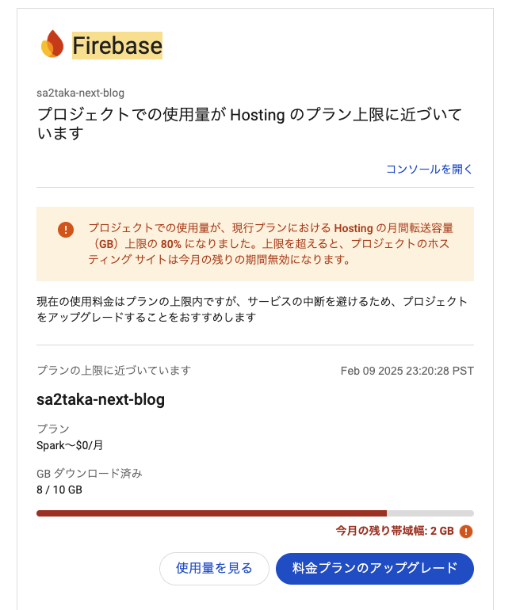

私のブログは現在Next.jsの[SSG](https://nextjs.org/docs/pages/building-your-application/rendering/static-site-generation)を用いて静的ファイルを生成し、Firebase Hostingでホスティングしていました。今回はそのホスティング先をCloudflare Pagesに移行した話です。

# 何故移行したのか

私のブログは元々Nuxt.jsのSSRで構築していたところから、Nuxt.jsのSSG、Next.jsのSSGと変遷していきました。で、SSGに移ったときにFirebase Hostingに移行しました。移行したのは2020年あたりで、その時にはCloudflare Pagesは出ていなかったと思います。当時はホスティングサービスと言えばGitHub PagesかNetlifyといった感じだった記憶があります。Netlifyを新しく使うか、今までお世話になっていたFirebaseをそのまま使うか悩んだときにFirebase Hosting使った理由はただ一つで、長野からアクセスしたときに一番早かったのがFirebase Hostingだったからです。

今回移行した理由ですが、**何故か**最近ダウンロード量が急増したからです。結果、2月の中旬にもかかわらず下記のようなメールが飛んできました。
メールが飛んできて調査したところ、何故か全画像ファイルをクローリングするような挙動が見られました。バグか何かで全画像ファイルが載ってんのかと思って思って私の環境で試してみても普通にリクエストはされません。IPアドレスなりUser Agentなりを見ても何らかの攻撃的な挙動でもなさそう。



いずれにせよこのままだと意味不明なままサイトが止まるか、有料プランにしたところで画像ファイルの謎のダウンロードによる無駄な料金支払いを強いられてしまいます。

そこでCloudflare Pagesへ移行しました。Cloudflare Pagesは無料でもリクエスト数・ダウンロード量が無制限という国の慈善事業でもあり得ないコストパフォーマンスであるため、移行することで上記の問題は（あまりにもパワフルパワーで）解決できます。

# 移行方法

移行方法は簡単。今回は[Git integration](https://developers.cloudflare.com/pages/get-started/git-integration/)による方法を選択しました。

1. GitHubのリポジトリと接続
2. ビルドコマンドを設定

だけ。詳しくは上記のドキュメントを参照してください。

この際、nodeのバージョンやyarnのバージョンは `.node-version` や `yarn.lock` からいい感じに判断してくれますが、判断でされない場合は環境変数を設定可能です。詳しくは[Build image](https://developers.cloudflare.com/pages/configuration/build-image/#frameworks)を参照。

# Cloudflare Web Analytics

Cloudflare Web Analyticsは簡単に言えばGoogle Analytics的なものです。無料で有効化できたので試してみたところ、何も設定していないのにパスごとのアクセス数だけではなくリファラやUser Agent、果てにはCore Web Vitalsまで表示されます。一応HTTPリクエストにリファラとかUser Agentあるので謎技術で取れる可能性はありますが、流石にCore Web Vitals、特にCLSなんかはJavaScript無しでは取得不可能だと思うので調査してみました。

見たところ、htmlに下記のスクリプトを挿入していました。

```html
<!-- Cloudflare Pages Analytics -->
<script defer="" src="https://static.cloudflareinsights.com/beacon.min.js" data-cf-beacon="{&quot;token&quot;: &quot;<ランダム文字列>&quot;}"></script>
<!-- Cloudflare Pages Analytics -->
 ```

どこでこのタグを挿入しているかは明確に記載されていませんが、[ドキュメント](https://developers.cloudflare.com/web-analytics/get-started/#:~:text=Cloudflare%20will%20automatically%20add%20the%20JavaScript%20snippet%20to%20your%20Pages%20site%20on%20the%20next%20deployment.)の

> Cloudflare will automatically add the JavaScript snippet to your Pages site on the next deployment.
> > Cloudflare は、次回のデプロイメント時に JavaScript スニペットを Pages サイトに自動的に追加します。

より多分デプロイプロセスのタイミングで自動的に埋め込むんだと思います。すごいね。
