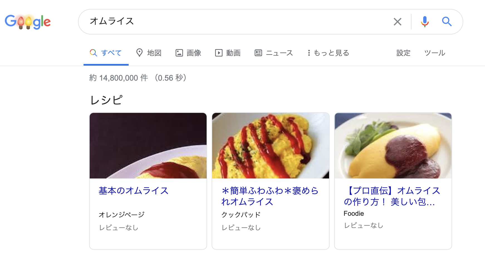

ハローワールド。

前置きが不要な方は[Nuxt.jsでJSON-LDを埋め込む](#Nuxt.jsでJSON-LDを埋め込む)を参照してください。

このブログは別に収益化をする気も人を集める気もないやる気のないものですが、SEOに関してそれなりに設定されています。今回はSEO[^seo]についてのお話です。

[^seo]: Search Engine Optimizationの略。日本語では直訳で検索エンジン最適化。Googleを始めとした検索エンジンの検索結果に働きかける設定をすること。主に検索結果の上位に表示されることを目的とすると記載されているが、実際はクリック数を上げる、さらにはコンバージョン率を上げることがよく目的に含まれる。一般的にはSEO対策と呼ばれているが、正確にはSEO対応なのでは？と思う節がある。

本ブログでは主にアクセシビリティの向上の副次効果としてSEOの向上がされていますので、実際はあまりSEOとしての設定をちゃんと行っているわけではありません。
今回はほぼ初めて「SEO」に関して向き合った設定しました。と言っても、大したことはやっていませんが。

# 構造化データ

本題に入る前に構造化データについて。

[Googleの構造化データに関するドキュメント](https://developers.google.com/search/docs/appearance/structured-data/intro-structured-data?hl=ja)には下記のように構造化データを説明しています。

>  構造化データとは、ページに関する情報を提供し、ページ コンテンツを分類するために使用される、標準化されたデータ形式です。

上記ページの例ではレシピページが示されていますが、例えばブログの記事（Article）やパンくずリスト、Videoなどの機能が用意されています。全ての機能は[検索ギャラリーを見る](https://developers.google.com/search/docs/appearance/structured-data/search-gallery?hl=ja)に記載があります。

この構造化データは検索エンジンがコンテンツを分類することにより検索結果の表示を特別なものにできます。この特別な表示を**リッチリザルト**と呼びます。

リッチリザルトの表示は先程の[検索ギャラリーを見る](https://developers.google.com/search/docs/appearance/structured-data/search-gallery?hl=ja)にまとまっていますが、例えばgoogleで検索すると下記の様な表示がされることがあります。



「オムライス」を検索した結果様々なレシピが表示されます。また作り方の動画が表示されたりするかもしれません。これらがリッチリザルトです。こうすることで通常の検索結果より、より高いクリック率が得られる可能性が増えます（多分）。

この様なリッチリザルトを提供するために構造化データは重要となり、すなわちSEOにおいても重要な立場となっています。

## JSON-LD形式

この構造化データ、3つのデータ構造があります： [JSON-LD](https://json-ld.org/)、[HTML Microdata](https://www.w3.org/TR/microdata/)、[RDFa](https://www.w3.org/TR/rdfa-core/)（公式ページが証明書エラーを起こすので仕様）。これら3つの違いはGoogleでも簡単に触れられていたり様々なところでより詳しい説明がされているので省くとして、ここではJSON-LDについて簡単に見ていきたいと思います。

JSON-LDはJSON for Linking Dataの略で[公式ページ](https://json-ld.org/)では下記のような説明がなされています。

> Data is messy and disconnected. JSON-LD organizes and connects it, creating a better Web.
> > データはめちゃくちゃでバラバラです。JSON-LDはデータを整理してつなぎ、よりよいWebを作ります

Linked Dataという概念が実は登場しますが、流石に話が重いのでここでは省きます。

簡単に言えばJSON-LD自体がデータをつなぐための形式の1つで、JSON-LDの名の通り、JSONでデータを表現します。

GoogleのJSON-LDのサンプル（レシピデータ）は下記のようになっています

```json
<script type="application/ld+json">
{
  "@context": "https://schema.org/",
  "@type": "Recipe",
  "name": "Party Coffee Cake",
  "author": {
    "@type": "Person",
    "name": "Mary Stone"
  },
  "datePublished": "2018-03-10",
  "description": "This coffee cake is awesome and perfect for parties.",
  "prepTime": "PT20M"
}
</script>
```

JSONではありますが、なんとなく人間にもそれぞれ何を意味しているかはわかる気がしますね。

このJSONを`&lt;script type="application/ld+json"&gt;&lt;/script&gt;`で囲むことにより、検索エンジンにJSON-LD形式の構造化データであることを伝えることができます。

### schema.org

一番上の`@context`に書いてあるものがその名の通り、データのコンテキストの素となるものです。基本的に`https://schema.org/`を指定します。

ちなみに`https://schema.org/`は構造化データのための構造を提供するコミュニティのことで、上記の`@Type`に指定されるものはschema.orgにて定義されています。

例えばRecipeであれば[https://schema.org/Recipe](https://schema.org/Recipe)に定義されており、例えば`prepTime`は下記の定義がなされています。

> The length of time it takes to prepare the items to be used in instructions or a direction, in ISO 8601 duration format.
> > 指示や指示で使用する項目を準備するのに要する時間の長さを、ISO 8601の継続時間形式[^iso-8601-duration-format]で表しています

[^iso-8601-duration-format]: Wikipediaの記事が簡潔に記載されていたのでそちらをお読みください。 https://ja.wikipedia.org/wiki/ISO_8601#%E7%B6%99%E7%B6%9A%E6%99%82%E9%96%93。

つまりこのレシピ通り作業するための準備時間は20分ということがわかりますね。

ただし、Googleでは完全にschema.orgに準拠しておらず、例えばレシピであれば
[developers.google.comのレシピページ](https://developers.google.com/search/docs/appearance/structured-data/recipe?hl=ja)の定義を確認する必要があります。

# 本ブログでの対応

というわけで本題。

[検索ギャラリーを見る](https://developers.google.com/search/docs/appearance/structured-data/search-gallery?hl=ja)で機能を見ると、本ブログではお飾り程度のパンくずリストと記事が構造化データとして記載できそうですね。

ではまずNuxt.jsでJSON-LD形式の構造化データを埋め込んでみましょう。

## Nuxt.jsでJSON-LDを埋め込む

Nuxt.jsのコンポーネントには`head()`という特別なメソッドを定義することによりhtmlのheadタグの内部を定義できます[^nuxt-head]。

[^nuxt-head]: ちなみに私の勘違いで`head()`はpageコンポーネントにしか無理だと思っていましたが、実はどこで定義しても問題ないことを知りました。こんな勘違いしている人他にも...いない？

そのため、JSON-LDを埋め込むのは下記のようになります。

ただし本blogでは`vue-property-decorator`を利用しているため、純粋なnuxtとは少し異なることをご了承いただければと思います。

```typescript
const hid = 'article';

return {
  // 中略
  script: [
    {
      hid,
      type: 'application/ld+json',
      innerHTML: JSON.stringify(this.seoStructureData),
    },
  ],
  __dangerouslyDisableSanitizersByTagID: {
    [hid]: ['innerHTML'],
  },
};
```

埋め込むだけなのに少しノイズの多いコードですね。少し詳細に見てます。

```typescript
script: [
    {
      hid,
      type: 'application/ld+json',
      innerHTML: JSON.stringify(this.seoStructureData),
    },
],
```

`hid`を除いてわかりやすいですね。`seoStructureData`というcomputed(とか普通にdata)なオブジェクトをJSONでエンコードして、そのデータを`application/ld+json`をtypeとして`script`で囲みます。

```typescript
__dangerouslyDisableSanitizersByTagID: {
    [hid]: ['innerHTML'],
},
```

この謎のものですが、[vue-metaのリファレンス](https://vue-meta.nuxtjs.org/api/#dangerouslydisablesanitizersbytagid)に記載があります。キーで指定されたvmidのバリューに指定された項目のHTMLサニタイズを無効化するものです。ただし、vue-metaではvmidとなっているのがnuxtではhidとなっています。

そのため、今回はscriptの構造化データのJSONのサニタイズを無効化しています。

結果としてこんな感じになります（中身のデータについては後術）。ただし中身のjsonは実際はスペースや改行がなくなり最適化されています。

```typescript
<script data-n-head="ssr" data-hid="article" type="application/ld+json">
{
  "@context": "https://schema.org",
  "@type": "BlogPosting",
  "mainEntityOfPage": {
    "@type": "WebPage",
    "@id": "https://blog.sa2taka.com/post/digital-signature-alrgorithm"
  },
  "headline": "君もDSAについて考えてみてよ",
  "image": [
    "//images.ctfassets.net/xw0ljpdch9v4/5vHYH1cHdX2HTV56Ygae5Z/869dd1733839d9f9337869bd4a5f30b9/default-high.png?w=1200"
  ],
  "datePublished": "2020-11-14T17:04:38.268Z",
  "dateModified": "2020-11-14T17:07:46.374Z",
  "author": {
    "@type": "Person",
    "name": "とっぷら"
  },
  "publisher": {
    "@type": "Organization",
    "name": "sa2taka",
    "logo": {
      "@type": "ImageObject",
      "url": "https://blog.sa2taka.com/logo-for-twitter.png"
    }
  }
}
</script>
```

## BlogPosting

あとは上記の`head`メソッドの中の`seoStructureData`のデータを生成してあげればいいだけですね。

まずは`BlogPosting`です。[GoogleのArticle機能のページ](https://developers.google.com/search/docs/appearance/structured-data/article?hl=ja#amp)を確認して見ます。ただし、本blogは非ampですが、ampの必須、推奨プロパティを実装してみます。

そして出来上がったメソッドがこちら。本ブログのソースコードをそのまま持ってきています。

```typescript:_slug.vue
get seoStructureData() {
    return {
      '@context': 'https://schema.org',
      '@type': 'BlogPosting',
      mainEntityOfPage: {
        '@type': 'WebPage',
        '@id': BASE_URL + this.$route.path,
      },
      headline: this.post.title,
      image: [this.ogImage],
      datePublished: this.post.createdAt.toString(),
      dateModified: this.post.updatedAt.toString(),
      author: {
        '@type': 'Person',
        name: this.post.author.name,
      },
      publisher: {
        '@type': 'Organization',
        name: 'sa2taka',
        logo: {
          '@type': 'ImageObject',
          url: BASE_URL + '/logo-for-twitter.png',
        },
      },
    };
}
```

何個か意味不明なところはありますが、パッと見て理解が可能なデータ構造なので解説は省きます[^blog-posting-data]。

[^blog-posting-data]: 1. datePublishedとdateModifiedは実際は+9:00などのタイムゾーンを記載したほうがいいと思うが、javascriptのDateにそんなものがなく、面倒なのでtoString()でお茶を濁している（Googleもそのへんは考えてるでしょ）。2. `/logo-for-twitter.png`はちょうどロゴにピッタリのロゴがtwitter用のロゴだったから。

## パンくずリスト

パンくずリストも[Googleの機能ページ](https://developers.google.com/search/docs/appearance/structured-data/breadcrumb?hl=ja)に記載があるとおりに作成します。
ただし、機能ページでは`@id`が指定されていませんが、[リッチリザルトテストページ](https://search.google.com/test/rich-results)では必須と怒られるので入れています。

```typescript:breadcrumbs.vue
  get seoStructureData() {
    const items = this.list.map((item, index) => ({
      '@type': 'ListItem',
      position: index + 1,
      item: {
        '@id': item.to,
        '@type': 'ListItem',
        name: item.text,
        item: `${BASE_URL}${item.to}`,
      },
    }));

    return {
      '@context': 'http://schema.org',
      '@type': 'BreadcrumbList',
      itemListElement: items,
    };
  }
```

結果はこんな感じです。

```json
<script data-n-head="ssr" data-hid="breadcrumbs" type="application/ld+json">
{
  "@context": "http://schema.org",
  "@type": "BreadcrumbList",
  "itemListElement": [
    {
      "@type": "ListItem",
      "position": 1,
      "item": {
        "@id": "/",
        "@type": "ListItem",
        "name": "ホーム",
        "item": "https://blog.sa2taka.com/"
      }
    },
    {
      "@type": "ListItem",
      "position": 2,
      "item": {
        "@id": "/category",
        "@type": "ListItem",
        "name": "カテゴリ一覧",
        "item": "https://blog.sa2taka.com/category"
      }
    },
    {
      "@type": "ListItem",
      "position": 3,
      "item": {
        "@id": "/category/cipher",
        "@type": "ListItem",
        "name": "暗号",
        "item": "https://blog.sa2taka.com/category/cipher"
      }
    },
    {
      "@type": "ListItem",
      "position": 4,
      "item": {
        "@id": "/post/digital-signature-alrgorithm",
        "@type": "ListItem",
        "name": "君もDSAについて考えてみてよ",
        "item": "https://blog.sa2taka.com/post/digital-signature-alrgorithm"
      }
    }
  ]
}
</script>
```

## ソースコード

コードの追加で2コミット、修正で2コミット。合わせてたったの4コミットですが、差分は[Githubで確認可能です](https://github.com/sa2taka/blog/compare/715fc2cf79c3de4c426170dfd598eb28ff78fccb..dcfbbb8c0c2024c0b8491992cd07d58e1e35848c)。

ちなみに[関連Issue](https://github.com/sa2taka/blog/issues/100)。

もう少しちゃんとGithubの使い方を学びたいお年頃になりましたね。
