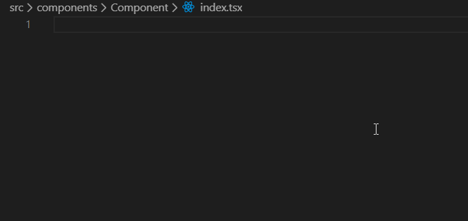
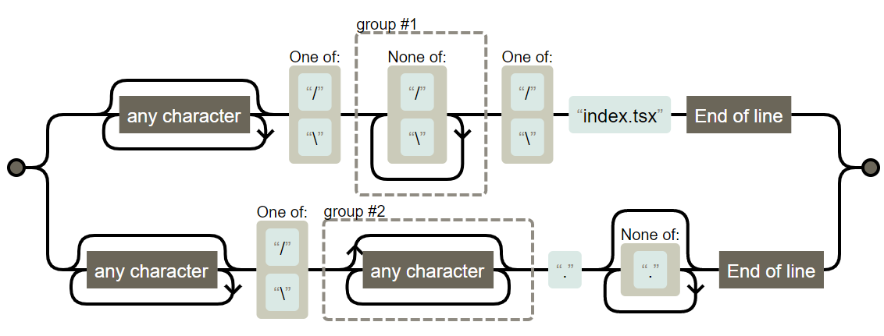

ハローワールド。

本題に入る前に今回の背景について説明。

Reactでコードを書いていると色々と困るのがファイル構成。[Reactの公式の見解](https://ja.reactjs.org/docs/faq-structure.html)としては特に無いとのことです。

> React はファイルをどのようにフォルダ分けするかについての意見を持っていません

それぞれプロジェクトにより千差万別と言えますが、本題に入る前に今回採用したファイル構成を紹介します。

# Reactのファイル構成

以前、私は`Component.tsx`を作ったら同じ階層に`Component.scss`、`Component.test.tsx`、`Component.stoires.tsx`を作成するようなルールにしていました（Testing、Storybookを採用した場合）。

上記ルールの問題は、1つの階層にコンポーネント数 * 4のファイルが出来上がるのですごく見通しが悪くなります。
テストファイルやStorybookファイルを別フォルダに分け、更にCSS in JSを採用すれば実質解決しますが、どれも一長一短ではあるのでここでは上記の方法を利用したいと考えました。

そのため、今回はフォルダをそれぞれ作って、その中に`index.tsx`、`index.scss`...を作るルールにしました。Webpackのルールではフォルダ名を指定すると、自動的にindex.jsを探してくれるので[^webpack-return-index.js]、`Component/index.js`は`Component`指定でimportできるので**名前の指定自体は以前と変わりません**。
またその中でしか利用しない子コンポーネントは同じ階層に入れる用にもしています。

[^webpack-return-index.js]: [実際は色々ルールが存在するようです](https://fringe.co.jp/webpack%E3%81%8C%E3%83%A2%E3%82%B8%E3%83%A5%E3%83%BC%E3%83%AB%E3%81%AEimport%E3%82%92%E8%A7%A3%E6%B1%BA%E3%81%99%E3%82%8B%E4%BB%95%E7%B5%84%E3%81%BF/)。またECMAScriptの仕様ではありません。ちなみにですが、近年のWebサーバーではディレクトリを指定すると勝手にindex.htmlへリダイレクト（参照）してくれますが、index.htmlをディレクトリのデフォルトにしたのは[1993年頃が最初らしいです](https://www.koikikukan.com/archives/2014/08/19-005555.php)。

例えば、LayoutHeaderは中にTitleLogoコンポーネントを利用しています。今回はLayoutHeaderコンポーネント内でしか使われないと仮定します。
そうした場合、下記のようなフォルダ構成になります。

```
LayoutHeader/
|-index.scss
|-index.stories.tsx
|-index.test.tsx
|-index.tsx
|-TitleLogo.scss
|-TitleLogo.stories.tsx
|-TitleLogo.test.tsx
|-TitleLogo.tsx
```

# スニペット

上記のファイル構成で今回アプリケーションを作成していきました。

ここでReact、Testing、Storybookを新しいコンポーネントを作るたびに作成し、更に既存のファイルからコピペしていることに気づきました。
流石に作業の時間が無駄なので、スニペットを使おうと思いましたが、今あるスニペットのライブラリは後術の理由であまりお気に召さなかったので、新しく作ろうと考えました。

## スニペットで作成したいファイル内容

今回はワンコマンド（ワンスニペット）で下記のファイルを作成したいのです（例えばReact関数コンポーネントの場合）。

```typescript:Component/index.tsx
import React from 'react';
import './index.scss';

interface Props {}

export const Component: React.FC<Props> = (props) => {
  return <div></div>;
};
```

ファイル内容に関しては人それぞれだと思いますが、特に欲しいのは**コンポーネントをnamed exportにする部分**です[^named-export]。default exportでは別に名前なんてなんでも良いですが、名前付きエクスポートではコンポーネントを表す名前を付けたいです（Buttonとか、Calendarとか）。そうすることでVSCodeの自動インポートが機能するのですごくDeveloper Experienceが高いです。
まぁ、`import { Component } from '@/src/Component'`みたいな気持ち悪い感じになっちゃいますけどね。

[^named-export]: javascriptではエクスポートの方法がデフォルトエクスポートと名前付きエクスポートの2つあります。Reactコンポーネントは大体の場合デフォルトエクスポートになっていると思いますが、VSCodeのデフォルトで名前付きエクスポートのみが自動インポートの対象になっているようなので名前付きエクスポートを利用しています。

ではここで、`Component`の中だけで使う`Other`コンポーネントを作りたくなりました。

OtherComponentはスニペットをバーンとやるだけでこうなってほしいですね。

```typescript:Component/Other.tsx
import React from 'react';
import './Other.scss';

interface Props {}

export const Other: React.FC<Props> = (props) => {
  return <div></div>;
}
```

大きな違いは、named exportの部分です。先程は「フォルダ名」を利用していましたが、今回は「ファイル名」をとっています。

つまり、**ファイル名が`index.tsx`であれば「フォルダ名を」、それ以外の場合は「ファイル名」から拡張子をとった名前にしてあげる必要**があります。

## 完成品

結論から言うと下記のスニペットで可能です。

```json:typescriptreact.json
{
	"React Functional Component": {
		"prefix": "reafunc",
		"body": [
			"import React from 'react';",
			"import './${2:$TM_FILENAME_BASE}.scss';",
			"",
			"interface Props {}",
			"",
			"export const ${1:${TM_FILEPATH/.*[\\/\\\\]([^\\/\\\\]+)[\\/\\\\]index\\.tsx$|.*[\\/\\\\](.*?)(?:\\.[^.]*)$/$1$2/}}: React.FC<Props> = (props) => {",
			"  return <div></div>;",
			"}",
			"",
		]
	},
}
```

実際に動作しているのはこんな感じ。




上側は`index.tsx`、下側は`Other.tsx`で行っていますが、エクスポートの部分がちゃんと想定通りになっていますね。

## 解説

VSCodeのスニペットでは**様々な変数が利用可能**です。[具体的には公式の変数一覧ページ](https://code.visualstudio.com/docs/editor/userdefinedsnippets#_variables)を参考にしていただければいいですが、今回は`$TM_FILEPATH`が活躍します。これはファイルパスが格納されています。

また、`${変数名/from/to/g}`で**正規表現を利用した置換が可能**です。今回はこの正規表現を利用して置換します。

今回はindex.tsxの場合はフォルダ名を、それ以外の場合はフォルダ名を取得する正規表現を作成することで解決できそうです。
なので、今回は下記のような正規表現を作成しました。

```regex
.*[\/\\]([^\/\\]+)[\/\\]index\.tsx$|.*[\/\\](.*?)(?:\.[^.]*)$
```

[Brainf*ck](http://www.kmonos.net/alang/etc/brainfuck.php)かな？

正規表現の可視化サイトを利用してわかりやすくしてみましょう。

今回利用したサイトは[Regexper](https://regexper.com/#.*%5B%5C%2F%5C%5C%5D%28%5B%5E%5C%2F%5C%5C%5D%2B%29%5B%5C%2F%5C%5C%5Dindex%5C.tsx%24%7C.*%5B%5C%2F%5C%5C%5D%28.*%3F%29%28%3F%3A%5C.%5B%5E.%5D*%29%24)です。



まぁ簡単に行ってしまえば、末尾がindex.tsxであれば上に、そうでなければ下にマッチする正規表現です。

ここで、groupを見てみると、上のgroup#1はindex.tsxの手前の\か/以外の文字列の連続にマッチします。すなわちindex.tsxの親フォルダが取得できます。
下のgroup#2は拡張子より前のファイルの名前にマッチします。

VSCodeではグループを`$1`、`$2`という感じで利用できます。そして、group1がマッチしたとき`$2`はマッチしていないので空文字、逆も同様なので`$1$2`とやると欲しい物が得られます。

更に、VSCodeでは`\`をエスケープしてやらないといけません。

これを踏まえて再度上記のスニペットを見てみましょう（一部抜粋です）。

```json/typescriptreact.json
"import React from 'react';",
"import './${2:$TM_FILENAME_BASE}.scss';",
"",
"interface Props {}",
"",
"export const ${1:${TM_FILEPATH/.*[\\/\\\\]([^\\/\\\\]+)[\\/\\\\]index\\.tsx$|.*[\\/\\\\](.*?)(?:\\.[^.]*)$/$1$2/}}: React.FC<Props> = (props) => {",
"  return <div></div>;",
"}",
"",
```

また、これを活用すると、storybookや

```typescript:Other.stories.tsx
import React from 'react';
import { Other as Component } from './Other';
export default {
  title: '',
};
export const Other = () => <Component />;

```

testなんかも

```typescript:Other.test.tsx
import React from 'react';
import { shallow } from 'enzyme';
import toJson from 'enzyme-to-json';
import { Other } from './Other';

describe('Other', () => {
  test('is rendered', () => {
    const wrapper = shallow(<Other />);
    expect(wrapper).toBeTruthy();
    expect(toJson(wrapper)).toMatchSnapshot();
  });
});
```

**スニペット一つで生成**できます。

上記設定は100%私がプロジェクトで利用している設定ですが、一応上記のスニペットも下記に記載しておきます。

```json:typescriptreact.json
{
	"React Functional Component": {
		"prefix": "reafunc",
		"body": [
			"import React from 'react';",
			"import './${2:$TM_FILENAME_BASE}.scss';",
			"",
			"interface Props {}",
			"",
			"export const ${1:${TM_FILEPATH/.*[\\/\\\\]([^\\/\\\\]+)[\\/\\\\]index\\.tsx$|.*[\\/\\\\](.*?)(?:\\.[^.]*)$/$1$2/}}: React.FC<Props> = (props) => {",
			"  return <div></div>;",
			"}",
			"",
		]
	},
	"React Test with jest and enzyme": {
		"prefix": "jest",
		"body": [
			"import React from 'react';",
			"import { shallow } from 'enzyme';",
			"import toJson from 'enzyme-to-json';",
			"import { ${2:${TM_FILEPATH/.*[\\/\\\\]([^\\/\\\\]+)[\\/\\\\]index\\.test\\.tsx$|.*[\\/\\\\](.*?)(?:\\.test\\.[^.]*)$/$1$2/}} } from './${1:${TM_FILENAME_BASE/\\.test//g}}';",
			"",
			"describe('${2:${TM_FILEPATH/.*[\\/\\\\]([^\\/\\\\]+)[\\/\\\\]index\\.test\\.tsx$|.*[\\/\\\\](.*?)(?:\\.test\\.[^.]*)$/$1$2/}}', () => {",
			"  test('is rendered', () => {",
			"    const wrapper = shallow(<${2:${TM_FILEPATH/.*[\\/\\\\]([^\\/\\\\]+)[\\/\\\\]index\\.test\\.tsx$|.*[\\/\\\\](.*?)(?:\\.test\\.[^.]*)$/$1$2/}} />);",
			"    expect(wrapper).toBeTruthy();",
			"    expect(toJson(wrapper)).toMatchSnapshot();",
			"  });",
			"});",
			"",
		]
	},
	"React Story book": {
		"prefix": "story",
		"body": [
			"import React from 'react';",
			"import { ${2:${TM_FILEPATH/.*[\\/\\\\]([^\\/\\\\]+)[\\/\\\\]index\\.stories\\.tsx$|.*[\\/\\\\](.*?)(?:\\.stories\\.[^.]*)$/$1$2/}} as Component } from './${3:${TM_FILENAME_BASE/\\.stories//g}}';",
			"export default {",
			"  title: '$1',",
			"};",
			"export const ${2:${TM_FILEPATH/.*[\\/\\\\]([^\\/\\\\]+)[\\/\\\\]index\\.stories\\.tsx$|.*[\\/\\\\](.*?)(?:\\.stories\\.[^.]*)$/$1$2/}} = () => <Component />;",
			"",
		]
	}
}
```
