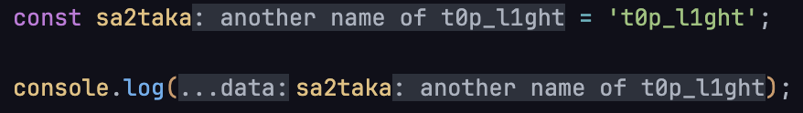
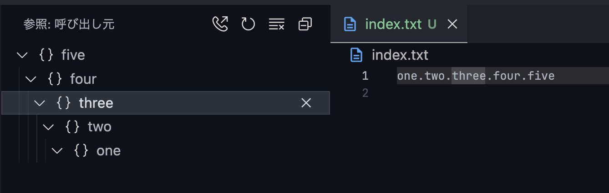

VSCodeには[Programmatic Language Features](https://code.visualstudio.com/api/language-extensions/programmatic-language-features)という機能があります。これを利用すると、例えばホバーした際の表示内容を追加出来ます。
こちらはLSP側の機能と密接に関わっており、これを活用すると高機能で便利なVSCode拡張を作成できます。

今回はこれを全部試してみました。下記を眺めてみて、拡張機能のアイデアだったり実現したいことに一番近い機能を探してみてください。

上記ページには2024-07-16現在、19個記載されています……が、実際には33個あります。テーブルにはないけれど実例にはあるやつもあったり、テーブルにも実例にもないけれど存在する例もあり、上記ドキュメントからは正しく読み取れない状態です。下記に現時点での完全版のAPIを載せました。
下記は2024-07-16現在の最新版である [types/vscode@1.91.0](https://www.npmjs.com/package/@types/vscode/v/1.91.0)の`vscode.languages`APIに生えているAPIの一覧です。対象外となっているのはエディタの機能の拡張しなさそうなものです。
ドキュメントに記載がある部分は公式で実例もあるので、そちらを確認するのもおすすめです。

VSCodeの拡張の作り方には触れません。公式のリファレンスや様々な記事を参照してください。私も一応簡単にですが[拡張の作り方を記載しています](https://blog.sa2taka.com/post/javascript-typescript-jump-between-test-and-code-with-vscode/#%E6%8B%A1%E5%BC%B5%E3%82%92%E4%BD%9C%E3%82%8B)。

今回は**TypeScriptのプロジェクト**に対して行います。


| VS Code API                                 | LSP method                          |                                                                                                                                                                                |
| ------------------------------------------- | ----------------------------------- | ------------------------------------------------------------------------------------------------------------------------------------------------------------------------------ |
| createDiagnosticCollection                  | PublishDiagnostics                  | [ドキュメントに記載あり](https://code.visualstudio.com/api/language-extensions/programmatic-language-features#provide-diagnostics)                                             |
| registerCompletionItemProvider              | Completion & Completion Resolve     | [ドキュメントに記載あり](https://code.visualstudio.com/api/language-extensions/programmatic-language-features#show-code-completion-proposals)                                  |
| registerHoverProvider                       | Hover                               | [ドキュメントに記載あり](https://code.visualstudio.com/api/language-extensions/programmatic-language-features#show-hovers)                                                     |
| registerSignatureHelpProvider               | SignatureHelp                       | [ドキュメントに記載あり](https://code.visualstudio.com/api/language-extensions/programmatic-language-features#help-with-function-and-method-signatures)                        |
| registerDefinitionProvider                  | Definition                          | [ドキュメントに記載あり](https://code.visualstudio.com/api/language-extensions/programmatic-language-features#show-definitions-of-a-symbol)                                    |
| registerTypeDefinitionProvider              | TypeDefinition                      |                                                                                                                                                                                |
| registerImplementationProvider              | Implementation                      |                                                                                                                                                                                |
| registerReferenceProvider                   | References                          |                                                                                                                                                                                |
| registerDocumentHighlightProvider           | DocumentHighlight                   | [ドキュメントに記載あり](https://code.visualstudio.com/api/language-extensions/programmatic-language-features#highlight-all-occurrences-of-a-symbol-in-a-document)             |
| registerDocumentSymbolProvider              | DocumentSymbol                      | [ドキュメントに記載あり](https://code.visualstudio.com/api/language-extensions/programmatic-language-features#show-all-symbol-definitions-within-a-document)                   |
| registerCodeActionsProvider                 | CodeAction                          | [ドキュメントに記載あり](https://code.visualstudio.com/api/language-extensions/programmatic-language-features#possible-actions-on-errors-or-warnings)                          |
| registerCodeLensProvider                    | CodeLens & CodeLens Resolve         | [ドキュメントに記載あり](https://code.visualstudio.com/api/language-extensions/programmatic-language-features#codelens-show-actionable-context-information-within-source-code) |
| registerDocumentLinkProvider                | DocumentLink & DocumentLink Resolve |                                                                                                                                                                                |
| registerColorProvider                       | DocumentColor & Color Presentation  | [ドキュメントに記載あり](https://code.visualstudio.com/api/language-extensions/programmatic-language-features#show-color-decorators)                                           |
| registerDocumentFormattingEditProvider      | Formatting                          | [ドキュメントに記載あり](https://code.visualstudio.com/api/language-extensions/programmatic-language-features#format-source-code-in-an-editor)                                 |
| registerDocumentRangeFormattingEditProvider | RangeFormatting                     |                                                                                                                                                                                |
| registerOnTypeFormattingEditProvider        | OnTypeFormatting                    | [ドキュメントに記載あり](https://code.visualstudio.com/api/language-extensions/programmatic-language-features#incrementally-format-code-as-the-user-types)                     |
| registerRenameProvider                      | Rename & Prepare Rename             | [ドキュメントに記載あり](https://code.visualstudio.com/api/language-extensions/programmatic-language-features#rename-symbols)                                                  |
| registerFoldingRangeProvider                | FoldingRange                        |                                                                                                                                                                                |
| createLanguageStatusItem                    | -                                   |                                                                                                                                                                                |
| registerInlineCompletionItemProvider        | -                                   |                                                                                                                                                                                |
| registerDeclarationProvider                 | -                                   |                                                                                                                                                                                |
| registerEvaluatableExpressionProvider       | -                                   |                                                                                                                                                                                |
| registerInlineValuesProvider                | -                                   |                                                                                                                                                                                |
| registerWorkspaceSymbolProvider             | -                                   | [ドキュメントに記載あり](https://code.visualstudio.com/api/language-extensions/programmatic-language-features#show-all-symbol-definitions-in-folder)                           |
| registerDocumentSemanticTokensProvider      | -                                   |                                                                                                                                                                                |
| registerDocumentRangeSemanticTokensProvider | -                                   |                                                                                                                                                                                |
| registerInlayHintsProvider                  | -                                   |                                                                                                                                                                                |
| registerSelectionRangeProvider              | -                                   |                                                                                                                                                                                |
| registerCallHierarchyProvider               | -                                   |                                                                                                                                                                                |
| registerTypeHierarchyProvider               | -                                   |                                                                                                                                                                                |
| registerLinkedEditingRangeProvider          | -                                   |                                                                                                                                                                                |
| registerDocumentDropEditProvider            | -                                   |                                                                                                                                                                                |
| getLanguages                                | -                                   | 対象外                                                                                                                                                                         |
| setTextDocumentLanguage                     | -                                   | 対象外                                                                                                                                                                         |
| match                                       | -                                   | 対象外                                                                                                                                                                         |
| getDiagnostics                              | -                                   | 対象外                                                                                                                                                                         |
| setLanguageConfiguration                    | -                                   | 対象外                                                                                                                                                                         |

# createDiagnosticCollection

こちらは、簡単に言えば、エラーや注意表示時に赤線やオレンジ色の線が引かれる機能です。

`extension.ts`の`activate`関数に下記を記載します。下記はactiveTextEditorが変化するたびに、対象のファイルの上位4行に対して、上から`Error`・`Warning`・`Information`・`Hint`のDiagnosticsを追加するものです。

```typescript:extension.ts
import * as vscode from "vscode";

export function activate(context: vscode.ExtensionContext) {
  const createDiagnosticCollection =
    vscode.languages.createDiagnosticCollection("my diagnostic");

  vscode.window.onDidChangeActiveTextEditor((editor) => {
    if (editor?.document.fileName) {
      const firstLineCharacters = editor.document.lineAt(0).text.length;
      const secondLineCharacters = editor.document.lineAt(1).text.length;
      const thirdLineCharacters = editor.document.lineAt(2).text.length;
      const fourthLineCharacters = editor.document.lineAt(3).text.length;

      createDiagnosticCollection.set(
        vscode.Uri.parse(editor.document.fileName),
        [
          {
            code: "diagnostic-code",
            message: "This is a diagnostic error",
            range: new vscode.Range(new vscode.Position(0, 0), new vscode.Position(0, firstLineCharacters)),
            severity: vscode.DiagnosticSeverity.Error,
            source: "diagnostic-source",
          },
          {
            // 2行目に対して同様に記載する
            severity: vscode.DiagnosticSeverity.Warning,
          },
          {
            // 3行目に対して同様に記載する
            severity: vscode.DiagnosticSeverity.Information,
          },
          {
            // 4行目に対して同様に記載する 
            severity: vscode.DiagnosticSeverity.Hint,
          },
        ]
      );
    }
  });

  context.subscriptions.push(createDiagnosticCollection);
}
```

実行結果が下記の通り。4行目だけ分かりづらいですが、先頭に白色の点線が表示されています。


# CompletionItemProvider

こちらは名前の通り補完候補に関するProviderです。

`extension.ts`の`activate`関数に下記を記載します。下記はTypeScriptに置いて、常にHello, WorldとBye Worldの補完を表示し続けます。補完は文字を入力するか、デフォルトだとCtrl-Spaceなどで表示されます。

```typescript:extension.ts  
import * as vscode from "vscode";

export class CompletionItemProvider implements vscode.CompletionItemProvider {
  provideCompletionItems(): vscode.ProviderResult<vscode.CompletionItem[] | vscode.CompletionList> {
    const completionItem1 = new vscode.CompletionItem("Hello World");
    completionItem1.detail = "This is a detail";
    completionItem1.documentation = new vscode.MarkdownString("This is a documentation");
    completionItem1.kind = vscode.CompletionItemKind.Text;
    completionItem1.insertText = "Hello World";

    const completionItem2 = new vscode.CompletionItem("Bye World");
    completionItem2.kind = vscode.CompletionItemKind.Function;
    // その他は1と同様

    return [completionItem1, completionItem2];
  }
}

export function activate(context: vscode.ExtensionContext) {
  const registerCompletionItemProvider = vscode.languages.registerCompletionItemProvider(
    { language: "typescript", scheme: "file" },
    new CompletionItemProvider()
  );

  context.subscriptions.push(registerCompletionItemProvider);
}
```

実行結果は下記の通り。補完に表示されますね。


# HoverProvider

こちらはホバー時のメッセージに関するProviderです。

`extension.ts`の`activate`関数に下記を記載します。

```typescript:extension.ts
import * as vscode from "vscode";

export class HoverProvider implements vscode.HoverProvider {
  provideHover(): vscode.ProviderResult<vscode.Hover> {
    return new vscode.Hover(
      new vscode
        .MarkdownString("This is a hover message")
        .appendCodeblock("const a = 'Hello World';", "typescript")
    );
  }
}

export function activate(context: vscode.ExtensionContext) {
  const registerHoverProvider = vscode.languages.registerHoverProvider({ language: "typescript", scheme: "file" }, new HoverProvider());

  context.subscriptions.push(registerHoverProvider);
}
```

実行結果は下記の通り。ホバー時にメッセージが表示されます。他のメッセージがある場合の順番はおそらく実行順で、インターフェース的に順番を弄れる機能は無さそうでした。


また、Hover時のメッセージはMarkdownです。コードブロックや画像の表示なども出来ますし、コマンドを実行するボタンも利用できます。ただしコマンドを実行する場合は`Markdown`インスタンスの`isTrusted`を`true`にする必要があります。コマンドの叩き方など含めて詳細は[Command URIs](https://code.visualstudio.com/api/extension-guides/command#command-uris)を参照してください。

# SignatureHelpProvider

こちらは関数やメソッドを記載時に関数・メソッドの情報や引数の情報を表示するためのものです。

`extension.ts`の`activate`関数に下記を記載します。

```typescript:extension.ts
import * as vscode from "vscode";

export class SignatureHelpProvider implements vscode.SignatureHelpProvider {
  provideSignatureHelp(): vscode.ProviderResult<vscode.SignatureHelp> {
    const signatureHelp = new vscode.SignatureHelp();
    const signatureInformation = new vscode.SignatureInformation("This is a signature label", "This is a signature documentation");
    signatureHelp.signatures = [signatureInformation];
    return signatureHelp;
  }
}


export function activate(context: vscode.ExtensionContext) {
  const signatureHelpProvider = vscode.languages.registerSignatureHelpProvider(
    { language: "typescript", scheme: "file" },
    new SignatureHelpProvider()
  );

  context.subscriptions.push(signatureHelpProvider);
}
```

実行結果は下記の通り。関数を呼び出したりする際にメッセージが表示されます。


# DefinitionProvider / TypeDefinitionProvider / ImplementationProvider / ReferenceProvider / DeclarationProvider

こちらは定義などにジャンプするためのProviderです。右クリックなどで出てくるコンテキストメニューの「定義へ移動」「型定義へ移動」「実装へ移動」「参照へ移動」「宣言へ移動」に該当する機能です。
今回はDefinitionProviderを例にしますが、他のProviderも同様のインターフェースを持っています。
TypeScriptを開くと「ソース定義に移動」というのも可能ですが、こちらはProgrammatic Language Featuresには含まれていません。TypeScriptの機能です。

`extension.ts`の`activate`関数に下記を記載します。

```typescript:extension.ts
import * as vscode from "vscode";

export class DefinitionProvider implements vscode.DefinitionProvider {
  provideDefinition(
    document: vscode.TextDocument,
    position: vscode.Position,
    token: vscode.CancellationToken
  ): vscode.ProviderResult<vscode.Definition | vscode.DefinitionLink[]> {
    const workspaceRoot = vscode.workspace.workspaceFolders?.[0];

    if (workspaceRoot) {
      const uri = vscode.Uri.joinPath(workspaceRoot.uri, "package.json");
      return new vscode.Location(uri, new vscode.Position(0, 0));
    }
  }
}


export function activate(context: vscode.ExtensionContext) {
  const definitionProvider = vscode.languages.registerDefinitionProvider(
    { language: "typescript", scheme: "file" },
    new DefinitionProvider()
  );

  context.subscriptions.push(definitionProvider);
}
```

実行結果は下記の通りです。上記の例だとワークスペースのrootにあるpackage.jsonの1行目に必ず飛ぶようになります。


# DocumentHighlightProvider

ハイライトを行うProviderです。

`extension.ts`の`activate`関数に下記を記載します。

```typescript:extension.ts
import * as vscode from "vscode";

export class DocumentHighlightProvider implements vscode.DocumentHighlightProvider {
  provideDocumentHighlights(
    document: vscode.TextDocument,
    position: vscode.Position,
    token: vscode.CancellationToken
  ): vscode.ProviderResult<vscode.DocumentHighlight[]> {
    const selectedText = document.getText(document.getWordRangeAtPosition(position));

    if (selectedText === "big") {
      // smallを含む文字列をハイライトする
      const text = document.getText();
      const highlights: vscode.DocumentHighlight[] = [];
      let match: RegExpExecArray | null;
      const regex = /small/g;
      while ((match = regex.exec(text))) {
        const start = document.positionAt(match.index);
        const end = document.positionAt(match.index + match[0].length);
        highlights.push(new vscode.DocumentHighlight(new vscode.Range(start, end), vscode.DocumentHighlightKind.Text));
      }
      return highlights;
    }
    return [];
  }
}

export function activate(context: vscode.ExtensionContext) {
  const documentHighlightProvider = vscode.languages.registerDocumentHighlightProvider(
    { language: "typescript", scheme: "file" },
    new DocumentHighlightProvider()
  );

  context.subscriptions.push(documentHighlightProvider);
}
```

上記は`big`というテキストが選択された場合`small`というテキストをハイライトする挙動となっています。実際の挙動が下記となります。


# DocumentSymbolProvider / WorkspaceSymbolProvider

こちらはSymbolについてのProviderです。Symbolは変数や関数、クラス、メソッドなどを表すものです。DocumentSymbolはアウトラインやmacOSではcmd-shift-Oで出現するシンボルの検索などに用いられます。WorkspaceSymbolはmacOSではcmd-tで出現するワークスペース全体でのsymbolの検索に利用します。
今回はDocumentSymbolProviderについて記載しますが、WorkspaceSymbolProviderも似たようなインターフェースを提供します。

`extension.ts`の`activate`関数に下記を記載します。

```typescript:extension.ts
import * as vscode from "vscode";

export class DocumentSymbolProvider implements vscode.DocumentSymbolProvider {
  provideDocumentSymbols(document: vscode.TextDocument): vscode.ProviderResult<vscode.SymbolInformation[] | vscode.DocumentSymbol[]> {
    // ""で囲まれている文字列をDocumentSymbolとして返す
    const symbols: vscode.DocumentSymbol[] = [];
    const regExp = /".*?"/g;
    let match;
    while ((match = regExp.exec(document.getText()))) {
      const symbol = new vscode.DocumentSymbol(
        match[0].slice(1, -1),
        "",
        vscode.SymbolKind.String,
        new vscode.Range(document.positionAt(match.index + 1), document.positionAt(match.index + match[0].length - 1)),
        new vscode.Range(document.positionAt(match.index + 1), document.positionAt(match.index + match[0].length - 1))
      );
      symbols.push(symbol);
    }
    return symbols;
  }
}

export function activate(context: vscode.ExtensionContext) {
  const documentSymbolProvider = vscode.languages.registerDocumentSymbolProvider(
    { language: "typescript", scheme: "file" },
    new DocumentSymbolProvider()
  );

  context.subscriptions.push(documentSymbolProvider);
}
```

上記は文字列（`" "`で囲まれたもの）をSymbolとして抜き出します。


# CodeActionsProvider

こちらはコードアクションについてのProviderです。コードアクションはエラーまたは警告時にそれを解消するためのアクションを提供するものです。電球マークのボタンです。

`extension.ts`の`activate`関数に下記を記載します。

```typescript:extension.ts
import * as vscode from "vscode";

export class CodeActionProvider implements vscode.CodeActionProvider {
  provideCodeActions(
    document: vscode.TextDocument,
    range: vscode.Range,
    context: vscode.CodeActionContext,
    token: vscode.CancellationToken
  ): vscode.ProviderResult<(vscode.Command | vscode.CodeAction)[]> {
    const action = new vscode.CodeAction("Convert to uppercase", vscode.CodeActionKind.QuickFix);
    action.edit = new vscode.WorkspaceEdit();
    action.edit.replace(document.uri, range, document.getText(range).toUpperCase());
    return [action];
  }
}

export function activate(context: vscode.ExtensionContext) {
  const codeActionProvider = vscode.languages.registerCodeActionsProvider(
    { language: "typescript", scheme: "file" },
    new CodeActionProvider()
  );

  context.subscriptions.push(codeActionProvider);
}
```

上記は大文字に変更するCodeActionを提供します。


# CodeLensProvider

CodeLensについてのProviderです。Code Lensと訊くと馴染は薄いですが、例えば有効にしていれば関数やメソッド、クラスなどの上に出てくる「5 references」といったボタンのことです。基本的に新しい行として上に表示され、何らかのアクションが起こせます。

`extension.ts`の`activate`関数に下記を記載します。

```typescript:extension.ts
import * as vscode from "vscode";

export class CodeActionProvider implements vscode.CodeActionProvider {
  provideCodeActions(
    document: vscode.TextDocument,
    range: vscode.Range,
    context: vscode.CodeActionContext,
    token: vscode.CancellationToken
  ): vscode.ProviderResult<(vscode.Command | vscode.CodeAction)[]> {
    const action = new vscode.CodeAction("Convert to uppercase", vscode.CodeActionKind.QuickFix);
    action.edit = new vscode.WorkspaceEdit();
    action.edit.replace(document.uri, range, document.getText(range).toUpperCase());
    return [action];
  }
}


export function activate(context: vscode.ExtensionContext) {
  const codeLensProvider = vscode.languages.registerCodeLensProvider({ language: "typescript", scheme: "file" }, new CodeLensProvider());
  const codeLensAction = vscode.commands.registerCommand("extension.lensAction", () => {
    vscode.window.showInformationMessage("CodeLens was clicked");
  });

  context.subscriptions.push(codeLensProvider,  codeLensAction);
}
```

下記を`package.json`に追加する必要があるかもしれません。

```package.json
{
  ... ,
    "contributes": {
    "commands": [
      {
        "command": "extension.lensAction",
        "title": "Lens Action"
      }
    ],
    ... ,
  },
  ... ,
}
```

上記はクリックすることで右下にメッセージを表示するものです。


#  DocumentLinkProvider

DocumentLinkについてのProviderです。DocumentLinkはリンクを貼ることが出来るもので、例えばURLやファイルパスなどをリンクとして表示することが出来ます。

`extension.ts`の`activate`関数に下記を記載します。

```typescript:extension.ts
import * as vscode from "vscode";

export class DocumentLinkProvider implements vscode.DocumentLinkProvider {
  provideDocumentLinks(document: vscode.TextDocument, token: vscode.CancellationToken): vscode.ProviderResult<vscode.DocumentLink[]> {
    const links: vscode.DocumentLink[] = [];
    const regex = /sa2taka/g;
    const text = document.getText();
    let match;
    while ((match = regex.exec(text))) {
      const start = document.positionAt(match.index);
      const end = document.positionAt(match.index + match[0].length);
      const link = new vscode.DocumentLink(new vscode.Range(start, end), vscode.Uri.parse("https://github.com/sa2taka"));
      links.push(link);
    }
    return links;
  }
}

export function activate(context: vscode.ExtensionContext) {
  const documentLinkProvider = vscode.languages.registerDocumentLinkProvider(
    { language: "typescript", scheme: "file" },
    new DocumentLinkProvider()
  );

  context.subscriptions.push(documentLinkProvider);
}
```

 上記は`sa2taka`という文字列をクリックするとsa2takaのGitHubページに飛ぶようになります。

 

# DocumentColorProvider

DocumentColorについてのProviderです。DocumentColorは色を表示するためのProviderです。
例えば、組織やプロダクトのメインカラーやセカンダリカラーを指定しておき、それを色として表示するなどの使い方が考えられます。

`extension.ts`の`activate`関数に下記を記載します。

```typescript:extension.ts
import * as vscode from "vscode";

const primaryColor = new vscode.Color(0x00 / 0xff, 0x80 / 0xff, 0x80 / 0xff, 1);
const secondaryColor = new vscode.Color(0x80 / 0xff, 0x00 / 0xff, 0x80 / 0xff, 1);

export class DocumentColorProvider implements vscode.DocumentColorProvider {
  provideDocumentColors(document: vscode.TextDocument, token: vscode.CancellationToken): vscode.ProviderResult<vscode.ColorInformation[]> {
    const colors: vscode.ColorInformation[] = [];
    const regExp = /(primary|secondary)/g;
    let match;
    while ((match = regExp.exec(document.getText()))) {
      const color = match[0] === "primary" ? primaryColor : secondaryColor;
      const range = new vscode.Range(document.positionAt(match.index), document.positionAt(match.index + match[0].length));
      colors.push(new vscode.ColorInformation(range, color));
    }
    return colors;
  }

  provideColorPresentations(
    color: vscode.Color,
    context: { document: vscode.TextDocument; range: vscode.Range },
    token: vscode.CancellationToken
  ): vscode.ProviderResult<vscode.ColorPresentation[]> {
    return [new vscode.ColorPresentation("primary"), new vscode.ColorPresentation("secondary")];
  }
}

export function activate(context: vscode.ExtensionContext) {
  const documentColorProvider = vscode.languages.registerColorProvider(
    { language: "typescript", scheme: "file" },
    new DocumentColorProvider()
  );

  context.subscriptions.push(documentColorProvider);
}
```

上記は`primary`と`secondary`という文字列を色として表示します。`provideColorPresentations`は色の名前を表示するためのものであり、クリックすると切り替えられるようです（こんな機能あったんだな）。


# DocumentFormattingEditProvider / DocumentRangeFormattingEditProvider / OnTypeFormattingEditProvider

こちらはフォーマットに関するProviderです。DocumentFormattingEditProviderは全体のフォーマット、DocumentRangeFormattingEditProviderは選択範囲のフォーマット、OnTypeFormattingEditProviderはタイプ時のフォーマットに関するProviderです。フォーマットはPrettierなどのフォーマッターを利用することが多いと思いますが、まさにその機能を提供するものです。

`extension.ts`の`activate`関数に下記を記載します。

```typescript:extension.ts
import * as vscode from "vscode";

export class DocumentFormattingEditProvider implements vscode.DocumentFormattingEditProvider {
  provideDocumentFormattingEdits(
    document: vscode.TextDocument,
    options: vscode.FormattingOptions
  ): vscode.ProviderResult<vscode.TextEdit[]> {
    const firstLine = document.lineAt(0);
    const lastLine = document.lineAt(document.lineCount - 1);
    const textRange = new vscode.Range(firstLine.range.start, lastLine.range.end);
    const newText = document.getText().toUpperCase();
    return [vscode.TextEdit.replace(textRange, newText)];
  }
}

export function activate(context: vscode.ExtensionContext) {
  const documentFormattingEditProvider = vscode.languages.registerDocumentFormattingEditProvider(
    { language: "typescript", scheme: "file" },
    new DocumentFormattingEditProvider()
  );

  context.subscriptions.push(documentFormattingEditProvider);
}
```

上記は全体を大文字に変換するフォーマットを提供します。
DocumentRangeFormattingEditProviderは選択範囲のみを変換するものです。選択して右クリック ->「選択範囲をフォーマット」により実行されるものです。
OnTypeFormattingEditProviderはタイプ時にフォーマットを行うものです。例えば`{`を入力すると`{}`に変換するなどの機能を提供します。Typeは型という意味ではないようですね。


# RenameProvider

こちらはリネームに関するProviderです。関数名や変数名の変更などしばしばお世話になる機能ですね。

Providerは2つのメソッドを提供します。`provideRenameEdits`はリネーム時に行うべき変更を提供します。`prepareRename`はリネームを行う前に行うべき処理を提供します。

`extension.ts`の`activate`関数に下記を記載します。

```typescript:extension.ts
import * as vscode from "vscode";

export class RenameProvider implements vscode.RenameProvider {
  // // author: が先頭にある行の名前の部分を抜き出すための正規表現
  private authorRegexp = /(?<=\s*\/\/\s*author:\s*)([\S].*)$/;
  prepareRename(
    document: vscode.TextDocument,
    position: vscode.Position,
    token: vscode.CancellationToken
  ): vscode.ProviderResult<vscode.Range> {
    const selectedLineText = document.lineAt(position.line).text;
    const match = this.authorRegexp.exec(selectedLineText);
    if (!match) {
      return;
    }

    return new vscode.Range(position.line, match.index, position.line, match.index + match[1].length);
  }

  provideRenameEdits(
    document: vscode.TextDocument,
    position: vscode.Position,
    newName: string,
    token: vscode.CancellationToken
  ): vscode.ProviderResult<vscode.WorkspaceEdit> {
    // ファイルの中の author から始まる行のうち、変換対象と同じ名前の行を変換する
    const selectedLineText = document.lineAt(position.line).text;
    const match = this.authorRegexp.exec(selectedLineText);
    if (!match) {
      return;
    }
    const oldName = match[1];

    const workspaceEdit = new vscode.WorkspaceEdit();
    const lineCount = document.lineCount;
    for (let i = 0; i < lineCount; i++) {
      const line = document.lineAt(i);
      const match = this.authorRegexp.exec(line.text);
      if (match && match[1] === oldName) {
        workspaceEdit.replace(document.uri, line.range, line.text.replace(match[1], newName));
      }
    }
    return workspaceEdit;
  }
}

export function activate(context: vscode.ExtensionContext) {
  const renameProvider = vscode.languages.registerRenameProvider(
    { language: "typescript", scheme: "file" },
    new RenameProvider()
  );

  context.subscriptions.push(renameProvider);
}
```

上記は`// author: ` から始まる行の名前の部分を一括で変更するProviderです。下記のgifを見ると、`author`の部分にカーソルを合わせてcmd-rを押しているのに、名前の部分が選択されていることが分かります。これは`prepareRename`の処理によるものです。


# FoldingRangeProvider

こちらは折り畳みに関するProviderです。クラスや関数などのブロックを折りたたむときに使う機能ですね。Visual Studioと同様に`region`と`endregion` により任意の箇所で折りたたむことが可能なほか、今回紹介するProviderを利用することで任意の場所に折りたたみを設定が可能です。

`extension.ts`の`activate`関数に下記を記載します。

```typescript:extension.ts
import * as vscode from "vscode";

export class FoldingRangeProvider implements vscode.FoldingRangeProvider {
  provideFoldingRanges(
    document: vscode.TextDocument,
    context: vscode.FoldingContext,
    token: vscode.CancellationToken
  ): vscode.ProviderResult<vscode.FoldingRange[]> {
    // private ... = ...; で表される行を全て閉じれるようにする
    const targetLineRegexp = /\s*private\s.*=.*;?/;
    const ranges: vscode.FoldingRange[] = [];
    for (let i = 0; i < document.lineCount; i++) {
      const line = document.lineAt(i);
      if (targetLineRegexp.test(line.text) || line.text.trim() === "") {
        const start = line.range.start;
        let end = new vscode.Position(i + 1, 0);
        while (i + 1 < document.lineCount) {
          if (!targetLineRegexp.test(document.lineAt(i + 1).text) && line.text.trim() !== "") {
            break;
          }
          i++;
          end = new vscode.Position(i + 1, 0);
        }
        ranges.push(new vscode.FoldingRange(start.line, end.line - 1, vscode.FoldingRangeKind.Region));
      }
    }
    return ranges;
  }
}

export function activate(context: vscode.ExtensionContext) {
  const foldingRangeProvider = vscode.languages.registerFoldingRangeProvider(
    { language: "typescript", scheme: "file" },
    new FoldingRangeProvider()
  );

  context.subscriptions.push(foldingRangeProvider);
}
```

上記は`private ... = ...;` で表される行を全て閉じられるようにするProviderです。下記のgifを見ると、`private`の部分をクリックすると折りたたまれることが分かります。


# createLanguageStatusItem

こちらは言語の状態に関するものです。TypeScriptを開いている場合、右下のステータスバーにTypeScriptと表示されているその右にある `{ }` に関するものです。
ステータスバーの表示に関しては `vscode.window.createStatusBarItem` という別のAPIを利用します。

`extension.ts`の`activate`関数に下記を記載します。

```typescript:extension.ts
import * as vscode from "vscode";

export function activate(context: vscode.ExtensionContext) {
  const languageStatusItem = vscode.languages.createLanguageStatusItem("my test language status", {
    language: "typescript",
    scheme: "file",
  });

  languageStatusItem.text = "TEST";
  languageStatusItem.command = { title: "TEST COMMAND", command: "<extensionId>.<commandId>"};
  context.subscriptions.push(languageStatusItem);
}
```

実行結果は下記になります。


# InlineCompletionItemProvider

こちらはインライン補完に関するProviderです。インライン補完も候補の一種です。違いとしては、

- リアルタイムに表示される
    - 通常の補完は `vscode.` のように `.` を押すことでメソッドが表示されます
    - インライン補完は比較的リアルタイムに色々表示されます
    - 例えば文字列の入力中に過去の入力履歴やファイルの単語などが自動的に表示されるのがインライン補完です
- 正確性は低い
    - 通常の補完は構文解析などを行い、正確な補完をします
    - インライン補完は文脈などを用いた補完なので、必ずしも正確な情報が現れるとは限りません

ただ、あまり変わらないように感じます。

`extension.ts`の`activate`関数に下記を記載します。

```typescript:extension.ts
import * as vscode from "vscode";

export class InlineCompletionProvider implements vscode.CompletionItemProvider {
  provideCompletionItems(document, position, token, context) {
    const completionItem = new vscode.CompletionItem("Inline Completion", vscode.CompletionItemKind.Text);
    completionItem.insertText = "Inline Completion";

    return [completionItem];
  }
}

export function activate(context: vscode.ExtensionContext) {
  const inlineCompletionProvider = vscode.languages.registerInlineCompletionItemProvider(
    { language: "typescript", scheme: "file" },
    new InlineCompletionProvider()
  );
}
```

実行結果は下記の通りです。


# EvaluatableExpressionProvider

こちらは評価可能な式に関するProviderです。

`extension.ts`の`activate`関数に下記を記載します。

```typescript:extension.ts
import * as vscode from "vscode";

export class EvaluatableExpressionProvider implements vscode.EvaluatableExpressionProvider {
  provideEvaluatableExpression(
    document: vscode.TextDocument,
    position: vscode.Position,
    token: vscode.CancellationToken
  ): vscode.ProviderResult<vscode.EvaluatableExpression> {
    console.log(position);
    const selectedText = document.getText(document.getWordRangeAtPosition(position));
    console.log("selectedText", selectedText);

    if (selectedText === "text_additional_test") {
      return {
        range: new vscode.Range(position, position.with(position.line, position.character + selectedText.length)),
        expression: "`evaluatable_expression_test: ${text_additional_test}`",
      };
    }
  }
}

export function activate(context: vscode.ExtensionContext) {
  const evaluatableExpressionProvider = vscode.languages.registerEvaluatableExpressionProvider(
    { language: "typescript", scheme: "file" },
    new EvaluatableExpressionProvider()
  );

  context.subscriptions.push(evaluatableExpressionProvider);
}
```

実行結果が下記となります。いまいちTypeScriptだと活用する場面が思いつかないけど、何らかの言語では活用できるのかもしれないですね。


# InlineValuesProvider

こちらはデバッグ時にインラインに値を表示するProviderです。デバッグ時に行末に値を表示します。

`extension.ts`の`activate`関数に下記を記載します。

```typescript:extension.ts
import * as vscode from "vscode";

export class InlineValuesProvider implements vscode.InlineValuesProvider {
  async provideInlineValues(
    document: vscode.TextDocument,
    viewPort: vscode.Range,
    context: vscode.InlineValueContext,
    token: vscode.CancellationToken
  ): Promise<vscode.InlineValue[]> {
    const lines = document.getText(viewPort).split("\n");
    const inlineValues: vscode.InlineValue[] = [];

    lines.forEach((line, index) => {
      const match = line.match(/^(const|var|let)\s+(\w+)/);
      if (match) {
        const variableName = match[2];
        const inlineValue = new vscode.InlineValueEvaluatableExpression(
          new vscode.Range(index, line.indexOf(variableName), index, line.indexOf(variableName) + variableName.length),
          variableName
        );
        inlineValues.push(inlineValue);
      }
    });

    return inlineValues;
  }
}

export function activate(context: vscode.ExtensionContext) {
  const inlineValuesProvider = vscode.debug.registerInlineValuesProvider(
    { language: "typescript", scheme: "file" },
    new InlineValuesProvider()
  );
}
```

実行結果が下記となります。こちらは`const`, `let`, `var`から始まる変数宣言時があるときに、宣言した変数の値を表示します（複数宣言している場合など対応していません）。


こちらの機能はデフォルトでは`auto`となっています。TypeScriptではデフォルトでは全く表示されないと思いますが`debug.inlineValue`を`on`にすることで下記のような利用する変数の値が表示されるようになります。


# DocumentSemanticTokensProvider / DocumentRangeSemanticTokensProvider

こちらはセマンティックトークンに関するProviderです。セマンティックトークンはコードの意味を示すトークンであり、特に色分けで利用されます。
[セマンティックハイライトガイド](https://code.visualstudio.com/api/language-extensions/semantic-highlight-guide)も参照してください。

`extension.ts`の`activate`関数に下記を記載します。

```typescript:extension.ts
import * as vscode from "vscode";

export const legend = new vscode.SemanticTokensLegend(["keyword", "class", "variable"], ["definition", "declaration"]);
export class DocumentSemanticTokensProvider implements vscode.DocumentSemanticTokensProvider {
  provideDocumentSemanticTokens(
    document: vscode.TextDocument,
    token: vscode.CancellationToken
  ): vscode.ProviderResult<vscode.SemanticTokens> {
    const builder = new vscode.SemanticTokensBuilder(legend);
    const lines = document.getText().split("\n");
    lines.forEach((line, index) => {
      const match = line.match(/^(frozen)\s+(\w+)/);
      if (match) {
        const declarationKeyWord = match[1];
        builder.push(
          new vscode.Range(index, line.indexOf(declarationKeyWord), index, line.indexOf(declarationKeyWord) + declarationKeyWord.length),
          "keyword",
          ["declaration"]
        );
        const variableName = match[2];
        builder.push(
          new vscode.Range(index, line.indexOf(variableName), index, line.indexOf(variableName) + variableName.length),
          "variable",
          ["definition", "declaration"]
        );
      }
    });
    return builder.build();
  }
}

export function activate(context: vscode.ExtensionContext) {
  const documentSemanticTokensProvider = vscode.languages.registerDocumentSemanticTokensProvider(
    { language: "plaintext", scheme: "file" },
    new DocumentSemanticTokensProvider(),
    legend
  );

  context.subscriptions.push(documentSemanticTokensProvider);
}
```

実行結果が下記となります。こちらは`frozen`というキーワードとその後に続く変数名を色分けして表示します。こちら、TypeScriptだとどうも色の上書きが出来ないようなので、`plaintext`で実行しています。
DocumentRangeSemanticTokensProviderに関してはどういうタイミングで発火してどう利用されるのかはわかりませんでした。


# InlayHintsProvider

こちらはInlayHintに関するProviderです。InlayHintはコードの補足情報を表示するものです。例えば、変数の型や関数の引数などを表示可能です。

`extension.ts`の`activate`関数に下記を記載します。

```typescript:extension.ts
import * as vscode from "vscode";

export class InlayHintProvider implements vscode.InlayHintsProvider {
  provideInlayHints(
    document: vscode.TextDocument,
    range: vscode.Range,
    token: vscode.CancellationToken
  ): vscode.ProviderResult<vscode.InlayHint[]> {
    const hints: vscode.InlayHint[] = [];

    const text = document.getText(range);
    const regexp = /sa2taka/g;
    let match;

    while ((match = regexp.exec(text))) {
      const position = document.positionAt(range.start.character + match.index + 7);
      const hint = new vscode.InlayHint(position, ": another name of t0p_l1ght", vscode.InlayHintKind.Parameter);
      hints.push(hint);
    }

    return hints;
  }
}

export function activate(context: vscode.ExtensionContext) {
  const inlayHintProvider = vscode.languages.registerInlayHintsProvider(
    { language: "typescript", scheme: "file" },
    new InlayHintProvider()
  );

  context.subscriptions.push(inlayHintProvider);
}
```

実行結果が下記となります。こちらは`sa2taka`という文字列の後に`: another name of t0p_l1ght`という補足情報を表示します。



# SelectionRangeProvider（動作について不明瞭）

こちらは選択範囲に関するProviderです。名前からは分かりづらいですが「選択範囲を拡張」、「選択範囲を縮小」という機能についてのProviderです。
こちらに関しては癖があるのか、あまり想定通りに動きませんでした。

`extension.ts`の`activate`関数に下記を記載します。

```typescript:extension.ts
import * as vscode from "vscode";

export class SelectionRangeProvider implements vscode.SelectionRangeProvider {
  provideSelectionRanges(
    document: vscode.TextDocument,
    positions: vscode.Position[],
    token: vscode.CancellationToken
  ): vscode.ProviderResult<vscode.SelectionRange[]> {
    const selectionRanges: vscode.SelectionRange[] = [];

    const selection = vscode.window.activeTextEditor?.selections[0];

    if (!selection) {
      return [];
    }

    positions.forEach((position) => {
      selectionRanges.push(
        new vscode.SelectionRange(
          selection,
          new vscode.SelectionRange(
            new vscode.Range(selection.start, new vscode.Position(selection.start.line, selection.start.character + 1))
          )
        )
      );
    });

    return selectionRanges;
  }
}

export function activate(context: vscode.ExtensionContext) {
  const selectionRangeProvider = vscode.languages.registerSelectionRangeProvider(
    { language: "typescript", scheme: "file" },
    new SelectionRangeProvider()
  );

  context.subscriptions.push(selectionRangeProvider);
}
```

上記は、普通単語単位で広がっていくのを右に一文字づつのみ広がるようにしています。が、実際にはそのようには動作しません。一文字のみ選択した場合はそうなりますが、2文字以上選択した場合は選択範囲は単語単位で広がります。


上記の処理無しで同様に行うと、最初から単語単位に選択範囲が広がります。


# CallHierarchyProvider  / TypeHierarchyProvider

こちらは階層に関するProviderです。

CallHierarchyProviderは関数の階層に関するProviderです。TypeHierarchyProviderは型の階層に関するProviderです。
階層というのは、関数の呼び出し関係や型の継承関係などを示すものであり、コンテキストメニューの「呼び出し階層」や、コマンドパレット経由で起動できる「型階層の表示」などが該当します。
正直利用したこと無いのと、適当に試した感じでTypeScriptではデフォルトでは動作しないようです。

`extension.ts`の`activate`関数に下記を記載します。

```typescript:extension.ts
import { type } from "os";
import * as vscode from "vscode";

export class CallHierarchyProvider implements vscode.CallHierarchyProvider {
  prepareCallHierarchy(
    document: vscode.TextDocument,
    position: vscode.Position,
    token: vscode.CancellationToken
  ): vscode.ProviderResult<vscode.CallHierarchyItem | vscode.CallHierarchyItem[]> {
    const range = document.getWordRangeAtPosition(position);
    if (range) {
      const word = document.getText(range);
      return this.createCallHierarchyItem(word, "", document, range);
    } else {
      return undefined;
    }
  }

  /**
   * one.two.three.four.five のように . 区切りのものを階層化する
   * incoming callsは上位の階層から下位の階層に向かって呼び出されるものを表示する
   */
  // @ts-expect-error
  async provideCallHierarchyIncomingCalls(
    item: vscode.CallHierarchyItem,
    token: vscode.CancellationToken
  ): Promise<vscode.ProviderResult<vscode.CallHierarchyIncomingCall[] | null | undefined>> {
    const document = await vscode.workspace.openTextDocument(item.uri);
    const callExpression = this.getCallExpression(document, item.range.start);
    if (!callExpression) {
      return null;
    }
    const parts = callExpression.split(".");
    const calls: vscode.CallHierarchyIncomingCall[] = [];
    const itemIndex = parts.findIndex((part) => part === item.name);
    const incomingCallWord = parts[itemIndex - 1];

    const range = document
      .getText()
      .match(new RegExp(`\\b${incomingCallWord}\\b`, "g"))
      ?.map((match) => {
        const index = document.getText().indexOf(match);
        const position = document.positionAt(index);
        return new vscode.Range(position, position.translate(0, match.length));
      });

    if (range) {
      calls.push(new vscode.CallHierarchyIncomingCall(this.createCallHierarchyItem(incomingCallWord, "", document, range[0]), [range[0]]));
    }

    return calls;
  }

  /**
   * one.two.three.four.five のように . 区切りのものを階層化する
   * outgoing callsは上位の階層から下位の階層に向かって呼び出すものを表示する
   */
  // @ts-expect-error
  async provideCallHierarchyOutgoingCalls(
    item: vscode.CallHierarchyItem,
    token: vscode.CancellationToken
  ): Promise<vscode.ProviderResult<vscode.CallHierarchyOutgoingCall[]>> {
    const document = await vscode.workspace.openTextDocument(item.uri);
    const callExpression = this.getCallExpression(document, item.range.start);
    if (!callExpression) {
      return null;
    }
    const parts = callExpression.split(".");
    const calls: vscode.CallHierarchyOutgoingCall[] = [];
    const itemIndex = parts.findIndex((part) => part === item.name);
    const outgoingCallWord = parts[itemIndex + 1];

    const range = document
      .getText()
      .match(new RegExp(`\\b${outgoingCallWord}\\b`, "g"))
      ?.map((match) => {
        const index = document.getText().indexOf(match);
        const position = document.positionAt(index);
        return new vscode.Range(position, position.translate(0, match.length));
      });

    if (range) {
      calls.push(new vscode.CallHierarchyOutgoingCall(this.createCallHierarchyItem(outgoingCallWord, "", document, range[0]), [range[0]]));
    }

    return calls;
  }

  private createCallHierarchyItem(
    word: string,
    type: string,
    document: vscode.TextDocument,
    range: vscode.Range
  ): vscode.CallHierarchyItem {
    return new vscode.CallHierarchyItem(vscode.SymbolKind.Object, word, type, document.uri, range, range);
  }

  private getCallExpression(document: vscode.TextDocument, position: vscode.Position): string | null {
    const line = document.lineAt(position.line).text;
    const likeExpression = line.match(/[\w\d.]+/g);

    // positionの場所を含むlikeExpressionを取得する
    const callExpression = likeExpression?.find((expression) => {
      const index = line.indexOf(expression);
      return position.character >= index && position.character <= index + expression.length;
    });

    return callExpression ?? null;
  }
}

export function activate(context: vscode.ExtensionContext) {
  const callHierarchyProvider = vscode.languages.registerCallHierarchyProvider(
    { language: "plaintext", scheme: "file" }, 
    new CallHierarchyProvider()
  );
}
```

実行結果が下記となります。こちらは`one.two.three`のように.区切りの文言に対して呼び出し階層を表示します。ただ、TypeScriptだと動かなため`plaintext`にて実行しています。
また、かなり適当な作りとなっています。実際はParserなどを活用してください。



# LinkedEditingRangeProvider

こちらはリンクされた編集範囲に関するProviderです。例えばhtmlタグの開始タグと終了タグを同時に編集するような機能です。

`extension.ts`の`activate`関数に下記を記載します。

```typescript:extension.ts
import { start } from "repl";
import * as vscode from "vscode";

type HereDoc = {
  keyword: string;
  range: vscode.Range;
};

export class LinkedEditingRangeProvider implements vscode.LinkedEditingRangeProvider {
  provideLinkedEditingRanges(
    document: vscode.TextDocument,
    position: vscode.Position,
    token: vscode.CancellationToken
  ): vscode.ProviderResult<vscode.LinkedEditingRanges> {
    const hereDocStarts = this.findAllHereDocStart(document);

    const start = hereDocStarts.find((start) => start.range.contains(position));
    if (!start) {
      return;
    }

    const hereDocEnds = this.findAllHereDocEnd(document, hereDocStarts);

    const end = hereDocEnds.find((end) => end.keyword === start.keyword && start.range.end.isBefore(end.range.start));
    if (!end) {
      return;
    }

    return {
      ranges: [start.range, end.range],
      wordPattern: new RegExp(`\w+`, "g"),
    };
  }

  private findAllHereDocStart(document: vscode.TextDocument): HereDoc[] {
    const hereDocStart: HereDoc[] = [];
    const regexp = /(?<=<<")(\w+)(?=")/gm;
    const text = document.getText();
    let match;
    while ((match = regexp.exec(text))) {
      const start = document.positionAt(match.index);
      const end = document.positionAt(match.index + match[0].length);
      hereDocStart.push({ keyword: match[1], range: new vscode.Range(start, end) });
    }
    return hereDocStart;
  }

  private findAllHereDocEnd(document: vscode.TextDocument, starts: HereDoc[]): HereDoc[] {
    const hereDocEnd: HereDoc[] = [];
    const regexp = new RegExp(`(?<!<<)(?<=")(${starts.map((v) => v.keyword).join("|")})(?=")`, "g");
    const text = document.getText();
    let match;
    while ((match = regexp.exec(text))) {
      const start = document.positionAt(match.index);
      const end = document.positionAt(match.index + match[0].length);
      hereDocEnd.push({ keyword: match[1], range: new vscode.Range(start, end) });
    }

    return hereDocEnd;
  }
}
```

上記はRubyのヒアドキュメントのような `<<"<文字列>"` `"<文字列>"` で囲まれた文字列部分をLinked Document Rangeとして扱います。
扱うだけであり、いい感じに編集してくれるわけではないようです。ただシンプルに文字が赤くなるだけのようです。

リンクされた編集は `リンクされた編集を開始` コマンドを実行するか、`editor.linkedEditing`をtrueにすることで有効になります。

ちなみに画像はエラーの抑制のためにコメントアウトしています。


# DocumentDropEditProvider

こちらはドロップ時の編集に関するProviderです。ファイルなどのドロップ時に編集できます。これはProgrammatic Language FeaturesではなくてEditor側の機能では...?

`extension.ts`の`activate`関数に下記を記載します。

```typescript:extension.ts
import * as vscode from "vscode";

export class DocumentDropEditProvider implements vscode.DocumentDropEditProvider {
  provideDocumentDropEdits(
    document: vscode.TextDocument,
    position: vscode.Position,
    dataTransfer: vscode.DataTransfer,
    token: vscode.CancellationToken
  ): vscode.ProviderResult<vscode.DocumentDropEdit> {
    const dataTransferArray = Array.from(dataTransfer);

    const filenames = dataTransferArray.find((item) => item[0] === "text/uri-list")?.[1].value;
    return new vscode.DocumentDropEdit(filenames ?? "");
  }
}


export function activate(context: vscode.ExtensionContext) {
  const documentDropEditProvider = vscode.languages.registerDocumentDropEditProvider(
    { language: "plaintext", scheme: "file" },
    new DocumentDropEditProvider()
  );
}
```

上記はドロップしたファイル名をそのまま表示するProviderです。実行結果が下記となります。
実行時には下記の2点に注意が必要です。

1. `editor.dropIntoEditor.enabled`の設定がtrueであること
2. ドロップ時には`Shift`キーを押すこと


# 最後に

上記で試したコードは全て下記のリポジトリにまとめてあります。tips的な話ですが、Github Copilotによる補完がかなり快適に動くので、拡張機能を作成する際はCopilotを活用するといいかもしれません。

https://github.com/sa2taka/test-all-language-providers

また、作ってから気づきましたが、VSCodeのExtensionのExampleも下記のリポジトリに数多く記載されています。下記も調べてみると良いでしょう。

https://github.com/microsoft/vscode-extension-samples

このドキュメントを眺めて、拡張機能の発想を広げてください。それでは良いVSCode拡張機能作成ライフを。
