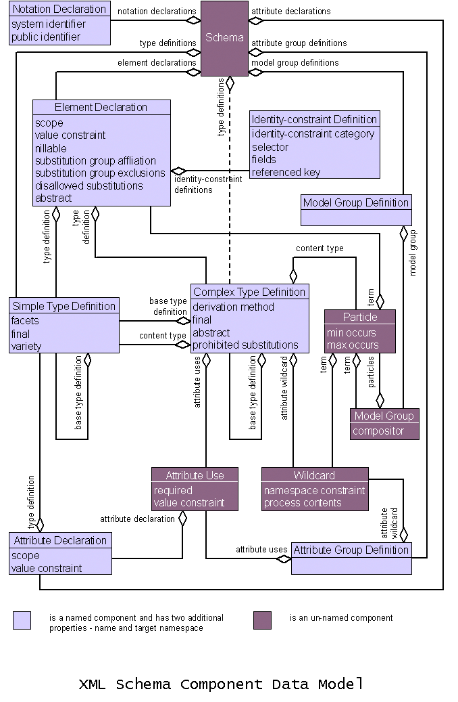

ハローワールド。

SAMLはXMLを利用した認証のための規格です。SAMLではXML Schemaと呼ばれるXMLの構造・内容などを定義する方法でSAMLで利用するXMLを定義します。

SAMLの仕様ではXML Schemaを利用してデータ構造を説明するため、このXML Schema知ることでSAMLへの理解の素早さに繋がります。
ただしXML Schema自体がかなり古い仕様であることもあり、解説する文章も少ないです。ここではSAMLを読むことに特化しXML Schemaの全体的な理解を高めていきます。

# SAMLとXML Schemaの概要

[SAML](http://saml.xml.org/saml-specifications)はOASISと呼ばれる標準化団体により策定されています。最新版は2.0で、2005年3月に策定されています。
認証のための規格であり、特にSSOとして一般的に知られていると思います。

[XML Schema](https://www.w3.org/XML/Schema)はW3Cにより策定されており、1つの入門書と2つの仕様のドキュメントで解説がされています。現在の最新版は第二版で、2004年10月28日に策定されています。
XMLの文章構造を定義するための方法であり、またXSDというファイル形式でプログラム上で生成や検証などを利用することが出来ます。

SAMLの主なXMLの定義は[SAMLの仕様](http://saml.xml.org/saml-specifications)のうち"Core"と呼ばれるものに含まれています。それ以外にも"Metadata"にも記載があったりします。
この記事では、"Core"のうち主に使いそうなXMLを選択して、その中で利用されているものなどを中心にXML Schemaの意味を確認していきます。

# XML Schemaを知る前に

XML Schemaには登場人物が主に3人いると考えていただくとわかりやすいと思います。

- 要素
- 属性
- 要素型

これらのうち、「要素」と「属性」はXMLに直接関係するものです。残りの「要素型」はその名の通り「要素」の「型」となるものです。
XML Schemaではこの「要素型」を継承したりすることで定義でき、「要素型」を「要素」にマッピングすることで、初めて「要素」をXML中で利用できる、というイメージです。XML Schemaはこの「要素型」を作成し、「要素」として名前を与えることを目的とした文章と言っても過言ではないです。

比較的わかりやすい図が [Part1 - Schema Components Diagram (non-normative)](https://www.w3.org/TR/xmlschema-1/#element-sequence) に乗っているため引用します。

下記図のうち`Complex Type Definition` および `Simple Type Definition` が要素型と考えると、要素の定義である `Element Declaration` は要素系と紐付いています（`Identifiy−constraint` というのはありますが、SAMLの定義では出てないと思います）。
一方でXML Schemaの主人公とも呼べる存在は`Complex Type`です。これは`Element`を複数持ったもの（図中では`particle`と名前が付いています）と`Attribute Use`つまり属性などから作成されており、要素型は要素を持ち（必ずではない）、要素もまた）要素型を持っている（これもまた必ずではない）という関係になっています。



# XML Schemaの基本

まずはSAMLの中心的な型として`RequestAbstractType`の定義を見ながらXML Schemaに触れていきます。これは名前に`Abstract`が入っていることからも分かる通り、`Request`の基底になる型です。

```xml
<?xml version="1.0" encoding="UTF-8"?>
<schema
    targetNamespace="urn:oasis:names:tc:SAML:2.0:protocol"
    xmlns="http://www.w3.org/2001/XMLSchema"
    xmlns:samlp="urn:oasis:names:tc:SAML:2.0:protocol"
    xmlns:saml="urn:oasis:names:tc:SAML:2.0:assertion"
    xmlns:ds="http://www.w3.org/2000/09/xmldsig#"
    elementFormDefault="unqualified"
    attributeFormDefault="unqualified"
    blockDefault="substitution"
    version="2.0">
    <import namespace="urn:oasis:names:tc:SAML:2.0:assertion"
        schemaLocation="saml-schema-assertion-2.0.xsd"/>
    <import namespace="http://www.w3.org/2000/09/xmldsig#"
        schemaLocation="http://www.w3.org/TR/2002/REC-xmldsig-core-20020212/xmldsig-core-schema.xsd"/>
    <annotation>
        <documentation>
            Document identifier: saml-schema-protocol-2.0
            Location: http://docs.oasis-open.org/security/saml/v2.0/
            Revision history:
            V1.0 (November, 2002):
              Initial Standard Schema.
            V1.1 (September, 2003):
              Updates within the same V1.0 namespace.
            V2.0 (March, 2005):
              New protocol schema based in a SAML V2.0 namespace.
     </documentation>
    </annotation>
    <complexType name="RequestAbstractType" abstract="true">
        <sequence>
            <element ref="saml:Issuer" minOccurs="0"/>
            <element ref="ds:Signature" minOccurs="0"/>
            <element ref="samlp:Extensions" minOccurs="0"/>
        </sequence>
        <attribute name="ID" type="ID" use="required"/>
        <attribute name="Version" type="string" use="required"/>
        <attribute name="IssueInstant" type="dateTime" use="required"/>
        <attribute name="Destination" type="anyURI" use="optional"/>
    	<attribute name="Consent" type="anyURI" use="optional"/>
    </complexType>
    <!-- 中略 -->
</schema>
```

XML Schema自身もXMLで記載されているため、1行目はXML宣言から始まります。 

```xml
<?xml version="1.0" encoding="UTF-8"?>
```

## schema要素

2行目にある`schema`要素ですが、XML Schemaのルートとなる要素です。[定義](https://www.w3.org/TR/xmlschema-1/#Schemas)があっさりしすぎていてこれを読むだけだと何もわかりません。

いくつかの属性がありますので、必要なものをピックアップしていきます。

### xmlns から始まる属性

`xmlns`から始まる属性がありますが、これはxmlのnamespaceを表すものです。XML SchemaではなくXMLに定義されているものです。XHTMLとか知っているならば、見たことあるかもしれません。

`xmlns`のみの属性は、その名前空間に属する要素をプレフィックス無しで使うことが出来ます。今回では`http://www.w3.org/2001/XMLSchema`が指定されていますが、つまりXML Schemaの要素（`schema`や`import`, `annotation`など）をプレフィックス無しで指定することが出来ます。

:::info
http://www.w3.org/2001/XMLSchema にはXML Schemaの定義が入っていますが、こちらはDTDという形式で書かれています。
XML Schemaは自分自身を自分自身で書けるため、XML Schemaで書いたXML Schemaも https://www.w3.org/TR/xmlschema-1/#normative-schemaSchema に記載されています。
:::

### targetNameSpace

`targetNameSpace`属性は自分自身の名前空間を表すものです。`RequestAbstractType`の名前空間は `urn:oasis:names:tc:SAML:2.0:protocol` ということになります。`xmlns`で`urn:oasis:names:tc:SAML:2.0:protocol`を指定する（または要素を利用する場合に毎回 `<urn:oasis:names:tc:SAML:2.0:protocol:Request>`と書く）ことをすれば利用できるようになります。

### その他の属性

`Version`属性は実に簡素な説明がされています。

>  The other attributes (id and version) are for user convenience, and this specification defines no semantics for them.
> > その他の属性（id、version）はユーザーの利便性のためであり、本仕様ではこれらのセマンティクスを定義していない。

簡単に言えばほぼ意味の無い値です。

その他の属性（`elementForDefault`, `elementFormDefault`, `blockDefault`）についても下記の記載があります。

> The blockDefault, finalDefault, attributeFormDefault, elementFormDefault and targetNamespace attributes are appealed to in the sub-sections above, as they provide global information applicable to many representation/component correspondences. 
> > blockDefault, finalDefault, attributeFormDefault, elementFormDefault 及び targetNamespace 属性は、多くの表現とコンポーネントの対応に適用できるグローバルな情報を提供するため、上記のサブセクション(訳注:他のコンポーネントについての定義)にて説明する。

仕様として読みにくいことこの上ないですね。簡単に言うと、他の要素にこれらの属性は関わってきます。たとえば`elementFormDefault`は`element`要素の`form`という属性のデフォルトの値を設定できます。これらは、名前空間などを適格にするかなどの要素ですが、SAMLのXMLを使う上ではあまり気にする値ではないです。

## import 要素

`import`要素はその名の通り、他のXML Schemaの要素をインポートします。`namespace`にはURIを、`schemaLocation`にはどこにファイルがあるかを指定します。

## annotation 要素

`annotation` 要素はその名の通り注釈です。人間やコンピューターに対して、説明や注釈、その他特記事項を記載するための場所です。小子供には、`doucmentation` 要素と`appinfo`要素を持つことができ、前者が人間用、後者がコンピューター用の情報です。

## complexType 要素

XML Schemaの最も重要な要素の1つ、`complexType`要素です。これはその名の通り複雑な型を表すものであり、XMLの構造を定義する型の1つでもあります。その他には`simpleType`があります。`simpleType`は文字列や数字などに制約を加えるために使わます。一方で`complexType` は子要素や属性などを自由に付け加えることが出来ます。

`name`属性は要素の名前となります。

`abstract`属性は、その名の通り抽象要素かどうかを表します。これがtrueの場合、この要素は継承で利用できるようになります。後に継承方法は解説します。

## sequence要素

`complexType`要素の子供で重要な子供は、属性を表す`attribute`要素と、要素を表す`all`, `choice`, そして`sequence`要素です。
今回出現しているのは `sequence`要素ですね。

`sequence`要素は子供の要素がそれぞれ指定した通りの順番で出現することを想定しています。子供に、実際にどの要素が現れるかを表し、SAMLの場合は基本的に `element`要素を指定します。今回もそうですね。それ以外にも`choice`要素が指定される場合もあります。

## element要素

`element`要素は「どの要素を子供に持つか」表す要素です。

`ref`属性にどの要素かを表すXMLの要素の名前が入ります。

重要なのは `minOccurs`属性です。これは、最低何個の要素が必要化を表すものです。逆に`maxOccurs`属性もあり、これは最大何個まで要素を置けるかを設定できます。
`minOccurs`, `maxOccurs`ともにデフォルトは1で、何も指定しない場合は必ず1つ必要な要素となります。上記の例では0が指定されているため、0個または1個の要素が必要、つまり存在しなくても問題のない要素、という事になっています。

## attribute要素

`attribute`要素は、その名の通り属性に関する定義を表すものです。`element`要素が要素に対する定義なので`attribute`要素が属性に関する定義という関係ですね。

`name`属性および`type`属性は、これもまたその通りです。それぞれ要素の名前と要素の型を表します。

`use`属性も見ただけでわかると思いますが、`required`が指定されれば属性として指定必須となり、`optional`では指定しなくてもよいという意味になります。デフォルトでは `optional`です。その他にも`prohibited`があります（ちゃんと調べてないですが、多分禁止するものです。型を拡張するときに使うのだと思います）。

## どのような要素になるのか

上記のXMLから`complexType`の部分のみを抜き出しました。
下記の要素型を要素として扱う場合、どのような要素になるのか見ていきましょう。と言っても下記の方は継承でしか利用しないのですが、イメージが湧くようにしています。

```xml
<complexType name="RequestAbstractType" abstract="true">
    <sequence>
        <element ref="saml:Issuer" minOccurs="0"/>
        <element ref="ds:Signature" minOccurs="0"/>
        <element ref="samlp:Extensions" minOccurs="0"/>
    </sequence>
    <attribute name="ID" type="ID" use="required"/>
    <attribute name="Version" type="string" use="required"/>
    <attribute name="IssueInstant" type="dateTime" use="required"/>
    <attribute name="Destination" type="anyURI" use="optional"/>
    <attribute name="Consent" type="anyURI" use="optional"/>
</complexType>

<!-- 上記を要素として扱うと -->

<RequestAbstractType
    ID="ID(必須)"
    Version="2.0(必須)"
    IssueInstant="20230226T012345+0900(必須)"
    Destination="https://exmaple.com/saml/sso/login(任意)">
	<saml:Issuer>https://sp.example.com/SAML2(任意)</saml:Issuer>
	<ds:Signature>...署名情報(任意)</ds:Signature>
	<samlp:NameIDPolicy AllowCreate="true" Format="urn:oasis:names:tc:SAML:2.0:nameid-format:transient"/>
</RequestAbstractType>
```

という感じになります。

# 継承して要素を定義する

`RequestAbstractType`というのは、SAMLのRequestに関する素となる要素型となります。
これを継承して、認証のリクエストである`AuthnRequest`の要素を定義していますが、その方法を確認していきましょう。

```xml
<element name="AuthnRequest" type="samlp:AuthnRequestType"/>
<complexType name="AuthnRequestType">
   <complexContent>
       <extension base="samlp:RequestAbstractType">
          <sequence>
             <element ref="saml:Subject" minOccurs="0"/>
             <element ref="samlp:NameIDPolicy" minOccurs="0"/>
             <element ref="saml:Conditions" minOccurs="0"/>
             <element ref="samlp:RequestedAuthnContext" minOccurs="0"/>
             <element ref="samlp:Scoping" minOccurs="0"/>
          </sequence>
          <attribute name="ForceAuthn" type="boolean" use="optional"/>
          <attribute name="IsPassive" type="boolean" use="optional"/>
          <attribute name="ProtocolBinding" type="anyURI" use="optional"/>
          <attribute name="AssertionConsumerServiceIndex" type="unsignedShort"
use="optional"/>
          <attribute name="AssertionConsumerServiceURL" type="anyURI"
use="optional"/>
          <attribute name="AttributeConsumingServiceIndex"
type="unsignedShort" use="optional"/>
          <attribute name="ProviderName" type="string" use="optional"/>
       </extension>
   </complexContent>
</complexType>
```

## schema直下にあるelement要素

`element`要素には大きく2つの存在があります。それが「グローバル」と「ローカル」です。
`schema`要素の直下に存在する場合は「グローバル」として定義されます。正確にはいくつか制限があり、例えば`ref`形式が利用できないなどあります。それ以外の要素は「ローカル」となります。

「グローバル」の`element`要素は、別のスキーマから参照できるため、プログラム的に言えば外部に`export`するためのものです。

例えば`AuthnRequest`では下記の定義がされています。

```xml
<element name="AuthnRequest" type="samlp:AuthnRequestType"/>
```

これは外部に`AuthnRequest`という名前で定義しています。要素の型は`samlp:AuthnRequestType`となりますね。
この定義をすることで、外部で`AuthnRequest`要素を利用することが出来ます。

## complexContent要素とextension要素で型を継承する

`AuthnRequest`は`RequestAbstractType`を継承して型を作成しています。そのためには`complexContent`要素と`extension`要素を利用しています。

`complexContent`要素は特定の`complexType`を「拡張」または「制限」するために利用するための要素です。
子供の要素に`extension`要素を置くと「拡張」（本記事では継承と呼ぶ）ことになり、`restriction`要素を置くと「制限」できます。

`extension`要素は `base` 属性に指定した型に子要素と型を加えます。子要素は既存の型の末尾に追加のみ許されています。ちなみに[将来のバージョンでは様々な拡張方法が追加される](https://www.w3.org/TR/xmlschema-1/#element-complexContent..extension:~:text=Future%20versions%20may%20allow%20more%20kinds%20of%20extension%2C%20requiring%20more%20complex%20transformations%20to%20effect%20casting.)ようですね。楽しみです。

今回は `RequestAbstractType`が`base`要素に指定されているため、[XML-Schemaの基本](#XML-Schemaの基本)で記載した要素を拡張するということですね。

例えば、既存の子要素である `saml:Issuer`・`ds:Signature`・`samlp:Extensions`の3つに加え`saml:Subject`・`samlp:NameIDPolicy`などの5つが追加されます。全て`minOccurs`が0なので存在しなくても問題ないですが、`sequence`で定義されているため、存在する場合は順番はかえてはいけません。

# 文字列を制限する

SAMLでは一部制限する型が出てきます。すでに記載したとおりですが`restriction`要素を使うと「制限」をすることが出来ます。
紹介した時は`complexType`及び`complexContent`要素を利用しましたが、その他にSAMLに登場するパターンを確認してみます。

:::info
SAMLに`complexType`および`complexContent`と`restriction`要素を利用した方法があります。「任意の子要素と特定の属性を持たなければならない」という `SubjectConfirmationDataType`要素型・「任意の子要素を設定できる」`SubjectConfirmationDataType`要素型の「子要素を`ds:KeyInfo`に制限する」という`KeyInfoConfirmationDataType`要素。これらにしか使われていないので、詳しい説明は省きます。
:::

`SimpleType`要素は子要素も属性も存在しない要素型です。子要素が存在しないと言うと意味が分かりづらいですが、文字列を表す型という感じです。

SAMLでは認可に関する状態を表す`AuthzDecisionStatement`という要素があり、その要素の属性に`Decision`属性というのがあります。
この`Decision`属性は`Permit`, `Deny`, `Indenterminate`の3つあります。認可に`Indenterminate`が合って良いのかわからないですが（SAMLは認可フレームワークじゃないんで良いってことだと思います）、この`Decision`の型をどうやって定義するか。このときに`restriction`要素が必要です。

実際の型は下記となっています。
`restriction`の`base`を`string`とし、制限する際には`enumeration`で利用可能な値を定義していきます。

```xml
<simpleType name="DecisionType">
   <restriction base="string">
       <enumeration value="Permit"/>
       <enumeration value="Deny"/>
       <enumeration value="Indeterminate"/>
   </restriction>
</simpleType>
```

# いずれか1つ（以上）

`complexType`要素の登場人物では`sequence`の他に`all`と`choice`があるといいました。

`all`要素は「指定した複数の要素が任意の順番で現れていいよ」ということを設定するものです。これはSAMLの要素に登場しなかったので紹介だけにとどめておきます。

`choice`要素はSAMLの要素の中でも重要な`Assertion`要素でも利用されているので見ていきましょう。

```xml
<element name="Assertion" type="saml:AssertionType"/>
<complexType name="AssertionType">
   <sequence>
       <element ref="saml:Issuer"/>
       <element ref="ds:Signature" minOccurs="0"/>
       <element ref="saml:Subject" minOccurs="0"/>
       <element ref="saml:Conditions" minOccurs="0"/>
       <element ref="saml:Advice" minOccurs="0"/>
       <choice minOccurs="0" maxOccurs="unbounded">
          <element ref="saml:Statement"/>
          <element ref="saml:AuthnStatement"/>
          <element ref="saml:AuthzDecisionStatement"/>
          <element ref="saml:AttributeStatement"/>
       </choice>
   </sequence>
   <attribute name="Version" type="string" use="required"/>
   <attribute name="ID" type="ID" use="required"/>
   <attribute name="IssueInstant" type="dateTime" use="required"/>
</complexType>
```

今までの説明を踏まえると上記の要素及び要素型定義はスラスラ読めると思います。この中で`choice`というものだけを知らないですよね。

`choice`要素は「子要素の任意の1ついずれかを指定個」を表す要素です。つまり今回で言えば`saml:Statement`か`saml:AuthnStatement`か`saml:AuthzDecisionStatement`か`saml:AttributeStatement`のいずれか、ということです。
属性にある`minOccurs`と`maxOccurs`は前述のとおりです。`maxOccurs`に`unbounded`が指定されていますが、これは上限は無いですよ、という意味であるため、今回は4要素いずれかが0以上続きますよ、という意味になります。

例えば下記のような定義いずれも`Assertion`型として定義通りのものとなります。

```xml:任意の子要素1つも存在しない.xml
<Assertion Version="2.0" ID="ID" IssuInstant="20230222T012345+0900">
    <saml:Issuer>...</saml:Issuer>
</Assertion>
```

```xml:Statementが1つxml
<Assertion Version="2.0" ID="ID" IssuInstant="20230222T012345+0900">
    <saml:Issuer>...</saml:Issuer>
    <saml:Statement>...</saml:Statement>
</Assertion>
```

```xml:AuthnStatementが3つxml
<Assertion Version="2.0" ID="ID" IssuInstant="20230222T012345+0900">
    <saml:Issuer>...</saml:Issuer>
    <saml:AuthnStatement>...</saml:AuthnStatement>
    <saml:AuthnStatement>...</saml:AuthnStatement>
    <saml:AuthnStatement>...</saml:AuthnStatement>
</Assertion>
```

違う種類の項目が複数存在するとエラーになるように思いますが、実際にはこれは許可されます。

```xml:StatementとAuthnStatementが1つづつxml
<Assertion Version="2.0" ID="ID" IssuInstant="20230222T012345+0900">
    <saml:Issuer>...</saml:Issuer>
    <saml:Statement>...</saml:AuthnStatement>
    <saml:AuthnStatement>...</saml:AuthnStatement>
</Assertion>
```
