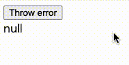
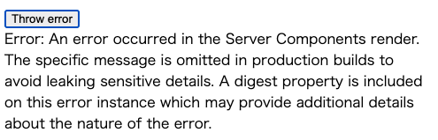
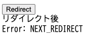

Server Actionにおけるエラーハンドリングについてです。

# 用語と本記事の対象

Next.jsやリリース前のReactではServerActionという名称ですが、現状Reactにおいては[Server Function](https://react.dev/reference/rsc/server-functions)という名称です。`form`の`action`や`useActionState`でServer Actionという命名になる感じですね。

Next.jsでは依然Server Actionという名称ですが、Next.js v13ではServer Actionではないものを[Custom Invocationと呼んでいたようです](https://nextjs.org/docs/13/app/api-reference/functions/server-actions#invocation:~:text=%3Cform%3E.-,Custom%20Invocation,-with%20startTransition%3A%20Invoke)。ですので、1年ほど前の記事ではそういった名称が見られます。

本記事では**formやActionに絡むものはServer Action**、**絡まないものはServer Function**とReactにおける呼称を採用しています。また、かなり**Next.jsに特化した内容**となっています。

# Server Actionでの例外伝播

Next.jsのServer Actionの[Error Handling](https://nextjs.org/docs/app/building-your-application/data-fetching/server-actions-and-mutations#error-handling)では、エラーは`error.js`または`Suspense`境界によってハンドリングされることが記載されています。

Server ActionであればformのactionなりuseActionStateなりに直接指定する形になるのでtry catchでエラーハンドリングを行うのは難しいですが、Server Functionとして扱う場合はtry catchでエラーハンドリングを行うことができます。

例えば下記の定義の場合の挙動を確認します。

```typescript:app/try-catch/action.ts
"use server";

export async  function throwError() {
  throw new Error("This is an error");
}
```


```typescript:app/try-catch/page.tsx
"use client";

import { useState } from "react";
import { throwError } from "./action";

export default function TryCatch() {
  const [error, setError] = useState<unknown | null>(null);
  const actionHandler = async () => {
    try {
      await throwError();
    } catch (error) {
      setError(error);
    }
  }
  return <>
    <button onClick={actionHandler}>Throw error</button>
    <br />
    <span>{String(error)}</span>
  </>
}
```

下記のように問題なくtry catchが動作していることがわかります。



# Next.jsにおける例外をthrowすることによる問題

上記の動作であれば問題なさそうに見えます。しかしながら問題は2点あります。

## 本番ビルドでのエラー情報の削除

上記のコードをプロダクション環境で実行、つまり `npm run build && npm run start` を行って実行する場合どうなるかと言うと、下記のような動作になります。



```
Error: An error occurred in the Server Components render. The specific message is omitted in production builds to avoid leaking sensitive details. A digest property is included on this error instance which may provide additional details about the nature of the error.
> エラー: サーバー コンポーネントのレンダリングでエラーが発生しました。機密情報の漏洩を防ぐため、本番ビルドでは特定のメッセージが省略されます。このエラー インスタンスにはダイジェスト プロパティが含まれており、エラーの性質に関する追加の詳細が提供される場合があります。
```

機密情報などがエラーに含まれている場合を考慮しており、本番ビルドではエラー情報が削除されてしまいます。そのため、エラー情報を取得できません。

## リダイレクトなどの特別な例外

[redirect](https://nextjs.org/docs/app/api-reference/functions/redirect)や[notFound](https://nextjs.org/docs/app/api-reference/functions/not-found)などのNext.jsの関数は、内部的に例外をスローすることで動作を実現しています。例えば下記はredirectの仕様です。

> Invoking the `redirect()` function throws a `NEXT_REDIRECT` error and terminates rendering of the route segment in which it was thrown.
> > `redirect()` 関数を呼び出すと `NEXT_REDIRECT` エラーがスローされ、スローされたルートセグメントの描画が終了します。

Next v15では下記のような実装で `catch` 節の動作が走ってしまいます。わかりやすいように自分自身にリダイレクトしていますが、自分自身にリダイレクトしていなくても発生します。

```typescript:app/redirect/page.tsx
"use client";

import { useState } from "react";
import { redirectAction } from "./action";

export default function Redirect() {
  const [error, setError] = useState<unknown | null>(null);
  const redirectHandler = async () => {
    try {
      await redirectAction();
    } catch (error) {
      setError(error);
    }
  }
  return <>
    <button onClick={redirectHandler}>Redirect</button>
    <br />
    <span>{String(error)}</span>
  </>
}
```

```typescript:app/redirect/action.ts
"use server";

import { redirect } from "next/navigation";

export async function redirectAction() {
  redirect("/redirect");
}
```

ボタンを押してみると下記のようになります。



エラーの表示部分が `NEXT_REDIRECT` エラーとなっているため、 `catch` 節が動作していることがわかります。また、リダイレクト後という表示からも分かる通り、リダイレクト自体は問題なく行われています。こちらはNext.js v14ではcatch節を通らないようになっているのですが、Next.js v15でcatch節を通るような動作になっています。
[Issue](https://github.com/vercel/next.js/issues/74258)こそ立っていましたが、バグかと言われたらバグだし、想定通りと言われれば想定通りですし...。redirectがエラーを吐く動作になっているので、いずれにせよcatch節が動作することを想定しておいた方がよいでしょう。

# Result型による対応

上記の理由から、Server Actionでtry catchを行うのは辞めたほうが良いでしょう。特にNext.jsにおいては。

ですので、一般的にResult/Either型と呼ばれるものを返すようにするとよいでしょう。例えば下記のような定義です。別にResult型である必要は無いのですが、エラーを表すために例外をthrowをしないほうが良いでしょう。

```typescript:app/result/action.ts
"use server";

export async  function returnError() {
  return { type: "error", error: "This is an error" };
}
```

ちなみにError型はシリアライズできないのでreturnでは返せないようです。ので、文字列なりオブジェクトなりでエラー情報を返すようにしましょう。
