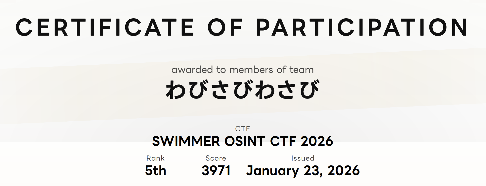
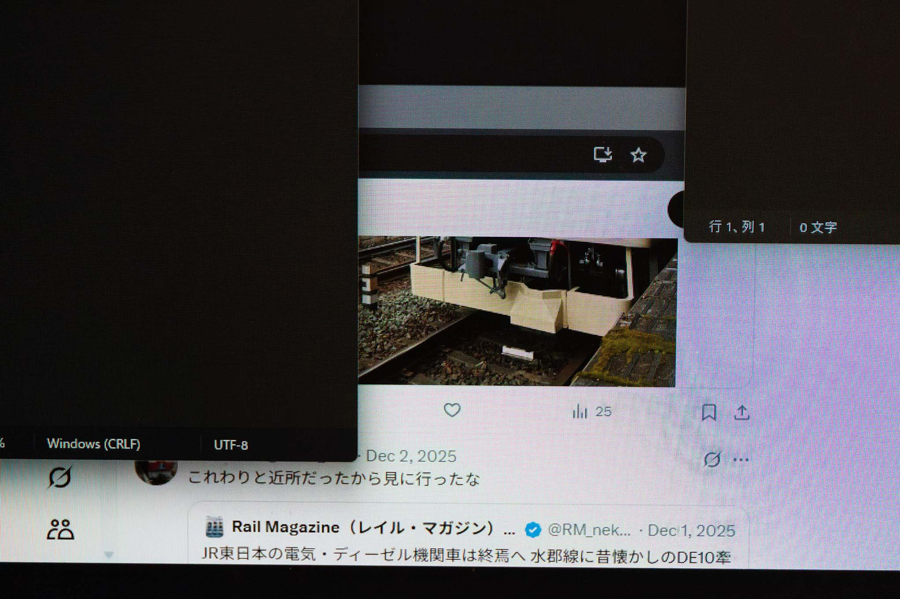
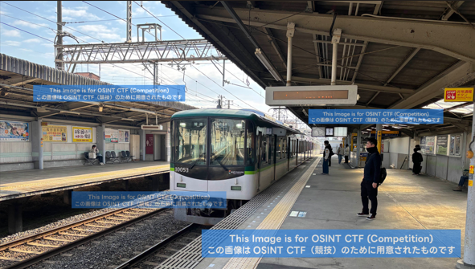
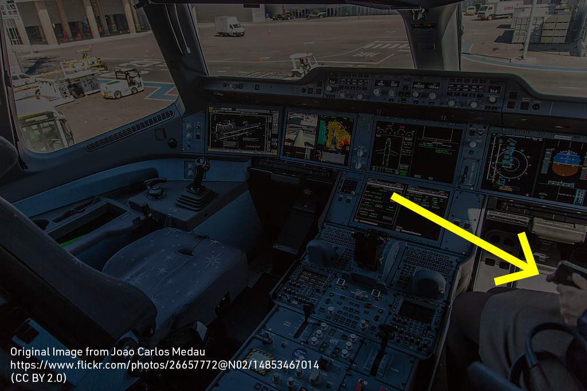
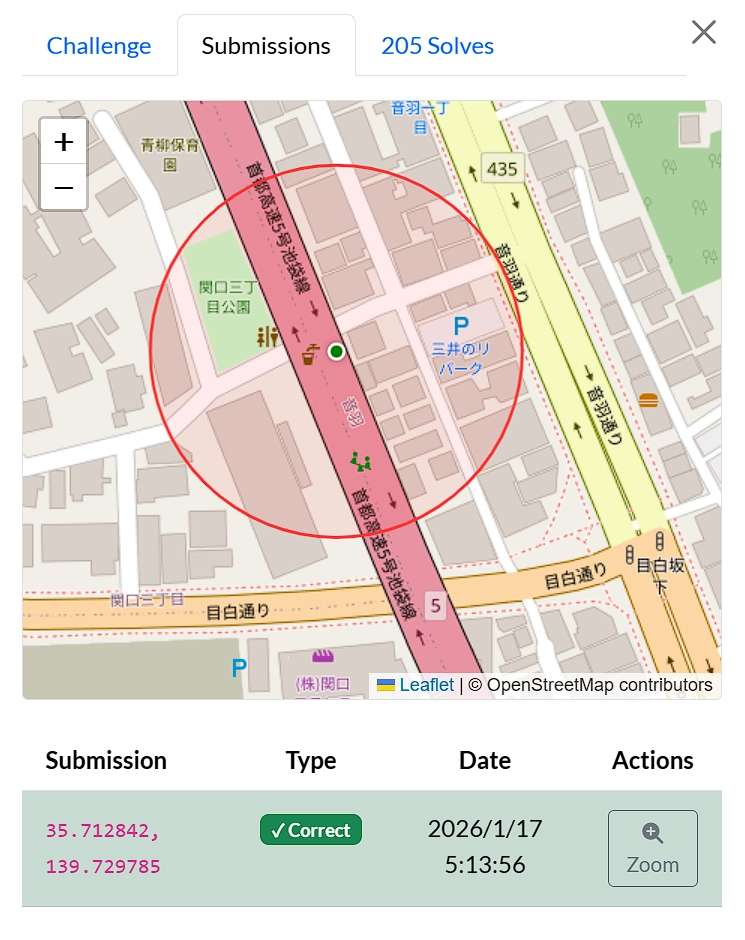
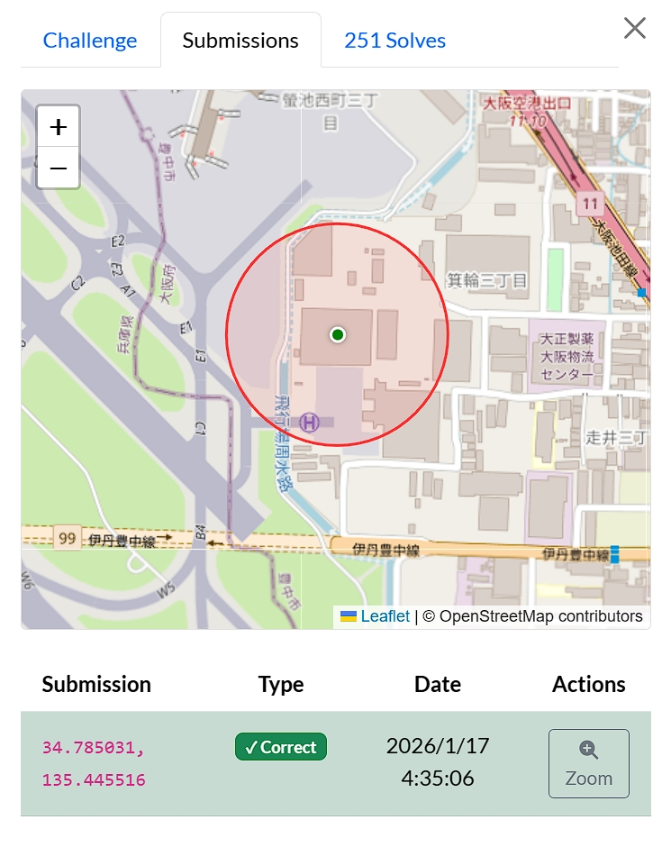
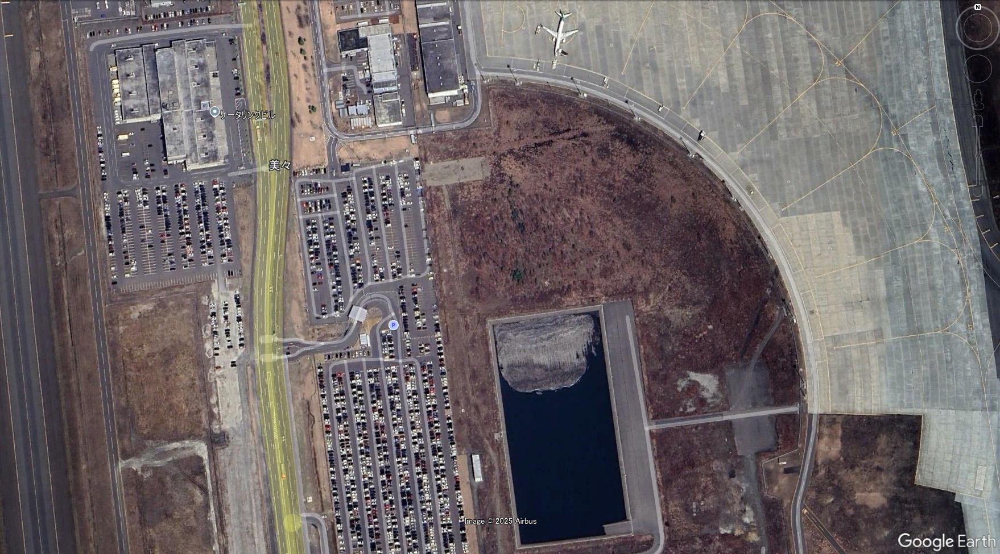
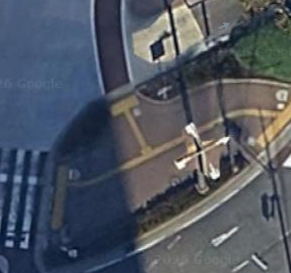
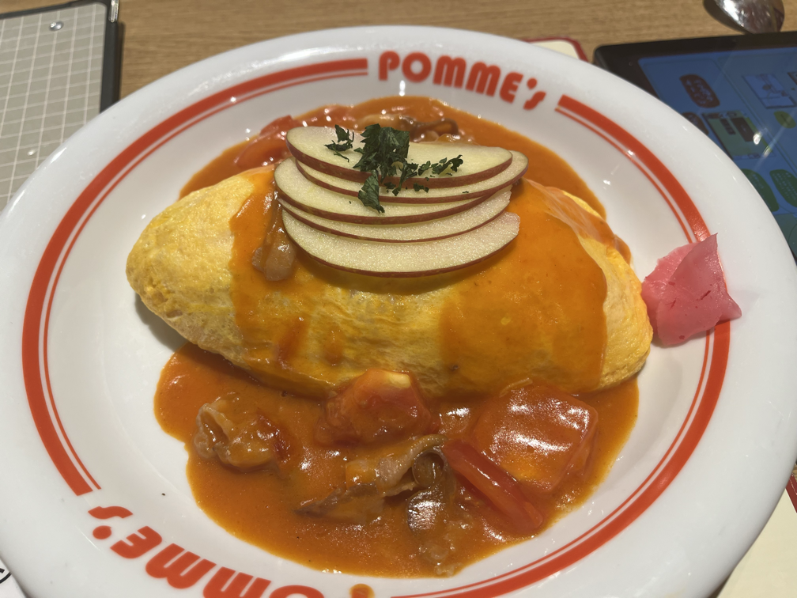

2026/01/17に開催された[SWIMMER OSINT CTF](https://swimmer.diverctf.org/)に参加しました。

体験記とチームメンバーの紹介です。大体のCTFはエンジニアが多いですが、今回はストーリー・OSINT特化ということもあり、様々なメンバーが集まりました。
そういった事情もありWriteupは私が代表して投稿しています。各Writeupは回答者に書いていただきました。

# SWIMMER OSINT CTFについて

2026/01/17（土）12:10（JST）- 01/18（日）00:10（JST）に開催されたCTFです。

OSINTと名が付く通り、Open Source Intelligenceに特化したCTFです。今回は広い目で見れば全部OSINTです。そのため通常のCTFにあるようなCryptoとかWebとかはないです。
[Diver OSINT CTF](https://diverctf.org/) という高難易度CTFの制作陣が作成した、初心者向けOSINT CTFです。

下記のティザーにもある通り、Story形式のCTFです。Storyが強くCTFに関わっているわけではないですが、3人の登場人物について調査をしていく形式のCTFとなっています。それ以外にもシンプルなOSINT問題もあります。

<iframe width="560" height="315" src="https://www.youtube.com/embed/ME_ck_hxkYQ?si=hQRP7-YNUn0eXFtu" title="YouTube video player" frameborder="0" allow="accelerometer; autoplay; clipboard-write; encrypted-media; gyroscope; picture-in-picture; web-share" referrerpolicy="strict-origin-when-cross-origin" allowfullscreen></iframe>

# チーム成績

- チーム名：「**わびさびわさび**」
- 最終成績： 5位 / 687チーム中



我々は[第四境界](https://www.daiyonkyokai.net/)というARGを主とするクリエイター集団、および第四境界のコンテンツの1つである高難易度検索謎Ds試験のファンメイド作品である[DTF(DsTestFanmade)](https://dstest.fans/)[^dtf]の愛好家たちが集まったチームです。実際は18人集まって、チーム制限が6人なので3チームに分割されました。

[^dtf]: 奇しくもCTFと1字違いですが、何の関係もありません。

ARGとOSINTは親和性が一定あるものの、全員がOSINT CTF未経験者の中で、5位という好成績を収めることができました。

## チームメンバー

- るみぃ
- たこすけ
- ヨズ
- ほるるん。
- テッカニン
- とっぷら

# Writeup

## tgt_rain

### rain_01_social (easy)

回答者： とっぷら

#### 問題文

```
rain は2026年時点でXのアカウントを所持していたようです。
我々は、この人物の投稿のスクリーンショットを入手しました。

スクリーンショットからアカウントを特定し、このアカウントのID（スクリーンネーム）を解答してください。

例えば、@gov_online が対象のアカウントの場合、Flag は SWIMMER{@gov_online} となります。
```



#### 回答

[見切れている投稿](https://x.com/RM_nekopub/status/1995356215803879641)を探し、そこから引用（ポストのエンゲージメントを表示 -> 引用）から投稿を探し、時間や内容から下記のアカウントが見つかった。
https://x.com/bruto_rain

フラグ： `SWIMMER{bruto_rain}`

### rain_02_region (medium)

回答者： ほるるん。

#### 問題文
```
rain は自身のブログに趣味の投稿を行っていたようです。 
投稿に用いられている写真のほとんどがこの人物の撮影したものではないフェイクのようですが、
1枚だけ、実際にこの人物が撮影したと考えられる写真が存在します。 
その写真を特定し、撮影地を地図上で解答してください。
```

#### 回答
前問で見つけた[rainのアカウント](https://x.com/bruto_rain)を見ると[ブログ](https://brutorain.wordpress.com/)自体は普通に隠すことなくリンクが置いてありました。
さて問題はここからです。どうやらブログには写真が計15枚もありますのでここからフェイクではない写真を探していきましょう。
使える武器はとことん使っていこうということで私の回答した問題ではバンバンgemini proを使っていきます。（せっかく有料版持ってるからね）
初めにわたしととっぷらさんが小牛田駅の写真がAIっぽくないと考え回答するも不正解になったので、次に素材なら広告の部分は写さないだろうしAI生成なら実在する広告は映り込まないと考えkeihan-2という名前の画像が怪しいと踏みましたがこちらは駅名が映り込んでいないため探していきます。

ちょうどyoutubeに[京阪線の走っている様子を電車内から撮り続けている動画](https://youtu.be/seTzXMCYtUk?si=vR-Yc4KUjh-DDORH)を発見したためチームメンバーが怪しいと考えた駅をローラーしたところ階段と非常ベルの位置関係とトイレの位置が一致した星ヶ丘駅が答えと考え提出したところ正解となりました。

フラグ：地図上で星ヶ丘駅にピンを立てる


### rain_03_source1 (medium)

回答者： るみぃ

#### 問題文

```
rain は、目を引くタイトルの記事を書くことで閲覧数が多くなると考えたようです。
この人物はこれをきっかけとして偽情報の作成・流布にのめり込んでしまったと考えられます。

この人物が一番最初に投稿した偽記事では、ある画像に全く関係ないキャプションが付けられています。 本来の出典を探し、この画像がどこの市区町村にまつわる資料に掲載されたものか解答してください。
都道府県名を含む必要はありません。
例えば、平塚市 の資料に掲載されていた場合、Flagは SWIMMER{平塚市} となります。
```

#### 回答

他の問題をあらかた片付けた後、ヒントに従って「工事中の濾過池其一」でGoogle検索したらAI概要が一発でやってくれました。後ほどチームメイトで試しても誰も出せませんでした。偶然です。


フラグ： `SWIMMER{豊橋市}`


### rain_04_source2 (easy)

回答者： とっぷら

#### 問題文

```
rain が2番目に作成した偽記事には、「rainが未公開の情報を見つけた」ということが書かれているようです。しかし、これは虚偽だと思われます。
この人物の嘘を暴くには、正確な出典を探す必要があります。

この画像の出典となる古い書籍は電子化されており、詳細が参照できるはずです。
その資料のデジタルオブジェクト識別子（DOI）を解答してください。
例えば、答えが 12.34567/890123 の場合、Flagは SWIMMER{12.34567/890123} となります。
```

#### 回答

下記のページについて。
https://brutorain.wordpress.com/2025/12/21/%e8%aa%b0%e3%82%82%e7%9f%a5%e3%82%89%e3%81%aa%e3%81%84%e7%9c%9f%e5%ae%9f%e3%82%92%e7%99%ba%e8%a6%8b/

画像検索すると、[議院建築意匠設計競技図集](https://ndlsearch.ndl.go.jp/books/R100000039-I967480#bib) という本が見つかり、その中にそれっぽい画像もあるので回答。

フラグ： `SWIMMER{10.11501/967480}`

### rain_05_date (medium)

回答者： とっぷら

#### 問題文

```
rain は2025年12月25日 (JST)、ある場所に来たことをX上で投稿しています。
しかし、この画像は2025年の別の日に撮影された写真のようで、事実とは異なるようです。 この写真が本当に撮影された日を YYYY/MM/DD の形式で解答してください。
ただし、撮影日は日本時間（JST）を基準とします。 例えば、答えが2025年6月8日の場合、Flagは SWIMMER{2025/06/08} となります。
```

#### 回答

下記の投稿に関して。

https://x.com/bruto_rain/status/2004085702469075019?s=20

奥の建物に書かれている文字から、ここから大阪城ホールであることがわかります。

奥の看板の上のロゴや右側にあるイベント掲示板などの情報がわかれば答えになりそうですが、読み取れそうもなく。
仕方なく、なんか関係者用ページに飛んでくれと思って、奥の看板で読める文字を付けて「大阪城ホールご招待報道受付南事務所口」と検索したら [サントリー1万人の第九](https://ja.wikipedia.org/wiki/%E3%82%B5%E3%83%B3%E3%83%88%E3%83%AA%E3%83%BC1%E4%B8%87%E4%BA%BA%E3%81%AE%E7%AC%AC%E4%B9%9D)というWikipediaにヒットしました。

このイベントについて調べて見ると[サントリー1万人の第九ホームページ](https://www.suntory.co.jp/culture-sports/daiku/)のページに表示されるロゴが奥の看板の上と同じっぽく見えます。
あとはサントリー1万人の第九の2025年の開催日を調べればOKです。12月の第一日曜日らしいです。

フラグ： `SWIMMER{2025/12/07}`

### rain_06_ai (hard)

回答者： テッカニン

#### 問題文

```
rain のブログには、東京駅の画像があります。しかし、これは実際に撮影したものではなく、AIで作成された画像のようです。
この画像が何というツールで作成されたのか特定し、解答してください。
例えば、答えが Adobe Firefly の場合、Flagは SWIMMER{Adobe Firefly} となります。
```

#### 回答

「画像生成AI確認」などで検索すると、生成AI画像にはメタデータが含まれていることがあるということがわかりました。

そこから、「画像生成AIメタデータ」で検索をすると、次のようなメタデータを確認する方法を記載した[サイト](https://signyamo.blog/meta-data_check/)を見つけました。

その方法を使って、ブログに載っている東京駅の画像を解析すると、メタデータ内に**dreamina**という文言が見つかりました。実際に「dreamina」で検索してみると、そのような画像生成AIがあることが確認できました。

フラグ： `SWIMMER{Dreamina}`

## tgt_debeyohiru

### debeyohiru_01_social (medium)

回答者： ほるるん。

#### 問題文
```
調査対象の人物はソフトウェアエンジニアで、2026年以降には debeyohiru というIDでの活動が確認されています。
この人物がこのIDでの活動を開始したのは2026年1月のようです。この人物がこれ以前に使用していたIDを特定できないでしょうか？

2026年1月時点で、noteというサービスに古いIDのアカウントが残存しているようです。
このアカウントのIDを解答してください。

例えば、digital_jpn_gc が対象のアカウントの場合、 Flag は SWIMMER{digital_jpn_gc} となります。
```

#### 回答
debeyohiruで検索したら一発で[ミスキーのアカウント](https://bsky.app/profile/debeyohiru.bsky.social)が出てきたので調べていたら投稿していたnoteのスクショに[URL](https://note.com/furaigo5/all)が映り込んでいたのでアクセス、noteのアカウントIDはURLの中に含まれているらしいので該当部分を抜き出して見事正解。
このくらいなら私でも昼ご飯食べながらでもできます。

フラグ：`SWIMMER{furaigo5}`


### debeyohiru_02_profile (easy)

回答者： とっぷら

#### 問題文

```
debeyohiru は2026年1月時点で求職中で、プロフィールページをウェブ上に公開していたようです。
このページを探り出し、そのURLを解答してください。

例えば、 https://example.com/foobar が対象のページの場合、 Flagは SWIMMER{https://example.com/foobar} となります
```

#### 回答

rainの問題が完全に停滞していたので、ちょっと息抜きにほるるんさんがやっていた続きをやっていました。

[WhatsMyName](https://whatsmyname.app/)で `debeyohiru` と01で出てきた `furaigo5` を入れて検索して、GitHubのアカウントが見つかりました。

https://github.com/furaigo5

GitHubページにプロファイルのリンクが載っています。

フラグ： `SWIMMER{https://furaigo5.github.io/profile/}`


### debeyohiru_03_email (easy)

回答者： とっぷら

#### 問題文

```
debeyohiru が2026年現在、普段使っているメールアドレスが知りたいです。
この人物が現在使用中とおぼしきメールアドレスを探り出し、解答してください。

例えば、メールアドレスがfoobar@example.comの場合、Flagは SWIMMER{foobar@example.com} となります。
警告: このアドレスに対してメールを送信してはなりません。解答に際して、メールを送る必要は一切ありません。
```

#### 回答

上記で取得した[プロフィールサイト](https://furaigo5.github.io/profile/)の下部に書いてある。この問題を解いている時間の中で、本当か？ という疑心暗鬼の時間が一番の割合を占めていました。

フラグ： `SWIMMER{furaigo5.onionsoup@gmail.com}`


### debeyohiru_04_meal (medium)

回答者： たこすけ

#### 問題文
```
debeyohiru はある料理が好物で、よく食べているようです。 直近では2026年1月10日の夕食にその料理を食べたことが確認されています。 この人物がこの日の夕食に食べたメニューを特定し、店舗のメニューに記載された名前で解答してください。
例えば、マクドナルドでビッグマックを食べたことが特定できた場合、Flagは SWIMMER{ビッグマック} になります。 メニュー名の表記は店舗のメニューの 日本語 表記に準拠してください。
```

#### 回答
VRC、エンジニアなどなど…分からない分野・ワードが並ぶ中、唯一理解できそうな「ポムの樹」を発見したため着手。

見つかっているBlueskyアカウントの投稿
https://bsky.app/profile/debeyohiru.bsky.social/post/3mazue5yqdc2n
へのリプライから2026年1月10日の夕食にはポムの樹のオムライスを食べたことが判明しました。上記投稿のものと同じメニューを食べたのだと思い、メニューを調べSWIMMER{特製デミソースのダブルチーズオムライス}と回答するも通らず。

Blueskyの投稿や個人サイトから渋谷周辺を中心に行動していることが分かったので「店舗限定メニューか？」と店舗限定メニューやメニューの改定などを調べるもめぼしい情報がない...。

ヒントの「投稿だけでなく、その日に投稿された写真がどこかにあるかもしれません」から「口コミか！！」とgmailを[epios](https://epieos.com/)に突っ込むも成果なし。

頭を抱えていたところで、VRCゾーンを抜けたヨズさんが合流。投稿されていた画像のスプーンの反射、照明などの内装から「ポムの樹　渋谷スペイン坂店」であることを特定してくれました。

しかし、画像と同じものを食べたのだと信じて疑わず、タイムロス...。
最終的に「ポムの樹　渋谷スペイン坂店　口コミ」と検索し、口コミを見たところ「ふらいご」による書き込みを発見！添付されていた画像をgoogle rensで検索にかけ、「豚肉とリンゴのホタテトマトクリームオムライス」であることを特定しました。

フラグ： `SWIMMER{豚肉とリンゴのホタテトマトクリームオムライス}`

### debeyohiru_05_hidden1 (medium)

回答者： とっぷら

#### 問題文

```
debeyohiru の本名が知りたいです。
この人物の実名と考えられるものを解答してください。 ローマ字（アルファベット）表記で入力してください。漢字の表記を考慮する必要はありません。

例えば、Sanae Takaichiが実名の場合、Flagは SWIMMER{Sanae Takaichi} となります。
```

#### 回答

ops_swimmerを除くと、最後から2番目に残っていた問題です。

正直debeyohiruの問題はBlueskyのアカウントとGitHub、プロフィールページしか見つかっていません。そのためそれ以外のアカウントを見つけるべきかなど色々探していませしたが見つからず。

でしばらくチームメンバーみんなで頭を悩ませていたところ、天啓。「JavaScriptとcssみてねぇな」と。
親のツールより叩いたCtrl+Shift+Iで管理者ツールを開き、[スクリプト](https://furaigo5.github.io/profile/js/script.js)を見ると、ビンゴ、名前が書いてあります。「gitあるんだからいらねぇだろ」というエンジニアジョークはチームメンバーに伝わりませんでした。

フラグ： `SWIMMER{Gotanno Tsubasa}`

### debeyohiru_06_hidden2 (medium)

回答者： ほるるん。

#### 問題文
```
debeyohiru が 2025年12月 時点で使用していたと考えられるスマートフォンの機種が知りたいです。
なお、複数の端末を使用していたと考えられる場合は、アンダーバー（_）で繋いで全てを解答してください。この場合、回答順序は問いません。
また、メーカー名は不要です。

例えば、Xperia 10 VIIとiPhone 17を使用していた場合、 Flagは SWIMMER{Xperia 10 VII_iPhone 17} となります。
```
#### 回答
ヒントより「現時点のプロフィールページに記載があるものは誤っているかもしれません。
昔のプロフィールページの内容を閲覧する方法はないでしょうか？」とあったので魚拓を探せばいいのは分かっていました。
この問題は自分は途中合流だったのですが、この時点でgitやinternet archiveなどで過去のサイトが閲覧できずチームメンバーたちが悩んでいる状態でした。
geminiに情報を投げたところチームメンバーも把握していないarchive.todayという魚拓サイトを挙げてきたため、URLを入力してみると[過去のページ](https://archive.md/ORR6S)が出てきたためそこからガジェットの欄のデバイスを回答して無事正解です。

フラグ： `SWIMMER{Pixel 8 Pro_iPhone 13 mini}`

## tgt_lilica

### lilica_01_social (easy)

回答者： るみぃ

#### 問題文

```
lilica は2026年時点でクリエイターとして活動しており、「黄昏ブロッサムリリカ」と名乗っていたことが分かっています。 また、Xのアカウントを持っていたことが確認されています。

そのXアカウントのID（スクリーンネーム）を解答してください。
例えば、@gov_online が対象のアカウントの場合、Flag は SWIMMER{@gov_online} となります。
```

#### 回答

Googleで「黄昏ブロッサムリリカ」で検索しました。特筆すべきことはないと思います。

フラグ： `SWIMMER{@twilight_lilica}`

### lilica_02_virtual_identity (easy)

回答者： ほるるん。

#### 問題文
```
lilica はVRにも関心があるようで、未来でもVR関連の活動がわずかながら確認されています。
lilica が2026年時点で使っていたVRChatのユーザーIDを特定し、解答してください。

VRChatのユーザー情報はブラウザからも確認できます。
例えば、対象アカウントのURLが https://vrchat.com/home/user/usr_xxxxxxxx-xxxx-xxxx-xxxx-xxxxxxxxxxxx の場合、 
Flagは SWIMMER{usr_xxxxxxxx-xxxx-xxxx-xxxx-xxxxxxxxxxxx} となります。
```
#### 回答

VRCのホームページにログインして検索欄に「黄昏ブロッサムリリカ」と入力すると[黄昏ブロッサムリリカ](https://vrchat.com/home/user/usr_b103fac6-8341-4b89-a606-920092e75e43)というアカウントが見つかります。
これにて正解です。
このチームにはVRChaterが二人もいるので余裕ですね。

本来はそうなるはずだったのですが、このチームのVRChater二人ともVRCのユーザーネームに日本語を使えることを完全に忘れており一時間以上迷走を続けました。どのように迷走をしていたかというと、まずメアドのtwilightblossomlilicaを調べるもヒットせず、NAGISAでの写真にネームタグの一部が映り込んでおり名前の末尾を4と仮定し、使えそうな情報を片っ端からgeminiに投げていたところ投稿されていたfbxのメタデータに本名らしき文字列shiharu_nanaogiを発見し、これらの文字列と4を加えたいろいろなパターンをローラーしました。
さらにVRCでの自撮りの写真も投稿されていたため使用されているアバターが[ビアナ](https://sephir.booth.pm/items/5694887)と判明し本来のアバターにない髪飾りを付けていることを確認。ロゴがビアナの製作元であるエルフの森静岡支部のものだと判明しましたが市販されていない模様でしたのでもしかしたら制作陣か関係者と予想しました。調べていたもう一人が製作者のyoutubeアカウントを見つけたので確認したところ投稿されていたのは作業動画が一本だけ、しかも作業動画の割には40分程度と短く再生回数も二ケタだったためもしかしたらこのために公開されほかの選手しか見てないためではと考えその動画をすべて見たりもしました。

手掛かりになりそうな情報はかなり出ているにも関わらず2問目が解けないのはなぜだと思っていたところでふとチームメンバーが黄昏ブロッサムリリカと検索し無事正解しました。

こうやって文字にしてみるととてつもない迷走ぶりで笑っちゃいますね。
VRChaterが一番水を得たswimmerになれたはずの次の問題を解きにいけなかった上にチームの筆頭の時間を奪う形になってしまったのがあまりにも痛い..。

フラグ： `SWIMMER{usr_b103fac6-8341-4b89-a606-920092e75e43}`

### lilica_03_virtual_world (easy)

回答者： るみぃ

#### 問題文

```
lilica はVRChatでの活動をSNSに投稿していたようです。
2025年11月9日（日本時間）に投稿された画像にはある「ワールド」が写っているようです。このワールドのIDを解答してください。
VRChatのワールド情報はブラウザからも確認できます。
例えば、対象のワールドのURLが https://vrchat.com/home/world/wrld_xxxxxxxx-xxxx-xxxx-xxxx-xxxxxxxxxxxx/info だった場合、
Flagは SWIMMER{wrld_xxxxxxxx-xxxx-xxxx-xxxx-xxxxxxxxxxxx} となります。
```

#### 回答

2025/11/09の[ポスト](https://x.com/twilight_lilica/status/1987359447111639464)の画像をGoogleで検索して、この[紹介サイト](https://vrchat-fbt.com/nagisa/)に辿り着きました。ワールドのリンク≒flagが載っていたので嬉しいですね。

フラグ： `SWIMMER{wrld_1b94e327-036b-4d09-81be-e898d71f02cb}`


### lilica_04_domain (easy)

回答者： るみぃ

#### 問題文

```
lilica は個人のWebサイトを運営していたようです。
このWebサイトのドメイン名が取得された日付が知りたいです。YYYY/MM/DD の形式で解答してください。
例えば、2026年1月2日 がドメイン取得日の場合、Flagは SWIMMER{2026/01/02} となります。
```

#### 回答

2025/12/13の[ポスト](https://x.com/twilight_lilica/status/1999551960341496014)から個人サイトのURLを取得。チームメイトから事前に共有されていた[ツール](https://inteltechniques.com/data/osintbook11/tools/Domain.html)で検索しました。どれを使えばいいのかはわからないのでなんとなくいけそうなものをクリックしていきました。私はこの[サイト](https://dmns.app/twilight-lilica.com/whois-registrar)を使いました。執筆段階で一番上のWhoisで行けることがわかり、とても悔しいです。

フラグ： `SWIMMER{2025/10/05}`

### lilica_05_hosting (medium)

回答者： とっぷら

#### 問題文

```
lilica が運営している個人サイトは、あるホスティングサービス上に存在しています。
このサイトは規約違反を行っているわけではないので何かできるわけではありませんが…… 念の為、連絡先を知っておきたいです。
このホスティングサービスの規約違反通報メールアドレスを解答してください。
例えば、メールアドレスが foobar@example.com の場合、Flagは SWIMMER{foobar@example.com} となります。

警告 : このアドレスに対してメールを送信してはなりません。 解答に際して、メールを送る必要は一切ありません。
```

#### 回答

rainもdebeyohiruも残りの問題が分からなかったので、何かhostingがうんたらかんたらとチームメイトがうなっていたのもあり、エンジニアの出番だと意気込んできました。

まさに人生という進研ゼミでやったところです。ドメインからIPを探し、該当のIPを管理している会社を探せばなんとかなりそうです。

まずはわかっている個人サイトのドメインからIPを探します。

```bash
$ dig twilight-lilica.com +noall +answer

; <<>> DiG 9.10.6 <<>> twilight-lilica.com +noall +answer
;; global options: +cmd
twilight-lilica.com.	3598	IN	A	45.77.129.141
```

IP Infoを利用して[45.77.129.141](https://ipinfo.io/45.77.129.141?lookup_source=search-bar) について調べてみると、Vultr Holdings, LLCというのが出てきます。調べてみるとVPSを提供している会社っぽいので良さそうです。

ホームページを調べてみると [Legal](https://www.vultr.com/legal/tos/) ページにそれっぽいメールアドレスがあるので回答。

フラグ： `SWIMMER{abuse@vultr.com}`


### lilica_06_name (hard)

回答者： ほるるん。

#### 問題文
```
hard
lilica の本名が知りたいです。
この人物の実名と考えられるものを解答してください。
ローマ字（アルファベット）表記で入力してください。漢字の表記を考慮する必要はありません。

例えば、Sanae Takaichi が実名の場合、Flagは SWIMMER{Sanae Takaichi} となります。
```
#### 回答
二面目で迷走していた時に本名を見つけていたのでそのまま回答しました。

フラグ： `SWIMMER{Shiharu Nanaogi}`

### lilica_07_work (medium)

回答者： ヨズ

#### 問題文

```
lilica は、Xとは別のSNSにもアカウントを所持しているようです。
このアカウントの情報から職場の最寄り駅として推定されるものを、東京メトロの駅名 で解答してください。
例えば、推定される職場の最寄り駅が 新宿三丁目駅 の場合、Flagは SWIMMER{新宿三丁目} となります。
```

これまでの調査では匿名性のあるアカウントを回ってnameを特定したことから、ここでいう別のSNSアカウントとはリアル用アカウントではないかと目星をつけ、第一に思い浮かぶInstagramにてlilica_06_nameで得られた文字列を探索。結果無事に[lilicaのリアルアカウント](https://www.instagram.com/nanaogi_shiharu?igsh=YjJ2NXdmNTB1Y2Fz)がヒットしました。

このアカウントは投稿に共通のハッシュタグをつけているようです。これをFlagとし、無事突破となります。単品で苦戦するものではありませんでしたが、一連のリアルアカウント特定、大変みのリアル経験でした。

#### 回答

フラグ： `SWIMMER{中目黒}`

## research_2025

### cx (easy)

回答者： テッカニン

#### 問題文

```
2025年春、かつて香港に存在していた空港の100周年を記念して、特別なフライトが実施されたようです。
このフライトの便名を解答してください。
例えば、便名が JL2026 のとき、Flag は SWIMMER{JL2026} となります。
```

#### 回答

問題文内の文言である「2025春香港100周年」で検索をすると啓徳空港が100周年を迎えることがわかった。

「啓徳空港100周年」で検索すると、次のような[ニュース記事](https://www.traicy.com/posts/20250329333965/)が見つかりました。その中に、便名も書いてありました。

フラグ： `SWIMMER{CX8100}`

### pilot (easy)

回答者： テッカニン

#### 問題文

```
cx の問題で示されたフライト中、添付画像の席に座っていた人物の名前を英語で解答してください。
（なお、添付画像は座席を示すためのものであり、当該フライトの実際の写真ではありません）
例えば、人物の名前が John Doe のとき、Flag は SWIMMER{John Doe} となります。
```




#### 回答

「CX8100便パイロット」で検索すると、このような[サイト](https://cisalumniconnect.org/geoffrey-lui-95-aviation-cathay-pacific-and-kai-tak-tribute-flight-cx8100/)をAIが引用してきました。

このサイトにフライトに関する動画が載っており、パイロットの名前も紹介されてました。

フラグ： `SWIMMER{Adrian Scott}`

### flag_on_the_don (easy)

回答者： テッカニン

#### 問題文

```
2025年8月28日、群馬県で「太鼓の達人」を利用したイベントが開催されました。
その会場となった建物はどこでしょうか。 OpenStreetMapのウェイ（way）番号で解答してください 。
例えば、建物が 123456789 というway番号であれば、Flagは SWIMMER{123456789} となります。
```

#### 回答

「群馬県太鼓の達人2025年8月28日」で検索すると[渋川市の資料のpdf](https://www.city.shibukawa.lg.jp/manage/contents/upload/68870b94eeb0d.pdf)がでてきました。その中に、**渋川市民会館**でシニア向けのeスポーツイベントが行われたことと、その中で太鼓の達人が使われていたことがわかりました。

あとは、渋川市民会館の座標をOpenStreetMapで検索するとway番号がわかりました。

ちなみに、SWIMMER OSINT CTFのために、いくつかのwrite upを見ていたのですが、そこでOpenStreetMapの内容が出てきたため、検索方法には困りませんでした。やったぜ！

フラグ： `SWIMMER{628293186}`

### obsolete (easy)

回答者： テッカニン

#### 問題文

```
2025年11月、「台湾有事」を巡って日中関係が悪化しました。
その中で、在日本中国大使館のSNSアカウントは国連憲章の「敵国条項」について言及する投稿を行いました。
これに対し、日本の外務省は「その条項は 1995年の国連決議 によって死文化（obsolete）している」と反論したことが報じられています。

さて、この決議において、投票を 棄権 した国がいくつかあります。それはどこの国か、解答してください。
決議に関する公式記録に記載されている国名をアンダーバー (_) で区切ったもの（順不同）をFlagとします。

たとえば、UNITED STATES（アメリカ合衆国）とRUSSIAN FEDERATION（ロシア連邦）と記載されていた場合、Flagは SWIMMER{UNITED STATES_RUSSIAN FEDERATION} となります。
```

#### 回答

「1995年の国連決議」で検索すると、[外務省の文章](https://www.mofa.go.jp/mofaj/gaiko/un_kaikaku/j_yusen.html)がでてきました。その中で1995年の国連決議が**国連総会決議50/52**と紹介されていました。

「国連総会決議50/52」で検索すると、国連総会決議50/52に関する[ウィキソース](https://ja.wikisource.org/wiki/%E5%9B%BD%E9%9A%9B%E9%80%A3%E5%90%88%E7%B7%8F%E4%BC%9A%E6%B1%BA%E8%AD%B050/52)がでてきました。さらに、そのサイトの中で[国連の文書へのリンク](https://docs.un.org/en/A/RES/50/52)がありました。

しかし、文書内には投票内容が書かれてなく、どの国が棄権したかがわかりませんでした。そして、詰まりました。一応、この条項に関する[wikipedia](https://ja.wikipedia.org/wiki/%E6%95%B5%E5%9B%BD%E6%9D%A1%E9%A0%85)も確認したところ、棄権が3票で北朝鮮、キューバ、リビアがやったこともわかりましたが、公式表記がわからず、答えられませんでした。悲しい..。

ここで、Copilotに聞いたところ、[国連のサイト](https://digitallibrary.un.org/?ln=en)で文書検索してみてはとの助言を得たので、先ほど見つけた国連の文書内に書いてある**A/RES/50/52**で検索すると、先ほどの文書意外に[別の文書](https://digitallibrary.un.org/record/284118?ln=en)が検索に引っ掛かりました。この文書内でAと書かれているのが棄権した国でした。

フラグ： `SWIMMER{CUBA_DEMOCRATIC PEOPLE'S REPUBLIC OF KOREA_LIBYAN ARAB JAMAHIRIYA}`

### truck (easy)

回答者： テッカニン

#### 問題文

```
あるトラックが 8773X3XQ+JWQ を2025年6月21日 13:39:54（現地時間）ごろに通過しました。このトラックの車体に書かれていたFQDNを解答してください。
たとえば、www.google.com の場合、Flagは SWIMMER{www.google.com} となります。
```

#### 回答

google mapで「8773X3XQ+JWQ」を検索すると、**サウスグレッグソンストリート**という名前の道を指していました。

「サウスグレッグソンストリート トラック」で検索すると、AIが、ここは缶切り橋と言われており、トラックの事故がよく起こる場所であること、この場所での[事故をまとめたサイト](https://11foot8.com/)があることを引用してきました。

2025年6月21日の事故を調べると、この[動画](https://youtu.be/MJ4tpEhQ86g?si=2fVXEq2CE7OQX6lS)が見つかりました。この動画に出ているトラックにFQDNが書かれていました。

フラグ： `SWIMMER{www.MiracleMoversUSA.com}`

### debris (medium)

回答者： るみぃ

#### 問題文

```
2025年12月8日、日本のあるテレビ番組で、高速道路のパトロール隊への密着取材の様子が放映されました。
パトロール隊の108号車は、路上に落下していたトン袋の回収を命じられました。トン袋が最初に落下していた地点はどこでしょうか？
マップ上で示して解答してください。

content warning : 交通事故の映像が含まれる映像を視聴する必要があります（人が巻き込まれるシーンはありません）。
```

#### 回答

「2025年12月8日高速道路パトロール」で検索して該当の番組と思われる[動画](https://www.youtube.com/watch?v=xo_2KZ3n668)を発見。見逃しが怖いので2倍速で頭から丁寧に視聴したところ、9:33から該当部分が始まりました。Google mapを開きながら情報を精査します。管制員の発言(10:03)から**上りの護国寺合流先 音羽**、トン袋を視認する直前のカット(10:25)から**非常駐車帯と左カーブの間**であることがわかります。決定打となったのは10:51の動画左側に見える建物の **FUK???** の文字でした。これから**株式会社フクイン 音羽工場第3ビル**だとわかったので、この隣の緯度経度をGoogle mapから取得しました。



### lattice_tower (medium)

回答者： テッカニン

#### 問題文

```
medium
2025年12月、日本で地震が発生し、ある通信施設の鉄塔が被害を受けました。
主要ニュースで報じられた名称以外に、このビルには通信施設としての別の公式な名前があるようです。
その正式名称を日本語で解答してください。

ただし、解答にアルファベットや数字が含まれている場合はそのまま答えてください（ただし、 半角英数字 にしてください）。
また、そのビルを保有している会社名は含まず、ビル名だけがFlagになります。

例えば、「SWIMMER OSINT CTF株式会社　台場SWIMMER2026ビル」だった場合、Flagは SWIMMER{台場SWIMMER2026ビル} となります。
```

#### 回答

「2025 12地震鉄塔」で検索すると、次のような[ニュース記事](https://xtech.nikkei.com/atcl/nxt/column/18/00154/02650/)が見つかりました。この記事で被害を受けたビルが**NTT青森八戸ビル**ということがわかりました。しかし、問題でも書いてあるように、主要ニュースで報じられた名称以外正式名称があるので、これは答えではありません。

「NTT青森八戸ビル」で検索すると、google mapで**八戸電話交換所**という名前が見つかりました。しかし、これも回答ではありませんでした。

さらに、「八戸電話交換所」で検索すると、[個人ブログ](http://blog.livedoor.jp/shinano_dsl/archives/52141814.html)が見つかりました。ここで、施設の名前が**八戸NW3棟局**と紹介されてました。

フラグ： `SWIMMER{八戸NW3棟局}`

### paint (medium)

回答者： るみぃ

#### 問題文

```
添付画像に写っている航空機は、ある映画にちなんだ特別塗装機です。
この特別塗装機は、2017年3月21日に就航開始しましたが、2025年に引退が発表され、去る2026年1月9日、この塗装での最後の運航を終了しました。

さて、2017年にこの特別塗装が行われた建物はどこでしょうか。座標を地図上で示してください。
```


#### 回答

画像検索で**C-3PO ANA JET**であることを確認。2017年3月21日に就航開始とあるので余裕をもって2016/01/01-2017/12/31の期間で「C-3PO ANA JET塗装どこ」でGoogle検索し、この[ニュース記事](https://dot.asahi.com/articles/-/96708?device=smartphone&page=1#:~:text=%E3%80%8CC%2D3PO%20ANA%20JET%E3%80%8D%E3%81%AE%E6%A9%9F%E4%BD%93%E3%81%AF%E6%97%A2%E5%AD%98%E3%81%AE,%E6%A0%BC%E7%B4%8D%E5%BA%AB%E3%81%A7%E5%A1%97%E8%A3%85%E3%81%95%E3%82%8C%E3%81%9F%E3%80%82)
から答えが大阪・伊丹空港のANA格納庫であることがわかりました。




### satellite_imagery (medium)

回答者： るみぃ

#### 問題文

```
この衛星画像が取得（撮影）された日はいつでしょうか？ YYYY/MM/DD 形式で解答してください。
例えば2026年1月17日の場合、Flagは SWIMMER{2026/01/17} となります。
```




#### 回答

画像左上の**ケータリングビル**、**美々**の文字から千歳空港の衛星画像であることがすぐわかりました。Google earthの画像であることも画像下部からわかるのでGoogle earthで「新千歳空港」を検索。撮影日を確認して回答を得ました。

フラグ： `SWIMMER{2025/04/18}`

### rage (hard)

回答者： るみぃ

#### 問題文

```
2025年7月、メキシコシティでは住宅価格の高騰を理由とするデモが起きました。
以下の記事URLから確認できる報道写真で破壊されている店舗がオープンした日時を、 YYYY/MM/DD （現地時間）の形式で解答してください。
例えば、答えが2025年7月5日の場合、Flagは SWIMMER{2025/07/05} となります。
```

記事 / Article: https://www.jiji.com/jc/article?k=2025070500264&g=int&p=20250705at46S&rel=pv

#### 回答

記事の写真から特徴的な猫の看板を画像検索してRIPNDIPという店舗だとわかりました。[RIPNDIPの公式サイト](https://www.ripndipclothing.com/pages/stores)からメキシコの店舗がメキシコシティにしかないことを確認して、「ripndipメキシコ オープン」で検索すると開店当日にInstagramでこの[投稿](https://www.instagram.com/p/Cc9PJtqNgKV/)をしていることがわかる。投稿日時を見ると2022年4月30日。私は現地時間かどうか不安になったので「ripndip mexico open april」で再度検索すると、[Facebookの投稿](https://www.facebook.com/RIPNDIP/videos/ripndip-cdmx/725664698853841/)が引っ掛かり、確信に至りました。

フラグ： `SWIMMER{2022/04/29}`

## ops_swimmer

全ての問題を回答すると、最終問題として新たなカテゴリが増えました。いざ。

### ops_swimmer (hard)

回答者： とっぷら

#### 問題文

```
2025年のある日、rain, debeyohiru, lilica が初めて3人で集まったようです。 この日以降、この集団は活動を徐々に活発化させました。
それはいつ・どこだったのでしょうか？
以下の情報を教えてください。

日付（YYYY/MM/DD 形式）
集合時刻（HHmm 形式。日本時間で24時間表記）
場所（チェーン店名と店舗名）
例えば、2025年の10月1日の20時00分（日本時間）に、マクドナルド 新宿西口店で集合している場合、 Flagは SWIMMER{2025/10/01_2000_マクドナルド新宿西口店} となります。

店舗名は 公式サイト の日本語表記に準拠します。ただし、スペース ( ) が含まれている場合、それを省いてください。
```

#### 回答

rainも、debeyohiruも、lilicaも全部めっちゃ悩んだということもあり、ここにたどり着くまでに様々な情報がわかっていました。

debeyohiruに関してはgmailがわかっていたので、 [epios](https://epieos.com/)を利用して [Googleカレンダー](https://calendar.google.com/calendar/u/0/embed?src=furaigo5.onionsoup@gmail.com) を特定できていました。そこには12/30の18:30に店の前に集合する、という予定だけありました。
また、オムライスを特定したときに判明した別の口コミによるとおそらくそのあたりでエクセシオールカフェ渋谷サクラステージ店にいたこともわかっています。

このタイミングで我々は4位タイ、高順位に目が眩んで、早とちりをしてしまいました。
まずは `SWIMMER{2025/12/30_1830_エクセシオールカフェ渋谷サクラステージ店}` で誤り。

続いて、そういえば、[rainのXにデニーズってあったな](https://x.com/bruto_rain/status/2007384438939021503?s=20)、ということを思い出し、渋谷のデニーズを探すことにしました。rainのほうは画像検索で調べましたが、 [黄昏ブロッサムリリカさんのほうの投稿](https://x.com/twilight_lilica/status/2007451888996724926?s=20)にガッツリ名前が書いてありました。

渋谷にはデニーズが2つありますが、片っぽは店が丸すぎるということで画像にそぐわなくて、 `SWIMMER{2025/12/30_1830_デニーズ渋谷公園通り店}`  で回答...が、ダメッ！

ここで、そういえば[rainのXに「品川区」って文字があったな](https://x.com/bruto_rain/status/2005982246499742052?s=20)と思い出します。第四境界で鍛えられたARGによる観察眼の賜物です。
品川区は広くとも、デニーズは2店舗しかないことがわかります。ここまで3回（実は入力ミスで4回）誤っているので精査をしようということで、写真の位置を探します。品川港南店は2022年に潰れて（マクドナルドに変わったらしい）大手町駅前店とthinkpark店の二択です。GoogleMapを眺めていると、下記の特徴的な歩道がXの画像と一致します。エウレカ！大手町駅であることが決定的です。



ちなみに、[次の投稿に「大手町」という切符の写真](https://x.com/bruto_rain/status/2006604801514057878?s=20)があると言われました。第四境界でもう少し観察眼を鍛えようと思います。

全ての問題を解いた後の最終問題ということもあり、6人全員が1つのFlagに向かって、自分の持っている情報や新たな角度から話が飛び交い、そしてたどり着いた答え。

フラグ： `SWIMMER{2025/12/30_1830_デニーズ大井町駅前店}`

SWIMMER OSINT CTF、完泳です。

# 感想

## るみぃ
OSINTに限らずCTFという形式は初めてでしたが、第四境界様をはじめとした様々な検索必須コンテンツの経験が活き、なんとか戦いきることができました。とてもたのしかったです。チーム分けの日、前述のDTFをともに解いたチームのリーダーにより「るみぃさんは強いよ！！」とハードルを上げられました。ぴえん。しかし私が何問も解けたのは事実。チームに十分貢献できたと言っても過言ではないでしょう。検索ちょっとできて良かった。また機会があれば何卒よろしくお願いします。最後に主催の方々、そして一緒に謎に取り組んだ皆々様に感謝します。**ありがとうございました。**

## たこすけ
OSINT CTFのOの字も知らないような初参加の初心者でした。今回開催していただいたSWIMMERは「OSINT」ジャンルに特化したハッキング要素がほとんどないもの、ということで「第四境界などARGを嗜んできた自分なら少しは活躍できるのではないか？」という舐め腐った気持ちで挑んでいましたが、その気持ちは開始10分も経たず打ち砕かれることとなりました。とても強力な面々が集まったチームだったため、貢献できるか不安でしたが、1問でも解くことができたので良かったです。オムライス！サイコー！
　そして唯一解けた際の手の震えと高揚感は忘れられないものとなりました。また機会があったら参加したいね。
　こんな貴重な機会も、誘っていただいたみーさんをはじめとした緑鯖の皆さま、主催陣の皆さま、そしてわびさびわさびのみんなのおかげです！本当にありがとうございました！

## ヨズ

呑気に昼食を食べていたら、チームの長所...いや完全にるみぃさんとテッカニンさんのおかげで事実上チュートリアル（※1）(※2)をスキップでき、ストーリーラインのものに専念できました。とはいっても、F12を押しても画像ファイルを見つけることくらいしかしたこともない身。取り組んだ問題の半分は全く手がつけられないものでした。戦略とっぷらさんやほるるんさんが道を示してくれたおかげで突破できた問題は数知れません。VRC、アカウントもっておきながらあのザマ(※3)してしまったのはほんとうに自らの検索能力の低さを呪いました。

さて、僕は当初「コードも読めないし検索もダメ。ならば画像編集でがんばるしかない」と考えておりました。この懸念は確かに的中しましたが、同時に期待も果たせたことを本当に幸運に思います(※4)。

僕がSWIMMERとして辛くも甘くもよい体験をできたのは、ここに誘っていただいたみーさんや主催陣のryo-aさんはじめ多くの交錯員(※5)の仲間、そしてこのメンバーに恵まれたことです。感謝の念は死後強まるばかり。

(※1)んなわけはない。
(※2)これを手早く解きほかの問題も解いていたお二人はバケモンである。
(※3)lilica_02_virtual_identity参照。
(※4)debeyohiru_04_meal参照。既に目星のついていたものの検算としての店舗特定。難易度調整とたこすけさんありがとうほんと
うに。
(※5)第四境界ファンの呼称。

## ほるるん

どうもこんにちはほるるんです。今回OSINT CTFというものに初めて参加しましたが、とても楽しかったです。しかもなんといっても総合五位！最終問題で5チームほど同じ点数で並んでいたあたりからもう脳みそがちょっと危ない量のドーパミンを出していました。
とはいっても私はほとんどgeminiとおしゃべりしてただけなのでチームメンバーの活躍が著しかったです。
それでも解いていて無理だろと叫びたくなるような問題はすくなかったのでARG出身は意外とOSINT CTFの世界でも戦えるのかもしれないと感じました。
もしかしたら次回のこれを読んでいるあなたとは次回のダイバーで戦うことになるかもしれません。

## テッカニン

初めて、OSINT CTFというものに触れましたが、とても楽しかったです。Ds試験やDTFなどの検索謎の経験が生かせたと思ってます。そして、チームの皆さんが強かったおかげで、意外にもすらすらとくことができ、12時間かかるものだと思っていましたが、以外にも早く終わりました。本当にありがたかったです。今回の大会を通して、もし別のOSINT CTFに参加できるなら、参加したいと思いました。その時に向けて、練習に励みたいと思います。

## とっぷら

DTFのライバルであるチーム緑、チームふりちゃ2同盟、チームマグロ解体ショー、テッカニンさんとチームを組むんで参戦しました。大抵のRPGのライバルは味方になると弱くなりますが、ライバルがライバルのまま味方になったようで、楽しかったです。

一応プログラマーということで、技術的な部分の知識を使う部分で活躍できたところもあると思います。が、今見るとeasyばっかり解いています。次があるなら、今回で言う `research_2025` のようなthe OSINT CTF問題を自力で回答していきたいです。

通常のCTFは経験したことがあるので、24時いっぱいまでやるつもりだったのが、17時に終わってしまいました。手持ち無沙汰だったので、当日渋谷スペイン坂店まで行って、豚肉とリンゴのホタテトマトクリームオムライスを食べてきました。



美味しかったです。次は特製デミソースダブルチーズオムライスを食べに行きます。
