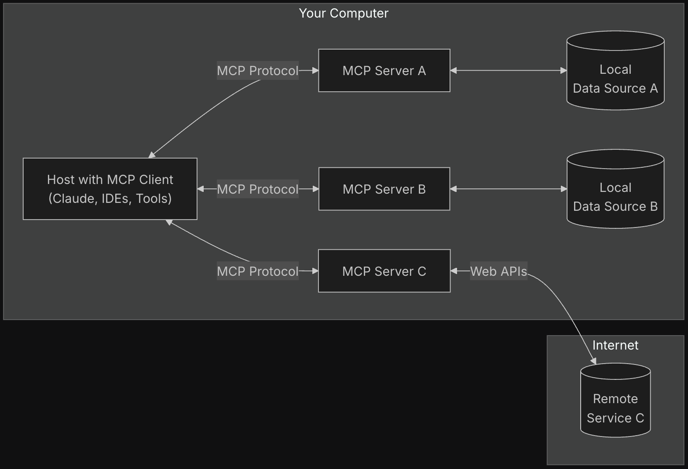
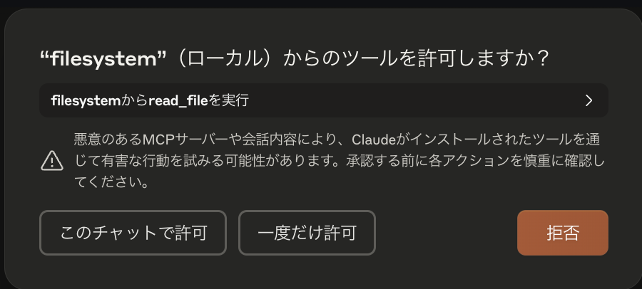
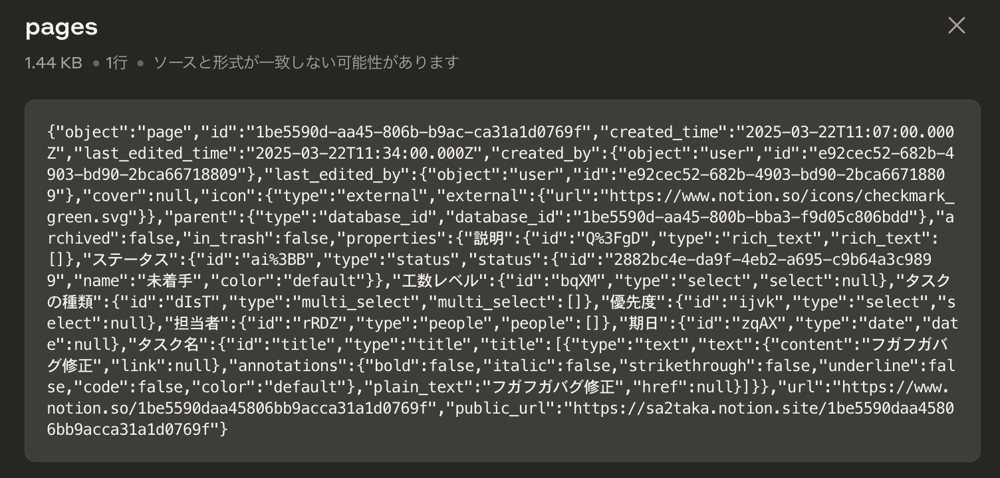
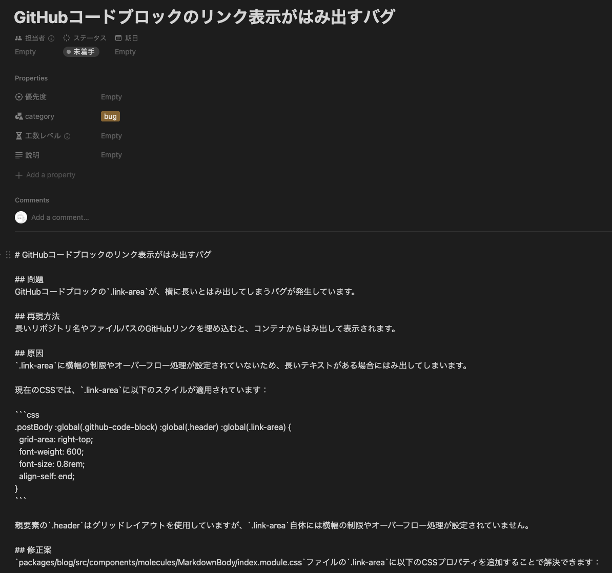

Model Context Protocol（MCP）はClaudeで有名なAnthropicにより[2024年11月26日にオープンソース化され発表されました](https://www.anthropic.com/news/model-context-protocol)。

発表からもう既に4か月経ち多くの情報が出ていますが、私自身はまだMCPを利用したことがありません。
一方で、私は個人的に今年度に書くコードの50%はAIに書かせることを目標としています。その中でも[Cline](https://github.com/cline/cline)（[Roo Code](https://github.com/RooVetGit/Roo-Code)）を主に活用していることもあり、MCPを触らないことにはトップギアには入らないと感じているため、少し遅いですがMCPに入門しようと考えています。

とはいえど、MCPは単に利用するにはあまりむずかしく概念です。現場はまだ新たな仕組みでしか無く、加えてまだまだデファクトスタンダードとは言えないプロトコルです。数多くの実装がありますが、自分で実装し・自分でコードを読み安全性を把握できる力はまだまだ重要だと思い、本記事では一定実用的なMCP Serverの実装を行い理解を深めようと考えています。

# MCPとMCP Server

[MCP](https://modelcontextprotocol.io/introduction)は下記の説明がされています。

> MCP is an open protocol that standardizes how applications provide context to LLMs. Think of MCP like a USB-C port for AI applications. Just as USB-C provides a standardized way to connect your devices to various peripherals and accessories, MCP provides a standardized way to connect AI models to different data sources and tools.
> > MCPはLLMにアプリケーションコンテキストを与える標準化されたオープンなプロトコルです。AIアプリケーションにおけるUSC Type Cと言えるでしょう。USB Type Cが様々なデバイスに接続できる用に、MCPもまたAIモデルと様々なデータソースやツールにアクセスする方法を標準化します。

つまり、AIが他のソースからデータを取得し他のツールを操作するための方法を提供します。何らかの方法でアクセス・操作さえできれば、Google Driveからデータを取得したり、[Browser Use](https://browser-use.com/)のようにブラウザを操作も可能になります。

MCP自体は非常にシンプルなアーキテクチャをしています。[introduction](https://modelcontextprotocol.io/introduction)から引用した下記画像がMCPのアーキテクチャを表しています。



登場人物はシンプルで

> - **MCP ホスト**: Claude Desktop、IDE、または MCP を介してデータにアクセスする AI ツールなどのプログラム
> - **MCP クライアント**: サーバーとの 1:1 接続を維持するプロトコル クライアント
> - **MCP サーバー**: 標準化されたモデル コンテキスト プロトコルを通じて特定の機能を公開する軽量プログラム
> - **ローカル データ ソース**: MCP サーバーが安全にアクセスできるコンピューターのファイル、データベース、サービス
> - **リモートサービス**: MCP サーバーが接続できるインターネット経由 (API 経由など) で利用可能な外部システム

となっています。

ClineなどであればMCP Clientを実装することもあるでしょうが、基本的に利用者側はツールと1:1で作成する必要のある**MCP Server**の方を重視することとなります。公式や該当サービスが作成したもの、もしくはコミュニティが作成したMCP Serverをインストールするか、もしくは自作します。

関係ないけど、正直MCP ServerというよりはMCP Adapterという名前の方が実情にはあっている気がする。

## MCPの5つの機能

MCPには大きく分けて現時点で5つ、実質3つの機能があります。

- Resources
- Prompts
- Tools
- Sampling
- Roots

[Example Clients](https://modelcontextprotocol.io/clients)にてどの機能がどのクライアントで利用できるかがまとめられています。現状はResource, Prompt, Toolsの3種類のみが対応されている（1つだけSamplingが部分対応としているだけの）状態です。

[Resources](https://modelcontextprotocol.io/docs/concepts/resources)は名前の通りリソースを表すものです。例えばローカルファイルやGoogle Driveのリソース一覧、GitHubのIssueやPRなんかもリソースとして定義できるかもしれません。

[Prompts](https://modelcontextprotocol.io/docs/concepts/prompts)は言ってしまえば定義済みプロンプトです。しかしながら、下記のことができると記載されています。

> - 動的引数を受け入れる
> - リソースからのコンテキストを含める
> - 複数のインタラクションを連鎖させる
> - 特定のワークフローをガイドする
> - UI 要素としての表面（スラッシュ コマンドなど）

特に動的引数を受け入れる点が重要で、引数によってプロンプトを書き換えることができるわけです。

MCPにおいて基本的に最も利用されるであろうものが[Tools](https://modelcontextprotocol.io/docs/concepts/tools)です。Toolsは圧倒的な汎用性があり、言ってしまえば何でもできてしまいます。
例えば公式のMCP Server実装である[GitHub](https://github.com/modelcontextprotocol/servers/tree/main/src/github)はIssueの取得（`list_issues`）などもResourcesではなくToolsにて提供しています。

ResourcesおよびPromptsは主に人向けであるのに対し（正確にはResourcesなんかはクライアント側が適宜決める場合もあると記載があります。Roo Codeなんかはどうやらその動きっぽい）、Toolsは適宜AIがどのToolを利用するかを判断し選択するものであるため、自ずとToolsに集約するのだと思います。

# MCP Serverを使ってみる

作りたいのはやまやまなのですが、そもそもMCP Serverを使ってもいないのに作るには流石に想像力が足りないので、どんなものかを試してみます。

MCPの[servers](https://github.com/modelcontextprotocol/servers)リポジトリでは様々なサーバー実装が載っています。この中で公式実装である、[Filesystem](https://github.com/modelcontextprotocol/servers/tree/main/src/filesystem)と[Fetch](https://github.com/modelcontextprotocol/servers/tree/main/src/fetch)を使ってみます。[Everything](https://github.com/modelcontextprotocol/servers/tree/main/src/everything)というResource, Prompts, Tools全部試せるやつがありますが、流石にちょっと味気ないかなと思い。

Claude DesktopにてMCPサーバーを有効化し、下記にて設定します。とはいえど、READMEに従ってJSONを修正するだけ。fetchは[uv](https://docs.astral.sh/uv/)が必要だったので、そちらのインストールは別途行っています。また、uvxのパスが通らなかったのでフルパスを設定しています。Dockerで提供している場合が多い理由がなんとなく分かりました。

```json:cline_mcp_settings.json
{
  "mcpServers": {
    "filesystem": {
      "command": "npx",
      "args": [
        "-y",
        "@modelcontextprotocol/server-filesystem",
        "/path/to/next-blog/_data/_posts"
      ]
    },
    "fetch": {
      "command": "/Users/sa2taka/.local/bin/uvx",
      "args": [
        "mcp-server-fetch"
      ]
    }
  }
}
```

filesystemの方は[本ブログの記事](https://github.com/sa2taka/next-blog/blob/main/_data/_posts)を指しています。

下記の命令文を実行してみます。

```
understanding-mcp-server-through-build-notion-integration.md を確認し、URLを抜き出してください。その後、URLを1つ選択し、アクセスして要約してください。
```

下記のような確認ダイアログが表示されます。



実行するとファイルを読み取って、fetchを実行して、最終的に要約までしてくれました。すごい、便利。実際に返ってきた文言が下記です。MCPのレスポンスの部分は長いので省いています（〜からの結果を表示と記載されているのが該当）。

```
まず、指定されたファイルを確認し、含まれているURLを抜き出します。

> filesystemのread_fileからの結果を表示（ローカル）

申し訳ありませんが、指定されたファイル「understanding-mcp-server-through-build-notion-integration.md」にアクセスできませんでした。アクセス許可のあるディレクトリを確認してみましょう。

> filesystemのlist_allowed_directoriesからの結果を表示（ローカル）

許可されているディレクトリは /Users/sa2taka/Documents/projects/next-blog/_data/_posts のみのようです。このディレクトリ内のファイルを確認してみましょう。f

> filesystemのlist_directoryからの結果を表示（ローカル） 

ディレクトリ内に「understanding-mcp-server-through-build-notion-integration.md」ファイルが見つかりました。それでは内容を確認してURLを抜き出します。

> filesystemのread_fileからの結果を表示（ローカル）

指定されたファイルから以下のURLを抽出しました： 

https://www.anthropic.com/news/model-context-protocol
https://github.com/cline/cline
https://github.com/RooVetGit/Roo-Code
https://modelcontextprotocol.io/introduction
https://browser-use.com/
https://modelcontextprotocol.io/clients
https://modelcontextprotocol.io/docs/concepts/resources
https://modelcontextprotocol.io/docs/concepts/prompts
https://modelcontextprotocol.io/docs/concepts/tools
https://github.com/modelcontextprotocol/servers
https://github.com/modelcontextprotocol/servers/tree/main/src/github
https://github.com/modelcontextprotocol/servers/tree/main/src/filesystem
https://github.com/modelcontextprotocol/servers/tree/main/src/fetch
https://github.com/modelcontextprotocol/servers/tree/main/src/everything
https://docs.astral.sh/uv/
https://github.com/sa2taka/next-blog/blob/main/_data/_posts

それでは、これらのURLの中からメインのトピックであるModel Context Protocol（MCP）の公式説明ページである「https://modelcontextprotocol.io/introduction」にアクセスして内容を要約します。

> fetchのfetchからの結果を表示（ローカル）

# Model Context Protocol (MCP) の概要
MCPは、アプリケーションがLLM（大規模言語モデル）にコンテキストを提供する方法を標準化するオープンプロトコルです。AI応用におけるUSB-Cポートのような役割を果たし、AIモデルと様々なデータソースやツールを標準化された方法で接続します。

## MCPの主な特徴

1. クライアント-サーバーアーキテクチャ

- MCPホスト: Claude Desktop、IDE、AIツールなどのプログラム
- MCPクライアント: サーバーとの1:1接続を維持するプロトコルクライアント
- MCPサーバー: 特定の機能を公開する軽量プログラム
- ローカルデータソース: MCPサーバーがアクセスできるファイル、データベース、サービス
- リモートサービス: API経由でアクセス可能な外部システム


2. 主な利点

- LLM上にエージェントや複雑なワークフローを構築するのに役立つ
- 事前構築された統合のリストが拡大中で、LLMを直接接続可能
- LLMプロバイダーやベンダー間の切り替えの柔軟性
- インフラストラクチャ内でのデータ保護のベストプラクティス


3. サポートと開発

- GitHub上でのバグ報告や機能リクエスト
- MCP仕様に関する議論やQ&A
- オープンソースコンポーネントに関する組織的な議論
- Claude.appとclaude.aiのMCP統合に関するサポート


MCPは基本的に、AIモデルにさまざまなデータソースやツールへのアクセスを提供する標準化されたインターフェースを確立することで、AI開発をより柔軟かつ安全にすることを目指しています。これにより、開発者はLLMの能力を拡張し、より複雑なアプリケーションやワークフローを構築することが可能になります。
```

ちなみにfilesystemsはREADMEにはResourcesと記載がありますが、実際にはResourcesの提供はないようですね。

MCP Serverを使ってみるとただJSONを追加するだけで色々できそうですね。先程も記載したように[servers](https://github.com/modelcontextprotocol/servers)のREADME.mdにはMCP公式だけではなくシステム側の公式、またはコミュニティベースのMCP Server実装があります。システム側が公式に対応しているものだけでもBox, Cloudflareなどもあります。コミュニティベースではありつつ、[【Cursor】FigmaにアクセスしてUIコードを自動生成！](https://zenn.dev/oke331/articles/97d5de75f06fb3)という記事でFigmaを元にデザインのコードを生成する記事なども話題となっていたと思います。
ただ、本記事の目的は使うだけではなく作る、です。

# MCP Serverを作ってみる

というわけで今回はNotionのMCP Serverを作成し、理解度を高めていきます。何故Notionなのかというと、Notionはコミュニティベースでは[コミュニティベースでは](https://github.com/suekou/mcp-notion-server)[2つほどMCPがありますが](https://github.com/v-3/notion-server)、公式では出ていませんしおそらくNotion AI等を利用している関係で対応する可能性も薄いでしょう。また、Notion APIは便利かと言われるとお世辞では便利と言えるぐらいのもので（正直Notion APIをちゃんと使ったことがあるわけではないが）、自分好みにカスタマイズする余地がある可能性もあるということで選択しました。実用性もありますしね。

今回の目的は、Roo Code上でタスクを作成・タスクの編集・Notion上のタスクを読み取り実装することを目標としましょう。Resourcesの動きも見てみたいので、下記の機能を実装しましょう。

- Resources
   - データベースの一覧を取得する機能
- Tools
   - データベースに新規ページを作成する機能
   - ページの情報を読み取る機能

Notionはページコンテンツがブロックという単位で表現されるため、そのブロックに関する情報をAIに渡す必要があります。が、その辺やりだしたら面倒なので、今回は「さわり」として既存のNotion APIで簡単に実現できる機能に絞ってMCPを実装します。

## セットアップ

MCP ServerはPython, TypeScript, Java, KotlinのSDKが用意されています。今回は[MCP TypeScript SDK](https://github.com/modelcontextprotocol/typescript-sdk)を利用します。
Notion APIを叩く方法は[Build your first integration](https://developers.notion.com/docs/create-a-notion-integration)、SDKは[notion-sdk-js](https://github.com/makenotion/notion-sdk-js)を参考にセットアップしています。

サクッと必要なものをインストールします。

```bash
$ npm install @modelcontextprotocol/sdk @notionhq/client zod
$ npm install -D typescript @types/node
```

## Resources

まずはResourcesを作成してみます。今回はNotionで用意されているタスクデータベースを利用し[MCP用のテストページ](https://sa2taka.notion.site/1be5590daa45800bbba3f9d05c806bdd?v=1be5590daa4580748984000ca53a5034&pvs=4)を作成しました。

[Resourceの実装例](https://modelcontextprotocol.io/docs/concepts/resources#example-implementation)を参考に実装していきましょう...と言いたかったのですが、1.3.0で何故かAPIが大幅に変わっており、現状サイト全体に渡ってドキュメントが古い状態です[^but-pr-is-merged]。幸い[SDKのREADME](https://github.com/modelcontextprotocol/typescript-sdk)は流石に最新なので、これを参考に作成していきます。インターフェースはシンプルですしね。

[^but-pr-is-merged]: [このPR](https://github.com/modelcontextprotocol/docs/pull/115) にて修正されているはずなんですが...。リリースされていないんですかね。

とりあえずボイラープレート的に下記を実装することで最低限動作するものができます。といってもリソースもツールも無いですがね。

```typescript:index.ts
import { McpServer } from "@modelcontextprotocol/sdk/server/mcp.js";
import { StdioServerTransport } from "@modelcontextprotocol/sdk/server/stdio.js";

const server = new McpServer(
  {
    name: "notion-mcp-server",
    version: "1.0.0",
  },
  {
    capabilities: {
      resources: {},
    },
  }
);

// ここにリソースやツールの登録処理を書く

const transport = new StdioServerTransport();
server.connect(transport);
```

続いて、Notionのデータベースからデータを取得する処理をサクッと書きます。

```typescript:env.ts
export const NOTION_SECRET = process.env.NOTION_SECRET;
export const NOTION_DATABASE_ID = process.env.NOTION_DATABASE_ID;
export const NOTION_FILTER = process.env.NOTION_FILTER;
```

```typescript:notion.ts
import { Client } from "@notionhq/client";
import { NOTION_DATABASE_ID, NOTION_FILTER, NOTION_SECRET } from "./env.js";

const notion = new Client({
  auth: NOTION_SECRET,
});

export const fetchPages = async () => {
  if (!NOTION_DATABASE_ID) {
    throw new Error("Notion database ID is not defined.");
  }

  return await notion.databases.query({
    database_id: NOTION_DATABASE_ID,
    filter: NOTION_FILTER ? JSON.parse(NOTION_FILTER) : undefined,
  });
};
```

最後に、`index.ts`を改めて書き直します。Notionの型定義が変な感じだったので変な感じの書き方になっています。

```typescript:index.ts
import { McpServer } from "@modelcontextprotocol/sdk/server/mcp.js";
import { StdioServerTransport } from "@modelcontextprotocol/sdk/server/stdio.js";
import { NOTION_DATABASE_ID } from "./env.js";
import { fetchPages } from "./notion.js";
import { ReadResourceResult } from "@modelcontextprotocol/sdk/types.js";
import { DatabaseObjectResponse, PageObjectResponse } from "@notionhq/client/build/src/api-endpoints.js";

// ...

server.resource("pages", `notion://${NOTION_DATABASE_ID}`, async (): Promise<ReadResourceResult> => {
  const pages = await fetchPages();

  const contents = pages.results.map((page): ReadResourceResult["contents"][number] => {
    return {
      uri: (page as PageObjectResponse | DatabaseObjectResponse)?.url ?? `notion://${NOTION_DATABASE_ID}/${page.id}`,
      text: JSON.stringify(page),
    };
  });

  return {
    contents,
  };
});

// ...
```

作ってみたところ、なんかRoo Code上では反応しなかったので、Claude Desktopにて確認してみます。下記のようなJSONを用意します。

```json
{
  "mcpServers": {
    "notion": {
      "command": "node",
      "args": [
        "/path/to/notion-mcp-server/dist/index.js"
      ],
      "env": {
        "NOTION_SECRET": "APIトークン",
        "NOTION_DATABASE_ID": "データベースID",
        "NOTION_FILTER": "{\"property\":\"ステータス\",\"status\":{\"does_not_equal\":\"完了\"}}"
      }
    }
  },
}
```

Claude Desktop上ではResourcesのデータは取得できるので取得してみると、下記の画像の様にデータが取得できました。



SDKのAPIがわかりやすいということもあり、Resourcesは簡単に実装できましたね。

## Tools

Toolsも同様に実装していきましょう。

まずは`capabilities`を追加します。

```typescript:index.ts
const server = new McpServer(
  {
    name: "notion-mcp-server",
    version: "1.0.0",
  },
  {
    capabilities: {
      resources: {},
      tools: {},
    },
  }
);
```

続いて定義を作っていきましょう。

まずはNotionでページを作成する部分と取得する部分を作成します。が、ページ作成部分は特に面倒なので一旦恣意的なインターフェースを敷いています。

```typescript:notion.ts
export const createPage = async (title: string, contents: string, category: "bug" | "feature-request") => {
  if (!NOTION_DATABASE_ID) {
    throw new Error("Notion database ID is not defined.");
  }

  return await notion.pages.create({
    parent: {
      database_id: NOTION_DATABASE_ID,
    },
    properties: {
      title: {
        title: [
          {
            type: "text",
            text: {
              content: title,
            },
          },
        ],
      },
      category: {
        multi_select: [{ name: "bug" }],
      },
    },
    children: [
      {
        object: "block",
        type: "paragraph",
        paragraph: {
          rich_text: [
            {
              type: "text",
              text: {
                content: contents,
              },
            },
          ],
        },
      },
    ],
  });
};

export const fetchPage = async (url: string) => {
  const pageId = url.split("/").pop();
  return await notion.pages.retrieve({
    page_id: pageId ?? "",
  });
};
```

そして、`index.ts`にtoolを追加。

```typescript:index.ts
import { createPage, fetchPage, fetchPages } from "./notion.js";

// ...

server.tool(
  "create-notion-page",
  "Create a new page in the Notion database",
  {
    title: z.string(),
    contents: z.string(),
    category: z.union([z.literal("bug"), z.literal("feature-request")]),
  },
  async (args) => {
    const result = await createPage(args.title, args.contents, args.category);
    return {
      content: [
        {
          type: "resource",
          uri: `notion://${NOTION_DATABASE_ID}`,
          resource: {
            uri: (result as PageObjectResponse)?.url ?? `notion:${NOTION_DATABASE_ID}/${result.id}`,
            text: JSON.stringify(result),
          },
        },
      ],
    };
  }
);

server.tool(
  "get-notion-page",
  "Get a page from the Notion database",
  {
    uri: z.string(),
  },
  async (args) => {
    const page = fetchPage(args.uri);
    return {
      // resourceのが良いのかなと思ったが、Roo Codeはtextじゃないと駄目っぽい
      content: [
        {
          type: "resource",
          uri: args.uri,
          resource: {
            uri: args.uri,
            text: JSON.stringify(page),
          },
        },
        {
          type: "text",
          text: JSON.stringify(page),
        },
      ],
    };
  }
);

```

ここまで終わったら、後はRoo Codeに依頼するだけです。

ちょうど私のブログに1つバグがあるので、それをタスクとして登録してもらいましょう。

```
@/packages/blog/src/components/molecules/MarkdownBody/index.module.css 
`.github-code-block .link-area` が、横に長いとはみ出てしまうバグが発生します。

理由を考えて、Notionのタスクにバグとして登録してください。
```

そこで作成されたのが下記のページ。Slackと違いいい感じにMarkdownを展開してくれるわけではないので、プレーンテキストで表現されています。



実際の文書が下記。

```
# GitHubコードブロックのリンク表示がはみ出すバグ

## 問題
GitHubコードブロックの`.link-area`が、横に長いとはみ出してしまうバグが発生しています。

## 再現方法
長いリポジトリ名やファイルパスのGitHubリンクを埋め込むと、コンテナからはみ出して表示されます。

## 原因
`.link-area`に横幅の制限やオーバーフロー処理が設定されていないため、長いテキストがある場合にはみ出してしまいます。

現在のCSSでは、`.link-area`に以下のスタイルが適用されています：

```css
.postBody :global(.github-code-block) :global(.header) :global(.link-area) {
  grid-area: right-top;
  font-weight: 600;
  font-size: 0.8rem;
  align-self: end;
}
```

親要素の`.header`はグリッドレイアウトを使用していますが、`.link-area`自体には横幅の制限やオーバーフロー処理が設定されていません。

## 修正案
`packages/blog/src/components/molecules/MarkdownBody/index.module.css`ファイルの`.link-area`に以下のCSSプロパティを追加することで解決できます：

```css
overflow: hidden;
text-overflow: ellipsis;
white-space: nowrap;
max-width: 100%;
```

これにより：
- `overflow: hidden` - はみ出した部分を非表示にする
- `text-overflow: ellipsis` - はみ出したテキストを「...」で表示する
- `white-space: nowrap` - テキストを折り返さない
- `max-width: 100%` - 親要素の幅を超えないようにする

## 関連ファイル
- packages/blog/src/components/molecules/MarkdownBody/index.module.css
- packages/blog/src/libs/markdown/plugins/github-emabed.ts
```

では、続いて上記のページを読み取ってバグ修正してもらいましょう。

```
https://www.notion.so/sa2taka/GitHub-1be5590daa4581369559ff2a1abc0cd9?pvs=4  を読んで対応してください。 
```

`get-notion-page` の引数を `uri` としたからか、URLをそのまま渡すのではなく変な感じにしてしまうようです。が、まぁ上手く動いたので良しとします。修正はサクッと終わりましたね。 `white-space: nowrap;` はいらなかったりするけど。


# まとめ

Notion用のMCP Serverを作成してみて色々と解像度が上がりました。Toolに関しては正直ほぼ設定していないのに勝手に判断してAIが実行してくれるのはなかなか良い体験です。一方で似たようなツールを大量にいれると命令のコンフリクトが発生しそうだったり、Notionのように複雑なAPIを持つようなものや、そもそもAPIを持たないようなものではかなりインターフェースのバインドが難しいような感想も得ました。
