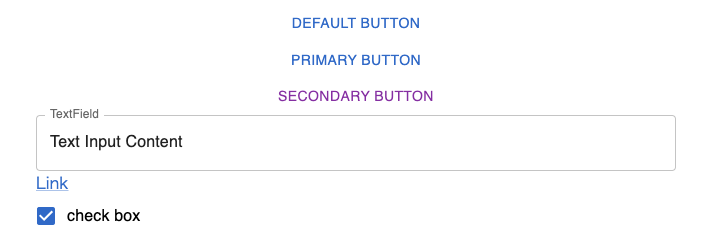
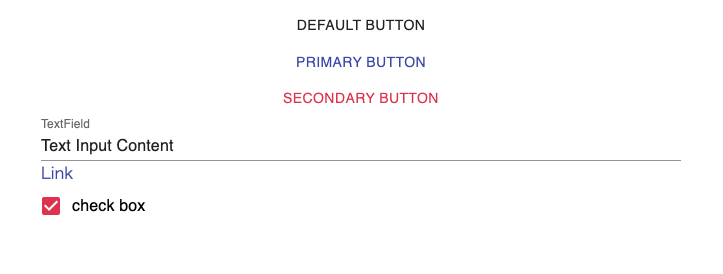
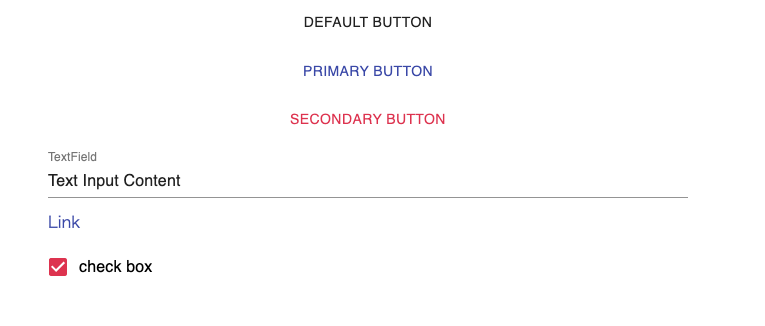

ハローワールド。

Material UIはReactの著名なUIフレームワークの1つです。
2021年9月、バージョン5に上がったタイミングで[MUI](https://mui.com/)に名前も変わりました。
すでに一年経っており、しかもMaterial UI v4はReact v18に対応してないのもあり、早急なアップデートが必要です。

しかしながら、MUIは名前だけではなく、大きな破壊的変更を含んでいます。
例えば、`makeStyles`や`createStyles`の廃止、sx propsの追加などは大きいところです。
ただし、上記の機能は最悪compatモジュールを利用すれば良いのですが...。

# 今回のサンプルアプリ

下記のようなコンポーネントを、まずMaterial UI v4で表示してみます。

```typescript
import React from "react";
import { createRoot } from "react-dom/client";

import {
  Box,
  Button,
  TextField,
  Link,
  Checkbox,
  FormControlLabel
} from "@material-ui/core";

function App() {
  return (
    <Box
      display="flex"
      flexDirection="column"
      gridRowGap="12px"
      width="640px"
      marginX="auto"
    >
      <Button>Default Button</Button>
      <Button color="primary">Primary Button</Button>
      <Button color="secondary">Secondary Button</Button>
      <TextField label="TextField" value="Text Input Content" />
      <Link href="example.com">Link</Link>
      <FormControlLabel label="check box" control={<Checkbox checked />} />
    </Box>
  );
}

const container = document.getElementById("app");
const root = createRoot(container);
root.render(<App />);
```


単純に上から、ボタン・テキストフィールド・リンク・チェックボックスを表示しているだけです。
ただし、Material UI v4はReact v18はサポートされていないので注意が必要です。上記の動作上では特に問題はないです。

# V5へアップグレード

MUI v5へのアップグレードは、[丁寧なマイグレーションガイドもあり](https://mui.com/material-ui/migration/migration-v4/)、codemodがあるため大量にコンポーネントがある場合もコマンド1つで変更できます。

[MUI v4 から v5 の移行に役立つツール codemods](https://www.gaji.jp/blog/2022/07/12/10437/)で紹介されていますが、下記のコマンドを実行することでインポートが変化します。

```bash
$ npx @mui/codemod v5.0.0/preset-safe path/to/component/root
```

上記だけでは完全に移行しきれません。上記のコマンド以外にもいくつかcodemodはありますが、いくつか注意点があります。
私自身は1つの罠と、1つのcodemodで移行できない部分で苦労しました。

ただ、見た目以外の部分はブログなどでもよくまとまっているため困ることはあまりないかなぁと思います。

## import方法の注意点

例えば、下記のようなインポートをするとビルド時にエラーになります。

```typescript
import Grid from "mui/core/Gird/Grid"
```

これは下記のcodemodを使うことで治ります。

```bash
$ npx @mui/codemod v5.0.0/top-level-imports path/to/component/root
```

## styledの型定義

MUIにはstyledという機能があります。これはemotionとかにある `styled` と同じで、コンポーネントに特定のスタイルを設定でき、それを使いまわることが出来る機能です。

このstyledですが、特定のpropsを付与できます。例えば、下記は `fontSize`を指定できる機能です。
下記はMaterial UI v4では動作します。

```typescript
const StyledDiv = styled("div")<Theme, { fontSize: string }>(({theme,fontSize}) => ({
    marginLeft: theme.spacing(2),
    fontSize
})
```

これが、MUI v5では下記のようになります。これがcodemodで修正できずに、数個程度ではありましたが手で修正しなければならない部分でした。

```typescript
const StyledDiv = styled("div")<{ fontSize: string }>(({fontSize}) => ({
    marginLeft: theme.spacing(2),
    fontSize
})
```

# v5にアップグレードした際の見た目の変化

しかしながら、上記のようなcodemodで修正しても、変わらないものがあります。

結論から言うと [こちらのマイグレーションガイド](https://v5-0-6.mui.com/guides/migration-v4/)を見ればよかったのですが、そもそもマイグレーションガイドが2つもあることに気づかなかったので、ちょっと時間がかかりました。

[今回のサンプルアプリ](#今回のサンプルアプリ)のコンポーネントをMUI v5対応して表示してみましょう。

```typescript
import React from "react";
import { createRoot } from "react-dom/client";

import {
  Box,
  Button,
  TextField,
  Link,
  Checkbox,
  FormControlLabel
} from "@mui/material";

function App() {
  return (
    <Box
      display="flex"
      flexDirection="column"
      gridRowGap="12px"
      width="640px"
      marginX="auto"
    >
      <Button>Default Button</Button>
      <Button color="primary">Primary Button</Button>
      <Button color="secondary">Secondary Button</Button>
      <TextField label="TextField" value="Text Input Content" />
      <Link href="example.com">Link</Link>
      <FormControlLabel label="check box" control={<Checkbox checked />} />
    </Box>
  );
}

const container = document.getElementById("app");
const root = createRoot(container);
root.render(<App />);
```


下記のMaterial UI v4の見た目と比べると一目瞭然ですが、import以外同じコードなのに全く見た目が違います。


MUI v5にアップグレードして大きく変わった点はいくつかあります。それが[こちらのマイグレーションガイド](https://v5-0-6.mui.com/guides/migration-v4/)に書いてあることではあります。

- デフォルトの色が `primary` となった
    - ボタンの色は、デフォルトで灰色っぽい色がデフォルトだった
    - CheckBoxやRadio ButtonはSecondaryがデフォルトだった
- TextField系のデフォルトの `variant` が `outlined` になった
    - 以前は `standard` がデフォルトだった。 `standard` がデフォルトで良くない...?
- Linkに下線が付くようになった
- 余白が変わった

その他にもコンポーネント毎に変わっている点はありますが、個人的には **Buttonがv4の動作に戻せなくなった** のが大きいかな、と思いました。正確に言えば戻せはしますが、propsの組み合わせなどでは戻せないです。デフォルトボタンの動作は結構使うと思うんだよ、MUIさん。

それ以外にも、例えば `Link`を以前の処理に戻すためには `underline="hover"` を付ける必要があったり、とにかく面倒くさいです。

# v4の動作に可能な限り見た目を変えない設定

v4の動作のほうが楽だし、いちいち `underline="hover"` なんてつけたくない、という人は `ThemeProvider`を活用しましょう。

MUIのThemeはカラーパレットなどを変えられるだけではなく、コンポーネントの動作を変えることができます。
例えばデフォルトのpropsの値や、見た目のオーバーライドができます。 `Link` コンポーネントの `underline` のデフォルト値を `hover` に変えることも簡単です。

下記はv4の動作に可能な限り戻したテーマの設定です。

```typescript
// v4のデフォルトの値です
const commonTheme = createTheme({
  breakpoints: {
    values: { xs: 0, sm: 600, md: 960, lg: 1280, xl: 1920 },
  },
  palette: {
    primary: {
      light: indigo[300],
      main: indigo[500],
      dark: indigo[700],
    },
    secondary: {
      light: pink.A200,
      main: pink.A400,
      dark: pink.A700,
    },
    error: {
      light: red[300],
      main: red[500],
      dark: red[700],
    },
    warning: {
      light: orange[300],
      main: orange[500],
      dark: orange[700],
    },
    info: {
      light: blue[300],
      main: blue[500],
      dark: blue[700],
    },
    success: {
      light: green[300],
      main: green[500],
      dark: green[700],
    },
    default: {
      light: grey[100],
      main: grey[300],
      dark: grey[500],
    },
  },
});

// material-v4のデフォルトの挙動となるようにコンポーネントを調整している
const componentTheme = createTheme(commonTheme, {
  components: {
    // ボタンだけはv4の設定に戻すためにめっちゃいろいろなことをしなければなりません。
    MuiButton: {
      defaultProps: {
        color: "default",
      },
      variants: [
        {
          props: { variant: "contained", color: "default" },
          style: {
            color: commonTheme.palette.getContrastText(commonTheme.palette.grey[300]),
            "&:hover": {
              backgroundColor: "#d5d5d5",
            },
          },
        },
        {
          props: { variant: "outlined", color: "default" },
          style: {
            color: commonTheme.palette.text.primary,
            borderColor: commonTheme.palette.mode === "light" ? "rgba(0, 0, 0, 0.23)" : "rgba(255, 255, 255, 0.23)",
            "&.Mui-disabled": {
              border: `1px solid ${commonTheme.palette.action.disabledBackground}`,
            },
            "&:hover": {
              borderColor: commonTheme.palette.mode === "light" ? "rgba(0, 0, 0, 0.23)" : "rgba(255, 255, 255, 0.23)",
              backgroundColor: alpha(commonTheme.palette.text.primary, commonTheme.palette.action.hoverOpacity),
            },
          },
        },
        {
          props: { color: "default", variant: "text" },
          style: {
            color: commonTheme.palette.text.primary,
            "&:hover": {
              backgroundColor: alpha(commonTheme.palette.text.primary, commonTheme.palette.action.hoverOpacity),
            },
          },
        },
      ],
    },
    MuiLink: {
      defaultProps: {
        underline: "hover",
      },
    },
    MuiTextField: {
      defaultProps: {
        variant: "standard",
      },
    },
    MuiInputBase: {
      styleOverrides: {
        // inputを利用しているものは、lineHeightやheightなどがなぜか大きなっているため、無駄に余白が取られます。
        // それを修正しています
        input: {
          height: "1.1876em",
        },
      },
    },
    MuiFormControl: {
      defaultProps: {
        variant: "standard",
      },
    },
    MuiCheckbox: {
      defaultProps: {
        color: "secondary",
      },
    },
  },
});

// 下記の型定義がないとTypeScriptではエラーになります
declare module "@mui/material/styles" {
  interface PaletteOptions {
    // ここでsecondary使っている理由は特にないです
    default?: PaletteOptions["secondary"];
  }
}

declare module "@mui/material/Button" {
  interface ButtonPropsColorOverrides {
    default: true;
  }
}
```

上記はごく一部のコンポーネントのみ戻しているため、他にも必要なものがあれば適宜[マイグレーションガイド](https://v5-0-6.mui.com/guides/migration-v4/)を参照してください。こちらに上記のテーマの設定が書いてあることもあります。

上記のテーマを設定してみて、MUI v5で上記のコンポーネントを再度表示してみましょう。

```typescript
import React from "react";
import { createRoot } from "react-dom/client";

import {
  alpha,
  createTheme,
  Box,
  Button,
  TextField,
  Link,
  Checkbox,
  FormControlLabel,
  ThemeProvider
} from "@mui/material";
import {
  blue,
  green,
  grey,
  indigo,
  orange,
  pink,
  red
} from "@mui/material/colors";

const commonTheme = createTheme({
  // ...
});

const componentTheme = createTheme(commonTheme, {
  // ...
});

function App() {
  return (
    <ThemeProvider theme={componentTheme}>
      <Box
        display="flex"
        flexDirection="column"
        gridRowGap="12px"
        width="640px"
        marginX="auto"
      >
        <Button>Default Button</Button>
        <Button color="primary">Primary Button</Button>
        <Button color="secondary">Secondary Button</Button>
        <TextField label="TextField" value="Text Input Content" />
        <Link href="example.com">Link</Link>
        <FormControlLabel label="check box" control={<Checkbox checked />} />
      </Box>
    </ThemeProvider>
  );
}

const container = document.getElementById("app");
const root = createRoot(container);
root.render(<App />);

```



若干余白が狭いですが、下記のMaterial UI v4の見た目と比べるとほとんど変化がありません。



このように、Themeを活用することでv4の見た目や使い心地をほぼ維持したままv5にアップグレードできます。

余白に関しては、あまり見た目に拘っているわけでもないのと、気づくレベルではないので、違いを受容してそのままにしています。そのため余白も完璧に一致させたい場合は、上記のテーマをさらに修正する必要があります。
