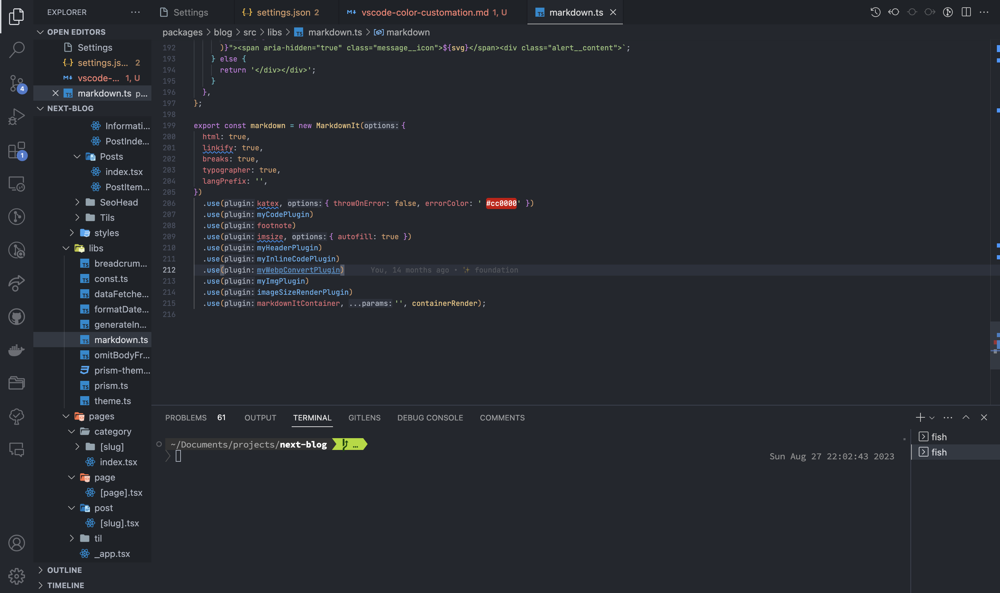
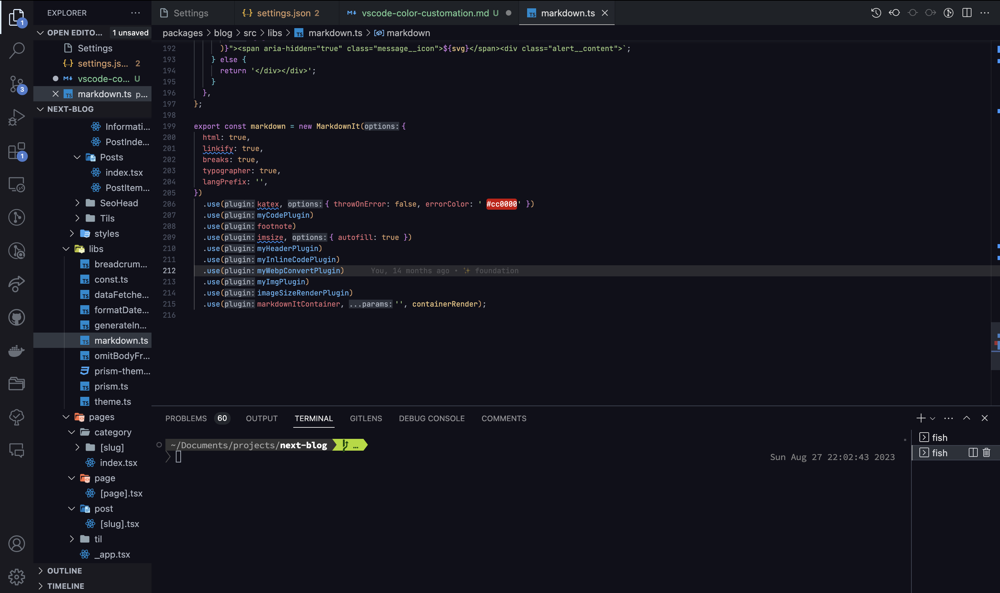

私は基本的にVSCodeを利用して書いています。

VSCodeを始めとして、エディタにはテーマ（色）を変えることが出来ます。VSCodeは特に様々なテーマがありますね。

私自身は長年 [One Dark Pro Darker](https://marketplace.visualstudio.com/items?itemName=zhuangtongfa.Material-theme) を利用しています。Atomが比較的好きだったのと、単純に色の見た目が好みだからです。

一方で `Darker` と名乗る割には背景が白っぽいのが最近気になり（目が悪くなったからでしょうか）、ここをカスタマイズできないかを調べたので備忘録的なまとめです。

# 色を変える方法

`setting.json` に記載することで色を変えることが出来ます。どの項目がどれに対応しているかは下記に記載されています。

[Theme Color](https://code.visualstudio.com/api/references/theme-color#color-formats)

例えば私は下記のような設定となっています。

```json
  "workbench.colorCustomizations": {
    "[One Dark Pro Darker]": {
      "editor.background": "#10101a",
      "editor.selectionBackground": "#40404d",
      "editor.lineHighlightBackground": "#2a2a30",
      "activityBar.background": "#1a1a20",
      "sideBar.background": "#10101a",
      "sideBarSectionHeader.background": "#1a1a20",
      "terminal.background": "#10101a",
      "foreground": "#ddd",
      "icon.foreground": "#ddd",
      "activityBar.foreground": "#def",
    }
  },
```

| before | after |
| -- | -- |
|  |  |


# コード上の色を変える方法

One Dark Pro DarkerではコメントやMarkdownの引用部分が非常に色が薄いです。そのため、それらのようなコード上の色もカスタマイズしたいですが、この場合は上記のような `colorCustomizations` は使えません。

[Editor syntax highlighting](https://code.visualstudio.com/docs/getstarted/themes#_editor-syntax-highlighting)に記載されていますが、`tokenColorCustomizations` にて設定します。

私は下記のような設定になっています[^comment]。

[^comment]: `name` などは [OneDarkの設定](https://github.com/Binaryify/OneDark-Pro/blob/master/src/themes/themeData.ts)からコピペしているため付いてきています。不要だとは思います。

```json
  "editor.tokenColorCustomizations": {
    "[One Dark Pro Darker]": {
      "textMateRules": [
        {
          "name": "Comments",
          "scope": "comment, punctuation.definition.comment",
          "settings": {
            "foreground": "#8f949e"
          }
        },
        {
          "name": "[VSCODE-CUSTOM] Markdown Quote",
          "scope": "markup.quote.markdown",
          "settings": {
            "foreground": "#8f949e",
            "fontStyle": "italic"
          }
        },
      ]
    }
  },
```

画像にすると分かりづらいですが、非常に可読性が上がりました。


| before | after |
| -- | -- |
|  |  |
