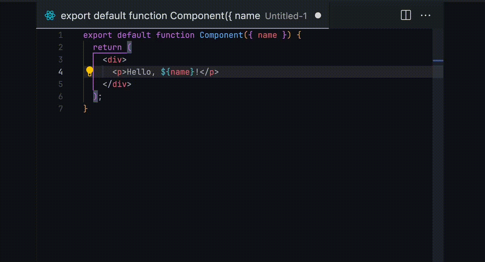
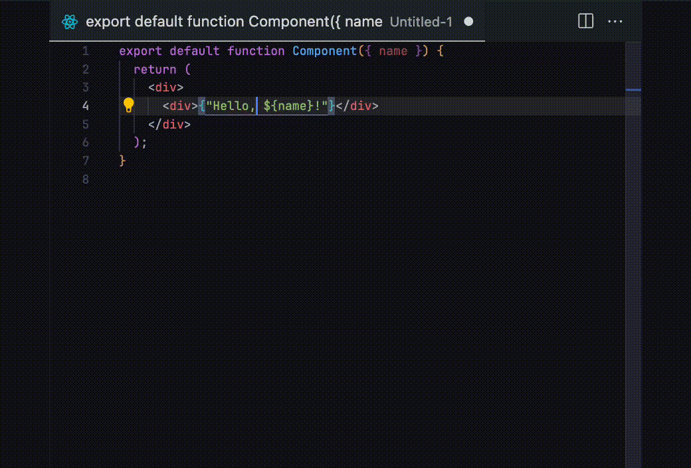
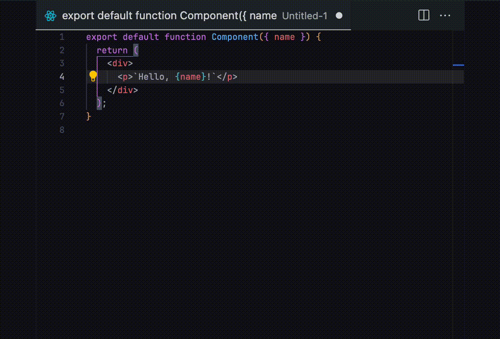

先日、[vscode-sandwich](https://marketplace.visualstudio.com/items?itemName=sa2taka.vscode-sandwich)というVSCodeの拡張を公開しました。本拡張はそのコードの**ほとんどが生成AI**(Roo Code × Claude Sonnet 3.7)**で作成された物**となっています。本記事では拡張の紹介と、その作成の裏側を記載します。

# vscode-sandwich

Vimのプラグインに[vim-sandwich](https://github.com/machakann/vim-sandwich)というのがあります。これは、括弧やクオーテーションなどで囲まれた文字列を編集するもので、 `saiw(` などとやるとwordの周辺に`()`が追加されます。[vim-surround](https://github.com/tpope/vim-surround)などの類似プラグインを含めて、vimを活用しているユーザーならこのプラグインを入れている人は多いのではないでしょうか。

今回はこれを模倣したVSCode拡張を作成しています。名前は恐れ多くもコンセプト元の「sandwich」をお借りして、[vscode-sandwich](https://marketplace.visualstudio.com/items?itemName=sa2taka.vscode-sandwich)。vimとVSCodeという違いがあるため最初から完全なる模倣をすることは考えていませんが、似たような動作感を目指しています。

## 特徴

sandwich呼び出しコマンド（デフォルトだと`Cmd-k s`、windowsの場合は`Ctrl-k s`）を入力したら、`a`, `d`, `r`のいずれかの入力画面になります。

`a`を入力すると追加モードになります。選択する範囲は現状、1行を表す `_`、選択範囲を表す `s`、タグの内側、タグの外側を表す`it`と`at`、そして自己閉じタグ（``とか）を表す`st`が選択可能です。vim-sandwichであればここがテキストオブジェクトという概念と融合して協力になりますが、VSCodeにはそんな概念がないので、vim-sandwichと比べると貧弱です。ちなみに貧弱な理由は、私がまだそんなに使わないからです。`w`あたりは簡単に追加できそうですし、要望があればIssueなりPRなり作ってもらえれば。

その後何を挿入するかの選択画面となります。vim-sandwich同様`t`を押せば任意のタグが追加できます。



`r`を入力すると置換モードになります。その後置換対象と置換後の値を入力することで置換されます。



`d`を入力すると削除モードになります。削除対象を入力することで削除されます。




vim-sandwichと比べると

- text objectの概念がない分、追加の範囲指定は貧弱
- 数字などを利用した詳細な指定にも対応していません。上記同様、その点は貧弱です
   - 対象のタグの指定は、タグ名を指定できるようにすることで代替しています。同じタグがネストしている場合は最も近いタグのみを指定できるようになっています
- 対象の特定は、**該当する項目のみ候補が表示されるような仕組み**となっています
    - [Quick Picks](https://code.visualstudio.com/api/ux-guidelines/quick-picks)の機能を用いて**候補を表示しつつ**、**Enterキー無しで進むことでvim-sandwichと同様の操作感を提供しています**

というような違いがあります。

## 作った理由

私自身はemacsに籍をいていた時期も長かったこともあり、あまりvimに慣れているわけではないです。一方でだいぶ前に勉強も兼ねてVSCodeに[VSCode Neovim](https://marketplace.visualstudio.com/items?itemName=asvetliakov.vscode-neovim)プラグインをいれました。
そこで色々プラグインを漁ったところ、vim-sandwichを見つけました。正直個人的にはモードの概念の手癖が永遠につかないまま2年経ったのですが、vim-sandwich自体は便利に利用していました（TypeScriptに置いてダブルクォーツをバッククォートに変えることがめちゃめちゃある）。
最近Roo CodeやCopilotの影響なのかVSCode Neovimが固まったりすることが頻発しており、特に最近はCopilot NESとの相性が悪くプラグインを取り除く決断をしました。

vim-sandwichの機能は欲しかったので、どうしようかなと思い代替拡張とか無いかなと探しました。ただ囲むだけ・ただ置換するだけとかならめっちゃありますが、vim-sandwich的なのはなかったので作りました。[JS Teleporter(旧JS Go to test)](https://marketplace.visualstudio.com/items?itemName=sa2taka.js-teleporter)然り、ありそうなもんなんだけどな。

ちなみに上記の理由により、私が利用しない機能の検証が全くできないのでめっちゃバグがあります。ちょこちょこ改修していきます（が、AIの書いたコードを読むのが面倒で...）。AIはバグ修正があんまり上手くないし。

# VSCode拡張と生成AI

本拡張の作成に当たり、生成AIをめっちゃ活用しています。今回はRoo Codeをエージェントとして用いて、モデルはClaude Sonnet 3.7を利用しました（Gemini 2.5を利用したかったんですが、トークン制限が思ったより頻発したのでSonnet 3.7を最終的に使いました）。というか、休日のコーディングということもありあんまり自分の頭を使ってAIのコードを適切な設計にするのも面倒だったのでAIに任せた結果、タイトル通り**コードの98%（数字は感覚です）が生成AIが作成しています**。

コストとしては、**APIが20\$**。**最初のプロンプトを動かして最低限動かすまでは2\$もかかっていません**。**20時に作業開始して24時にリリースする爆速対応**。それ以降はバグ修正とかで2時間ぐらい使っていますが、コード量・時間・コストは著しく悪くなっています。

ちなみに最初のプロンプトは下記です。この時括弧などの考慮を忘れています。最終的にこの仕様から若干変わっていますが、下記のプロンプトで概ねの機能は作成されていました。一部面倒だったのかTODOとかになってます。

```markdown
[vim-sandwich](https://github.com/machakann/vim-sandwich) というVimの有名なプラグインがあります。

これのコンセプトをVSCodeの拡張として再現したいです。

現在考えている仕様は下記のとおりです

- 特定の命令（ショートカットCmd-k + s）を押すと、a(追加), d(削除), r(置換)の選択肢が出てきます。入力後Enterを押すと次に進みます
  - 設定次第では、キーを打った瞬間に即座に反応することも可能です。デフォルトではEnterを押さない方が良いと思います

- aの場合オブジェクト範囲を指定します
  - vimのように `aw` などは初期バージョンでは実装しません
  - 下記の機能がほしいです
    - `_` は該当の行の最初から最後までを選択します
    - `s` は選択範囲を選択します
    - `it` は囲まれたタグの内側を選択します。 <hoge><foga>hello[curcor]world</foga></hoge> の場合、`hello world` の部分のみ選択します
    - `at` は囲まれたタグの外側を選択します。<hoge><foga>hello[curcor]world</foga></hoge> の場合、`<foga></foga>` の部分のみ選択します
    - `st` は自己閉じタグ（）全体を選択します
- オブジェクト範囲を指定した後、追加するペアを指定します

  - クォート(`'`)やダブルクォート(`"`)、バッククォート(`\``)を選択肢として表示します。
  - htmlやtypescriptreact等の場合はタグ(`<tag></tag>`)を選択肢として表示します。これは`t`です。
    - `t`を選択した後は、タグの中身を入力する必要があります。`input` と入力したら `<input></input>` になります。

- rの場合は置換する対象を指定します。
  - クォート(`'`)やダブルクォート(`"`)、バッククォート(`\``)を選択肢として表示します。
  - htmlやtypescriptreact等の場合はタグ(`<tag></tag>`)を選択肢として表示します。これは`t`です。
  - いずれの場合は、キーを打った瞬間に即座に反応することも可能です。デフォルトではEnterを押さない方が良いと思います
- 置換対象を選択後、置換後の値を指定します。

  - 同様に、クォート(`'`)やダブルクォート(`"`)、バッククォート(`\``)を選択肢として表示します。
  - 同様に、htmlやtypescriptreact等の場合はタグ(`<tag></tag>`)を選択肢として表示します。これは`t`です。
    - `t`を選択した後は、タグの中身を入力する必要があります。`input` と入力したら `<input></input>` になります。

- dの場合は削除する対象を指定します。

  - rの置換対象と同じです

- UXを考慮してください。例えば選択範囲をハイライトで光らせるなど

# 開発の上で

開発の上では、必要十分な機能分割、関数分割を行ってください。例えば、各命令ごとにファイルを分割するなど。
仕様や開発用のメモは、`docs/` にてファイルを作成・編集してください。また、AIによる自動作成であることが分かるように `-by-ai` というsuffixを付与してください。
```

**VSCode拡張の骨子を作るのに生成AIは非常に便利です**。あくまでClaudeは、ですが、VSCode拡張の知識が非常に高く、欲しい機能を言ったらそれっぽいのは簡単に作ってくれます。おそらく公開されているコードが多いからでしょうか。GitHub Actionsの精度が悪いのとは対象的な感じがします。このへんは[VSCode拡張のProgrammatic Language Featuresを全部試してみた](https://blog.sa2taka.com/post/record-of-testing-all-vscode-programmatic-language-features/)あたりでも示唆していますが、欲しい機能があったら是非作ってみてください。
