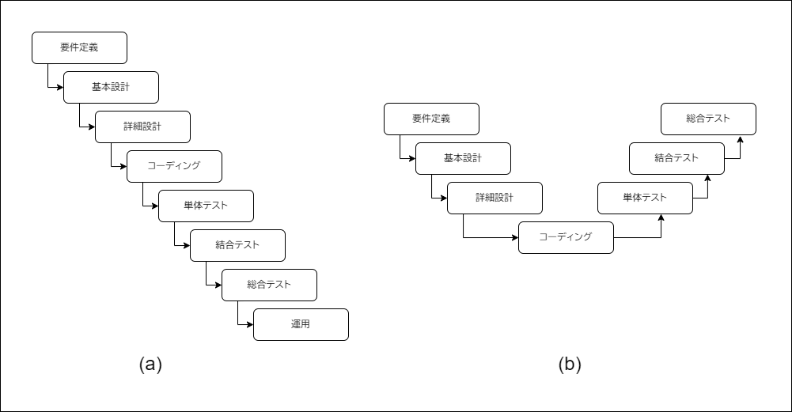
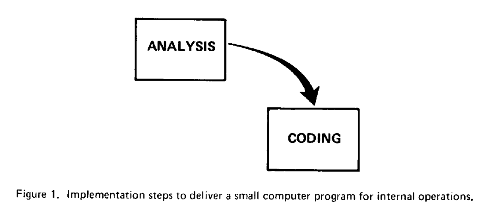
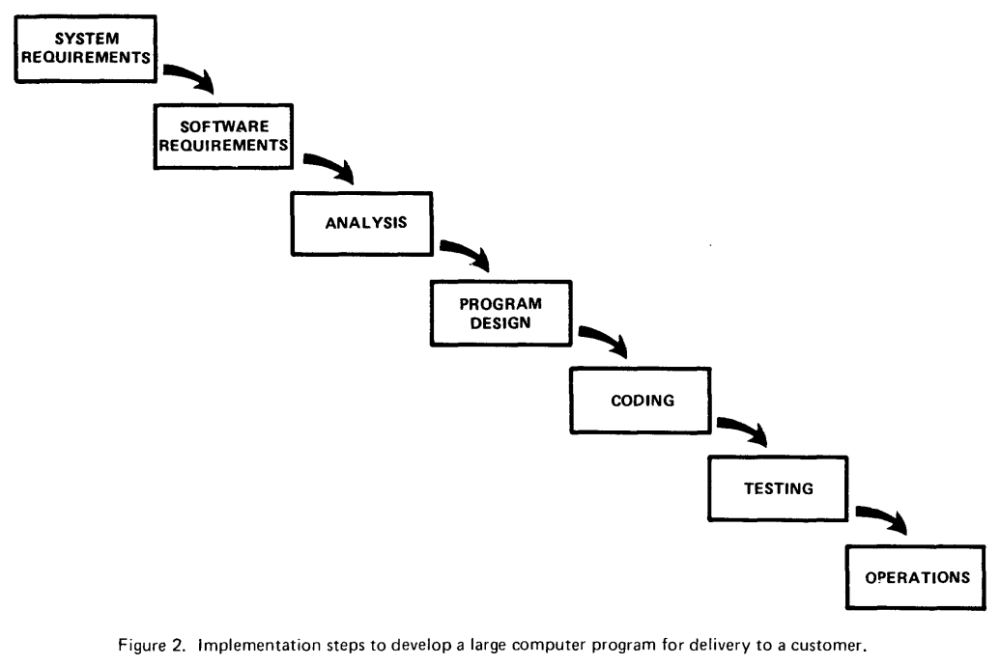
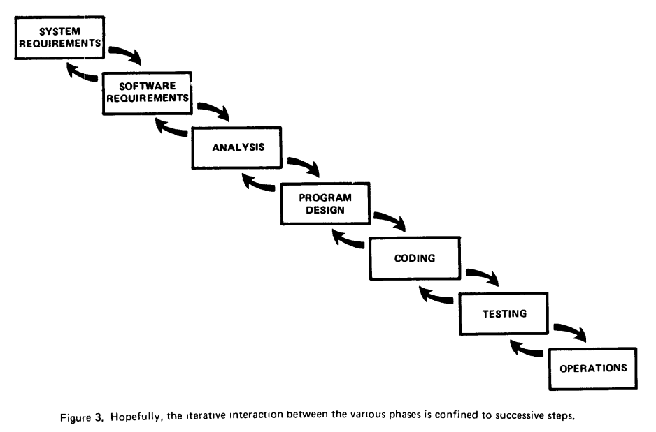
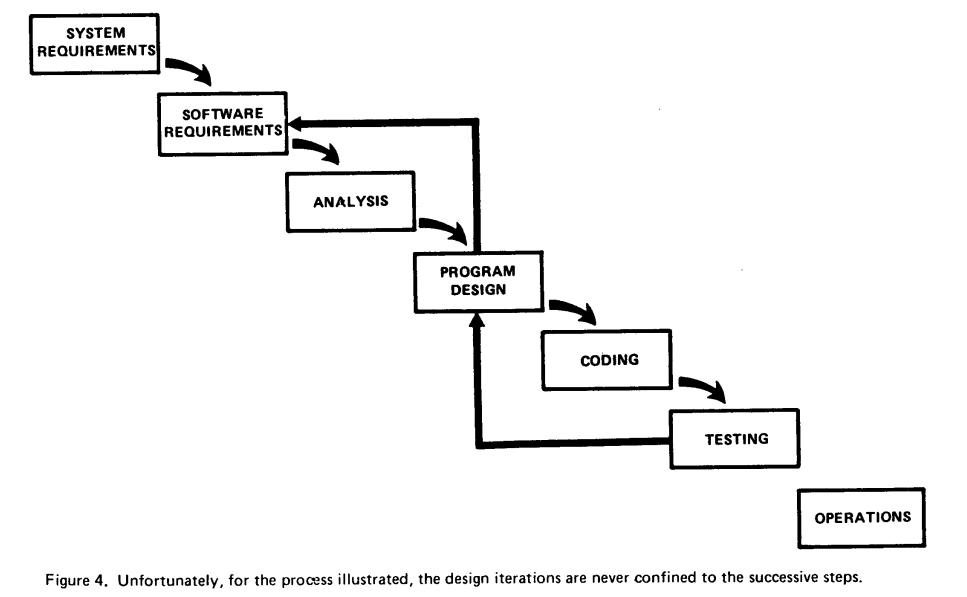
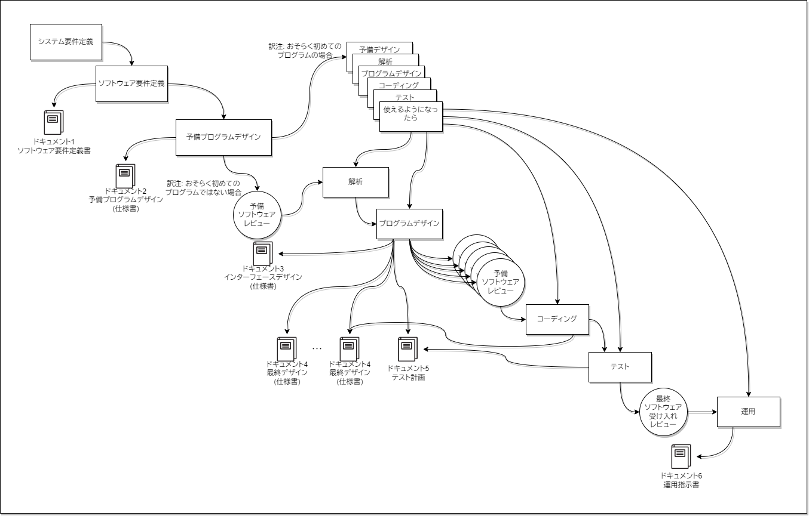

ソフトウェア工学の開発モデルで最も有名なものは、その内容の賛否を問わなければ間違いなくウォーターファールでしょう。現在はアジャイルという概念によって駆逐されている印象ですが、それでも大規模開発ではまだウォーターフォール、またはそれに似ているものが利用されています。

そんなウォーターフォール、初出とされている論文はRoyceによる「[Managing the Development of Large Software Systems](http://www-scf.usc.edu/~csci201/lectures/Lecture11/royce1970.pdf)」[^royce-1970]（以下、原論文と記載）ですが、この論文`Waterfall`という単語は**出てきません**。更には**一般的なウォーターフォールとは異なります**。

本記事ではそんなウォーターフォール開発モデルに付いて詳しく振り返っていき、本当にいいたかったことは何なのだろうか、ということを掘り出していこうと思います。あくまで振り返るだけであって、**ウォーターフォールそのものの議論はしません**。

# ウォーターフォールの定義（っぽいもの）

ウォーターフォールという言葉、上記にもあるように、原論文ではWaterfallという言葉は出てこず、Royceの主張はウォーターフォールとは異なるということです。これが意味するのは、ウォーターフォールの定義はないということです。
そのへんの子供の遊びではなく、国家や大手ゼネコンなども採用している（いた）開発プロセスなのに、そんなことがあって良いのかという感じですが、そのあたりの歴史は流石に僕にはわかりません。

とはいえど、ウォーターフォールは検索すればその定義が色々出てきます。まとめると下記の様になるかと思います。

- 大まかにプロセスが別れている
   - 要件定義・外部設計・内部設計・コーディング・単体テスト・結合テスト・運用テスト・リリースというプロセスがある
   - 要件定義・基本設計・詳細設計・コーディング・単体テスト・結合テスト・総合テストというプロセスがある
   - （Royceの原論文の記載は）システム要件・ソフトウェア要件・分析・プログラムデザイン・コーディング・テスト・運用というプロセスがある
   - その他、概要設計とか機能設計とか、表記ゆれだったり増えたり減ったりする
- 下図のような形体で示されている
  - 下図（a）は上から下に流れていく。この図よりウォーターフォールと名付けられた。また、更に滝ということで、上流プロセスへの手戻りのコストが高いと言われることもある
  - 下図（b）はドイツ政府関連の開発工程であるV字モデルの表記方法。各テストと設計が1対1で紐付いている点がわかりやすい。**ただし、[Vモデルのドキュメント](http://ftp.tu-clausthal.de/pub/institute/informatik/v-modell-xt/Releases/2.3/Dokumentation/V-Modell-XT-HTML/d45f146fc585bdf.html#toc43)などでは各プロセスの表記は異なる**
- 名称やその表記方法に揺れこそあるものの、要件定義からリリース・運用までを一気通貫で行うことは共通している

表記ゆれ過ぎじゃない、と改めて思いました。

ウォーターフォールは一般論として下記のような定義に落ち着くことに異論はないでしょう。細かい部分では色々あるでしょうが、本記事では大雑把に下記を一般論のウォーターフォール定義とします。

- 要件定義→設計→コーディング→テスト→完成、というような順番
- 一気通貫で行われる
- 手戻りのコストは高い。手戻りのプロセス数が大きくなればなるほど高い。若干の手戻りは許される
- 各プロセスの完了した証左としてドキュメントを作成する

やり方は上記の通りですが、本質的には**要件定義・設計・コーディング・テスト**をプロセスに分割することで**開発コストの見積もりが簡単になる**という点がメリットとして挙げられる認識です。

続いて、ウォーターフォールは一般的に嫌われていますが、なぜ嫌われているのでしょうか。いくつかネット上で出てくる例を挙げてみます。

- （後になればなるほど）変更が難しくなる
- プロジェクト後半になるまでテストができない
- 成果物が膨大で時間がかかる
- ユーザーの意見を（後から）取り入れづらいが、ユーザーの要件は変わるので、結局最初からになる
- 顧客やエンドユーザーが阻害される

本質的には、プロセスを一歩一歩進めていくのが最大の問題でしょう。要件定義を最初に全部やってしまうので、後から顧客が必要な機能は取り入れづらく、コーディングが全部終わらないとテストはできず、完成品は最後までわからない。そのプロセスがちゃんと進んでいますよという証左のために成果物を作成する必要がある。**何が嬉しいんだこの開発手法**。

# Royce氏が本当に言いたかったこと

本章では原論文を要約し、Royce氏が本当に言いたかったことをまとめてみます。

## 導入

導入部分は短いので全体を訳してみます（一部省略します）。

> I'm going to describe my personal views about managing large software developments. I have had various assignments ... the development of software packages for spacecraft mission planning, commanding and post-flight analysis. .  In these assignments I have experienced different degrees of successwith respect to arriving at an operational state, on-time, and within costs. I have become prejudiced by my experiences and I am going to relate some of these prejudices in this presentation.
> > 大規模なソフトウェア開発について個人的な考えを述べます。私は、これまで宇宙船のミッション計画、指揮、飛行後の解析などを中心に、様々なソフトウェアパッケージの開発を担当してきました。これらの仕事では、運用可能な状態に・時間通りに・コスト内に到達することに関して、様々な成功度合いを経験しました。この発表ではこれらの経験の一部を主観的な目線で発表します。

この論文は、Royce氏が経験してきた様々な開発の成功・失敗体験について発表するようなもののようですね。

導入以降は、Royce氏は開発にどういったステップがあるか、という記載をしています。

## 現状の開発のステップと問題点

まず最初に例示した例は2つのステップの図です。下記画像は原論文の図です。

図のキャプションは「社内用の小型のコンピューターシステムを作るための実施手順」となっていますが、本文中では、上記2ステップは**すべてのコンピュータープログラム開発に共通する重要なステップである**と記載があります。解析とコーディングは、言われなくとも分かるものですね。何が必要なのかわからないまま（少なくとも仕事では）プログラムは書きませんし、何が必要なのか分かってもコーディングしなかったら永遠にプログラムは完成しませんしね。

ただし**大きな開発では上記2つだけでは足りない**と記載されています。

このステップを元に、原論文では下記のことが書かれています。

- より大きなソフトウェアを製造するためにこれらだけでは失敗する
- 多くの開発ステップが必要だが、最終製品に直接関わるわけではないので顧客側も開発側もコストを負担したくない
- マネジメントの主な役割は、コンセプトを両グループに売り込み（sell）、開発担当者に遵守を矯正すること

結論はわかりませんが、マネジメントは「**（一見最終製品に関係ない工程が）有用であることを示すもの**」「**開発者が遵守するもの**」ということがわかります。

続いて2枚目の図が現れますが、この図こそ、ウォーターフォールはRoyce氏が生み出したと言われる理由の図です。

2枚目の画像に関する説明は実にあっさりしており、下記の客観的事実のみの記載です。

- より大きな開発のアプローチ
- 解析の前に2段階の要求分析があること・コーディングと解析の間にプログラムデザインを挟むこと・以降はテストのステップが増えていること
- これらを分けたのは、実行方法が明確に異なり、更には計画や人員配置も異なる場合があるからと記載がある。計画が異なる、という意図は私はわからなかった

続く3枚目・4枚目の画像には「理想」と「現実」が書かれています。

画像3枚目は「理想的には、行ったり来たり（iterative interaction）するプロセスは連続したステップに限定されています」という理想が記載されています。

まずこの時点で世のウォーターフォールとは異なります。世のウォーターフォールは**前のプロセスと行ったり来たりはしません**。あくまでニュアンスレベルな話だとは思いますが、Royse氏はどちらかというと前のプロセスと相互的に・協調をするといった雰囲気があります。世のウォーターフォールとは違い、実装中に（上長の目を盗んで）ちょっとだけ基本設計を直して、といったニュアンスではなさそうです。
そもそも世のウォーターフォールは設計を基本設計・詳細設計と分割し、テストを単体テスト・結合テスト・総合テストと分割しているのですが、このRoyceの原論文とは異なります。そのため、その点から異なるため、齟齬が発生していると考えます。

そして4枚目の画像と説明があまりにも鮮烈です。キャプションは「残念ながら、図示したプロセスでは、設計の繰り返しは**決して**連続したステップに限定されません」となっています。neverという語句を使っている以上、おそらく今まで一度も連続したプロセスでのみ手戻り（行ったり来たり）とは限らなかったのでしょう。
画像の上ではテストが失敗したらプログラムデザインに手戻りし、プログラムデザインがミスっていたら要件定義まで手戻りするという表現になっています。

また、文章でも理想通りにはいかないことを記載しています。本文を掻い摘んで引用します。

> I believe in this concept, but the implementation described above is risky and invites failure. The problem is illustrated in Figure 4. The testing phase which occurs at the end of the development cycle is the first event for which timing, storage, input/output transfers, etc., are experienced as distinguished from analyzed. These phenomena are not precisely analyzable. ... if these phenomena fail to satisfy the various external constraints, then invariably a major redesign is required. ... The required design changes are likely to be so disruptive that the software requirements upon which the design is based and which provides the rationale for everything are violated. Either the requirements must be modified, or a substantial change in the design is required. 
> > 私はこのコンセプト（訳注: 図3のこと）を信じているが、上記のような実装はリスクが高く、失敗を招く。その問題点を図4に示す。テストフェーズはタイミングやストレージ、IO転送など、分析（要件定義）からは読み取れない現象が発生する部分だ。これらの現象は、正確には解析できない。（中略）これらの現象が様々な外部制約を満足しない場合、必ず大規模な再設計が必要となる。（中略） 必要な設計変更は、設計の基礎となり、すべての根拠となる要件に違反するほど破壊的である可能性が高い。要件の修正や、設計の大幅な変更が必要だ。

まず図4について解説です。ここで分かることは下記のようなことでしょうか。

- 筆者（Royce氏）は図3は正しいと考え、理想的にはそうでありたいと思っている
- 経験上、テストで分析段階でわからないことが発生し、プログラムデザインや要件定義を再度再設計しなければならない

つまり、筆者自身は、一般的なウォーターフォールの原典とされている**図2のやり方を否定している**のです。
ただし、続く言葉があり、**図2自体を完全に否定はしていない**ことも読み取れます。

> However, I believe the illustrated approach to be fundamentally sound. The remainder of this discussion presents five additional features that must be added to this basic approach to eliminate most of the development risks.
> > しかし、私は、このアプローチは基本的に健全であると信じている。本論では、この基本的なアプローチに、開発リスクをほとんど排除するために追加しなければならない5つの機能を紹介する。

つまり、Royce氏は**図2に5つの機能（ステップ）を追加することでリスクを排除できる**、と言っているのですね。

## Royse氏の考えるプロセス

原論文はここから5つの機能の紹介をしています。ここでは、詳細は省いて、紹介に留めます。

1. プログラム設計が最優先： PROGRAM DESIGN COMES FIRST
   - 要件定義の次に事前にプログラム設計を考えるフェーズを用意する
   - DBやストレージなどを事前に検証する、みたいな感じという意味だと私は捉えました
   - その後ANALYSEを行う
2. ドキュメントの設計：DOCUMENT THE DESIGN
   - どれだけのドキュメントが必要なのか、を提起すること
   - これは通常のウォーターフォールのように、各プロセスの結果として設計書が現れるという考えと似ている
3. 2回やれ： DO IT TWICE
   - もしこれが初めて開発されたものならば、**パイロット版を最初に作成する**。これはプロセス全体をミニチュア化して行い、全体の作業に比べて比較的小さい時間スケールで行われるもの
   - パイロット版は設計の問題点を早めに察知し、代替案を出し、早い段階で価値のない設計を省き、エラーのないプログラムを作らなければならない
   - 一般的なウォーターフォールと圧倒的に違う部分がここ
4. テストを計画せよ・コントロールせよ・監視せよ： PLAN, CONTROL AND MONITOR TESTING
   - 人手・コンピューターの時間・経営判断など、リソースをもっとも使うのがテストフェーズ
   - 上記3つはすべてテストフェーズの前に問題を検知し解決することを目標としているが、それでもテスト段階で問題が発生する場合がある
   - テスト計画の際は
     1. テストの専門家によって処理されるのが最善である。必ずしも設計に貢献している必要はない。これは設計が優れたドキュメントになっているからこそできる
     2. 殆どのエラーは、目視で簡単に発見できる。第三者の目視検査をして、このようなことにコンピューターリソースを使ってはならない
     3. すべての論理経路を少なくとも一度は何らかの数値チェックでテストすること
     4. シンプルなエラーをすべて取り除いてからテスト部門に渡す（という意味だと思う）
5. お客様を巻き込め： INVOLVE THE CUSTOMER
   - ソフトウェア設計で何を行うかは、事前に合意しても解釈に揺れ幅がある
   - 納品前に、早い段階で顧客に約束させるため、顧客を巻き込むことが重要である
   - 農研定義から運用まで請負業者を自由にさせるのはトラブルの元である
   - これはアジャイル（XP？）でも強い考え方として存在している

Royce氏は、これらをやること自体にコストこそ掛かるが、これらをやらないときのほうがコストが掛かったと締めくくっています。

最後に、これらをまとめたフローがありますが、これを日本語訳したものを下記に示します。

**僕の知ってるウォーターフォールと、なんか違う**と違和感を覚えること必至です。あっている点は左上から右下までプロセスが配置してあるところと、ドキュメントを作成するところ、ぐらいです。またこの表では表現できていませんが**それぞれのプロセスで顧客を巻き込むこと**も重要視しています。

## Royce氏の言いたかったこと - 結論

原論文を読み込むと、下記のことが客観的にわかります。

- ウォーターフォールの原典とされていた図は、実はRoyce氏ですら問題があると記載していた
- Royce氏の結論は一切現在のウォーターフォールと関係がない。それどころか一部ではウォーターフォールの反対のことを記載している
   - 例えば2回フローを行うことや、理想を語っていた部分での直前のプロセスと相互的に協調する部分など
- 彼自身が考えた開発モデルは、現在一般的に語られるどの開発モデルにも当てはまらない

最後は開発モデルをあまりたくさん知らないのでもしかしたら間違いかも知れませんが、多分2020年台でこの開発モデルは正しいという人は少ないのではないでしょうか。

とりわけ私の感覚からすると、テストのコストをとりわけ高く見積もっているように感じます。

> 人手・コンピューターの時間・経営判断など、リソースをもっとも使うのがテストフェーズ

> 殆どのエラーは、目視で簡単に発見できる。第三者の目視検査を行い、このようなことにコンピューターリソースを使ってはならない

このような記述から、テストを行うこと自体が億劫であるような印象を受けます。

しかしながら、これは当然な事かもしれません。というのも、Royce氏がこの論文を書いたのは1970年の話です。単体テストが簡単にかけるSUnitやJUnitどころか、C言語すら生まれていません。時代はALGOLやCOBOL、FORTRANの時代で、一人一台PCはおそらくないでしょう[^1970-history]。
つまりPCリソースは貴重であり、プログラムを書いてから実行しテストができるまで非常に多くの時間を必要とし、また、プログラムはデータアクセスなどの低レイヤーな部分から要件を満たす処理の高レイヤーなすべてを含むでしょう。
**テストの実行難易度の高さ**と**テスト自体の網羅度**が現代の感覚とは段違いであったと感じます。

[^1970-history]: 1970年前後の出来事をWikipediaでみてみました。Intelが世界初のDRAMを発売。まだUNIXは生まれてない（1973年最初の論文発表）。マイコンもない（1971年、i4004発売）。マウスでウィンドウ（GUI）を操作する伝説のデモンストレーションが行われてから2年。フロッピーディスクができてから3年。Altoができるまで後3年。IBMの最初のPCができるまで後5年。

そして、このテストの難易度の高さこそが、Royce氏の言いたかったことに繋がります。
Royce氏の「経験上、プログラムデザインや要件定義を再度再設計しなければならない」という記載は、**ウォーターフォールのデメリットそのもの**です。ただ、**そう考える理由が違います**。
ウォーターフォールのデメリットが発生する理由は、一般的に顧客（と開発者）は完璧な要件定義を最初からできない、という経験則から来ています。しかし、Royce氏が設計や要件定義を再度行うことになる理由は**テストで要件定義やデザインで検出できない問題が発生するから**というものです。

なので

- Royce氏のこの開発モデルは1970年代では正しかったかも知れない
- ただ現代とは大きく異なる環境であるがゆえの結論だった
- 何れにせよ、今のウォーターフォールとは全く関係ない

と結論づけます。

# ウォーターフォールは何者か

Royce氏の論文ではウォーターフォールっぽい開発手法の記載はありませんでした。一体、ウォーターフォールはどこから生まれ、なぜ流行ったのでしょうか。

結論としては、正直わかりませんでした。1970年～1980年にかけて、いわゆるウォーターフォール開発が活発となったのは間違いないでしょう。ただ最初から忌子（またの名を反論のための案山子）として生まれたこの開発モデル、実際は何者だったのか、といった点はWebの世界ではわかりませんでした。

## Waterfallという単語の出どころ

ウォーターフォールを提唱したとされるRoyceの現論文ではWaterfallなんて単語は出てきませんでした。Waterfallはどこから出てきたのかというのは上記のWikipediaや「[ウォーターフォールモデルの起源に関する考察 ウォーターフォールに関する誤解を解く](https://barrel.repo.nii.ac.jp/?action=pages_view_main&active_action=repository_view_main_item_detail&item_id=269&item_no=1&page_id=13&block_id=135)」[^er64-1]に記載があるように、T. E. BellとT. A. Thayerの「[Software requirements: Are they really a problem?](https://dl.acm.org/doi/10.5555/800253.807650)」[^bell-thayer-1976]（以下、[1976]と記載）と考えるのが妥当なようです。

[1976]の論文において`waterfall`という単語は2回出てきています。そのうち、最初の出現の段落が下記となります。
下記は「ソフトウェア要件とは？」という章の1段落です。

> The evolution of approaches for the development of software systems has generally paralleled the evolution of ideas for the implementation of code. ... practicioneers have concluded that a top-down approach is superior to the bottom-up approach of the past. The Military Standard set MILSTD 490/483 recognized this newer approach ... . The same top-down approach to a series of requirements statements is explained, without the specialized military jargon, in an excellent paper by Royce [5]; he introduced the concept of the **"waterfall"** of development activities. In this approach software is developed in the disciplined sequence of activities shown in Figure I.
>> ソフトウェア開発の手法の進化は、コード実装に関する考え方の進化とだいたい変更して進んできた。（中略）実践者たちは、過去のボトムアップ・アプローチよりもトップダウン・アプローチのほうが優れていると結論づけた。軍用企画セットMILSTD 490/483は(中略)この新しいアプローチを認識した。（中略）一連の要件記述に対する同じトップダウン・アプローチは、Royceによる優れた論文で軍事用語を使わずに説明されている。彼は、開発活動の「**ウォーターフォール**」の概念を導入している。このアプローチでは図1に示すような、規律ある一連の活動でソフトウェアが開発される。

注意点として、このときの「図1」は、[Royce氏が本当に言いたかったこと](#Royce氏が本当に言いたかったこと)章の中の図2と同じであり、すなわちRoyce氏が**誤っている**（改善すべきである）と語っている手法のことです。
また、waterfallはご丁寧にクオーテーション付きとなっていますが、これは**トップダウン・アプローチが優れている**という論文筆者の記載から、**上から下に流れていくもののメタファー**として記載したものではと考えられます。すなわち、当時一般的な名称としてWaterfallが使われていたのではなく、トップダウン・アプローチをイメージしやすくするために使われた一種のキラーワード[^killer]だったのではという推測です。

[^killer]: 何人ものエンジニアを結果的に殺したという意味を含む

あくまで筆者は、トップダウン・アプローチが優れているという観点で話を進めています。そして、そのアプローチを例して、軍用企画セットMILSTD 490/483というものを出しています。それに付随して、Royce氏の論文を引用しています。あくまで、**Royce氏の結論を引用していない**ことが重要なのです。

まとめると、この論文からは下記のような事実が見て取れます。

- この論文ではRoyce氏が結論的に提唱したものを**ウォーターフォールと呼んでいない**
- トップダウンアプローとの一例として、MILSTD 490/483という企画を持ち出し、軍事用語を使わずにそのフローを説明していた論文がRoyce氏の論文であった。ただし、引用しているフローはRoyce氏によって改善すべきであると記載されているものである

## ウォーターフォールの正体？

ここまで出てきた論文に記載されている事実を下記に3点並べます。

- Royce氏は宇宙船のミッション計画、指揮、飛行経路の解析などを中心に、様々なソフトウェアパッケージの開発を担当してきた
- ウォーターフォールと最初に記載された論文では、トップダウン・アプローチの例として、MILSTD 490/483という軍事標準を挙げている
- そのMILSTD 490/483を軍事用語無しで解説したのが、Royce氏の論文である

宇宙船のミッション計画、指揮、飛行経路の解析というのは、現在ならまだしも、1970年では国家レベルの資金・施設がないと無理でしょう。更に、当時は冷戦時代だったこともあり、開発は軍隊が率先して行っていたということは火を見るより明らかです。
つまり、**Royce氏はMILSTD 490/483という規則に則って開発していたのでは**、という推測が立ちます。

その推測を裏付けるように、[Winston W. Royce](https://en.wikipedia.org/wiki/Winston_W._Royce)氏のWikipediaのページでは、TRWという会社のプロジェクトマネージャーを行っていたという記載があります。
[TRW](https://ja.wikipedia.org/wiki/TRW)という企業は、日本のウィキペディアにも記載がある通り、ミサイル開発や宇宙船の開発に取り組んでいた企業です。特に1970年は奇跡の生還を果たしたアポロ13号の開発にも関わっており、軍事関連の開発もズブズブでやっていたことを考えるのは自然でしょう。

Royce氏の関わりや、[1976]の論文での示唆から導き出されるのは、**ウォーターフォール開発モデルはMILSTD 490/483**が元になっているのでは？という推測です。

## MIL-STDはウォーターフォール開発モデルを提唱しているのか？

MIL-STD、というのは、MILITARY STANDARのことで、つまり軍隊における標準です。

MILSTD 490および483は、[Product Lifecycle Management](https://www.product-lifecycle-management.com/)の[Standards](https://www.product-lifecycle-management.com/legacy-military-standards.htm)より閲覧が可能です。 

[MILSTD 483](https://www.product-lifecycle-management.com/download/MIL-STD-483A.pdf)は「システム・機器・軍需品およびコンピュータープログラムの構成管理プラクティス」、[MILSTD490](https://www.product-lifecycle-management.com/download/MIL-STD-490A.pdf)は「仕様のプラクティス」というタイトルがそれぞれついています。

MILSTD490はひたすら仕様書について記載されているので割愛し、MILSTD 483を見てみます。そもそも、MILSTD 483自体が構成管理のプラクティスであり、開発手法についての記載ではないため、**これがウォーターフォール開発モデルとは言えない**というのが結論です。

ただし、3.3.1項「システムエンジニアリング」の部分では、「MIL-STD 499にシステムエンジニアリング基準を記載している」と引用されています。

[MIL-STD 499](https://www.product-lifecycle-management.com/download/MIL-STD-499A.pdf)の10.2節には「システムエンジニアリングプロセス」というビンゴな記載があります。ただし、内容は、**似ている部分は、ないこともない**ぐらいのものです。
ただ英語力のなさにより、完全に意図を捉えきれてない可能性はあります。

1. 要件分析（Mission Requirements Analysis）
   - ミッションの目的と、運用・脅威・環境などの影響について分析する
2. 機能分析（Functional Analysys）
   - システム機能、およびサブの機能について要件とシステム性能を満たすために、分析する。基本設計みたいな感じだと捉えました
3. 割当（Allocation）
   - ハードウェア・プログラム・プロセス・データ・施設や人員を割り当てるために十分な詳細度を持った設計フェーズ、といった感じ
4. 合成（Synthesis）
   - 3で詳細に分析した結果の確認のための予備設計
   - 回路図や物理・数学モデル、コンピューターシミュレーション、レイアウト、図面などの形式で記載されるものらしい
5. 物流工学（Logistics Enginnering）
   - 突然出てきてよくわからないですが、機械の調達とかに関連するものなのかなぁと思いました
6. ライフサイクルコスト分析（Life Cycle Const Analysis）
7. 最適化（Optimization）
8. 生産技術解析（Production Enginnering Analysis）
   - 当時は、おそらくプログラムだけではなく、ハードウェアとセットで何かを作ることが多く、そのハードウェア部分のことを言っているのかなぁと思いました
9. 仕様書の作成（Generation of Specifications）

これ、多分ですが、**設計のプロセス**ですね。1が要件定義、2が基本設計だとしたら、3～8が詳細設計、みたいなイメージ。

結局の所、MIL-STDでウォーターフォールらしい記載が見つかったのは**1994年に発行されている[MIL-STD-498](https://www.product-lifecycle-management.com/download/MIL-STD-498.pdf)**です。ただし、MIL-STD-498は**ウォーターフォールを（間接的に）批判しています**[^mil-std-498-waterfall]。

[^mil-std-498-waterfall]: 「MIL-STD-498は様々なプログラム戦略をサポートし、開発者が行うべき作業に最適なソフトウェア開発プロセスを柔軟にレイアウトできるような構造になっている」。「CDRL（契約の要件リスト）が厳格な「ウォーターフォール」式の納品順序を定めている場合、革新的な開発プロセスを提案する余地はほとんど残されていない」。上記のような記述によりMIL-STD-498では開発プロセスを定めず開発者（請負業者）が選択できるようになっています。

順繰りに辿っていくと、MIL-STD-498の前身である[DOD-STD-2167](http://everyspec.com/DoD/DoD-STD/DOD-STD-2167_278/)（1985年）において、設計・実装・統合・テストを順番にトップダウンで行うこと（図1などがあわかりやすいです）・5.7章以下においては設計・テスト仕様書等の文章化をすることなどが要件化されていて、ウォーターフォールの考え方に則っているように見受けられます。
さらに、この前身である[DOD-STD-1679A](http://everyspec.com/DoD/DoD-STD/DOD-STD-1679A_20563/)（1983年）及び、更にその前身のDOD-STD-1679（1978）もあります。ここでは5.5.1項に「請負業者はソフトウェアの設計、コーディング、同業、テストをトップダウンで容易にできるソフトウェア実装組織（implementation organization）を導入すること」や5.11節の構成管理において、開発作業の全段階でのドキュメント化を示唆しています。

## 結局

ウォーターフォールという単語が載った最初の論文は1976年に発表されたもので、1985年においては、現在のウォーターフォール開発モデルに近いものがあったというのは事実でしょう。さらには、1978年において、トップダウンの開発手法は一般的だったことも分かります。
1976年の段階でトップダウンのアプローチのポジティブな意見があるため、その前後でプロト・ウォーターフォール開発が流行りだし、1985年には少なくともDOD-STD-2167で定義される程には普及していた、という時系列は正しそうです。ですが、結局ウォーターフォールが一体何物なのかはつかめませんでした。おそらく、アジャイルにおけるアジャイル憲章はなく、口伝や経験則で広まっていたものがウォーターフォールという大雑把な名前を付けられてしまった、というのが正解な気がします。

# まとめ

ウォーターフォールはRoyse氏の論文が最初と誰かが言いました。しかしながら、**ウォーターフォールの起源**と言われた論文は、一切ウォーターフォールの手法について触れておらず、むしろ現在のウォーターフォールモデル（に似た何か）を（理由は異なりますが）**不完全である**と指摘していたものだったのです。

ここで別のお話を見てみましょう。
人月の神話は1975年の伝説的な本です。後に改訂版がいくつか出ていますが、20年前を振り返って本の内容を再考しています。本の内容はともかく、20年前は「ウォーターフォールモデルを暗黙のうちに想定していること」を誤りと筆者は語っています。
つまり、1975年にはウォーターフォールモデルがあったということです（言葉はなかったでしょうが）。当然20年も、ウォーターフォールという文言が溢れかえってからの発言ではありますが、IBMでは1975年よりも前からウォーターフォールに近い考えを持つ開発モデルがあったのでしょう（筆者のブルックス氏はIBMの人です）。ちなみに、彼が人月の神話の元となり、開発者の一人として携わったシステムであるOS/360は1964年のOSです。

1970年前後、職人芸によるシステム開発は影を潜め、様々な開発手法、とりわけトップダウン的な手法が打って変わって出た時代なのでしょう。なので、ウォーターフォールの元となったもの、というものは実際にはなく様々なエンジニア、様々な企業が開発モデルを考えた集合体としてあったのかも知れません。
ともかく、我々がウォーターフォールと信じているものは、一体何なのか、真相は未だ歴史の中にあります。

[^royce-1970]: http://www-scf.usc.edu/~csci201/lectures/Lecture11/royce1970.pdf
[^er64-1]: https://barrel.repo.nii.ac.jp/?action=pages_view_main&active_action=repository_view_main_item_detail&item_id=269&item_no=1&page_id=13&block_id=135
[^bell-thayer-1976]: https://dl.acm.org/doi/10.5555/800253.807650
