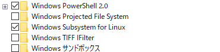

ハローワールド。

2022/04/02追記： どうやら`wsl`というコマンドが追加されたようで、簡単に追加できるようになっていたようです。詳細：[WSL のインストール | Microsoft Docs](https://learn.microsoft.com/ja-jp/windows/wsl/install)
下記は、`wsl`コマンドがないような環境で利用できますが、まずは上記の方法を試してみてください。

会社ではMicrosoft Storeが使えない関係で、WSLで動かすUbuntu等が手に入らないと思っていましたが、**ググったら公式で回答がありました**。下記手順で問題ないですが、一応、1からやってみます。

[Linux 用 Windows サブシステム ディストリビューション パッケージを手動でダウンロードする](https://learn.microsoft.com/ja-jp/windows/wsl/install-manual)

# やり方

WSLでUbuntuを動かすまでを記載していきます。

## WSLの有効化

1. Win + rで`appwiz.cpl`と入力して、プログラムと機能を表示（もしくはコンパネからプログラムと機能を表示）
2. 左の"Windowsの機能の有効化または無効化"を開く
3. Windows Subsystem for Linuxのチェックボックスを入れる



4. 再起動が必要かも

## Ubuntuを手に入れる

1. [Windowsの公式ページ](https://learn.microsoft.com/ja-jp/windows/wsl/install-manual)にディストリビューションがあるので、好きなものを選択してダウンロード
2. ダウンロードしたら下記コマンドをPowershellに流し込む

```powershell
$ Add-AppxPackage .\<ダウンロードしたファイル>.appx
```

3. スタートメニューの「最近追加された項目」とかにUbuntuとかが入ってると思うので、開く。

以上。
