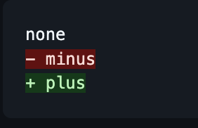

GitHubでコードブロックに`diff`を指定すると、差分表示ができる。

~~~
```diff
none
- minus
+ plus
```
~~~




GitHubのドキュメントにある[コードブロックの作成と強調表示](https://docs.github.com/ja/get-started/writing-on-github/working-with-advanced-formatting/creating-and-highlighting-code-blocks)では[linguist](https://github.com/github-linguist/linguist)を用いて言語判定しているとのこと。言語一覧にdiffがあるので、diffを指定すると差分表示になる。実際のハイライトはおそらく[Rouge](https://github.com/rouge-ruby/rouge)を利用している？

https://github.com/github-linguist/linguist/blob/main/lib/linguist/languages.yml#L1618-L1629
